[toc]

# PS笔记

# 一、软件界面及基础设置

## 1、首页与工作区

首次打开软件，界面如下

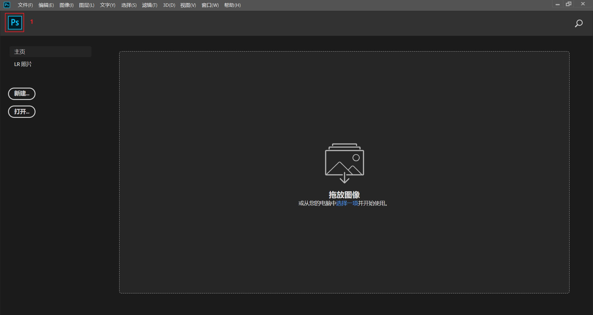

现在展示的就是主页界面，**标号1**点击后可以切换到**工作区**

点击**标号1**来切换到工作区，界面如下

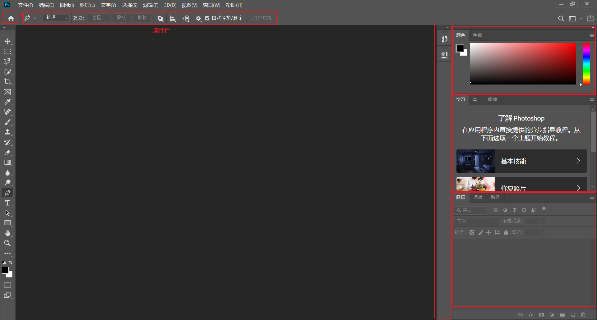

## 2、属性栏与窗口

位于菜单栏下面的是**属性栏**，每一种工具都有自己的属性栏，需要特别注意

图中**标号1**按钮可以切换工作区和主页，右边的是各种窗口，可以通过**右击文字**部分来删除窗口

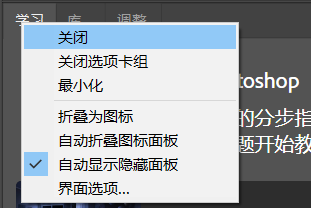

所有关闭的窗口可以点击菜单栏中的**窗口**，勾选相应的菜单项可以添加对应的窗口

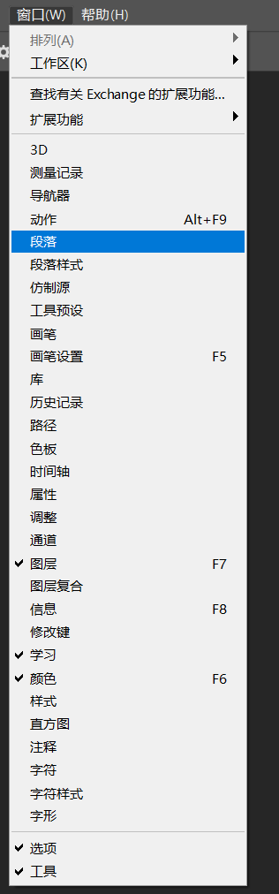

## 3、自定义工作区

对各种窗口进行添加删除，最后成为自己喜欢的风格之后，可以**新建工作区**，将其状态保存，就算窗口变化之后也可以快速恢复到保存的状态。

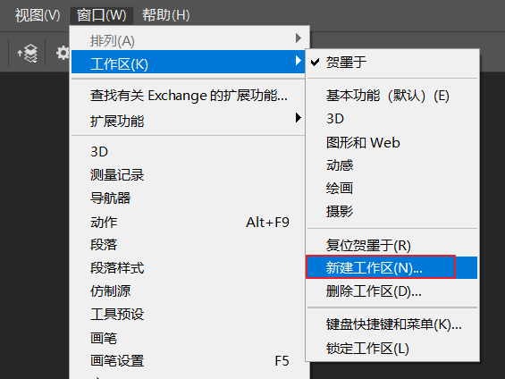

## 4、状态栏

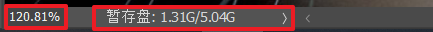

位于软件的最底边，可以看到图片的**放大比例**，和其他**图片信息**

# 二、文件的打开新建及存储

## 1、快捷键

（1）快捷键

打开文件： <kbd>ctrl</kbd>+<kbd>o</kbd>

另存为： <kbd>ctrl</kbd>+<kbd>shift</kbd>+<kbd>s</kbd>

填充**前景色**： <kbd>alt</kbd>+<kbd>delete</kbd>

填充**背景色**： <kbd>ctrl</kbd>+<kbd>delete</kbd>

（2）快捷操作

打开文件：双击工作区空白区域，会弹出打开文件框

缩放图片：<kbd>alt</kbd>+<kbd>滚轮↑/滚轮↓</kbd>

## 2、分辨率

​	在PS中，分辨率是指决定图像精细程度的量级单位，即分辨率越高，图像越精细。一般来说，分辨率表示单位长度内像素点的数量。通常，**分辨率的单位为PPI**（像素/英寸）

​	**分辨率的设置**

+ 图像在**显示器或者其他多媒体设备**上显示时，分辨率设置为：**72PPI**
+ 图像需要**印刷**时，分辨率设置为：**300PPI**
+ 海报高清写真，分辨率设置为：96-200PPI
+ 大型喷绘，分辨率设置为：25-50PPI

## 3、颜色标准

​	**RGB与CMYK**

​	RGB色彩模式是工业界的一种颜色标准，是通过对红（R）绿（G）蓝（B）三个颜色通道的变化以及它们相互之间的叠加来得到各式各样的颜色。

​	CMYK是另一种专门**针对印刷业**设定的颜色标准，是通过对青（C）、洋红（M）、黄（Y）、黑（K）四种颜色变化以及它们相互之间的叠加来得到各种颜色的。在CMYK模式下PHOTOSHOP通道中即为这四种颜色。

## 4、保存格式

+ PSD格式：这是**PS的源文件格式**，会保存图像修改的图层，方便再次编辑
+ JPG格式：这是**常规**的图片保存格式，使用起来比较方便。
+ PNG格式：该格式的图片优点是**不会自动填充背景**，可以储存**透明背景**效果。
+ TIFF格式：该格式**不经压缩**，一般喷绘写真，**印刷场合**都需要TIFF格式，而且是CMYK的。

# 三、移动工具（V）move

## 1、快捷键

（1）快捷键

自由变换：<kbd>ctrl</kbd>+<kbd>T</kbd>

复制图层：<kbd>ctrl</kbd>+<kbd>J</kbd>

删除图层：<kbd>delete</kbd>

切换自动选择：<kbd>ctrl</kbd>

（2）快捷操作

复制图片：<kbd>alt</kbd>+<kbd>鼠标点击移动</kbd>

显示单独图层/显示所有图层切换：<kbd>alt</kbd>+<kbd>点击图层区眼睛</kbd>

自由变化：按住<kbd>shift</kbd>，可以保持纵横比

## 2、属性栏

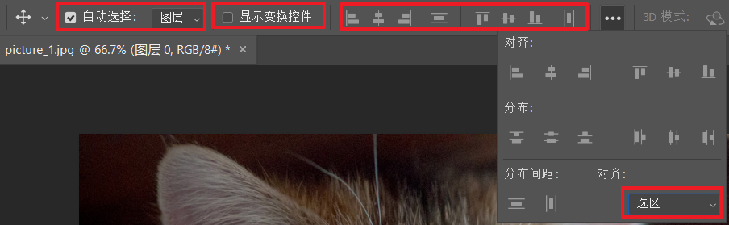

​	方框1：含有**自动选择**，和选择的对象——**图层**、**组**。自动选择勾选后会自动识别鼠标下的图层或组，并使它成为选中状态，另外可以通过快捷键<kbd>ctrl</kbd>快速切换自动选择复选框的状态。

​	方框2：显示自动变化控件，默认是不需要选择的，因为可以通过快捷键<kbd>ctrl</kbd>+<kbd>t</kbd>来快速达到此效果

​	方框3：对齐方式，根据对齐的方式来对齐，默认对齐方式为**选区**，左对齐以最左边的为基准，中间对齐以最靠两边的中线为基准，左对齐同理，垂直分布按照各个部件距离等距分布。

​	方框4：对齐的对象，默认是**选区**，可以修改为**画布**

​	**如何选择多个图层？**

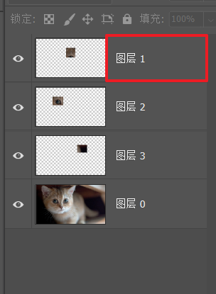

按住<kbd>ctrl</kbd>键，然后选择**文字区域**，也就是红框部分（千万不能选择左边图片部分，否则选择不上），这样可以多选几个图层，也可以先选择第一个图层，按住<kbd>shift</kbd>键，再选择最后一个图层，这样就可以批量选择

**自由变换**：自由变化的时候可以按住`ctrl`键，点击边角，对图片进行变形处理

## 3、图层窗口工具栏

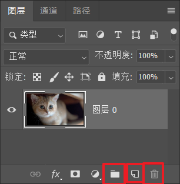

方框1：新建组

方框2：新建图层

方框3：删除图层

# 四、选框工具（M）marquee

## 1、快捷键

（1）快捷键

取消选区：<kbd>ctrl</kbd>+<kbd>D</kbd>

添加选区：<kbd>shift</kbd>

删除选区：<kbd>alt</kbd>

交叉选区：<kbd>alt</kbd>+<kbd>shift</kbd>

（2）快捷操作

移动图片：按住<kbd>space</kbd>键，然后移动鼠标可以移动图片

选择正圆或正矩形：按住<kbd>shift</kbd>键

以**半径方式**选框：按住<kbd>alt</kbd>键

## 2、属性栏

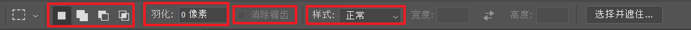

​	方框1：按住<kbd>shift</kbd>可以**添加选区**到已有选区，按住<kbd>alt</kbd>从已有选中**删除选区**，按住<kbd>alt</kbd>+<kbd>shift</kbd>键可以选择**交叉**部分的选区

​	方框2：羽化，将**边缘模糊**

​	方框3：消除锯齿，大多都选上，能让选区更加精致

​	方框4：样式，含有**正常**、**固定比例**、**固定大小**三种样式，方框左边的宽度和高度就是来填写精确数据的

## 3、选框工具

选区工具里包含4中工具

+ 矩形选框工具：按住<kbd>shift</kbd>选择正方形，按住<kbd>alt</kbd>以半径方式选区
+ 椭圆选框工具：同上
+ 单行选框工具：选择单行像素
+ 单列选框工具：选择单列像素

## 4、概念

**什么是选区**

选区就是对图像进行区域选择，所有选区都为虚线闪烁，即为选区，也是你所选择后需要处理的部份。

**选区的作用**

只对特定区域进行编辑，不会对其他部分产生影响。比如说可以对被选中的区域做修改、随意修改颜色、调整亮度、对比度、复制及随意更改大小等操作，方便修图。

# 五、套索工具组（L）lasso

## 1、套索工具组件

套索工具包含3个工具

+ 套索工具
+ 多边形套多工具：按住<kbd>Alt</kbd>不松可以切换成套索工具
+ 磁性套索工具：按住<kbd>Alt</kbd>不松可切换成多边形工具且可以自由套索

# 六、快速选择工具组（W）

## 1、快捷键

（1）快捷键

**分离选区**：<kbd>ctrl</kbd>+<kbd>shift</kbd>+<kbd>j</kbd>

（2）快捷操作

**调整画笔大小**：按住<kbd>alt</kbd>+<kbd>右键</kbd>+<kbd>鼠标左右移动</kbd>

## 2、属性栏

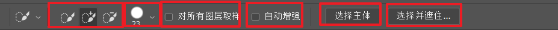

方框1：同之前的操作，可以添加、删除选区

方框2：改变画笔样式

方框3：对**所有图层取样**，如果不勾选，所有色彩一样的都会被魔棒工具选取，勾选的话，中间有色彩不一样的会阻断选取

方框4：自动增强，是选区的更加精致

方框5：**选择主体**，可以自动选取画面的主体部分

方框6：**选择并遮住**，如下面板

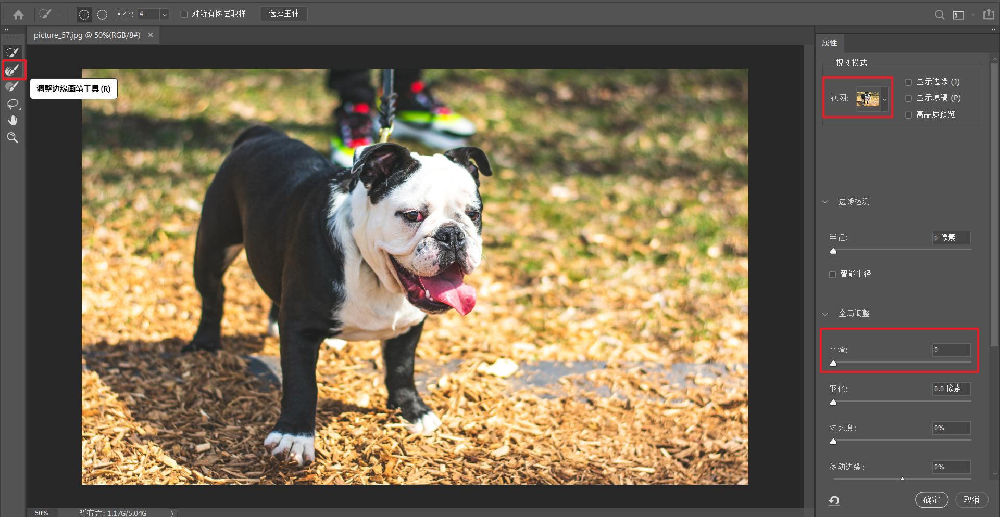

常用这三个方框的内容

调整边缘画笔工具：可以对选区的内容进行再次调节，例如扣取含背景色的头发

平滑：可以使选区更加平滑

净化颜色：可以消去单调的背景色

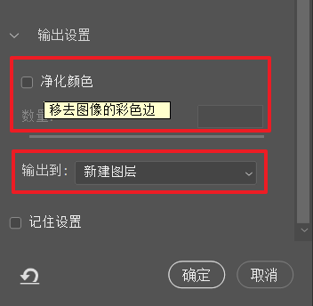

# 七、裁剪工具组（C）cut

## 1、快捷键

恢复：<kbd>F12</kbd>

标尺工具：<kbd>ctrl</kbd>+<kbd>R</kbd>

显示隐藏参考线：<kbd>ctrl</kbd>+<kbd>h</kbd>

## 2、裁剪工具

方框1：如下，可以按照各种比例与像素进行裁剪，其后的两个方框可以填写**自定义的比例以及像素**，仅在

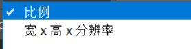模式下可以填写

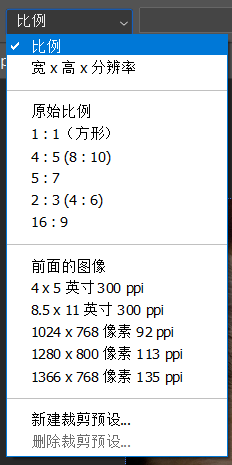

方框2：清除按钮，可以清除自定义的比例以及像素

方框3：拉直，可以自定义一条水平线，并以此为基准**拉直图片**

方框4：辅助裁剪网格线

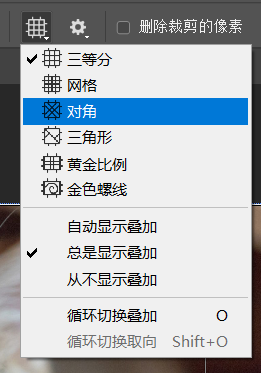

方框5：

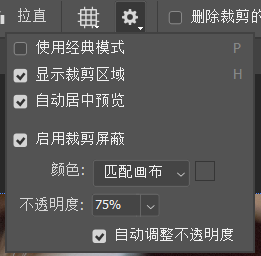

+ 经典模式：画选区进行裁剪
+ 显示裁剪区域：进行裁剪选区时，会**显示裁剪区之外**的部分，否则选区外的部分将不可见
+ 居中预览：裁剪**选区**总会**居中显示**
+ 裁剪屏蔽：裁剪**选区之外**的部分以**灰暗色显示**

方框5：删除裁剪的像素

裁剪完毕后未被选区的区域将会被删除，否则再次进行裁剪时能看到原始的图片

方框6：内容识别

通过裁剪放大图片会自动识别，以填充空白的部分

按住alt或shift可以进行按比例半径方式进行选区

## 3、透视裁剪工具

将选区的不规则四边形拉直为矩形

## 4、切片工具

绘制矩形框，分割图片，可以通过**视图**->**清除切片**来删除切片

但实际上是通过参考线来进行切片的，ctrl+r打开标尺，然后在标尺区域拖拽，可以脱出一条辅助线

然后再点击切片工具的**基于参考线进行切片**

在切片工具模式按住`ctrl`键可以选择切片区域，按住`shift`键可以多选切片区域，右击可以合并、删除切片区域

# 八、图框工具（K）

alt键：按在两个图层之间可以创建剪切蒙版

# 九、吸管工具组（I）

## 1、吸管工具

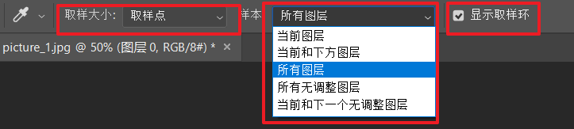

取样大小：设置取样范围

样本：设置样本图层

取样环：显示一个环，上方显示当前取样颜色，下方显示之前的前景色

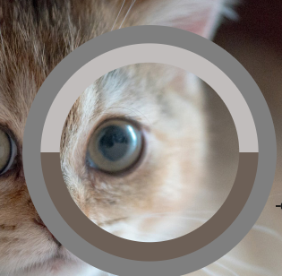

## 2、颜色取样器工具

选取一个颜色点并固定在图片上，可能通过信息栏查看信息，通过**按住`alt`键删除取样点**

也可以通过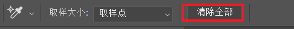工具栏清除全部来清除

## 3、标尺工具

首先点击一个点拖动，可以产生一个标尺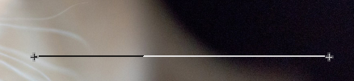

然后按住`Alt`键点击起始点拖动可以查看两直线角度信息

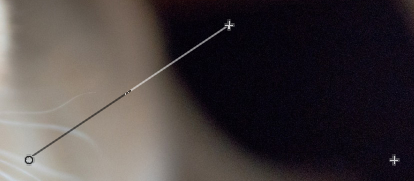

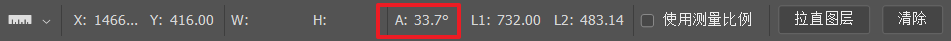

L表示线段的长度，单位可以在**编辑**->**首选项**->**单位和标尺**中修改

使用测量比例：可以查看逻辑值

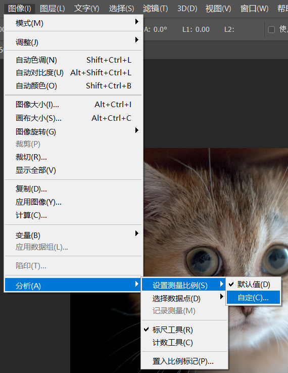

# 十、修复画笔工具组（J）

## 1、污点修复画笔工具

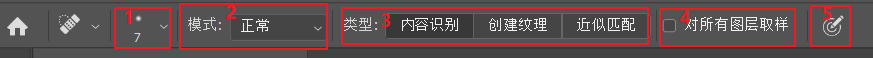

方框1：对画笔的大小、硬度等进项调节

方框2：选择模式有正常、替换等等模式，一半**选择正常**就可以了

方框3：类型，内容识别会对框选的区域与周围的区域进行识别颜色匹配，创建纹理软件会对选择区域加上一点纹理，一半**选择内容识别**就行了

方框4：对所有图层取样，会对所有图层叠加起来后进行取样，一半都是**勾选**的

方框5：按压版

**注意：一半进行修复的时候都是创建一个新图层**

## 2、修复画笔工具

方框1：取样，按住<kbd>Alt</kbd>进行取样，然后就会把会把取样点对涂抹区域进行覆盖并内容识别；图案，选择一种预设图案，涂抹

方框2：对齐，若没有勾选，在每次移动鼠标并释放，然后重新涂抹时还会使用原来的取样点。若勾选了取样点在鼠标释放后也会随之更改

方框3：使用旧版，莫不勾选方框5的扩散就会消失

方框4：取样样本，一半选择所有图层

方框5：羽化的大小

## 3、修补工具

要点就是方框内的东西

源：**框选需要修复**的地方，移动到采样区域

目标：**框选采样区域**，移动到需要修复的地方

## 4、内容感知移动工具

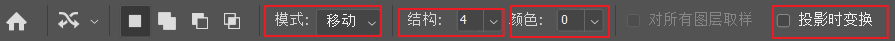

方框1：模式，有移动和拓展两种。移动就是将**选区的区域移动到别的区域**，并对其进行**内容识别**
拓展就是将**选区的区域复制到另一个区域**，并进行内容识别

方框2：结构**越大**，移动选区后**轮廓就越明显**

方框3：颜色**越大**，移动选区后**相融的就越明显**

方框4：投影时变换，移动一个选区后产生一个自由变换工具

## 5、红眼工具

以前的照相机拍照后眼睛就变红，就使用此工具进行修复，原理就是**降低所选区域红色的饱和度**，不常使用了

