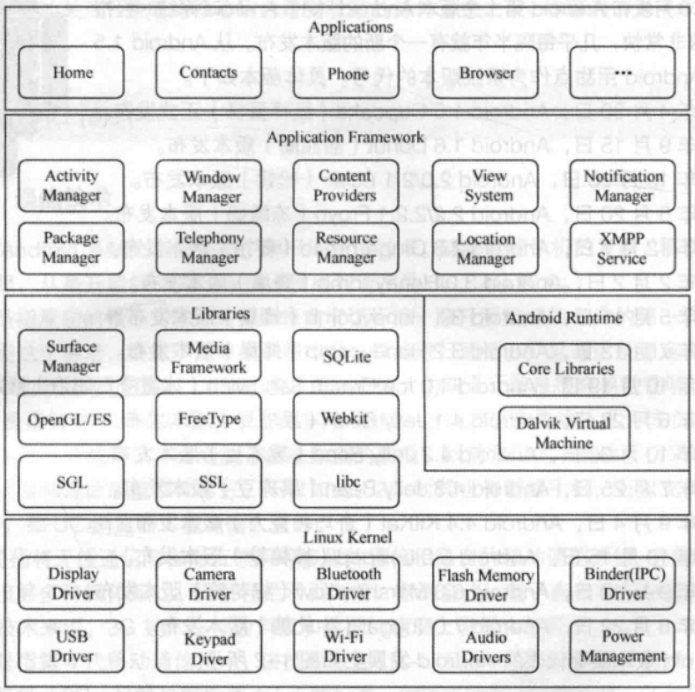

# Android基础

# 一、Android简介

## 1、Android体系结构



# 二、布局管理

## 1、LinearLayout线性布局

常用属性

+ android:id
+ android:layout_width
+ android:layout_height
+ android:background
+ android:layout_margin
+ android:layout_padding
+ android:orientation
+ android:layout_weight：组件所占权重，首先先分配layout_width或layout_height，然后父组件剩下的空间按照权重分配给当前组件

## 2、相对布局

常用属性

+ android:layout_toLeftOf
+ android:layout_toRightOf
+ android:layout_alignBottom
+ android:layout_alignParentBottom
+ android:layout_below

# 三、常用控件

## 1、TextView

当限制TextView的宽度时，一行显示不下的内容会换行显示

**常用属性：**

+ android:maxLines：显示最大行数，超过则不显示
+ android:ellipsize：显现不下的文字使用`...`代替
+ android:drawableRight：在文字右边显示一个drawable
+ android:drawablePadding：drawable内边距

**特殊效果：**

中划线：

```java
textView.getPaint().setFlags(Paint.STRIKE_THRU_TEXT_FLAG);
```

下划线：

```java
textView.getPaint().setFlags(Paint.UNDERLINE_TEXT_FLAG);
//或
textView.setText(Html.fromHtml("<u>下划线</u>"));
```

消除锯齿

```java
textView.getPaint().setFlags(Paint.STRIKE_THRU_TEXT_FLAG);
```

跑马灯

```xml
<TextView
        android:layout_width="wrap_content"
        android:layout_height="wrap_content"
        android:text="跑马灯跑马灯跑马灯跑马灯"
        android:singleLine="true"
        android:ellipsize="marquee"
        android:marqueeRepeatLimit="marquee_forever"
        android:focusable="true"
        android:focusableInTouchMode="true"/>
```

## 2、Button

属性：

+ android:textAllCaps：默认Button会显示内容为大写，设置次属性为false后将正常显示

**特殊效果：**

自定义背景及形状：

```xml
<?xml version="1.0" encoding="utf-8"?>
<shape xmlns:android="http://schemas.android.com/apk/res/android">
    <!--填充颜色-->
    <solid android:color="@color/btn_blue"/>
    <!--圆角大小-->
    <corners android:radius="10dp"/>
    <!--描边-->
    <stroke
        android:width="1dp"
        android:color="@color/btn_blue" />
</shape>
```

按压效果：

```xml
<?xml version="1.0" encoding="utf-8"?>
<selector xmlns:android="http://schemas.android.com/apk/res/android">
    <!--按压状态的效果-->
    <item android:state_pressed="true">
        <shape>
            <solid android:color="@color/btn_blue"/>
            <corners android:radius="10dp"/>
        </shape>
    </item>
    <!--非按压的效果-->
    <item android:state_pressed="false">
        <shape>
            <solid android:color="#fff"/>
            <corners android:radius="10dp"/>
        </shape>
    </item>
</selector>
```

## 2、EditText

**常用属性：**

+ android:hint：类似于html的placeholder

+ Android:inputType：编辑框类型


## 3、RadioButton

**常用属性**

+ Android:checked：默认的选中状态
+ Android:button：设置为`@null`后，默认Radio前的小圆圈就会消失

**常用操作**

1. 将RadioButton放在一个组`RadioGroup`中，这样每个Radio的选中状态都是互斥的了
2. 将`Android:button`设置为`@null`，然后新建一个selector，对其设置好不同的状态样式后，把他设置为`RadioButton`的背景`background`，这样就可以自定义一个`RadioButton`的样式了

**监听操作**

创建`RadioGroup`，然后对其添加选中状态改变事件`setOnCheckedChangeListener`

```java
mRadioGroup.setOnCheckedChangeListener(new RadioGroup.OnCheckedChangeListener() {
    @Override
    public void onCheckedChanged(RadioGroup group, int checkedId) {

    }
});
```

## 4、CheckBox

**常用属性**

+ Android:button：可以将CheckBox的复选框更改为别的，如自定义的drawable
+ Android:paddingLeft:

**监听操作**

```java
checkBox.setOnCheckedChangeListener(new CompoundButton.OnCheckedChangeListener() {
    @Override
    public void onCheckedChanged(CompoundButton buttonView, boolean isChecked) {

    }
});
```

## 5、ImageView

**常用属性**

+ android:src：类似于html中img的src属性
+ android:scaleType
  + fitXY：撑满控件，宽高比可能发生改变
  + fitCenter：保持宽高比缩放，直至能够完全显示
  + centerCrop：保持宽高比缩放，直至完全覆盖控件，裁剪显示

**加载网络图片**

github中的glide

注意：需要在清单文件中添加网络权限

```xml
<uses-permission android:name="android.permission.INTERNET"/>
```

## 6、ListView

**属性**

+ android:divider：分割线
+ android:dividerHeight：分割线高度
+ android:listSelector：被选择后的样式，可以是drawable

**事件**

```java
ListView listView = null;
listView.setOnItemClickListener(new AdapterView.OnItemClickListener() {
    @Override
    public void onItemClick(AdapterView<?> parent, View view, int position, long id) {

    }
});

listView.setOnItemLongClickListener(new AdapterView.OnItemLongClickListener() {
    @Override
    public boolean onItemLongClick(AdapterView<?> parent, View view, int position, long id) {
        return false;
    }
});
```

## 7、GridView

**属性**

+ android:numColumns：显示几列
+ android:horizontalSpacing：水平间距
+ android:verticalSpacing：垂直间距

## 8、ScrollView & HorizontalScrollView


## 注：将布局文件转换为View

1、方法一

```java
View view = View.inflate(getApplication(), R.Layout.item, null);
```

2、方法二

```java
View view = LayoutInflater.from(getApplication()).inflate(R.Layout.item, null);
```

3、方法三

```java
LayoutInflater inflater = getSystemService(LAYOUT_INFALTER_SERVICE);
View view = inflater(R.Layout.item, null);
```

