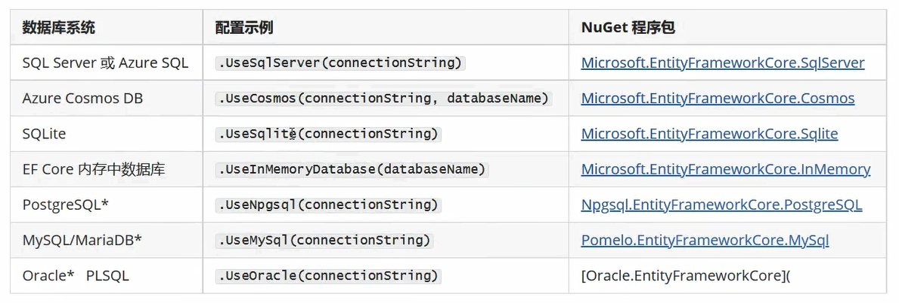
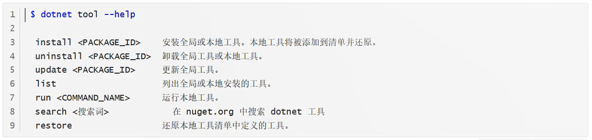

# EF教程

## ORM介绍

### 包版本

**请务必安装Microsoft提供的所有EFcore包的同一版本**。例如，如果安装了5.0.3版本的 `Microsoft.EntityFrameworkCore.Sglserver`，则所有其他 `Microsoft.EntityFrameworkCore.*` 包也必须为5.0.3版本。

此外，请确保所有外部包都与所使用的EFCore的版本兼容。 特别是，检查外部数据库提供程序是否支持你所使用的EFCore版本。EF Core的新主版本通常需要更新的数据库提供程序。

**警告**： NuGet不强制使用一致的包版本。 请始终仔细检查你在.csproj文件或等效

### 数据库提供程序

EF Core通过使用"数据库提供程序"支持不同的数据库系统。每个系统都有自己的数据库提供程序，而提供程序以NuGet包的形式提供。应用程序应安装其中一个或多个提供程序包。

下表列出了常见的数据库提供程序。有关可用提供程序的更全面列表，请参阅数据库提供程痉。



### 工具



使用用于EF Core迁移和现有数据库中的反向工程（基架）的工具需要安装相应的工具包：

+ 可在Visual Studio包，管理器控制台中使用的 PowerShell 工具的 `Microsoft.EntityFrameworkCore.Tools`
+ 跨平台命令行工具的 dotnet-ef 和 `Microsoft.EntityFrameworkCore.Design`

请参阅 Entiy Framework Core 工具参考，详细了解如何使用 EF Core 工具，包括如何在项目中或在全局范围内正确安装 dotnet-ef 工具。

#### 安装 .Net Cli

```
dotnet tool install -g dotnet-ef --version 6.0.4
```


用 NuGet 安装

```
Microsoft.EntityFrameworkCore.Sqlite
Microsoft.EntityFrameworkCore.Design
```

