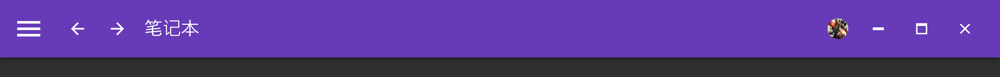
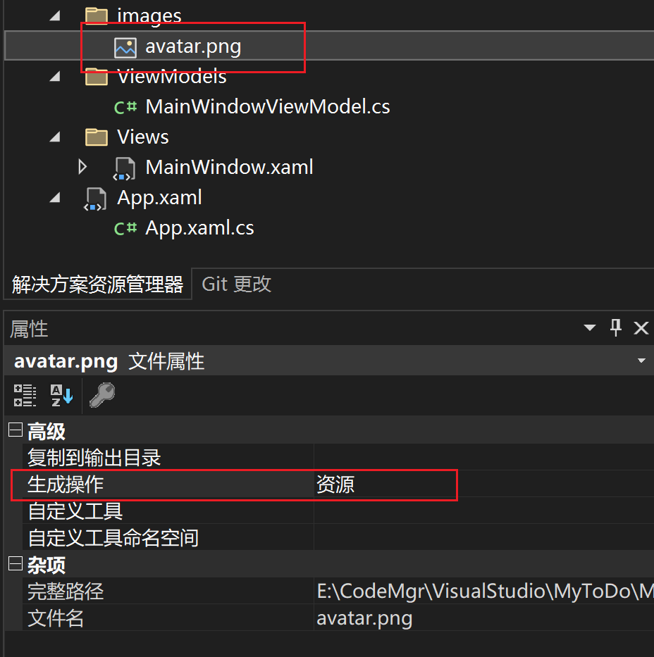
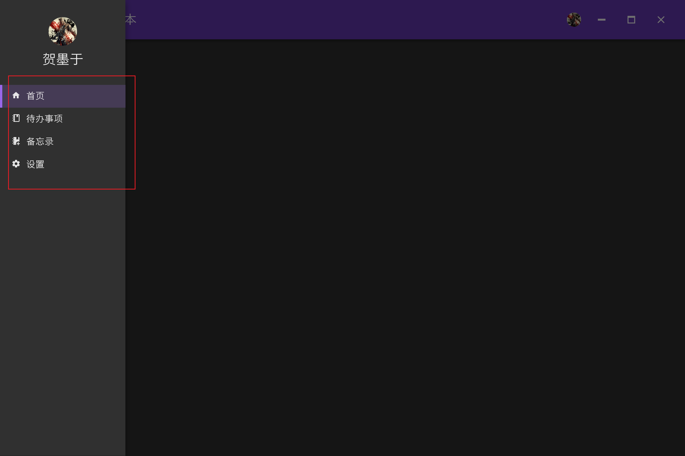
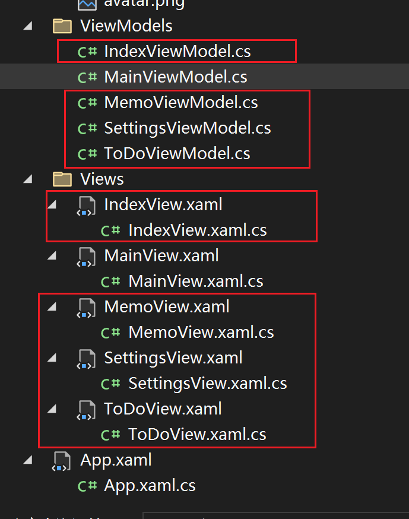

# MyToDo项目实战

## 初始化项目

### 依赖

+ Prism.DryIoc
+ MaterialDesignThemes

### 初始化

1、配置 `App.xaml`

```xaml
<prism:PrismApplication x:Class="MyToDo.App"
             xmlns="http://schemas.microsoft.com/winfx/2006/xaml/presentation"
             xmlns:x="http://schemas.microsoft.com/winfx/2006/xaml"
             xmlns:local="clr-namespace:MyToDo"
             xmlns:prism="http://prismlibrary.com/" 
             xmlns:materialDesign="http://materialdesigninxaml.net/winfx/xaml/themes">
    <Application.Resources>
        <ResourceDictionary>
            <ResourceDictionary.MergedDictionaries>
                <materialDesign:BundledTheme BaseTheme="Dark" PrimaryColor="DeepPurple" SecondaryColor="Lime" />
                <ResourceDictionary Source="pack://application:,,,/MaterialDesignThemes.Wpf;component/Themes/MaterialDesignTheme.Defaults.xaml" />
            </ResourceDictionary.MergedDictionaries>
        </ResourceDictionary>
    </Application.Resources>
</prism:PrismApplication>
```

+ 只有引入了 prism 命名空间才能使用对应的标签`prism:PrismApplication`
+ 可以自行调节需要的颜色主体 `BaseTheme="Dark"` 或者 `BaseTheme="Light" `

## 设计导航栏

需要的效果如下：



### 编写 `MainWindow.xaml`

```xaml
<Window x:Class="MyToDo.Views.MainWindow"
        xmlns="http://schemas.microsoft.com/winfx/2006/xaml/presentation"
        xmlns:x="http://schemas.microsoft.com/winfx/2006/xaml"
        xmlns:d="http://schemas.microsoft.com/expression/blend/2008"
        xmlns:materialDesign="http://materialdesigninxaml.net/winfx/xaml/themes"
        xmlns:mc="http://schemas.openxmlformats.org/markup-compatibility/2006"
        xmlns:system="clr-namespace:System;assembly=mscorlib"
        xmlns:prism="http://prismlibrary.com/"
        prism:ViewModelLocator.AutoWireViewModel="True"
        Style="{StaticResource MaterialDesignWindow}"
        WindowStartupLocation="CenterScreen"
        WindowStyle="None"
        AllowsTransparency="True"
        ResizeMode="CanResize"
        Title="{Binding Title}" Height="800" Width="1200" >
    <materialDesign:DialogHost DialogTheme="Inherit"
                             Identifier="RootDialog"
                             SnackbarMessageQueue="{Binding ElementName=MainSnackbar, Path=MessageQueue}">

        <materialDesign:DrawerHost IsLeftDrawerOpen="{Binding ElementName=MenuToggleButton, Path=IsChecked}">
            <materialDesign:DrawerHost.LeftDrawerContent>
                <DockPanel MinWidth="220" LastChildFill="False">
                    <Image Height="50" Width="50" Source="/images/avatar.png" DockPanel.Dock="Top" Margin="0, 30, 0, 0">
                        <Image.Clip>
                            <EllipseGeometry Center="25, 25" RadiusX="25" RadiusY="25" />
                        </Image.Clip>
                    </Image>
                    <ListBox>
                        <ListBox.ItemTemplate>
                            <DataTemplate>
                                <StackPanel Orientation="Horizontal">
                                    <!--<TextBlock con-->
                                </StackPanel>
                            </DataTemplate>
                        </ListBox.ItemTemplate>
                    </ListBox>
                </DockPanel>
            </materialDesign:DrawerHost.LeftDrawerContent>

            <DockPanel>
                <materialDesign:ColorZone Padding="16" x:Name="colorZone"
                                  materialDesign:ElevationAssist.Elevation="Dp4"
                                  DockPanel.Dock="Top"
                                  Mode="PrimaryMid">
                    <DockPanel LastChildFill="False">
                        <StackPanel Orientation="Horizontal">
                            <ToggleButton x:Name="MenuToggleButton"
                            AutomationProperties.Name="HamburgerToggleButton"
                            IsChecked="False"
                            Style="{StaticResource MaterialDesignHamburgerToggleButton}" />

                            <Button Margin="24,0,0,0"
                      materialDesign:RippleAssist.Feedback="{Binding RelativeSource={RelativeSource Self}, Path=Foreground, Converter={StaticResource BrushRoundConverter}}"
                      Command="{Binding MovePrevCommand}"
                      Content="{materialDesign:PackIcon Kind=ArrowLeft,
                                                        Size=24}"
                      Foreground="{Binding RelativeSource={RelativeSource AncestorType={x:Type FrameworkElement}}, Path=(TextElement.Foreground)}"
                      Style="{StaticResource MaterialDesignToolButton}"
                      ToolTip="Previous Item" />

                            <Button Margin="16,0,0,0"
                      materialDesign:RippleAssist.Feedback="{Binding RelativeSource={RelativeSource Self}, Path=Foreground, Converter={StaticResource BrushRoundConverter}}"
                      Command="{Binding MoveNextCommand}"
                      Content="{materialDesign:PackIcon Kind=ArrowRight,
                                                        Size=24}"
                      Foreground="{Binding RelativeSource={RelativeSource AncestorType={x:Type FrameworkElement}}, Path=(TextElement.Foreground)}"
                      Style="{StaticResource MaterialDesignToolButton}"
                      ToolTip="Next Item" />


                            <TextBlock Margin="16,0,0,0"
                       HorizontalAlignment="Center"
                       VerticalAlignment="Center"
                       AutomationProperties.Name="MyToDo"
                       FontSize="22"
                       Text="笔记本" />

                        </StackPanel>

                        <StackPanel DockPanel.Dock="Right"  Orientation="Horizontal">
                            <Image Height="25" Width="25" Source="/images/avatar.png" Margin="10, 0">
                                <Image.Clip>
                                    <EllipseGeometry Center="12.5, 12.5" RadiusX="12.5" RadiusY="12.5" />
                                </Image.Clip>
                            </Image>

                            <Button Content="{materialDesign:PackIcon Kind=WindowMinimize,Size=20}" Command="{Binding WindowCommand}" CommandParameter="windowMinimize"
                                    Foreground="{Binding RelativeSource={RelativeSource AncestorType={x:Type FrameworkElement}}, Path=(TextElement.Foreground)}"
                                    Style="{StaticResource MaterialDesignFlatMidBgButton}" />
                            <Button x:Name="btnWindowMaximize" Content="{materialDesign:PackIcon Kind=WindowMaximize,Size=20}" Command="{Binding WindowCommand}" CommandParameter="windowMaximize"
                                    Foreground="{Binding RelativeSource={RelativeSource AncestorType={x:Type FrameworkElement}}, Path=(TextElement.Foreground)}"
                                    Style="{StaticResource MaterialDesignFlatMidBgButton}" />
                            <Button Content="{materialDesign:PackIcon Kind=WindowClose,Size=20}" Command="{Binding WindowCommand}" CommandParameter="windowClose"
                                    Foreground="{Binding RelativeSource={RelativeSource AncestorType={x:Type FrameworkElement}}, Path=(TextElement.Foreground)}"
                                    Style="{StaticResource MaterialDesignFlatMidBgButton}" />
                        </StackPanel>
                    </DockPanel>
                </materialDesign:ColorZone>

            </DockPanel>
        </materialDesign:DrawerHost>
    </materialDesign:DialogHost>
</Window>
```

+ 窗口属性

  + `WindowStartupLocation`：窗口的起始位置
  + `WindowStyle`：窗口样式，`None`表示无边框
  + `AllowsTransparency`：设置为 True 后，窗口的边框和标题栏将被隐藏

+ Margin：沿着 left、top、right、bottom 的方向

+ 图片：

  + 裁剪

    ```xaml
    <Image Height="50" Width="50" Source="/images/avatar.png" DockPanel.Dock="Top" Margin="0, 30, 0, 0">
        <Image.Clip>
            <EllipseGeometry Center="25, 25" RadiusX="25" RadiusY="25" />
        </Image.Clip>
    </Image>
    ```

  + 设置图片

    + 
      需要将图片的生成操作设置为**资源**

### 编写 `MainWindowModel.cs`

```cs
using MyToDo.Events;
using Prism.Commands;
using Prism.Events;
using Prism.Mvvm;

namespace MyToDo.ViewModels
{
    public class MainWindowViewModel : BindableBase
    {
        private string _title = "Prism Application";
        private readonly IEventAggregator eventAggregator;

        public string Title
        {
            get { return _title; }
            set { SetProperty(ref _title, value); }
        }

        public DelegateCommand<string> WindowCommand { get; private set; }

        public MainWindowViewModel(IEventAggregator eventAggregator)
        {
            this.eventAggregator = eventAggregator;

            InitEvent();
        }

        private void InitEvent()
        {
            WindowCommand = new DelegateCommand<string>((arg) =>
            {
                eventAggregator.GetEvent<WindowEvent>().Publish(arg);
            });
        }
    }
}
```

在这里我们使用了 `IEventAggregator` 来发布一些窗口事件（因为Model中无法直接操作Window的窗口状态，因此我们使用发布订阅的方式通知`MainWindow.xaml.cs`来进行修改）

### 编写`MainWindow.xaml.cs`

```cs
using MaterialDesignThemes.Wpf;
using MyToDo.Events;
using Prism.Commands;
using Prism.Events;
using System;
using System.Windows;
using System.Windows.Input;
using System.Windows.Media.Media3D;

namespace MyToDo.Views
{
    /// <summary>
    /// Interaction logic for MainWindow.xaml
    /// </summary>
    public partial class MainWindow : Window
    {
        private readonly IEventAggregator eventAggregator;

        public MainWindow(IEventAggregator eventAggregator)
        {
            this.eventAggregator = eventAggregator;

            InitializeComponent();
            InitializeEvent();

            HandlePublish();
        }

        private void InitializeEvent()
        {
            colorZone.MouseMove += (s, e) =>
            {
                if (e.LeftButton == MouseButtonState.Pressed)
                {
                    this.DragMove();
                }
            };
            colorZone.MouseDoubleClick += (s, e) =>
            {
                if (this.WindowState == WindowState.Normal)
                {
                    ((PackIcon)btnWindowMaximize.Content).Kind = PackIconKind.WindowRestore;
                    this.WindowState = WindowState.Maximized;
                }
                else
                {
                    ((PackIcon)btnWindowMaximize.Content).Kind = PackIconKind.WindowMaximize;
                    this.WindowState = WindowState.Normal;
                }
            };
        }

        private void HandlePublish()
        {
            eventAggregator.GetEvent<WindowEvent>().Subscribe(arg =>
            {
                switch (arg)
                {
                    case "windowMinimize":
                        this.WindowState = WindowState.Minimized;
                        break;
                    case "windowMaximize":
                        if (this.WindowState == WindowState.Normal)
                        {
                            ((PackIcon)btnWindowMaximize.Content).Kind = PackIconKind.WindowRestore;
                            this.WindowState = WindowState.Maximized;
                        }
                        else
                        {
                            ((PackIcon)btnWindowMaximize.Content).Kind = PackIconKind.WindowMaximize;
                            this.WindowState = WindowState.Normal;
                        }
                        break;
                    case "windowClose":
                        this.Close();
                        break;
                }
            });
        }
    }
}
```

在这里，我们处理一些具体的窗口事件

## 设计侧边栏菜单

### 定义菜单栏实体

我们新建一个命名空间`Common.Models`，并定义菜单栏数据实体

```cs
namespace MyToDo.Common.Models
{
    public class MenuItem
    {
        private string _icon;

        private string _title;

        private string _namespace;

        public string Icon { get => _icon; set => _icon = value; }

        public string Title { get => _title; set => _title = value; }

        public string Namespace { get => _namespace; set => _namespace = value; }
    }
}
```

### 定义数据源

```cs
namespace MyToDo.ViewModels
{
    public class MainViewModel : BindableBase
    {       
        public ObservableCollection<MenuItem> MenuItems { get => menuItems; set { menuItems = value; RaisePropertyChanged(); } }

        public MainWindowViewModel(IEventAggregator eventAggregator)
        {
            this.eventAggregator = eventAggregator;

            InitData();
            InitEvent();
        }

        private void InitData()
        {
            MenuItems = new ObservableCollection<MenuItem>
            {
                new MenuItem() { Icon = "Home", Title = "首页", Namespace = "IndexView" },
                new MenuItem() { Icon = "NotebookOutline", Title = "待办事项", Namespace = "ToDoView" },
                new MenuItem() { Icon = "NotebookPlus", Title = "备忘录", Namespace = "MemoView" },
                new MenuItem() { Icon = "Cog", Title = "设置", Namespace = "SettingsView" }
            };
        }

    }
}
```

### 编写模板

```xaml
<Window x:Class="MyToDo.Views.MainView"
        xmlns="http://schemas.microsoft.com/winfx/2006/xaml/presentation"
        xmlns:x="http://schemas.microsoft.com/winfx/2006/xaml"
        xmlns:d="http://schemas.microsoft.com/expression/blend/2008"
        xmlns:materialDesign="http://materialdesigninxaml.net/winfx/xaml/themes"
        xmlns:mc="http://schemas.openxmlformats.org/markup-compatibility/2006"
        xmlns:system="clr-namespace:System;assembly=mscorlib"
        xmlns:prism="http://prismlibrary.com/"
        prism:ViewModelLocator.AutoWireViewModel="True"
        Style="{StaticResource MaterialDesignWindow}"
        WindowStartupLocation="CenterScreen"
        WindowStyle="None"
        AllowsTransparency="True"
        ResizeMode="CanResize"
        Title="{Binding Title}" Height="800" Width="1200" >
    <materialDesign:DialogHost DialogTheme="Inherit"
                             Identifier="RootDialog"
                             SnackbarMessageQueue="{Binding ElementName=MainSnackbar, Path=MessageQueue}">

        <materialDesign:DrawerHost IsLeftDrawerOpen="{Binding ElementName=MenuToggleButton, Path=IsChecked}">
            <materialDesign:DrawerHost.LeftDrawerContent>
                <DockPanel MinWidth="220">
                    <StackPanel DockPanel.Dock="Top" Margin="0, 0, 0, 20">
                        <Image Height="50" Width="50" Source="/images/avatar.png" Margin="0, 30, 0, 0">
                            <Image.Clip>
                                <EllipseGeometry Center="25, 25" RadiusX="25" RadiusY="25" />
                            </Image.Clip>
                        </Image>
                        <TextBlock Text="贺墨于" FontSize="24" Margin="0, 10" HorizontalAlignment="Center" />
                    </StackPanel>
                    <ListBox ItemContainerStyle="{StaticResource MenuListBoxItem}" ItemsSource="{Binding MenuItems}">
                        <ListBox.ItemTemplate>
                            <DataTemplate>
                                <StackPanel Orientation="Horizontal" VerticalAlignment="Center" Background="Transparent">
                                    <materialDesign:PackIcon Kind="{Binding Icon}" FontSize="16" Margin="15, 0, 0, 0" />
                                    <TextBlock Text="{Binding Title}" Margin="8,0,0,0" FontSize="16"/>
                                </StackPanel>
                            </DataTemplate>
                        </ListBox.ItemTemplate>
                    </ListBox>
                </DockPanel>
            </materialDesign:DrawerHost.LeftDrawerContent>

			...
        </materialDesign:DrawerHost>
    </materialDesign:DialogHost>
</Window>
```

+ 这里我们设置了`Background="Transparent"`，对后面的 Triggers 有影响
+ 设置 `ListBox` 内部 `ListBoxItem` 的样式使用 `ItemContainerStyle` 属性

### 编写样式

```xaml
<prism:PrismApplication x:Class="MyToDo.App"
             xmlns="http://schemas.microsoft.com/winfx/2006/xaml/presentation"
             xmlns:x="http://schemas.microsoft.com/winfx/2006/xaml"
             xmlns:local="clr-namespace:MyToDo"
             xmlns:prism="http://prismlibrary.com/" 
             xmlns:materialDesign="http://materialdesigninxaml.net/winfx/xaml/themes">
    <Application.Resources>
        <ResourceDictionary>
            <ResourceDictionary.MergedDictionaries>
                <materialDesign:BundledTheme BaseTheme="Dark" PrimaryColor="DeepPurple" SecondaryColor="Lime" />
                <ResourceDictionary Source="pack://application:,,,/MaterialDesignThemes.Wpf;component/Themes/MaterialDesignTheme.Defaults.xaml" />
            </ResourceDictionary.MergedDictionaries>

            <Style x:Key="MenuListBoxItem" TargetType="ListBoxItem">
                <Setter Property="MinHeight" Value="40" />
                <Setter Property="Template">
                    <Setter.Value>
                        <ControlTemplate TargetType="{x:Type ListBoxItem}">
                            <Grid>
                                <Border x:Name="border" />
                                <Border x:Name="background" />
                                <ContentPresenter HorizontalAlignment="{TemplateBinding HorizontalAlignment}" VerticalAlignment="{TemplateBinding VerticalAlignment}" />
                            </Grid>

                            <ControlTemplate.Triggers>
                                <Trigger Property="IsSelected" Value="True">
                                    <Setter Property="BorderThickness" TargetName="border" Value="4,0,0,0"/>
                                    <Setter Property="BorderBrush" TargetName="border" Value="{DynamicResource PrimaryHueLightBrush}" />
                                    <Setter Property="Background" TargetName="background" Value="{DynamicResource PrimaryHueLightBrush}" />
                                    <Setter Property="Opacity" TargetName="background" Value="0.2" />
                                </Trigger>
                                <Trigger Property="IsMouseOver" Value="True">
                                    <Setter Property="Background" TargetName="background" Value="{DynamicResource PrimaryHueLightBrush}" />
                                    <Setter Property="Opacity" TargetName="background" Value="0.2" />
                                </Trigger>
                            </ControlTemplate.Triggers>
                        </ControlTemplate>
                    </Setter.Value>
                </Setter>
            </Style>
        </ResourceDictionary>
    </Application.Resources>
</prism:PrismApplication>
```

+ `BorderThickness`：控制边框的厚度
+ `BorderBrush`：控制边框颜色

## 菜单导航

我们想要的效果就是点击侧边栏，主内容区域自动跳转相应区域



### 定义子界面★

> 后面统一将所有的界面变为 xxxView，之前的 MainWindow 也改为了 MainView

定义子界面的 View 以及 Model，<font color=red>注意 View 不能为 `Page` 而是 `UserControl`</font>



然后在 `App.xaml.cs` 中进行注册

```cs
using MyToDo.ViewModels;
using MyToDo.Views;
using Prism.Ioc;
using System.Windows;

namespace MyToDo
{
    /// <summary>
    /// Interaction logic for App.xaml
    /// </summary>
    public partial class App
    {
        protected override Window CreateShell()
        {
            return Container.Resolve<MainView>();
        }

        protected override void RegisterTypes(IContainerRegistry containerRegistry)
        {
            containerRegistry.RegisterForNavigation<IndexView, IndexViewModel>();
            containerRegistry.RegisterForNavigation<MemoView, MemoViewModel>();
            containerRegistry.RegisterForNavigation<ToDoView, ToDoViewModel>();
            containerRegistry.RegisterForNavigation<SettingsView, SettingsViewModel>();
        }
    }
}
```

### 编写 `MainViewModel.cs`

下面是全部的代码，后面我们将进行挨个分析

```cs
using MyToDo.Common.Models;
using MyToDo.Events;
using MyToDo.Extensions;
using Prism.Commands;
using Prism.Events;
using Prism.Mvvm;
using Prism.Regions;
using System;
using System.Collections.ObjectModel;
using System.Windows.Markup;

namespace MyToDo.ViewModels
{
    public class MainViewModel : BindableBase
    {
        private string title = "Prism Application";
        private readonly IEventAggregator eventAggregator;
        private readonly IRegionManager regionManager;
        private ObservableCollection<MenuItem> menuItems;
        private IRegionNavigationJournal journal;
        public DelegateCommand<string> WindowCommand { get; private set; }
        public DelegateCommand<MenuItem> NavigateCommand { get; private set; }
        public DelegateCommand GobackCommand { get; private set; }
        public DelegateCommand GoForwardCommand { get; private set; }

        public ObservableCollection<MenuItem> MenuItems { get => menuItems; set { menuItems = value; RaisePropertyChanged(); } }

        public MainViewModel(IEventAggregator eventAggregator, IRegionManager regionManager)
        {
            this.eventAggregator = eventAggregator;
            this.regionManager = regionManager;
            InitData();
            InitEvent();
        }

        private void InitData()
        {
            MenuItems = new ObservableCollection<MenuItem>
            {
                new MenuItem() { Icon = "Home", Title = "首页", Namespace = "IndexView" },
                new MenuItem() { Icon = "NotebookOutline", Title = "待办事项", Namespace = "ToDoView" },
                new MenuItem() { Icon = "NotebookPlus", Title = "备忘录", Namespace = "MemoView" },
                new MenuItem() { Icon = "Cog", Title = "设置", Namespace = "SettingsView" }
            };
        }

        private void InitEvent()
        {
            WindowCommand = new DelegateCommand<string>((arg) =>
            {
                eventAggregator.GetEvent<WindowEvent>().Publish(arg);
            });
            NavigateCommand = new DelegateCommand<MenuItem>((arg) =>
            {
                if (arg == null || string.IsNullOrWhiteSpace(arg.Namespace)) return;
                regionManager.Regions[PrismManager.MainViewRegion].RequestNavigate(arg.Namespace, backcall =>
                {
                    journal = backcall.Context.NavigationService.Journal;
                });
            });
            GobackCommand = new DelegateCommand(() =>
            {
                if (journal != null && journal.CanGoBack)
                {
                    journal.GoBack();
                }
            });
            GoForwardCommand = new DelegateCommand(() =>
            {
                if (journal != null && journal.CanGoForward)
                {
                    journal.GoForward();
                }
            });
        }
        public string Title
        {
            get { return title; }
            set { SetProperty(ref title, value); }
        }
    }
}
```

1、定义菜单数据源

```cs
private ObservableCollection<MenuItem> menuItems;
public ObservableCollection<MenuItem> MenuItems { get => menuItems; set { menuItems = value; RaisePropertyChanged(); } }

private void InitData()
{
    MenuItems = new ObservableCollection<MenuItem>
    {
    new MenuItem() { Icon = "Home", Title = "首页", Namespace = "IndexView" },
    new MenuItem() { Icon = "NotebookOutline", Title = "待办事项", Namespace = "ToDoView" },
    new MenuItem() { Icon = "NotebookPlus", Title = "备忘录", Namespace = "MemoView" },
    new MenuItem() { Icon = "Cog", Title = "设置", Namespace = "SettingsView" }
    };
}
```

2、添加相应的导航事件，并在构造方法中引入 `IRegionManager`

```cs
private readonly IRegionManager regionManager;
private IRegionNavigationJournal journal;
public DelegateCommand<MenuItem> NavigateCommand { get; private set; }
public DelegateCommand GobackCommand { get; private set; }
public DelegateCommand GoForwardCommand { get; private set; }

 public MainViewModel(IEventAggregator eventAggregator, IRegionManager regionManager)
{
    this.eventAggregator = eventAggregator;
    this.regionManager = regionManager;
    InitData();
    InitEvent();
}

private void InitEvent()
{
    NavigateCommand = new DelegateCommand<MenuItem>((arg) =>
    {
        if (arg == null || string.IsNullOrWhiteSpace(arg.Namespace)) return;
        regionManager.Regions[PrismManager.MainViewRegion].RequestNavigate(arg.Namespace, backcall =>
        {
            journal = backcall.Context.NavigationService.Journal;
        });
    });
    GobackCommand = new DelegateCommand(() =>
    {
        if (journal != null && journal.CanGoBack)
        {
            journal.GoBack();
        }
    });
    GoForwardCommand = new DelegateCommand(() =>
    {
        if (journal != null && journal.CanGoForward)
        {
            journal.GoForward();
        }
    });
}
```

还需要注意，我们定义了一个 `MainViewRegion` 的字符串常亮，它在 `PrismManager` 中进行统一的管理，如下

```cs
namespace MyToDo.Extensions
{
    public class PrismManager
    {
        public static readonly string MainViewRegion = "MainViewRegion";
    }
}
```

### 编写 `MainView.xaml`

1、引入命名空间`i`以及自定义命名空间`ext`

```xaml
xmlns:i="http://schemas.microsoft.com/xaml/behaviors"
xmlns:ext="clr-namespace:MyToDo.Extensions"
```

2、定义占位符

```xaml
<ContentControl prism:RegionManager.RegionName="{x:Static ext:PrismManager.MainViewRegion}" />
```

3、为 ListBox 添加事件

```xaml
<ListBox x:Name="MenuListBox" ItemContainerStyle="{StaticResource MenuListBoxItem}" ItemsSource="{Binding MenuItems}">
    <i:Interaction.Triggers>
        <i:EventTrigger EventName="SelectionChanged">
            <i:InvokeCommandAction Command="{Binding NavigateCommand}" CommandParameter="{Binding ElementName=MenuListBox,Path=SelectedItem}"/>
        </i:EventTrigger>
    </i:Interaction.Triggers>
    <ListBox.ItemTemplate>
        <DataTemplate>
            <StackPanel Orientation="Horizontal" VerticalAlignment="Center" Background="Transparent">
                <materialDesign:PackIcon Kind="{Binding Icon}" FontSize="16" Margin="20, 0, 0, 0" />
                <TextBlock Text="{Binding Title}" Margin="10,0,0,0" FontSize="16"/>
            </StackPanel>
        </DataTemplate>
    </ListBox.ItemTemplate>
</ListBox>
```

这里面 `i:EventTrigger` 使用的 `EventName` 为 `SelectionChanged`，它是 `Listbox` 中的一个事件。

### 编写 `MainView.xaml.cs`

我们希望让 ListBox 点击相应的 Item 后，DrawerHost 要自动关闭，因此添加了以下的事件

```cs
MenuListBox.SelectionChanged += (s, e) =>
{
    DrawerHost.IsLeftDrawerOpen = false;
};
```

