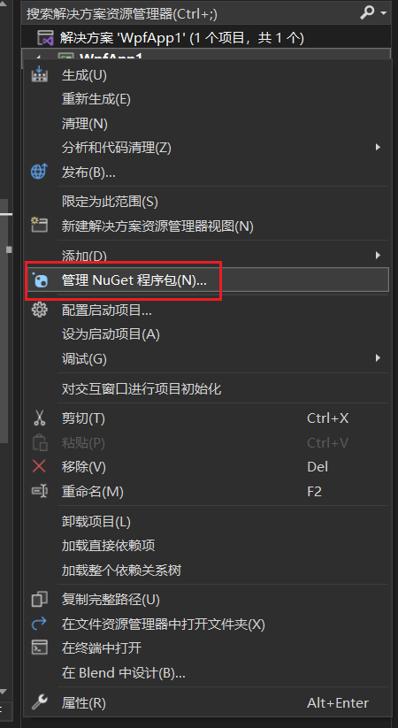
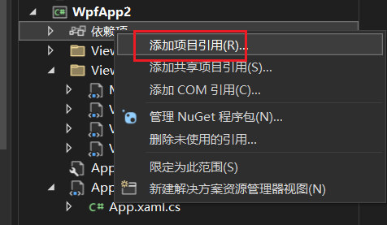

# WPF项目实战合集

> https://www.bilibili.com/video/BV1nY411a7T8?vd_source=6acbea1f220677e467858842c9adf1b2

## 布局基础

### Grid

```xaml
<Window x:Class="WpfApp1.MainWindow"
        xmlns="http://schemas.microsoft.com/winfx/2006/xaml/presentation"
        xmlns:x="http://schemas.microsoft.com/winfx/2006/xaml"
        xmlns:d="http://schemas.microsoft.com/expression/blend/2008"
        xmlns:mc="http://schemas.openxmlformats.org/markup-compatibility/2006"
        xmlns:local="clr-namespace:WpfApp1"
        mc:Ignorable="d"
        Title="MainWindow" Height="450" Width="800">
    <Grid>
        <Grid.ColumnDefinitions>
            <ColumnDefinition />
            <ColumnDefinition />
        </Grid.ColumnDefinitions>

        <Grid.RowDefinitions>
            <RowDefinition />
            <RowDefinition />
        </Grid.RowDefinitions>

        <Border Background="Red"/>
        <Border Grid.Row="1" Background="Green"/>
        <Border Grid.Column="1" Background="Yellow"/>
        <Border Grid.Row="1" Grid.Column="1" Background="Blue"/>
        
    </Grid>
</Window>
```

可以看到如下的效果


但是我如果我们作出如下修改

```xaml
<Grid.RowDefinitions>
            <RowDefinition Height="auto" />
            <RowDefinition />
        </Grid.RowDefinitions>
```

可以发现第一行的高度被省略了，因为第一行没有任何东西，所以`auto`高度的Row会被自动省略


接着我们给第一行添加一个有高度的控件，如下【Button】

```xaml
<Window x:Class="WpfApp1.MainWindow"
        xmlns="http://schemas.microsoft.com/winfx/2006/xaml/presentation"
        xmlns:x="http://schemas.microsoft.com/winfx/2006/xaml"
        xmlns:d="http://schemas.microsoft.com/expression/blend/2008"
        xmlns:mc="http://schemas.openxmlformats.org/markup-compatibility/2006"
        xmlns:local="clr-namespace:WpfApp1"
        mc:Ignorable="d"
        Title="MainWindow" Height="450" Width="800">
    <Grid>
        <Grid.ColumnDefinitions>
            <ColumnDefinition />
            <ColumnDefinition />
        </Grid.ColumnDefinitions>

        <Grid.RowDefinitions>
            <RowDefinition Height="auto" />
            <RowDefinition />
        </Grid.RowDefinitions>

        <Border Background="Red"/>
        <Border Grid.Row="1" Background="Green"/>
        <Border Grid.Column="1" Background="Yellow"/>
        <Border Grid.Row="1" Grid.Column="1" Background="Blue"/>

        <Button Height="100" Width="100" Click="Button_Click" Grid.ColumnSpan="2" />
    </Grid>
</Window>
```


这里我们给Button设置了一个高度，于是Row在高度为`auto`的情况下，就与Button的高度一致了，同时我们为Button设置了ColumSpan，让他跨过两列

对于 `RowDefinition` 我们还可以设置其他的高度值

+ `100` 绝对高度
+ `2*` 相较于其他行的两倍

### StackPanel

```xaml
<Window x:Class="WpfApp1.MainWindow"
        xmlns="http://schemas.microsoft.com/winfx/2006/xaml/presentation"
        xmlns:x="http://schemas.microsoft.com/winfx/2006/xaml"
        xmlns:d="http://schemas.microsoft.com/expression/blend/2008"
        xmlns:mc="http://schemas.openxmlformats.org/markup-compatibility/2006"
        xmlns:local="clr-namespace:WpfApp1"
        mc:Ignorable="d"
        Title="MainWindow" Height="450" Width="800">
    <Grid>
        <Grid.ColumnDefinitions>
            <ColumnDefinition />
            <ColumnDefinition />
        </Grid.ColumnDefinitions>

        <Grid.RowDefinitions>
            <RowDefinition Height="350" />
            <RowDefinition />
        </Grid.RowDefinitions>

        <Border Background="Red"/>
        <Border Grid.Row="1" Background="Green"/>
        <Border Grid.Column="1" Background="Yellow"/>
        <Border Grid.Row="1" Grid.Column="1" Background="Blue"/>

        <StackPanel Orientation="Horizontal">
            <Button Height="100" Width="100" />
            <Button Height="100" Width="100" />
            <Button Height="100" Width="100" />
        </StackPanel>
        
    </Grid>
</Window>
```

默认情况下`StackPanel`的内容排布为纵向的，我们可以设置`Orientation`属性来调整它的方向


### WrapPanel

```xaml
<Window x:Class="WpfApp1.MainWindow"
        xmlns="http://schemas.microsoft.com/winfx/2006/xaml/presentation"
        xmlns:x="http://schemas.microsoft.com/winfx/2006/xaml"
        xmlns:d="http://schemas.microsoft.com/expression/blend/2008"
        xmlns:mc="http://schemas.openxmlformats.org/markup-compatibility/2006"
        xmlns:local="clr-namespace:WpfApp1"
        mc:Ignorable="d"
        Title="MainWindow" Height="450" Width="800">
    <Grid>
        <Grid.ColumnDefinitions>
            <ColumnDefinition />
            <ColumnDefinition />
        </Grid.ColumnDefinitions>

        <Grid.RowDefinitions>
            <RowDefinition Height="350" />
            <RowDefinition />
        </Grid.RowDefinitions>

        <Border Background="Red"/>
        <Border Grid.Row="1" Background="Green"/>
        <Border Grid.Column="1" Background="Yellow"/>
        <Border Grid.Row="1" Grid.Column="1" Background="Blue"/>

        <WrapPanel Orientation="Vertical">
            <Button Height="100" Width="100" />
            <Button Height="100" Width="100" />
            <Button Height="100" Width="100" />
            <Button Height="100" Width="100" />
            <Button Height="100" Width="100" />
        </WrapPanel>
        
    </Grid>
</Window>
```

默认情况下`WrapPanel`的内容排布为横向的，我们可以设置`Orientation`属性来调整它的方向

它与`StackPanel`不同的是，它超过容器的高度时，会自动换行

### DockPanel

```xaml
<Window x:Class="WpfApp1.MainWindow"
        xmlns="http://schemas.microsoft.com/winfx/2006/xaml/presentation"
        xmlns:x="http://schemas.microsoft.com/winfx/2006/xaml"
        xmlns:d="http://schemas.microsoft.com/expression/blend/2008"
        xmlns:mc="http://schemas.openxmlformats.org/markup-compatibility/2006"
        xmlns:local="clr-namespace:WpfApp1"
        mc:Ignorable="d"
        Title="MainWindow" Height="450" Width="800">
    <Grid>

        <DockPanel>
            <Button Height="100" Width="100" />
            <Button Height="100" Width="100" />
            <Button Height="100" Width="100" />
            <Button Height="100" Width="100" />
            <Button Height="100" Width="100" />
        </DockPanel>
        
    </Grid>
</Window>
```

DockPanel 最后一个元素会自动填充整个容器，我们可以通过修改`LastChildFill="False"`来变更这个特性


但是由于我们限定了Button的宽度，所以只能看到最后一个Button处于剩余空间的中间，如果我们调整Button的Width为`auto`的话，他就会填充满整个容器，如下


我们还可以为各个Button设置停靠的方向

```xaml
<Window x:Class="WpfApp1.MainWindow"
        xmlns="http://schemas.microsoft.com/winfx/2006/xaml/presentation"
        xmlns:x="http://schemas.microsoft.com/winfx/2006/xaml"
        xmlns:d="http://schemas.microsoft.com/expression/blend/2008"
        xmlns:mc="http://schemas.openxmlformats.org/markup-compatibility/2006"
        xmlns:local="clr-namespace:WpfApp1"
        mc:Ignorable="d"
        Title="MainWindow" Height="450" Width="800">
    <Grid>

        <DockPanel>
            <Button Height="100" Width="100" DockPanel.Dock="Top" />
            <Button Height="100" Width="100" DockPanel.Dock="Right" />
            <Button Height="100" Width="100" DockPanel.Dock="Left" />
            <Button Height="100" Width="100" DockPanel.Dock="Bottom" />
            <Button Height="100" Width="auto" />
        </DockPanel>
        
    </Grid>
</Window>
```


它会根据已占用的空间重新计算居中的位置

### UniformGrid

它可以自动将界面切分成几个等份的块

```xaml
<Window x:Class="WpfApp1.MainWindow"
        xmlns="http://schemas.microsoft.com/winfx/2006/xaml/presentation"
        xmlns:x="http://schemas.microsoft.com/winfx/2006/xaml"
        xmlns:d="http://schemas.microsoft.com/expression/blend/2008"
        xmlns:mc="http://schemas.openxmlformats.org/markup-compatibility/2006"
        xmlns:local="clr-namespace:WpfApp1"
        mc:Ignorable="d"
        Title="MainWindow" Height="450" Width="800">
    <Grid>

        <UniformGrid>
            <Button  />
            <Button  />
            <Button  />
            <Button  />
            <Button  />
        </UniformGrid>
        
    </Grid>
</Window>
```

如图所示


当然也可手动的指定需要划分的行列数

```xaml
<Window x:Class="WpfApp1.MainWindow"
        xmlns="http://schemas.microsoft.com/winfx/2006/xaml/presentation"
        xmlns:x="http://schemas.microsoft.com/winfx/2006/xaml"
        xmlns:d="http://schemas.microsoft.com/expression/blend/2008"
        xmlns:mc="http://schemas.openxmlformats.org/markup-compatibility/2006"
        xmlns:local="clr-namespace:WpfApp1"
        mc:Ignorable="d"
        Title="MainWindow" Height="450" Width="800">
    <Grid>

        <UniformGrid Columns="4" Rows="3" >
            <Button  />
            <Button  />
            <Button  />
            <Button  />
            <Button  />
        </UniformGrid>
        
    </Grid>
</Window>
```

## 样式

### 样式基础

我们可以按如下方式定义统一的样式

```xaml
<Window x:Class="WpfApp1.MainWindow"
        xmlns="http://schemas.microsoft.com/winfx/2006/xaml/presentation"
        xmlns:x="http://schemas.microsoft.com/winfx/2006/xaml"
        xmlns:d="http://schemas.microsoft.com/expression/blend/2008"
        xmlns:mc="http://schemas.openxmlformats.org/markup-compatibility/2006"
        xmlns:local="clr-namespace:WpfApp1"
        mc:Ignorable="d"
        Title="MainWindow" Height="450" Width="800">
    <Window.Resources>
        <Style x:Key="baseStyle" TargetType="Button">
            <Setter Property="FontSize" Value="40"/>
        </Style>
        <Style x:Key="customStyle" TargetType="Button" 
               BasedOn="{StaticResource baseStyle}">
            <Setter Property="Background" Value="Red"/>
        </Style>
    </Window.Resources>
    <Grid>

        <UniformGrid Columns="4" Rows="3" >
            <Button Style="{DynamicResource customStyle}" Content="靠" />
            <Button  />
            <Button  />
            <Button  />
            <Button  />
        </UniformGrid>
        
    </Grid>
</Window>
```

首先我们需要定义一个 `Window.Resources` 标签，并添加 `Style` 子标签。这个 `Style` 就是用来定义统一样式的，它主要会用到下面三个属性：

+ `TargetType`：样式应用到哪个控件上

+ `x:Key`：样式标识
  + 如果不设置，样式会应用到所有的`TargetType` 上
  + 如果设置了，目标控件需要在自己的 `Style` 属性上添加`Style="{DynamicResource KeyName}"`
+ `BasedOn`：继承于哪个父样式

### 控件模板

C# 为每个空间定义了默认的样式模板，我们可以对其进行修改，操作如下：


这样 VS Studio 就会在当前的 xaml 文件中创建出对应的样式模板

```xaml
<Window x:Class="WpfApp1.MainWindow"
        xmlns="http://schemas.microsoft.com/winfx/2006/xaml/presentation"
        xmlns:x="http://schemas.microsoft.com/winfx/2006/xaml"
        xmlns:d="http://schemas.microsoft.com/expression/blend/2008"
        xmlns:mc="http://schemas.openxmlformats.org/markup-compatibility/2006"
        xmlns:local="clr-namespace:WpfApp1"
        mc:Ignorable="d"
        Title="MainWindow" Height="450" Width="800">
    <Window.Resources>
        <Style x:Key="baseStyle" TargetType="Button">
            <Setter Property="FontSize" Value="40"/>
        </Style>
        <Style x:Key="customStyle" TargetType="Button" BasedOn="{StaticResource baseStyle}">
            <Setter Property="Background" Value="Red"/>
        </Style>
        <SolidColorBrush x:Key="Button.MouseOver.Background" Color="#FFBEE6FD"/>
        <SolidColorBrush x:Key="Button.MouseOver.Border" Color="#FF3C7FB1"/>
        <SolidColorBrush x:Key="Button.Pressed.Background" Color="#FFC4E5F6"/>
        <SolidColorBrush x:Key="Button.Pressed.Border" Color="#FF2C628B"/>
        <SolidColorBrush x:Key="Button.Disabled.Background" Color="#FFF4F4F4"/>
        <SolidColorBrush x:Key="Button.Disabled.Border" Color="#FFADB2B5"/>
        <SolidColorBrush x:Key="Button.Disabled.Foreground" Color="#FF838383"/>
        <ControlTemplate x:Key="ButtonTemplate1" TargetType="{x:Type ButtonBase}">
            <Border x:Name="border" Background="{TemplateBinding Background}" BorderBrush="{TemplateBinding BorderBrush}" BorderThickness="{TemplateBinding BorderThickness}" SnapsToDevicePixels="true">
                <ContentPresenter x:Name="contentPresenter" Focusable="False" HorizontalAlignment="{TemplateBinding HorizontalContentAlignment}" Margin="{TemplateBinding Padding}" RecognizesAccessKey="True" SnapsToDevicePixels="{TemplateBinding SnapsToDevicePixels}" VerticalAlignment="{TemplateBinding VerticalContentAlignment}"/>
            </Border>
            <ControlTemplate.Triggers>
                <Trigger Property="Button.IsDefaulted" Value="true">
                    <Setter Property="BorderBrush" TargetName="border" Value="{DynamicResource {x:Static SystemColors.HighlightBrushKey}}"/>
                </Trigger>
                <Trigger Property="IsMouseOver" Value="true">
                    <Setter Property="Background" TargetName="border" Value="{StaticResource Button.MouseOver.Background}"/>
                    <Setter Property="BorderBrush" TargetName="border" Value="{StaticResource Button.MouseOver.Border}"/>
                </Trigger>
                <Trigger Property="IsPressed" Value="true">
                    <Setter Property="Background" TargetName="border" Value="{StaticResource Button.Pressed.Background}"/>
                    <Setter Property="BorderBrush" TargetName="border" Value="{StaticResource Button.Pressed.Border}"/>
                </Trigger>
                <Trigger Property="IsEnabled" Value="false">
                    <Setter Property="Background" TargetName="border" Value="{StaticResource Button.Disabled.Background}"/>
                    <Setter Property="BorderBrush" TargetName="border" Value="{StaticResource Button.Disabled.Border}"/>
                    <Setter Property="TextElement.Foreground" TargetName="contentPresenter" Value="{StaticResource Button.Disabled.Foreground}"/>
                </Trigger>
            </ControlTemplate.Triggers>
        </ControlTemplate>
    </Window.Resources>
    <Grid>

        <UniformGrid Columns="4" Rows="3" >
            <Button Template="{DynamicResource ButtonTemplate1}" Style="{DynamicResource customStyle}" Content="Test" />
            <Button  />
            <Button  />
            <Button  />
            <Button  />
        </UniformGrid>
        
    </Grid>
</Window>
```

## 资源 ★

### 类型

可以分为静态资源以及动态资源

+ 静态资源是在编译时解析的，静态资源适用于不会更改的资源

  + 在 XAML 中，可以使用`{StaticResource}` 引用静态资源

+ 动态资源是在运行时解析的，动态资源适用于可能会在运行时更改的资源。

  + 在 XAML 中，可以使用 `{DynamicResource}` 引用动态资源。通过使用这些标记扩展，可以将资源应用于界面元素的属性、样式和模板中。

+ 在cs文件中，我们可以使用

  ```cs
  this.Resources["resourceName"] = xxx
  ```

  来变更资源

### 资源管理

我们可以右击模块添加资源字典来为该模块添加全局资源


```xaml
<ResourceDictionary xmlns="http://schemas.microsoft.com/winfx/2006/xaml/presentation"
                    xmlns:x="http://schemas.microsoft.com/winfx/2006/xaml">
    <Style x:Key="buttonStyle" TargetType="Button">
        <Setter Property="FontSize" Value="20" />
    </Style>
</ResourceDictionary>
```

同时我们还需要将这个资源字典添加到 `MergedDictionaries`后，我们才能使用这个字典内定义的资源，如下，打开`App.xaml`：

```xaml
<Application x:Class="WpfApp1.App"
             xmlns="http://schemas.microsoft.com/winfx/2006/xaml/presentation"
             xmlns:x="http://schemas.microsoft.com/winfx/2006/xaml"
             xmlns:local="clr-namespace:WpfApp1"
             StartupUri="MainWindow.xaml">
    <Application.Resources>
        <ResourceDictionary>
            <ResourceDictionary.MergedDictionaries>
                <ResourceDictionary Source="Dictionary1.xaml" />
            </ResourceDictionary.MergedDictionaries>
        </ResourceDictionary>
    </Application.Resources>
</Application>
```

`ResourceDictionary` 是一种用于组织和管理资源的集合。可以在应用程序中使用多个 `ResourceDictionary`，并使用 `MergedDictionaries` 属性将它们合并在一起。这样可以更好地组织和管理大量的资源。

在cs代码中，我们可以通过如下方式获取资源字典中定义的字典

```cs
var style = App.Current.FindResource("resourceName");
```

## 动画

```cs
public MainWindow()
{
    InitializeComponent();

    DoubleAnimation animation = new DoubleAnimation();
    // 创建 DoubleAnimation 对象来定义按钮宽度的动画效果

    // animation.By -= 100;
    // 使用 By 属性可以设置按钮宽度相对于当前值的增量

    animation.From = btn.Width;
    // 定义动画的起始值为按钮的当前宽度

    animation.To = btn.Width - 100;
    // 定义动画的结束值为按钮的当前宽度减去 100

    animation.Duration = TimeSpan.FromSeconds(2);
    // 设置动画的持续时间为 2 秒

    animation.AutoReverse = true;
    // 设置动画在完成后是否自动反向播放，即返回到起始值

    animation.RepeatBehavior = RepeatBehavior.Forever;
    // 设置动画的重复行为为永远重复播放

    // animation.RepeatBehavior = new RepeatBehavior(5);
    // 也可以指定重复的次数
    
    animation.Completed += Completed;
    // 设定动画完成后的行为

    btn.BeginAnimation(Button.WidthProperty, animation);
    // 将动画应用于按钮的宽度属性，开始播放动画
}

private void Completed(object sender, EventArgs e)
{
	throw new NotImplementedException();
}
```

## 数据模板

### 演示

```xaml
<Window x:Class="WpfApp1.MainWindow"
        xmlns="http://schemas.microsoft.com/winfx/2006/xaml/presentation"
        xmlns:x="http://schemas.microsoft.com/winfx/2006/xaml"
        xmlns:d="http://schemas.microsoft.com/expression/blend/2008"
        xmlns:mc="http://schemas.openxmlformats.org/markup-compatibility/2006"
        xmlns:local="clr-namespace:WpfApp1"
        mc:Ignorable="d"
        Title="MainWindow" Height="450" Width="800">
    <Grid>
        <Grid.RowDefinitions>
            <RowDefinition/>
            <RowDefinition/>
        </Grid.RowDefinitions>

        <ListBox x:Name="listBox">
            <ListBox.ItemTemplate>
                <DataTemplate>
                    <StackPanel Orientation="Horizontal">
                        <Border  Width="10" Height="10" Background="{Binding Code}"/>
                        <TextBlock Margin="10, 0" Text="{Binding Name}"/>
                    </StackPanel>
                </DataTemplate>
            </ListBox.ItemTemplate>
        </ListBox>

        <DataGrid x:Name="dataGrid" Grid.Row="1" AutoGenerateColumns="False" CanUserAddRows="False" >
            <DataGrid.Columns>
                <DataGridTextColumn Header="名字" Binding="{Binding Name}"/>
                <DataGridTextColumn Header="颜色代码" Binding="{Binding Code}" />
                <DataGridTemplateColumn Header="展示">
                    <DataGridTemplateColumn.CellTemplate>
                        <DataTemplate>
                            <StackPanel Orientation="Horizontal">
                                <Border  Width="10" Height="10" Background="{Binding Code}"/>
                                <TextBlock Margin="10, 0" Text="{Binding Name}"/>
                            </StackPanel>
                        </DataTemplate>
                    </DataGridTemplateColumn.CellTemplate>
                </DataGridTemplateColumn>
            </DataGrid.Columns>
        </DataGrid>
    </Grid>
</Window>
```

其中 `DataGrid` 的部分属性说明如下：

+ `AutoGenerateColumns`：是否使用自动生成的代码模板，为 True 时，控件会额外
+ `CanUserAddRows`：是否在表格最后添加一个空白行，用于用户添加自定义数据

界面效果如下


总结一下就是我们在`DataTemplate`标签下定义我们自己的数据模板，其中 `{Binding Name}` 表示当前控件所绑定的属性名，然后在代码处，我们为控件赋予数据源，如下：

```cs
namespace WpfApp1
{
    /// <summary>
    /// MainWindow.xaml 的交互逻辑
    /// </summary>
    public partial class MainWindow : Window
    {
        public MainWindow()
        {
            InitializeComponent();

            List<ColorEntity> entities = new List<ColorEntity>();
            entities.Add(new ColorEntity() { Name = "红色", Code = "red" });
            entities.Add(new ColorEntity() { Name = "蓝色", Code = "blue" });
            entities.Add(new ColorEntity() { Name = "绿色", Code = "green" });
            entities.Add(new ColorEntity() { Name = "黄色", Code = "yellow" });
            listBox.ItemsSource = entities;
            dataGrid.ItemsSource = entities;
        }

        public class ColorEntity
        {
            public String Name { get; set; }

            public String Code { get; set; }
        }
    }
}
```

### 数据绑定

Binding（绑定）是在 WPF (Windows Presentation Foundation) 中用于建立界面元素与数据源之间的连接。它提供了一种便捷的方式来显示、更新和同步数据的变化。下面是 Binding 的全部用法：

1. 数据源选择：
   - ElementName：使用其他 XAML 元素作为数据源。可以通过指定元素的名称来引用该元素。
   - Source：直接指定一个对象作为数据源。
   - RelativeSource：相对于绑定目标元素的位置来选择数据源，例如绑定目标元素的父级或祖先元素。
   - StaticResource：从 XAML 中定义的静态资源中选择数据源。

2. 属性路径：
   - Path：指定要绑定的属性路径。可以是对象的公共属性、索引器、命令、依赖属性等。

3. 模式与更新行为：
   - Mode：指定绑定的模式，控制数据的双向绑定、单向绑定、单次绑定等。常见的模式包括 OneWay、TwoWay、OneTime 和 OneWayToSource。
   - UpdateSourceTrigger：指定何时更新数据源。例如，当目标属性更改时、当焦点丢失时、或者实时更新。

4. 转换器：
   - Converter：用于在绑定过程中执行值的转换。可以自定义转换器来实现特定的逻辑，将绑定值转换为目标属性所需的值。

5. 验证：
   - ValidationRules：用于对绑定值进行验证的规则。可以自定义验证规则来验证绑定值的有效性。

6. 附加属性：
   - TargetNullValue：在绑定值为 null 时，显示的备用值。
   - FallbackValue：在绑定失败或无效时，显示的备用值。

Binding 提供了强大的数据绑定功能，使开发人员能够轻松实现界面和数据的交互。它使得界面元素能够自动更新，根据数据源的变化进行同步，并且允许用户输入的数据与数据源进行双向绑定。通过合理使用 Binding，可以提高代码的可维护性和灵活性，同时减少手动处理数据与界面之间的繁琐操作。

```xaml
<Window x:Class="WpfApp1.MainWindow"
        xmlns="http://schemas.microsoft.com/winfx/2006/xaml/presentation"
        xmlns:x="http://schemas.microsoft.com/winfx/2006/xaml"
        xmlns:d="http://schemas.microsoft.com/expression/blend/2008"
        xmlns:mc="http://schemas.openxmlformats.org/markup-compatibility/2006"
        xmlns:local="clr-namespace:WpfApp1"
        mc:Ignorable="d"
        Title="MainWindow" Height="450" Width="800">
    <StackPanel>
        <Slider x:Name="slider"/>
        <TextBox Text="{Binding ElementName=slider, Path=Value}" Margin="5"/>
        <TextBox Text="{Binding ElementName=slider, Path=Value}" Margin="5"/>
        <TextBox Text="{Binding ElementName=slider, Path=Value}" Margin="5"/>
    </StackPanel>
</Window>
```


## 命令（ICommand）

### 简单使用

需求：点击Button按钮显示对应的弹出框

1、创建一个`MyCommand`实现`ICommand`接口，通过传递委托来执行方法

默认实现如下所示

```cs
using System;
using System.Collections.Generic;
using System.Linq;
using System.Text;
using System.Threading.Tasks;
using System.Windows.Input;

namespace WpfApp1
{
    public class MyCommand : ICommand
    {
        public event EventHandler CanExecuteChanged;

        public bool CanExecute(object parameter)
        {
            throw new NotImplementedException();
        }

        public void Execute(object parameter)
        {
            throw new NotImplementedException();
        }
    }
}
```

我需要传递一个委托，可以通过构造方法来实现

```cs
using System;
using System.Collections.Generic;
using System.Linq;
using System.Text;
using System.Threading.Tasks;
using System.Windows.Input;

namespace WpfApp1
{
    public class MyCommand : ICommand
    {
        public event EventHandler CanExecuteChanged;

        private Action<string> executeAction;

        public MyCommand(Action<string> executeAction)
        { 
            this.executeAction = executeAction;
        }

        public bool CanExecute(object parameter)
        {
            return true;
        }

        public void Execute(object parameter)
        {
            executeAction((string)parameter);
        }
    }
}
```

+ 其中`CanExecuteChanged`属性表示触发`Command`后的事件处理器
+ `CanExecute` 表示是否执行事件处理
+ `Execute` 表示该执行什么事件处理，在上例中，我们调用所传递的委托来处理事件，同时把参数传递给委托

2、创建具体的委托方法，并使用类封装起来，这个类创建的对象最终会变成我们的数据上下文

```cs
namespace WpfApp1
{
    internal class MainViewModel
    {
        public MainViewModel() 
        {
            myCommand = new MyCommand((s) =>
            {
                MessageBox.Show(s);
            });
        }
        public MyCommand myCommand { get; set; }
    }
}
```

3、为 View 指定好数据上下文

```cs
namespace WpfApp1
{
    /// <summary>
    /// MainWindow.xaml 的交互逻辑
    /// </summary>
    public partial class MainWindow : Window
    {
        public MainWindow()
        {
            InitializeComponent();

            this.DataContext = new MainViewModel();
        }

    }
}
```

3、为 Button 绑定 Command，并设置相应的 CommandParameter

```xaml
<Window x:Class="WpfApp1.MainWindow"
        xmlns="http://schemas.microsoft.com/winfx/2006/xaml/presentation"
        xmlns:x="http://schemas.microsoft.com/winfx/2006/xaml"
        xmlns:d="http://schemas.microsoft.com/expression/blend/2008"
        xmlns:mc="http://schemas.openxmlformats.org/markup-compatibility/2006"
        xmlns:local="clr-namespace:WpfApp1"
        mc:Ignorable="d"
        Title="MainWindow" Height="450" Width="800">
    <StackPanel>

        <Button Command="{Binding myCommand}" CommandParameter="1" Content="按钮1" Margin="5" />
        <Button Command="{Binding myCommand}" CommandParameter="2" Content="按钮2" Margin="5" />
        <Button Command="{Binding myCommand}" CommandParameter="3" Content="按钮3" Margin="5" />
    </StackPanel>
</Window>
```

### 通知更新

假设我们在数据上下文内部定义了一个新的变量`Name`，并且在定义的委托方法中去修改这个变量

```cs
using System;
using System.Windows;

namespace WpfApp1
{
    internal class MainViewModel
    {
        public MainViewModel() 
        {
            myCommand = new MyCommand((s) =>
            {
                Name = new DateTime().Millisecond.ToString();
                MessageBox.Show(s);
            });
        }
        public string Name { get; set; }

        public MyCommand myCommand { get; set; }
    }
}

```

并且我们在 xaml 也定义一个 TextBox 来显示他

```xml
<Window x:Class="WpfApp1.MainWindow"
        xmlns="http://schemas.microsoft.com/winfx/2006/xaml/presentation"
        xmlns:x="http://schemas.microsoft.com/winfx/2006/xaml"
        xmlns:d="http://schemas.microsoft.com/expression/blend/2008"
        xmlns:mc="http://schemas.openxmlformats.org/markup-compatibility/2006"
        xmlns:local="clr-namespace:WpfApp1"
        mc:Ignorable="d"
        Title="MainWindow" Height="450" Width="800">
    <StackPanel>

        <TextBox Text="{Binding Name}" Margin="5" />
        <Button Command="{Binding myCommand}" CommandParameter="1" Content="按钮1" Margin="5" />
        <Button Command="{Binding myCommand}" CommandParameter="2" Content="按钮2" Margin="5" />
        <Button Command="{Binding myCommand}" CommandParameter="3" Content="按钮3" Margin="5" />
    </StackPanel>
</Window>
```

但是可以发现，当我们点击 Button 时，委托方法中的

```cs
Name = new DateTime().Millisecond.ToString();
```

并没有执行，这时我们接需要用到“通知”了

#### 版本1

在 C# 中，当您在命令的委托方法中修改属性值时，界面上绑定该属性的数据可能不会自动更新。这是因为在大多数情况下，**界面绑定是单向的**，即从数据源到界面，而不会自动从界面到数据源进行双向更新。

当您修改属性值时，**界面绑定通常不会自动检测到属性值的更改并更新界面上显示的数据**。这是因为界面绑定通常依赖于数据源对象实现的 INotifyPropertyChanged 接口或属性的属性更改事件。

为了确保界面上绑定的数据可以正确地更新，您需要确保以下几点：

1. 属性实现 INotifyPropertyChanged 接口：您的数据源对象应该实现 `INotifyPropertyChanged` 接口，并在属性更改时引发 `PropertyChanged` 事件。这将通知绑定系统属性值已更改，需要更新绑定的界面元素。

2. 在属性的 `set` 访问器中引发 PropertyChanged 事件：在属性的 `set` 访问器中，应该触发 `PropertyChanged` 事件，以通知绑定系统属性已更改。
   ```csharp
   using System;
   using System.ComponentModel;
   using System.Windows;
   
   namespace WpfApp1
   {
       internal class MainViewModel: INotifyPropertyChanged
       {
   
           public MainViewModel() 
           {
               myCommand = new MyCommand((s) =>
               {
                   Name = new DateTime().Millisecond.ToString();
                   MessageBox.Show(s);
               });
           }
   
           private string name;
           public string Name 
           { 
               get { return name; }
               set
               {
                   name = value;
                   PropertyChanged?.Invoke(this, new PropertyChangedEventArgs("Name"));
               }
           }
   
           public MyCommand myCommand { get; set; }
   
           public event PropertyChangedEventHandler PropertyChanged;
       }
   }
   ```

通过以上步骤，当您在命令的委托方法中修改属性值时，引发 `PropertyChanged` 事件将通知绑定系统该属性已更改，并自动更新绑定的界面数据。

但是这个方法有个缺点，如果界面有多个属性，我们就要写许多下面这样的代码，看起来非常的累赘

```cs
PropertyChanged?.Invoke(this, new PropertyChangedEventArgs("Name"));
```

#### 版本2

我们可以将上面这个方法封装为一个基类，这个基类会继承`INotifyPropertyChanged`

```cs
public class ViewModelBase: INotifyPropertyChanged
{
    public event PropertyChangedEventHandler PropertyChanged;
    
    public void OnPropertyChanged(string propertyName)
    {
        PropertyChanged?.Invoke(this, new PropertyChangedEventArgs(propertyName));
    }
}
```

然后我们在继承这个基类

```cs
using System;
using System.ComponentModel;
using System.Windows;

namespace WpfApp1
{
    internal class MainViewModel: ViewModelBase
    {

        public MainViewModel() 
        {
            myCommand = new MyCommand((s) =>
            {
                Name = new DateTime().Millisecond.ToString();
                MessageBox.Show(s);
            });
        }

        private string name;
        public string Name 
        { 
            get { return name; }
            set
            {
                name = value;
                OnPropertyChanged("Name");
            }
        }

        public MyCommand myCommand { get; set; }

    }
}
```

这样我们就能省略一部分代码，但是这样还不够

#### 版本3

```cs
OnPropertyChanged("Name");
```

我们每次都要传递我们变更的属性名，我们可以通过`CallerMemberName`这个特性自动获得属性名

```cs
public class ViewModelBase: INotifyPropertyChanged
{
    public event PropertyChangedEventHandler PropertyChanged;
    
    public void OnPropertyChanged([CallerMemberName]string propertyName = "")
    {
        PropertyChanged?.Invoke(this, new PropertyChangedEventArgs(propertyName));
    }
}
```

之后我们调用这个方法就不需要手动传递属性名这个参数了

```cs
public string Name 
        { 
            get { return name; }
            set
            {
                name = value;
                OnPropertyChanged();
            }
        }
```

## 其他框架

+ MvvmLight
+ MicrosoftToolkitMVVM

## Prism 框架

> 示例代码：[PrismLibrary/Prism-Samples-Wpf: Samples that demonstrate how to use various Prism features with WPF (github.com)](https://github.com/PrismLibrary/Prism-Samples-Wpf)

### 初识

1、安装依赖

右击模块 -> 管理 NuGet 程序包



2、搜索 `prism.dryioc`，找到匹配版本并安装

3、使用

（1）将 `App.xaml.cs` 的 App 的基类改为 `PrismApplication`

```cs
using Prism.DryIoc;

namespace WpfApp1
{
    /// <summary>
    /// App.xaml 的交互逻辑
    /// </summary>
    public partial class App : PrismApplication
    {
    }
}
```

要注意，这样改后直接运行会产生如下错误

```
“App”的分部声明一定不能指定不同的基类
```

（2）我们还需要修改 xaml 的命名空间，将

```xaml
<Application x:Class="WpfApp1.App"
             xmlns="http://schemas.microsoft.com/winfx/2006/xaml/presentation"
             xmlns:x="http://schemas.microsoft.com/winfx/2006/xaml"
             xmlns:local="clr-namespace:WpfApp1"
             StartupUri="MainWindow.xaml">
    <Application.Resources>
    </Application.Resources>
</Application>
```

改为

```xaml
<prism:PrismApplication x:Class="WpfApp1.App"
             xmlns="http://schemas.microsoft.com/winfx/2006/xaml/presentation"
             xmlns:x="http://schemas.microsoft.com/winfx/2006/xaml"
             xmlns:local="clr-namespace:WpfApp1"
             xmlns:prism="http://prismlibrary.com/"
             StartupUri="MainWindow.xaml">
    <Application.Resources>
        
    </Application.Resources>
</prism:PrismApplication>
```

（3）但是这样直接运行还是会报错

```
App.xaml.cs(16,26,16,29): error CS0534: “App”不实现继承的抽象成员“PrismApplicationBase.RegisterTypes(IContainerRegistry)”
App.xaml.cs(16,26,16,29): error CS0534: “App”不实现继承的抽象成员“PrismApplicationBase.CreateShell()”
```

我们还需要在 `App.xaml.cs` 实现两个抽象方法

```cs
namespace WpfApp1
{
    /// <summary>
    /// App.xaml 的交互逻辑
    /// </summary>
    public partial class App : PrismApplication
    {

        protected override Window CreateShell()
        {
            return Container.Resolve<MainWindow>();
        }

        protected override void RegisterTypes(IContainerRegistry containerRegistry)
        {
        }
    }
}
```

其中：

+  `CreateShell` ，启动脚本，我们确定了首页面
+ `RegisterTypes`，一些依赖注入的操作

（4）上面这样虽然能运行，但是它会同时运行两个首界面，我们需要删除 `App.xaml.cs` 中的 `StartupUri` 属性，如下

```xaml
<prism:PrismApplication x:Class="WpfApp1.App"
             xmlns="http://schemas.microsoft.com/winfx/2006/xaml/presentation"
             xmlns:x="http://schemas.microsoft.com/winfx/2006/xaml"
             xmlns:local="clr-namespace:WpfApp1"
             xmlns:prism="http://prismlibrary.com/">
    <Application.Resources>
        
    </Application.Resources>
</prism:PrismApplication>
```

4、模板

每次使用 Prism 框架都要改这么多东西，十分的麻烦，因此我们需要下载模板插件


下载完成后重启 vs studio


选择 dryioc


这样一个完整的 Prism 项目就被创建了


它会我们的项目添加额外的模块与服务

### 导航

> 类似于 Vue 的 `<router-view />`

需求：导航栏有3个按钮，点击不同的按钮，主区域部分展示不同的内容

#### 版本1

（1）首先创建 `MainView.xaml`

```xaml
<Window x:Class="WpfApp1.Views.MainView"
        xmlns="http://schemas.microsoft.com/winfx/2006/xaml/presentation"
        xmlns:x="http://schemas.microsoft.com/winfx/2006/xaml"
        xmlns:d="http://schemas.microsoft.com/expression/blend/2008"
        xmlns:mc="http://schemas.openxmlformats.org/markup-compatibility/2006"
        xmlns:local="clr-namespace:WpfApp1"
        xmlns:prism="http://prismlibrary.com/"
        prism:ViewModelLocator.AutoWireViewModel="True"
        mc:Ignorable="d"
        Title="MainView" Height="450" Width="800">
    <Grid>
        <Grid.RowDefinitions>
            <RowDefinition Height="auto"/>
            <RowDefinition/>
        </Grid.RowDefinitions>

        <StackPanel Orientation="Horizontal">
            <Button Margin="5" Content="模块A" Command="{Binding OpenCommand}" CommandParameter="ViewA" />
            <Button Margin="5" Content="模块B" Command="{Binding OpenCommand}" CommandParameter="ViewB" />
            <Button Margin="5" Content="模块C" Command="{Binding OpenCommand}" CommandParameter="ViewC" />
        </StackPanel>

        <ContentControl Grid.Row="1" Content="{Binding Body}" />
    </Grid>
</Window>
```

编写好 `Command` 相关，我们把 `ContentControl` 当成占位符（可以视为`router-view`）

然后编写 `MainView.xaml.cs` 

```cs
namespace WpfApp1.Views
{
    /// <summary>
    /// MainWindow.xaml 的交互逻辑
    /// </summary>
    public partial class MainView: Window
    {
        public MainView()
        {
            InitializeComponent();
        }
    }
}
```

（2）创建对应的 `MainViewModel.cs`，用以完成我们界面的切换逻辑

```cs
namespace WpfApp1.ViewModels
{
    public class MainViewModel : BindableBase
    {

        public DelegateCommand<string> OpenCommand { get; private set; }

        public MainViewModel()
        {

            OpenCommand = new DelegateCommand<string>((arg) =>
            {
                switch (arg)
                {
                    case "ViewA":
                        Body = new ViewA();
                        break;
                    case "ViewB":
                        Body = new ViewB();
                        break;
                    case "ViewC":
                        Body = new ViewC();
                        break;
                }
            });
        }

        private object body;

        public object Body
        {
            get { return body; }
            set { body = value; RaisePropertyChanged(); }
        }
    }
}
```

##### 注意点 ★★

+ view 和 model 一定要符合规范

  + 如果创建了一个名为 `MainView.xaml` 的界面，它的 model 名必须为 `MainViewModel.cs`并
  +  view 要放在 `Views` 命令空间下，model 要放到 `ViewModels` 命名空间下，这两个命名空间属于同一级
  +  `MainView.xaml`  要引入 `xmlns:prism="http://prismlibrary.com/"` 空间，以及 `prism:ViewModelLocator.AutoWireViewModel="True"` 自动匹配

+ 不用手动设置上下文参数，prism 可以自动帮我们托管注入

  ```cs
  namespace WpfApp1.Views
  {
      public partial class MainView: Window
      {
          public MainView()
          {
              InitializeComponent();
              this.DataContext = new MainViewModel(xx);
          }
      }
  }
  ```

+ 想要使用“通知更新”，需要继承 `BindableBase`

#### 版本2

这种路由规则需要通过下面这样的硬编码实现，耦合的十分厉害，因此不推荐，下面使用框架的方法来解耦

（1）首先调整 `MainView.xaml` 文件

将

```xaml
<ContentControl Grid.Row="1" Content="{Binding Body}" />
```

替换为

```xaml
<ContentControl Grid.Row="1" prism:RegionManager.RegionName="RegionContent" />
```

（2）调整`MainViewModel.cs`文件

```cs
namespace WpfApp1.ViewModels
{
    public class MainViewModel : BindableBase
    {
        private readonly IRegionManager _regionManager;

        public DelegateCommand<string> OpenCommand { get; private set; }

        public MainViewModel(IRegionManager regionManager)
        {
            _regionManager = regionManager;


            OpenCommand = new DelegateCommand<string>((arg) =>
            {
                _regionManager.Regions["RegionContent"].RequestNavigate(arg);
            });
        }

        public MainViewModel()
        {
        }
    }
}
```

+ 为构造方法传递 `IRegionManager` 参数
+ `_regionManager.Regions["RegionContent"]` 可以获取容器中所有注册的导航路由，然后调用`RequestNavigate(routeName)`导航到指定的路由

（3）在`App.xaml.cs`注入导航路由

```cs
namespace WpfApp1
{
    /// <summary>
    /// App.xaml 的交互逻辑
    /// </summary>
    public partial class App : PrismApplication
    {

        protected override Window CreateShell()
        {
            return Container.Resolve<MainView>();
        }

        protected override void RegisterTypes(IContainerRegistry containerRegistry)
        {
            containerRegistry.RegisterForNavigation<ViewA>();
            containerRegistry.RegisterForNavigation<ViewB>();
            containerRegistry.RegisterForNavigation<ViewC>();
        }
    }
}
```

##### 注意点

+ 如果不想遵循版本1中的规范，我们可以在注册导航时指定 View 与 Model 的对应关系

  ```
  containerRegistry.RegisterForNavigation<ViewA, ViewAModel>();
  ```

#### 传递参数 ★★

（1）传递参数

```cs
_regionManager.Regions["RegionContent"].RequestNavigate(arg);
```

`RequestNavigate`有多个重载方法，我们可以在其第二个参数为 view 传递参数，如下

```cs
NavigationParameters parameters = new NavigationParameters();

parameters.Add("Title", "Hello");

_regionManager.Regions["RegionContent"].RequestNavigate(arg, parameters);
```

（2）接受参数

```cs
using Prism.Mvvm;
using Prism.Regions;
using System;
using System.Collections.Generic;
using System.Linq;
using System.Reflection;
using System.Text;
using System.Threading.Tasks;

namespace WpfApp2.ViewModels
{
    internal class ViewCModelTest : BindableBase, INavigationAware
    {

        private string title;

        public string Title 
        { 
            get { return title; }
            set { title = value; RaisePropertyChanged(); }
        }

        /// <summary>
        /// 每次导航时，是否重用原来的对象
        /// </summary>
        /// <param name="navigationContext"></param>
        /// <returns></returns>
        /// <exception cref="NotImplementedException"></exception>
        public bool IsNavigationTarget(NavigationContext navigationContext)
        {
            return true;
        }

        /// <summary>
        /// 导航离开时的操作
        /// </summary>
        /// <param name="navigationContext"></param>
        public void OnNavigatedFrom(NavigationContext navigationContext)
        {
        }

        /// <summary>
        /// 导航进入时的操作
        /// 可以接受 RegionManager 传递的参数
        /// </summary>
        /// <param name="navigationContext"></param>
        /// <exception cref="NotImplementedException"></exception>
        public void OnNavigatedTo(NavigationContext navigationContext)
        {
            if (navigationContext.Parameters.ContainsKey("Title"))
            {
                Title = navigationContext.Parameters.GetValue<string>("Title");
            }
            
        }
    }
}
```

+ 实现 `INavigationAware` 接口，在`OnNavigatedTo()` 中完成相应的处理操作

（3）View 与 Model 绑定

可以发现 View 的名称为 `ViewC.xaml.cs`，而 Model 的名称为 `ViewCModelTest.cs`，明显与规范不符，因此，我们需要手动指定 View 与 Model 的绑定。

```cs
protected override void RegisterTypes(IContainerRegistry containerRegistry)
{
    containerRegistry.RegisterForNavigation<ViewC, ViewCModelTest>();
}
```

（4）`IConfirmNavigationRequest` 接口

`IConfirmNavigationRequest` 接口继承了 `INavigationAware`，如下

```cs
using System;

namespace Prism.Regions
{
    //
    // 摘要:
    //     Provides a way for objects involved in navigation to determine if a navigation
    //     request should continue.
    public interface IConfirmNavigationRequest : INavigationAware
    {
        //
        // 摘要:
        //     Determines whether this instance accepts being navigated away from.
        //
        // 参数:
        //   navigationContext:
        //     The navigation context.
        //
        //   continuationCallback:
        //     The callback to indicate when navigation can proceed.
        //
        // 言论：
        //     Implementors of this method do not need to invoke the callback before this method
        //     is completed, but they must ensure the callback is eventually invoked.
        void ConfirmNavigationRequest(NavigationContext navigationContext, Action<bool> continuationCallback);
    }
}
#if false // 反编译日志
```

并且提供了一个额外的 `ConfirmNavigationRequest()` 函数，它可以确定是否拦截此次导航，如下

```cs
internal class ViewCModelTest : BindableBase, IConfirmNavigationRequest
{
	// 确定此实例是否接受被导航离开
    public void ConfirmNavigationRequest(NavigationContext navigationContext, Action<bool> continuationCallback)
    {
        bool result = true;
        if (MessageBox.Show("确认导航？", "温馨提示", MessageBoxButton.YesNo) 
            == MessageBoxResult.No)
        {
            result = false;
        }
        continuationCallback(result);
    }
```

#### 导航日志

需求：实现类似浏览器返回上一步的操作

```cs
namespace WpfApp1.ViewModels
{
    public class MainViewModel : BindableBase
    {
        private readonly IRegionManager _regionManager;

        public DelegateCommand BackCommand { get; private set; }

        public DelegateCommand<string> OpenCommand { get; private set; }

        private IRegionNavigationJournal _journal;

        public MainViewModel(IRegionManager regionManager)
        {
            _regionManager = regionManager;

            BackCommand = new DelegateCommand(() =>
            {
                if(_journal != null && _journal.CanGoBack)
                {
                    _journal.GoBack();
                }
            });

            OpenCommand = new DelegateCommand<string>((arg) =>
            {
                NavigationParameters parameters = new NavigationParameters();

                parameters.Add("Title", "Hello");

                _regionManager.Regions["RegionContent"].RequestNavigate(arg, callBack =>
                {
                    if (callBack.Result != null && (bool)callBack.Result)
                    {
                        _journal = callBack.Context.NavigationService.Journal;
                    }
                }, parameters);
            });
        }
    }
}
```

主要注意下面这些东西

+ `IRegionNavigationJournal` 记录导航日志的
+ `_regionManager.Regions["RegionContent"].RequestNavigate` 的第二个参数为回调函数
  + 可以用来确定当前的导航日志
+ `_journal` 的 `GoBack()` 方法返回上一步

### 模块化

#### 版本1

（1）首先创建两个模块 ModuleA、ModuleB，将其输出类型改为类库

（2）每个模块各创建一个界面为 ViewA、ViewC

（3）在对应模块的根目录下创建 `ModuleAProfile.cs` 、`ModuleBProfile.cs`，以 `ModuleAProfile.cs`  为例

```cs
using ModuleA.Views;
using Prism.Ioc;
using Prism.Modularity;

namespace ModuleA
{
    public class ModuleAProfile : IModule
    {
        public void OnInitialized(IContainerProvider containerProvider)
        {
        }

        public void RegisterTypes(IContainerRegistry containerRegistry)
        {
            containerRegistry.RegisterForNavigation<ViewA>();
        }
    }
}
```

+ 继承 `IModule` 表明他是一个模块
+ 将 ViewA 注册到容器中

（3）在主项目中引用这两个模块




然后调用`ConfigureModuleCatalog()`添加这两个模块

```cs
using ModuleA;
using ModuleB;
using Prism.DryIoc;
using Prism.Ioc;
...

namespace WpfApp1
{
    /// <summary>
    /// App.xaml 的交互逻辑
    /// </summary>
    public partial class App : PrismApplication
    {

        protected override Window CreateShell()
        {
            return Container.Resolve<MainView>();
        }

        protected override void RegisterTypes(IContainerRegistry containerRegistry)
        {
            containerRegistry.RegisterForNavigation<ViewC>();
        }

        protected override void ConfigureModuleCatalog(IModuleCatalog moduleCatalog)
        {
            moduleCatalog.AddModule<ModuleAProfile>();
            moduleCatalog.AddModule<ModuleBProfile>();
        }
    }
}
```

#### 版本2

上面一种写法是通过编译器强引用 ModuleA 以及 ModuleB，下面通过目录加载的方式引用这两个模块

```cs
namespace WpfApp1
{
    /// <summary>
    /// App.xaml 的交互逻辑
    /// </summary>
    public partial class App : PrismApplication
    {

        protected override Window CreateShell()
        {
            return Container.Resolve<MainView>();
        }

        protected override void RegisterTypes(IContainerRegistry containerRegistry)
        {
            containerRegistry.RegisterForNavigation<ViewC>();
        }

        protected override void ConfigureModuleCatalog(IModuleCatalog moduleCatalog)
        {
            //moduleCatalog.AddModule<ModuleAProfile>();
            //moduleCatalog.AddModule<ModuleBProfile>();
        }

        protected override IModuleCatalog CreateModuleCatalog()
        {
            return new DirectoryModuleCatalog()
            {
                ModulePath = @"./Modules"
            };
        }
    }
}
```

+ 注意：`@"./Modules"` 所指定的目录必须存在，否则会报错

通过 `CreateModuleCatalog()` 表明需要引用那个目录下的模块（DLL）

然后我们去编译目录创建代码中指名 `Modules` 文件夹，将版本1中生成的两个模块的 DLL 复制到这个文件夹中，截图如下：


然后取消引用版本1中所引用的两个模块

### 对话服务（弹窗）

（1）创建 View `DialogA.xaml` 以及 Model `DialogAModel.cs`

**其中 `DialogAModel.cs` 需要继承 `IDialogAware` 并实现一定的方法**，如下

```cs
namespace WpfApp2.ViewModels
{
    public class DialogAModel : IDialogAware
    {
        public string Title { set; get; }

        public event Action<IDialogResult> RequestClose;

        public DelegateCommand CancelCommand { get; set; }

        public DelegateCommand ConfirmCommand { get; set; }

        public DialogAModel()
        {
            CancelCommand = new DelegateCommand(cancel);
            ConfirmCommand = new DelegateCommand(confirm);
        }

        private void confirm()
        {
            OnDialogClosed();
        }

        private void cancel()
        {
            RequestClose?.Invoke(new DialogResult(ButtonResult.No));
        }

        public bool CanCloseDialog()
        {
            return true;
        }

        public void OnDialogClosed()
        {
            DialogParameters keys = new DialogParameters();
            keys.Add("Value", "Hello");
            RequestClose?.Invoke(new DialogResult(ButtonResult.OK, keys));
        }

        public void OnDialogOpened(IDialogParameters parameters)
        {
            if (parameters != null)
            {
                if (parameters.ContainsKey("Title")) 
                {
                    Title = parameters.GetValue<string>("Title");
                }
            }
            
        }
    }
}
```

+ `Title` ：窗口标题，在这里，我们通过 `OnDialogOpened()` 方法中获取参数来实现，这个参数需要打开窗口时传入进去
+ `OnDialogOpened()`：窗口打开时的回调，一般可以用来初始化数据
+ `OnDialogClosed()`：窗口关闭时的回调，**但是如果直接关闭窗口 `RequestClose` 好像会为 null**

（2）注册窗口到容器，在`App.xaml.cs` 中

```cs
protected override void RegisterTypes(IContainerRegistry containerRegistry)
{
    containerRegistry.RegisterDialog<DialogA, DialogAModel>();
}
```

（3）打开窗口

```cs
namespace WpfApp1.ViewModels
{
    public class MainViewModel : BindableBase
    {
        private readonly IRegionManager regionManager;
        private readonly IDialogService dialogService;

        public DelegateCommand BackCommand { get; private set; }

        public DelegateCommand<string> OpenCommand { get; private set; }

        public DelegateCommand OpenDialog { get; private set; }


        public MainViewModel(IRegionManager regionManager, 
                             IDialogService dialogService)
        {
            this.regionManager = regionManager;
            this.dialogService = dialogService;

            OpenDialog = new DelegateCommand(() =>
            {
                DialogParameters keys = new DialogParameters();
                keys.Add("Title", "Hello");
                dialogService.ShowDialog("DialogA", keys, callBack =>
                {
                    if (callBack.Result == ButtonResult.OK)
                    {
                        if (callBack.Parameters.ContainsKey("Value"))
                        {
                            string value = callBack.Parameters.GetValue<string>("Value");
                            MessageBox.Show(value);
                        }
                    }
                });
            });
        }
    }
}
```

`dialogService.ShowDialog("DialogA", keys, callBack => {})` 

在这里，我们打开名为 `DialogA`（就是类名），然后传递参数 `keys`（用`DialogParameters`声明），最后完成窗口关闭后的回调方法

### 发布订阅

（1）创建事件，我们先创建一个 `Events` 文件夹，接着创建一个名为 `MessageEvent` 的类，**它需要继承 `PubSubEvent` 类**，也可以指定泛型，如下

```cs
namespace WpfApp2.Events
{
    public class MessageEvent: PubSubEvent<string>
    {

    }
}
```

（2）发布事件，在需要订阅或者发布订阅的类的构造方法中添加 `IEventAggregator eventAggregator` 参数

```cs
using Prism.Commands;
using Prism.Events;
using Prism.Services.Dialogs;
using System;
using System.Collections.Generic;
using System.Linq;
using System.Text;
using System.Threading.Tasks;
using WpfApp2.Events;

namespace WpfApp2.ViewModels
{
    public class DialogAModel : IDialogAware
    {
        private readonly IEventAggregator eventAggregator;

        ...
        
        public DialogAModel(IEventAggregator eventAggregator)
        {
            CancelCommand = new DelegateCommand(cancel);
            ConfirmCommand = new DelegateCommand(confirm);
            this.eventAggregator = eventAggregator;
        }

        private void confirm()
        {
            eventAggregator.GetEvent<MessageEvent>().Publish("Hello");
            OnDialogClosed();
        }
        ...
    }
}
```

然后使用 

```cs
eventAggregator.GetEvent<MessageEvent>().Publish("Hello");
```

发布一个 `MessageEvent` 的事件，并传递参数`Hello`

（3）订阅事件

```cs
namespace WpfApp1.Views
{
    /// <summary>
    /// ViewC.xaml 的交互逻辑
    /// </summary>
    public partial class ViewC : UserControl
    {
        private readonly IEventAggregator eventAggregator;

        public ViewC(IEventAggregator eventAggregator)
        {
            InitializeComponent();
            this.eventAggregator = eventAggregator;

            eventAggregator.GetEvent<MessageEvent>().Subscribe(arg =>
            {
                MessageBox.Show($"arg:{arg}");
            });
        }
    }
}
```

使用`eventAggregator.GetEvent<MessageEvent>().Subscribe`

（4）取消订阅

```cs
namespace WpfApp1.Views
{
    /// <summary>
    /// ViewC.xaml 的交互逻辑
    /// </summary>
    public partial class ViewC : UserControl
    {
        private readonly IEventAggregator eventAggregator;

        public ViewC(IEventAggregator eventAggregator)
        {
            InitializeComponent();
            this.eventAggregator = eventAggregator;

            eventAggregator.GetEvent<MessageEvent>().Subscribe(SubPublish);
        }

        public void SubPublish(string arg)
        {
            MessageBox.Show($"arg:{arg}");

            eventAggregator.GetEvent<MessageEvent>().Unsubscribe(SubPublish);
        }
    }
}
```

使用`eventAggregator.GetEvent<MessageEvent>().Unsubscribe`

（5）事件信息可以是对象，使用泛型指定一下类名就行
