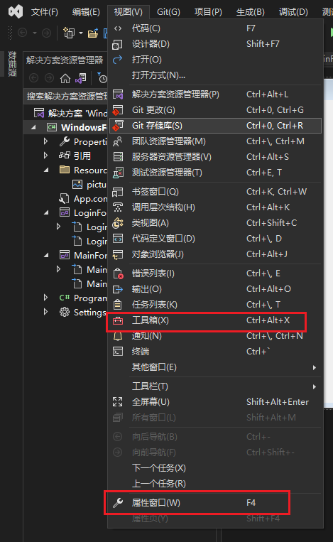
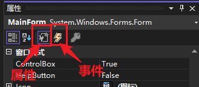
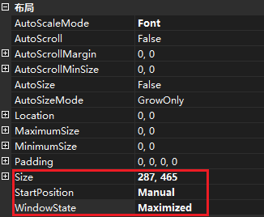
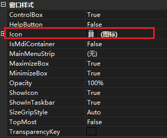
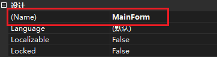
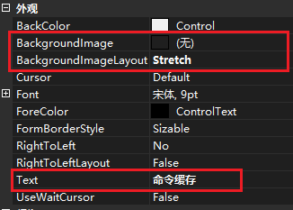

# winform教程

编写 winform 程序有两个视图窗口非常重要：【工具箱】【属性窗口】

## 属性窗口

它用来描绘控件的属性以及事件信息：

### 属性

> + 公共：
>
>   + 布局：大小、位置
>
>   + 焦点：
>
>   + 可访问性
>
>   + 设计：类名或变量名
>
>   + 数据：
>
>   + 外观：显示文字、文字对齐、背景
>
>   + 行为：
>
>   + 杂项：
>
> + 窗口控件：
>
>   + 窗口样式
>     + Icon：设置图标
>     + Opacity：透明度
>     + isMdiContainer：是否以容器方式包含容器
>   + 属性：
>     + this.Controls.Add(xxx)  

*1、布局*

可以改变窗口**起始位置**、大小、启动时窗口状态（正常、最小化或最大化）

*2、窗口样式*

可以修改图标

*3、设计*

窗体的**类名**

*4、外观*

窗体背景图片，以及窗体显示名称

### 事件

> + 布局：
> + 操作：用户的一些鼠标操作，比如单击、双击、拖动窗口等
> + 键：
> + 焦点：
> + 属性已更改：
> + 鼠标：
> + 数据：
> + 拖放：
> + 外观：
> + 行为：窗口加载、关闭、显示

*行为*

窗口关闭事件 `FormClosingEventArgs e` 

+ `e.Cancel = false` 正常关闭
+ `e.Cancel = true` 取消关闭

## 工具箱（控件）

### 文本类控件

+ Label
+ Button
+ TextBox

选择类控件

分组控件

菜单控件

工具栏控件

状态栏控件

