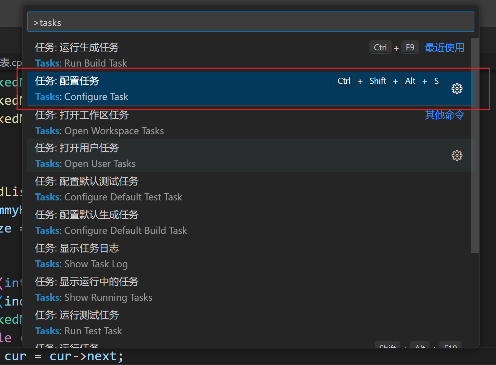
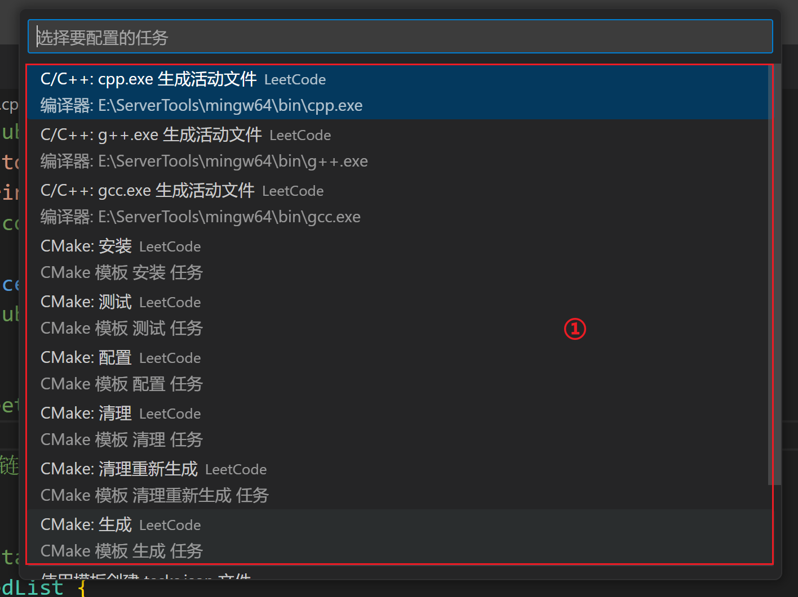
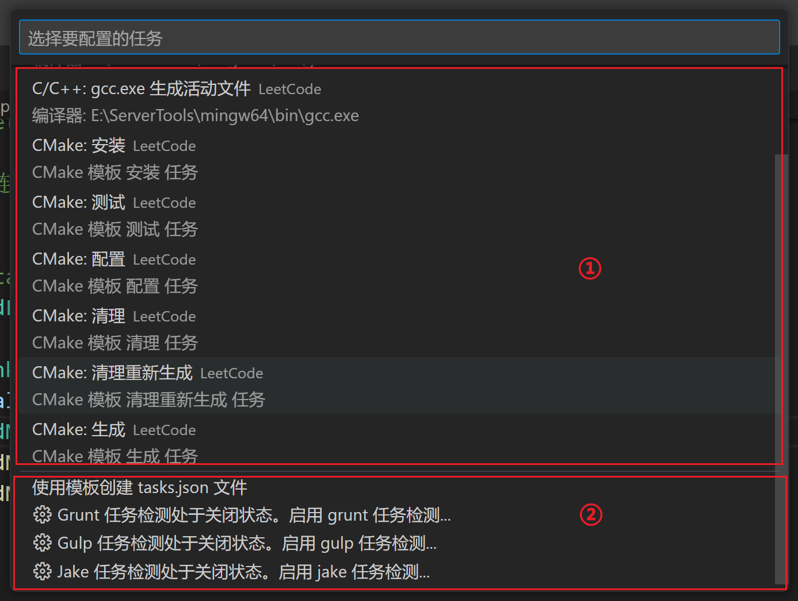
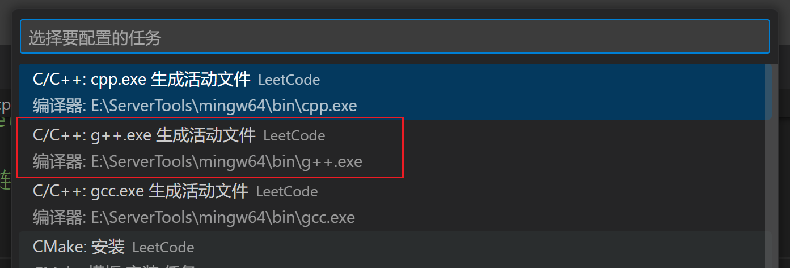
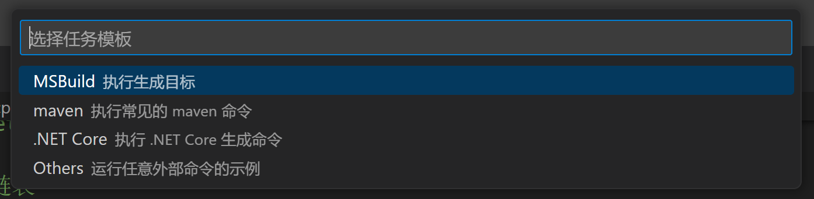
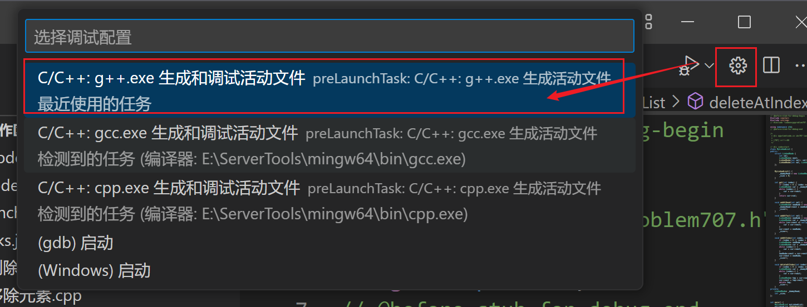

# VSCode环境配置

## 配置编译任务

1、按住 ctrl+shfit+P，输入`tasks`，选择【任务：配置任务】



2、配置具体任务

上一步过后会弹出如下图所示的窗口（由于内容较多，分两次截取），它分为两个区域





**区域 ①**：是 vscode 自动检测出的 task，如果我们配置了 mingw64 的环境变量，它就会自动检测出来，这些任务配置我们可以直接拿来使用，比如下图的配置



我们点击它后，vscode 会自动创建 g++ 的 `task.json` 文件

```json
{
	"version": "2.0.0",
	"tasks": [
		{
			"type": "cppbuild",
			"label": "C/C++: g++.exe 生成活动文件",
			"command": "E:\\ServerTools\\mingw64\\bin\\g++.exe",
			"args": [
				"-fdiagnostics-color=always",
				"-g",
				"${file}",
				"-o",
				"${fileDirname}\\${fileBasenameNoExtension}.exe"
			],
			"options": {
				"cwd": "${fileDirname}"
			},
			"problemMatcher": [
				"$gcc"
			],
			"group": "build",
			"detail": "编译器: E:\\ServerTools\\mingw64\\bin\\g++.exe"
		}
	]
}
```

- `"version": "2.0.0"`: 这是配置文件的版本。当前使用的是 2.0.0 版本的配置。
- `"tasks"`: 这是一个包含任务配置的数组。您的配置中只有一个任务。
- `"type": "cppbuild"`: 指定了任务的类型为 C++ 构建任务。
- `"label": "C/C++: g++.exe 生成活动文件"`: 这是任务的标签，将显示在 Visual Studio Code 的任务列表中。
- `"command": "E:\\ServerTools\\mingw64\\bin\\g++.exe"`: 指定了要执行的命令，即 g++ 编译器的路径。
- `"args"`: 这是传递给编译器的参数数组。在这里，它包括：
  - `-fdiagnostics-color=always`：启用彩色诊断信息以便更易读。
  - `-g`：生成调试信息。
  - `${file}`：当前编辑文件的路径。
  - `-o`：输出选项，指定生成的可执行文件的路径。
  - `${fileDirname}\\${fileBasenameNoExtension}.exe`：构建可执行文件的路径和名称，使用 `${fileDirname}` 表示当前文件所在的目录，`${fileBasenameNoExtension}` 表示当前文件的名称（不包括扩展名），并附加 `.exe` 扩展名。
- `"options"`: 指定了任务的选项。
  - `"cwd": "${fileDirname}"`：指定任务的当前工作目录为当前文件所在的目录，这确保了编译输出文件和源文件在同一目录下。
- `"problemMatcher": ["$gcc"]`: 这是一个问题匹配器，用于捕获编译过程中的错误和警告，以便在 Visual Studio Code 中显示并定位到源代码。
- `"group": "build"`: 指定任务所属的分组为 "build"，这将影响它在任务列表中的显示顺序。
- `"detail": "编译器: E:\\ServerTools\\mingw64\\bin\\g++.exe"`: 提供了关于任务的详细描述，包括所使用的编译器的路径。


**区域 ②**：模板创建 task.json 以及其他的任务自动检测

1）如果我们点击【使用模板创建tasks.json文件】，vscode 会新弹出一个窗口，其中有不同的任务模板



2）如果我们点击下面的这三个之一，vscode 会请求进行相应的任务自动检测，在下一次运行【任务：配置任务】时，vscode会显示出检测到任务配置


## 配置调试器

选择齿轮按钮，然后点击如图所示的选项



## 附录

在 Visual Studio Code 中常用的变量及其含义，它们可以在配置文件中用于构建路径、指定文件名等。

| 名字                       | 值                                                      |
| -------------------------- | ------------------------------------------------------- |
| ${workspaceFolder}         | 打开在 VS Code 中的文件夹的路径                         |
| ${workspaceFolderBasename} | 打开在 VS Code 中的文件夹的名称，不包含任何斜杠 (/)     |
| ${file}                    | 当前打开的文件                                          |
| ${fileWorkspaceFolder}     | 当前打开的文件的工作区文件夹路径                        |
| ${relativeFile}            | 当前打开的文件相对于 workspaceFolder 的相对路径         |
| ${relativeFileDirname}     | 当前打开的文件的目录名相对于 workspaceFolder 的相对路径 |
| ${fileBasename}            | 当前打开的文件的基本名称                                |
| ${fileBasenameNoExtension} | 当前打开的文件的基本名称，不包括文件扩展名              |
| ${fileDirname}             | 当前打开的文件的目录名                                  |
| ${fileExtname}             | 当前打开的文件的扩展名                                  |
| ${cwd}                     | 任务运行器在启动时的当前工作目录                        |
| ${lineNumber}              | 当前活动文件中选定的行号                                |
| ${selectedText}            | 当前活动文件中选定的文本                                |
| ${execPath}                | 运行中的 VS Code 可执行文件的路径                       |
| ${defaultBuildTask}        | 默认构建任务的名称                                      |
| ${pathSeparator}           | 操作系统用于分隔文件路径组件的字符                      |

