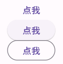

# 样式及基础组件

## 图片组件

Flutter 中，我们可以通过`Image`组件来加载并显示图片，`Image`的数据源可以是asset、文件、内存以及网络。

### ImageProvider 抽象类

`ImageProvider` 是一个抽象类，主要定义了图片数据获取的接口load()

### Image

Image 的主要参数如下

```dart
const Image({
  required this.image, // 图片
  this.width, //图片的宽
  this.height, //图片高度
  this.color, //图片的混合色值
  this.colorBlendMode, //混合模式
  this.fit,//缩放模式
  this.alignment = Alignment.center, //对齐方式
  this.repeat = ImageRepeat.noRepeat, //重复方式
  ...
})
```

Image 可以展示不同的数据源

#### 展示 assets 图片

1、在工程根目录下创建一个`images目录`，并将图片 avatar.png 拷贝到该目录。

2、添加图片资源

修改根目录的 `pubspec.yaml` 文件

```yaml
flutter:
  # To add assets to your application, add an assets section, like this:
  assets:
    - images/avatar.png
```

3、使用图片资源

```dart
Image(
    image: AssetImage('images/avatar.png'),
    width: 100.0
)
```

或者使用提供的构造方法

```dart
Image.asset('images/avatar.png', width: 100.0)
```

#### 展示网络图片

```dart
Image(
    image: NetworkImage('http://xxx/ava.png'),
    width: 100.0
)
```

或者使用提供的构造方法

```dart
Image.network('http://xxx/ava.png', width: 100.0)
```

#### fit 参数

该属性用于在图片的显示空间和图片本身大小不同时指定图片的适应模式。适应模式是在`BoxFit`中定义，它是一个枚举类型

- `fill`：会拉伸填充满显示空间，图片本身长宽比会发生变化，图片会变形。
- `cover`：会按图片的长宽比放大后居中填满显示空间，图片不会变形，超出显示空间部分会被剪裁。
- `contain`：这是图片的默认适应规则，图片会在保证图片本身长宽比不变的情况下缩放以适应当前显示空间，图片不会变形。
- `fitWidth`：图片的宽度会缩放到显示空间的宽度，高度会按比例缩放，然后居中显示，图片不会变形，超出显示空间部分会被剪裁。
- `fitHeight`：图片的高度会缩放到显示空间的高度，宽度会按比例缩放，然后居中显示，图片不会变形，超出显示空间部分会被剪裁。
- `none`：图片没有适应策略，会在显示空间内显示图片，如果图片比显示空间大，则显示空间只会显示图片中间部分。

#### repeat 参数

当图片本身大小小于显示空间时，指定图片的重复规则。简单示例如下：

```dart
Image(
  image: AssetImage("images/avatar.png"),
  width: 100.0,
  height: 200.0,
  repeat: ImageRepeat.repeatY,
)
```

## 按钮

### ElevatedButton、TextButton、OutlinedButton

按钮，用法都差不多

```dart
TextButton(onPressed: () =>{}, child: const Text('点我')),
ElevatedButton(onPressed: () =>{}, child: const Text('点我')),
OutlinedButton(onPressed: () =>{}, child: const Text('点我')),
```

需要注意 `onPressed` 是必须要实现的函数，下面是它们的样子



### FloatingActionButton


