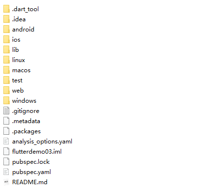

# Flutter基础

## Flutter 安装

1、下载 Flutter SDK

https://flutter.dev/docs/development/tools/sdk/releases

2、把下载好的 Flutter SDK 解压到想要安装 SDK 的目录

```
F:\flutter_windows\flutter_windows_3.0.4\flutter
```

3、添加到环境变量（全英文不能有空格）

4、设置环境变量

https://flutter.dev/community/china

https://flutter-io.cn/

拉到Flutter中文网最下面有配置方式，把下面两句配置到环境变量里面

社区镜像

```
FLUTTER_STORAGE_BASE_URL: https://storage.flutter-io.cn
PUB_HOSTED_URL: https://pub.flutter-io.cn
```

清华大学 TUNA 协会镜像

```
FLUTTER_STORAGE_BASE_URL: https://mirrors.tuna.tsinghua.edu.cn/flutter
PUB_HOSTED_URL: https://mirrors.tuna.tsinghua.edu.cn/dart-pub
```

5、使用`flutter doctor`检查是否存在问题

## Flutter应用

```
flutter create flutterdemo03
```

### 目录结构



+ android：android平台相关代码
+ ios：ios平台相关代码
+ linux：Linux平台相关的代码
+ macos：macos平台相关的代码
+ web：web相关的代码
+ windows：windows相关的代码
+ lib：flutter相关代码，我们编写的代码就在这个文件夹
+ test：用于存放测试代码
+ pubspec.yaml：配置文件，一般存放一些第三方库的依赖。
+ analysis_options.yaml：分析dart语法的文件，老项目升级成新项目有警告信息的话可以删掉此文件

### 入口

每一个flutter项目的lib目录里面都有一个main.dart这个文件就是flutter的入口文件
main.dart里面的

```dart
void main(){
runApp(MyApp());
}

// 也可以简写
void main()=>runApp(MyApp());
```

其中的main方法是dart的入口方法。runApp方法是flutter的入口方法。

MyApp是自定义的一个组件。

### Demo

demo1

```dart
import 'package:flutter/material.dart';
void main() {
    runApp(const Center(
        child: Text(
            "我是一个文本",
            textDirection: TextDirection.ltr,
        ),
    ));
}
```

demo2，给Text组件增加一些装饰

```dart
import 'package:flutter/material.dart';
void main() {
    runApp(const Center(
        child: Text(
            "我是一个文本",
            textDirection: TextDirection.ltr,
            style: TextStyle(
                fontSize: 40.0,
                // color: Colors.yellow,
                color: Color.fromRGBO(244, 233, 121, 0.5),
            ),
        ),
    ));
}
```

demo3

```dart
import 'package:flutter/material.dart';
void main() {
    runApp(MaterialApp(
        home: Scaffold(
            appBar: AppBar(title: const Text("你好Flutter")),
            body: const Center(
                child: Text(
                    "我是一个文本",
                    textDirection: TextDirection.ltr,
                    style: TextStyle(
                        fontSize: 40.0,
                        // color: Colors.yellow,
                        color: Color.fromRGBO(244, 233, 121, 0.5),
                    ),
                ),
            ),
        ),
    ));
}
```

<font color=red>demo4</font>

```dart
import 'package:flutter/material.dart';
void main() {
    runApp(MaterialApp(
        home: Scaffold(
            appBar: AppBar(title: const Text("你好Flutter")),
            body:const HomeWidget(),
        ),
    ));
}

class HomeWidget extends StatelessWidget{
    const HomeWidget({Key? key}) : super(key: key);
    @override
    Widget build(BuildContext context) {
        return const Center(
            child: Text(
                "我是一个文本",
                textDirection: TextDirection.ltr,
                style: TextStyle(
                    fontSize: 40.0,
                    // color: Colors.yellow,
                    color: Color.fromRGBO(244, 233, 121, 0.5),
                ),
            ),
        );
    }
}
```

## 基础组件

### `MaterialApp`

MaterialApp 是一个方便的Widget，它封装了应用程序实现Material Design所需要的一些Widget。一般作为顶层widget使用。

**常用的属性：**

+ home（主页）
+ title（标题）
+ color（颜色）
+ theme（主题）
+ routes（路由）
+ ...

### `Scaffold`

Scaffold是Material Design布局结构的基本实现。此类提供了用于显示drawer、snackbar 和底部 sheet 的API。

**Scaffold 有下面几个主要属性：**

+ appBar - 显示在界面顶部的一个 AppBar。
+ body - 当前界面所显示的主要内容 Widget。
+ drawer - 抽屉菜单控件。
+ ...

### `Container`

+ alignment

  + topCenter：顶部居中对齐
  + topLeft：顶部左对齐
  + topRight：顶部右对齐
  + center：水平垂直居中对齐
  + centerLeft：垂直居中水平居左对齐
  + centerRight：垂直居中水平居右对齐
  + bottomCenter底部居中对齐
  + bottomLeft：底部居左对齐
  + bottomRight：底部居右对齐

+ decoration

  ```json
  decoration: BoxDecoration(
      color: Colors.blue,
      border: Border.all(color: Colors.red, width: 2.0),
  	borderRadius:BorderRadius.circular((8)),// 圆角，
  	boxShadow: [
      	BoxShadow(
              color: Colors.blue,
              offset: Offset(2.0, 2.0),
          	blurRadius: 10.0
      	) 
  	]
  ) 
  //LinearGradient 背景线性渐变 RadialGradient径向渐变
  gradient: LinearGradient(colors: [Colors.red, Colors.orange])
  ```

+ margin

  + margin属性是表示Container与外部其他组件的距离。 
  + `EdgeInsets.all(20.0)`

+ padding

  + padding就是Container的内边距，指Container边缘与Child之间的距离
  + `padding:EdgeInsets.all(10.0)`

+ transform

  + 让Container容易进行一些旋转之类的
  + `transform: Matrix4.rotationZ(0.2)`

+ height：容器高度

+ width：容器宽度

+ child：容器子元素

### `Text`

+ textAlign：文本对齐方式（center居中，left左对齐，right右对齐，justfy两端对齐）
+ textDirection：文本方向（ltr从左至右，rtl从右至左）
+ overflow：文字超出屏幕之后的处理方式（clip裁剪，fade渐隐，ellipsis省略号）
+ textScaleFactor：字体显示倍率
+ maxLines：文字显示最大行数
+ style：字体的样式设置，TextStyle
  + decoration：文字装饰线（none没有线，lineThrough删除线，overline上划线，underline下划线）
  + decorationColor：文字装饰线颜色
  + decorationStyle：文字装饰线风格（[dashed,dotted]虚线，double两根线，solid一根实线，wavy波浪线）
  + wordSpacing：单词间隙（如果是负值，会让单词变得更紧凑
  + letterSpacing：字母间隙（如果是负值，会让字母变得更紧凑）
  + fontStyle：文字样式（italic斜体，normal正常体）
  + fontSize：文字大小
  + color：文字颜色
  + fontWeight：字体粗细（bold粗体，normal正常体）

