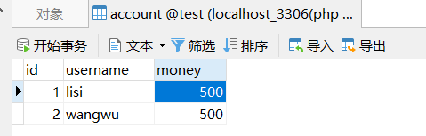
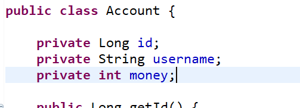
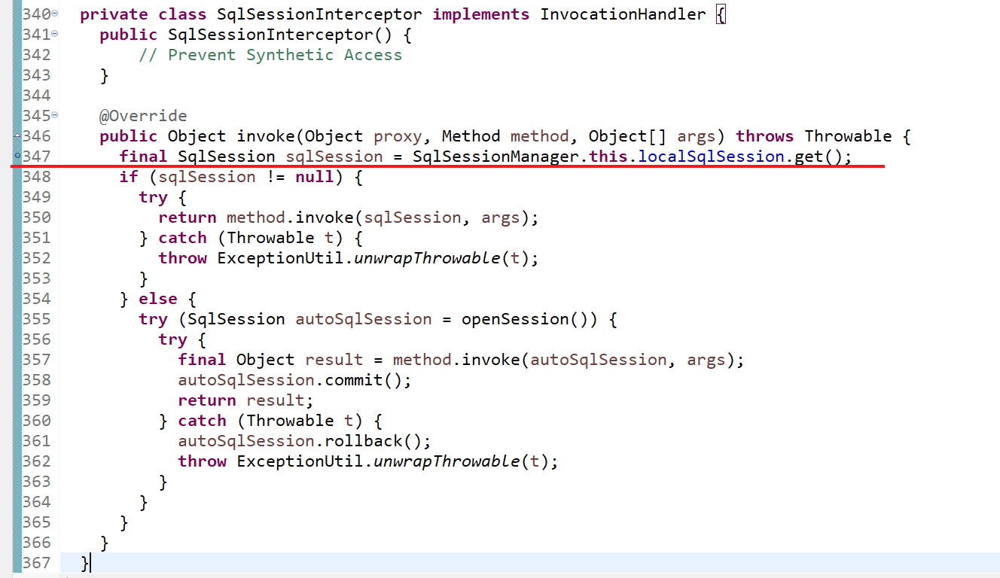
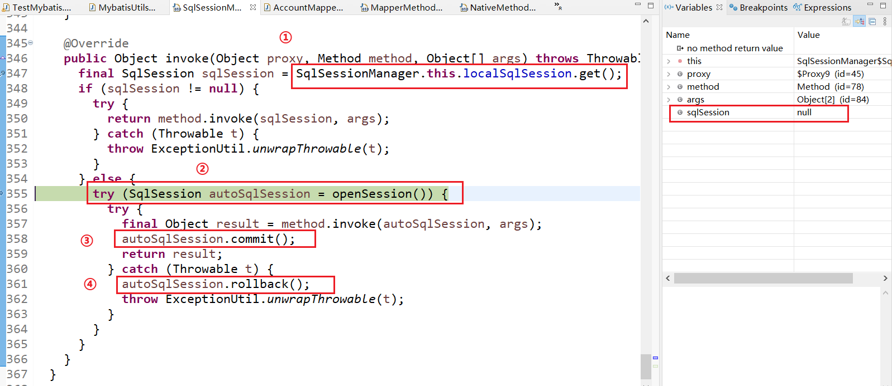
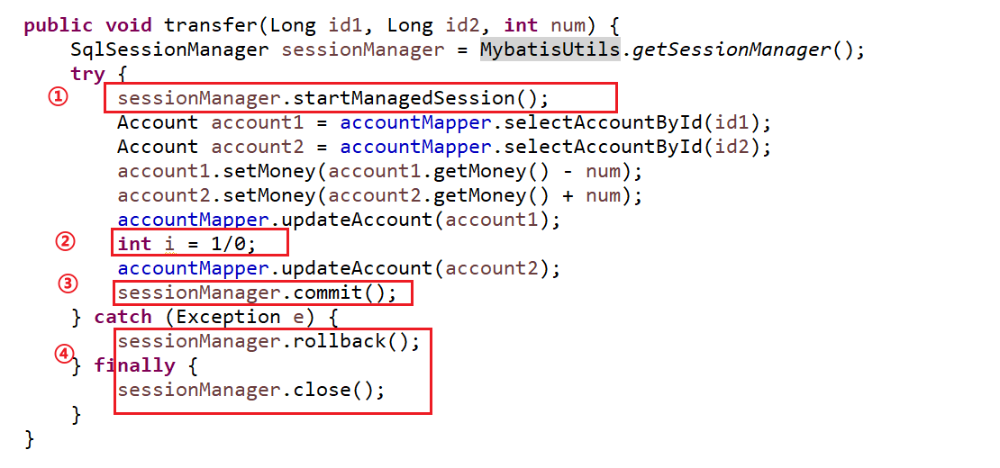
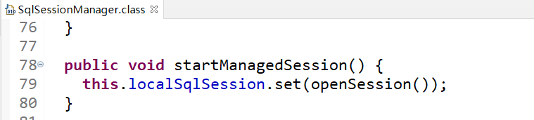

# MyBatis 自动关闭 session

在某些小项目中，需要单独使用到 mybatis，但是网上常见工具类方法获取的 session 通常要么需要手动关闭，这样即麻烦，而且有时会容易出错，要么要需要结合使用spring，但是我们只想写个简单的增删改，不想引入太多框架。

而下面将要介绍的`SqlSessionManager`所获取的session以及mapper就无需关心连接关闭的事情了。

## 环境搭建

数据库与实体类：

<table>
	<td>	
        
    </td>
    <td>	
        
    </td>
</table>

工具类：

```java
public class MybatisUtils {
	
	private static SqlSessionManager sessionManager = null;

	static {
		try {
			InputStream inputStream = MybatisUtils.class.getClassLoader().getResourceAsStream("mybatis-config1.xml");
			sessionManager = SqlSessionManager.newInstance(inputStream);
		} catch (Exception e) {
			throw new RuntimeException("the Configuration of Mybatis is not exist!");
		}
	}
	
	/**
	 * 获取 Mapper
	 * @param <T>
	 * @param clazz
	 * @return
	 */
	public static <T> T getMapper(Class<T> clazz) {
		return sessionManager.getMapper(clazz);
	}
	
	/**
	 * 开启事务
	 * @return  
	 */
	public static SqlSessionManager getSessionManager() {
		return sessionManager;
	}
}
```

mapper：

```java
public interface AccountMapper {

	@Select("select * from account")
	public List<Account> selectAccountList();
	
	@Select("select * from account where id = #{id}")
	public Account selectAccountById(Long id);
	
	@Update("update account set money = #{money} where id = #{userId}")
	public void updateAccount(Account account);
}
```

## 原理

它的原理就是使用了JDK的动态代理，先看看`SqlSessionManager`的构造方法

```java
public class SqlSessionManager implements SqlSessionFactory, SqlSession {

  private final SqlSessionFactory sqlSessionFactory;
  private final SqlSession sqlSessionProxy;

  private final ThreadLocal<SqlSession> localSqlSession = new ThreadLocal<>();

  private SqlSessionManager(SqlSessionFactory sqlSessionFactory) {
    this.sqlSessionFactory = sqlSessionFactory;
    this.sqlSessionProxy = (SqlSession) Proxy.newProxyInstance(
        SqlSessionFactory.class.getClassLoader(),
        new Class[]{SqlSession.class},
        new SqlSessionInterceptor());
  }
```

从上面可以看出`SqlSessionManager`使用了`Proxy.newProxyInstance()`即JDK对默认的session进行了增强。

下面来结合具体的例子来看一下增强方法

```java
@Test
public void test1() {
    AccountMapper mapper = MybatisUtils.getMapper(AccountMapper.class);
    List<Account> list = mapper.selectAccountList();
    System.out.println(list);
}
```

上面是一个很简单的查询方法，

然后我们在源码画线处打一个断点



然后执行



因为我们并没有设置`localSqlSession`，所以很显然跳转到了else块中，当然`localSqlSession`的设置会在后面事务管理中说到。

然后我们看②处代码，他使用了增强的try语句，可以**自动帮我们释放 session**。还有③④处代码，会发现`SqlSessionManager`自动帮我们进行事务的提交与回滚，所以之后我们使用mapper的方法时，可以随意使用，不再关心连接释放的问题了。

## 事务管理

前面说到通过`SqlSessionManager`获取的mapper进行了增强，在我们使用单一的增删改时就不用再考虑连接释放的问题了，但是有些问题需要执行多个mapper方法，这时就要通过事务来完成了，并且`SqlSessionManager`也为我们提供了一些事务提交回滚的方法，下面就来看看。

假设有个简单的业务转账，用户1向用户2转账指定金额，当程序出错时要能回滚，不能一方扣了钱，另一方钱却没有增加。



这里最关键的就是①处的`startManagedSession()`方法，我们能发现这里给`localSqlSession`设置了一个值



再回到前面的`SqlSessionInterceptor`类中


就能发现，当我们调用了`startManagedSession()`方法后，`SqlSessionManager`就不会帮助我们进行session的管理，一切连接的关闭，事务的提交与回滚就需要我们自己手动完成了

## 小结

通过`SqlSessionManager`获取的mapper，使用单一的接口方法操作时，我们可以不用关心连接的释放。

只有需要多个接口方法组合操作时我们才需要开启session管理，手动来进行连接的释放，与事务提交回滚。