[toc]

# MyBatis笔记

# 一、Mybatis入门

## 1、单独使用JDBC的问题

### 1 jdbc编程的步骤

1、 加载数据库驱动

2、 创建并获取数据库链接

3、 创建jdbc statement对象

4、 设置sql语句

5、 设置sql语句中的参数(使用preparedStatement)

6、 通过statement执行sql并获取结果

7、 对sql执行结果进行解析处理

8、 释放资源(resultSet、preparedstatement、connection)

### 2 问题总结

1、 数据库链接创建、释放频繁造成系统资源浪费从而影响系统性能，如果使用数据库链接池可解决此问题。

2、 Sql语句在代码中硬编码，造成代码不易维护，实际应用sql变化的可能较大，sql变动需要改变java代码。

3、 使用preparedStatement向占有位符号传参数存在硬编码，因为sql语句的where条件不一定，可能多也可能少，修改sql还要修改代码，系统不易维护。

4、 对结果集解析存在硬编码（查询列名），sql变化导致解析代码变化，系统不易维护，如果能将数据库记录封装成pojo对象解析比较方便。

## 2、Mybatis介绍

​	MyBatis 本是[apache](http://baike.baidu.com/view/28283.htm)的一个开源项目[iBatis](http://baike.baidu.com/view/628102.htm), 2010年这个项目由apache software foundation 迁移到了google code，并且改名为MyBatis，实质上Mybatis对ibatis进行一些改进。 

​	MyBatis是一个优秀的持久层框架，它对jdbc的操作数据库的过程进行封装，使开发者只需要关注 SQL 本身，而不需要花费精力去处理例如注册驱动、创建connection、创建statement、手动设置参数、结果集检索等jdbc繁杂的过程代码。

​	Mybatis通过xml或注解的方式将要执行的各种statement（statement、preparedStatemnt、CallableStatement）配置起来，并通过java对象和statement中的sql进行映射生成最终执行的sql语句，最后由mybatis框架执行sql并将结果映射成java对象并返回。

## 3、Mybatis架构

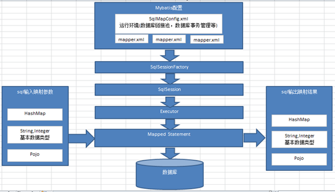

1、 mybatis配置

**SqlMapConfig.xml**，此文件作为mybatis的**全局配置文件**，配置了mybatis的运行环境等信息。mapper.xml文件即sql映射文件，文件中配置了操作数据库的sql语句。此文件需要在SqlMapConfig.xml中加载。

2、 通过mybatis环境等配置信息构造SqlSessionFactory即会话工厂

3、 由会话工厂创建sqlSession即会话，操作数据库需要通过sqlSession进行。

4、 mybatis底层自定义了Executor执行器接口操作数据库，Executor接口有两个实现，一个是基本执行器、一个是缓存执行器。

5、 Mapped Statement也是mybatis一个底层封装对象，它包装了mybatis配置信息及sql映射信息等。**mapper.xml文件中一个sql对应一个Mapped Statement对象**，**sql的id即是Mapped statement的id**。

6、 Mapped Statement对sql执行输入参数进行定义，包括HashMap、基本类型、pojo，Executor通过Mapped Statement在执行sql前将输入的java对象映射至sql中，输入参数映射就是jdbc编程中对preparedStatement设置参数。

7、 Mapped Statement对sql执行输出结果进行定义，包括HashMap、基本类型、pojo，Executor通过Mapped Statement在执行sql后将输出结果映射至java对象中，输出结果映射过程相当于jdbc编程中对结果的解析处理过程。

## 4、入门程序

**（1）创建项目，添加jar包**

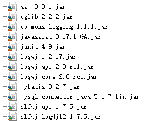

**（2）日志配置**

```properties
# Global logging configuration
log4j.rootLogger=DEBUG, stdout
# Console output...
log4j.appender.stdout=org.apache.log4j.ConsoleAppender
log4j.appender.stdout.layout=org.apache.log4j.PatternLayout
log4j.appender.stdout.layout.ConversionPattern=%5p [%t] - %m%n
```

mybatis默认使用**log4j**作为输出日志信息。

**（3）创建SqlMapConfig.xml**

在classpath下创建SqlMapConfig.xml

```xml
<?xml version="1.0" encoding="UTF-8" ?>
<!DOCTYPE configuration
PUBLIC "-//mybatis.org//DTD Config 3.0//EN"
"http://mybatis.org/dtd/mybatis-3-config.dtd">
<configuration>
	<!-- 和spring整合后 environments配置将废除-->
	<environments default="development">
		<environment id="development">
			<!-- 使用jdbc事务管理-->
			<transactionManager type="JDBC" />
			<!-- 数据库连接池-->
			<dataSource type="POOLED">
				<property name="driver" value="com.mysql.jdbc.Driver" />
				<property name="url"
                 value="jdbc:mysql://localhost:3306/mybatis?characterEncoding=utf-8" />
				<property name="username" value="root" />
				<property name="password" value="mysql" />
			</dataSource>
		</environment>
	</environments>
</configuration>
```

**（4）实体类**

```java
Public class User {
	private int id;
	private String username;// 用户姓名
	private String sex;// 性别
	private Date birthday;// 生日
	private String address;// 地址
get/set……
```

**（5）映射文件**

在classpath下的sqlmap目录下创建sql映射文件Users.xml：

```xml
<?xml version="1.0" encoding="UTF-8" ?>
<!DOCTYPE mapper
PUBLIC "-//mybatis.org//DTD Mapper 3.0//EN"
"http://mybatis.org/dtd/mybatis-3-mapper.dtd">
<mapper namespace="test">
    <!-- 根据id获取用户信息 -->
	<select id="findUserById" parameterType="int" resultType="cn.itcast.mybatis.po.User">
		select * from user where id = #{id}
	</select>
    
	<!-- 自定义条件查询用户列表 -->
	<select id="findUserByUsername" 
            parameterType="java.lang.String" 
			resultType="cn.itcast.mybatis.po.User">
	   select * from user where username like '%${value}%' 
	</select>
</mapper>
```

**namespace** ：命名空间，用于隔离sql语句，后面会讲另一层非常重要的作用。

**parameterType**：定义输入到sql中的映射类型，#{id}表示使用preparedstatement设置占位符号并将输入变量id传到sql。

**resultType**：定义结果映射类型

**（6）加载映射文件**

mybatis框架需要加载映射文件，将Users.xml添加在SqlMapConfig.xml，如下：

```xml
<mappers>
    <mapper resource="sqlmap/User.xml"/>
</mappers>
```

**（7）测试程序**

```java
public class Mybatis_first {
	
	//会话工厂
	private SqlSessionFactory sqlSessionFactory;

	@Before
	public void createSqlSessionFactory() throws IOException {
		// 配置文件
		String resource = "SqlMapConfig.xml";
		InputStream inputStream = Resources.getResourceAsStream(resource);

		// 使用SqlSessionFactoryBuilder从xml配置文件中创建SqlSessionFactory
		sqlSessionFactory = new SqlSessionFactoryBuilder()
				.build(inputStream);

	}

	// 根据 id查询用户信息
	@Test
	public void testFindUserById() {
		// 数据库会话实例
		SqlSession sqlSession = null;
		try {
			// 创建数据库会话实例sqlSession
			sqlSession = sqlSessionFactory.openSession();
			// 查询单个记录，根据用户id查询用户信息
			User user = sqlSession.selectOne("test.findUserById", 10);
			// 输出用户信息
			System.out.println(user);
		} catch (Exception e) {
			e.printStackTrace();
		} finally {
			if (sqlSession != null) {
				sqlSession.close();
			}
		}
	}

	// 根据用户名称模糊查询用户信息
	@Test
	public void testFindUserByUsername() {
		// 数据库会话实例
		SqlSession sqlSession = null;
		try {
			// 创建数据库会话实例sqlSession
			sqlSession = sqlSessionFactory.openSession();
			// 查询单个记录，根据用户id查询用户信息
			List<User> list = sqlSession.selectList("test.findUserByUsername", "张");
			System.out.println(list.size());
		} catch (Exception e) {
			e.printStackTrace();
		} finally {
			if (sqlSession != null) {
				sqlSession.close();
			}
		}
	}
}
```

## 5、相关概念

### 1 #{}和${}

​	#{}表示一个**占位符**号，通过#{}可以**实现preparedStatement**向**占位符中设置值**，自动进行**java类型和jdbc类型转换**，#{}可以有效**防止sql注入**。 #{}可以**接收简单类型值**或**pojo属性值**。 如果parameterType**传输**单个**简单类型值**，**#{}括号**中**可以是value**或**其它名称**。

​	${}表示**拼接sql串**，通过${}可以将parameterType 传入的内容拼接在sql中且**不进行jdbc类型转换**， ${}可以**接收简单类型值**或**pojo属性值**，如果parameterType**传输**单个**简单类型**值，**${}括号中只能是value**。

### 2 parameterType和resultType

parameterType：指定输入参数类型，mybatis通过ognl从输入对象中获取参数值拼接在sql中。

resultType：指定输出结果类型，mybatis将sql查询结果的一行记录数据映射为resultType指定类型的对象。

### 3 MySql自增主键返回

通过修改sql映射文件，可以将mysql自增主键返回：

```xml
<insert id="insertUser" parameterType="cn.itcast.mybatis.po.User">
    <!-- selectKey将主键返回，需要再返回 -->
    <selectKey keyProperty="id" order="AFTER" resultType="java.lang.Integer">
    	select LAST_INSERT_ID()
    </selectKey>
    insert into user(username,birthday,sex,address)
    values(#{username},#{birthday},#{sex},#{address});
</insert>
```

添加selectKey实现将主键返回

**keyProperty**:返回的主键存储在pojo中的哪个属性

**order**：selectKey的执行顺序，是相对与insert语句来说，由于mysql的自增原理执行完insert语句之后才将主键生成，所以这里selectKey的执行顺序为after

**resultType**:返回的主键是什么类型

**LAST_INSERT_ID()**:是mysql的函数，返回auto_increment自增列新记录id值。

异常测试：

Sql中**字段名输入错误**后测试，username输入dusername测试**结果报错**


第二种方法

```xml
<insert id="insertUser" parameterType="User" useGeneratedKeys="true" keyProperty="userId">
    INSERT INTO t_user VALUES (NULL, #{userName}, #{password}, #{userType}, #{locked}, #{credit}, #{lastVisit}, #{lastIp})
</insert>
```

说明使用自增主键`useGeneratedKeys`，然后指定主键在po中的字段名`keyProperty`

### 4 Mysql实现uuid返回

```xml
<insert  id="insertUser" parameterType="cn.itcast.mybatis.po.User">
    <selectKey resultType="java.lang.String" order="BEFORE" keyProperty="id">
    	select uuid()
    </selectKey>
    insert into user(id,username,birthday,sex,address) 
             values(#{id},#{username},#{birthday},#{sex},#{address})
</insert>
```

注意这里使用的order是“**BEFORE**”

### 5 oracle使用序列生成主键

首先自定义一个序列且用于生成主键，selectKey使用如下：

```xml
<insert  id="insertUser" parameterType="cn.itcast.mybatis.po.User">
    <selectKey resultType="java.lang.Integer" order="BEFORE" keyProperty="id">
    	SELECT 自定义序列.NEXTVAL FROM DUAL
    </selectKey>
insert into user(id,username,birthday,sex,address) 
		 values(#{id},#{username},#{birthday},#{sex},#{address})
</insert>
```

注意这里使用的order是“**BEFORE**”

## 6、Mybatis解决的问题

1、 数据库链接创建、释放频繁造成系统资源浪费从而影响系统性能，如果使用数据库链接池可解决此问题。

解决：在SqlMapConfig.xml中配置数据链接池，使用连接池管理数据库链接。

2、 Sql语句写在代码中造成代码不易维护，实际应用sql变化的可能较大，sql变动需要改变java代码。

解决：将Sql语句配置在XXXXmapper.xml文件中与java代码分离。

3、 向sql语句传参数麻烦，因为sql语句的where条件不一定，可能多也可能少，占位符需要和参数一一对应。

解决：Mybatis自动将java对象映射至sql语句，通过statement中的parameterType定义输入参数的类型。

4、 对结果集解析麻烦，sql变化导致解析代码变化，且解析前需要遍历，如果能将数据库记录封装成pojo对象解析比较方便。

解决：Mybatis自动将sql执行结果映射至java对象，通过statement中的resultType定义输出结果的类型。

## 7、与hibernate不同

​	Mybatis和hibernate不同，它不完全是一个ORM框架，因为MyBatis需要程序员自己编写Sql语句，不过mybatis可以通过XML或注解方式灵活配置要运行的sql语句，并将java对象和sql语句映射生成最终执行的sql，最后将sql执行的结果再映射生成java对象。

​	Mybatis学习门槛低，简单易学，程序员直接编写原生态sql，可严格控制sql执行性能，灵活度高，非常适合对关系数据模型要求不高的软件开发，例如互联网软件、企业运营类软件等，因为这类软件需求变化频繁，一但需求变化要求成果输出迅速。但是灵活的前提是mybatis无法做到数据库无关性，如果需要实现支持多种数据库的软件则需要自定义多套sql映射文件，工作量大。

​	Hibernate对象/关系映射能力强，数据库无关性好，对于关系模型要求高的软件（例如需求固定的定制化软件）如果用hibernate开发可以节省很多代码，提高效率。但是Hibernate的学习门槛高，要精通门槛更高，而且怎么设计O/R映射，在性能和对象模型之间如何权衡，以及怎样用好Hibernate需要具有很强的经验和能力才行。

​	总之，按照用户的需求在有限的资源环境下只要能做出维护性、扩展性良好的软件架构都是好架构，所以框架只有适合才是最好。 

# 二、Dao开发方法

使用Mybatis开发Dao，通常有两个方法，即**原始Dao开发方法**和**Mapper接口开发方法**。

## 1、SqlSession的使用范围

​	SqlSession中封装了对数据库的操作，如：查询、插入、更新、删除等。通过**SqlSessionFactory**创建**SqlSession**，而**SqlSessionFactory**是通过**SqlSessionFactoryBuilder**进行创建。

**（1）SqlSessionFactoryBuilder**

​	SqlSessionFactoryBuilder用于创建SqlSessionFacoty，SqlSessionFacoty一旦创建完成就不需要SqlSessionFactoryBuilder了，因为SqlSession是通过SqlSessionFactory生产，所以可以将SqlSessionFactoryBuilder当成一个工具类使用，最佳使用范围是方法范围即方法体内局部变量。

**（2）SqlSessionFactory**

​     SqlSessionFactory是一个接口，接口中定义了openSession的不同重载方法，SqlSessionFactory的最佳使用范围是整个应用运行期间，一旦创建后可以重复使用，通常以单例模式管理SqlSessionFactory。

**（3）SqlSession**

​    SqlSession是一个面向用户的接口， sqlSession中定义了数据库操作，默认使用DefaultSqlSession实现类。


**执行过程如下：**

1、 加载数据源等配置信息

```java
Environment environment = configuration.getEnvironment();
```

2、 创建数据库链接

3、 创建事务对象

4、 创建Executor，SqlSession所有操作都是通过Executor完成，mybatis源码如下：

```java
if (ExecutorType.BATCH == executorType) {
	executor = newBatchExecutor(this, transaction);
} else if (ExecutorType.REUSE == executorType) {
	executor = new ReuseExecutor(this, transaction);
} else {
	executor = new SimpleExecutor(this, transaction);
}
if (cacheEnabled) {
	executor = new CachingExecutor(executor, autoCommit);
}
```

5、 SqlSession的实现类即DefaultSqlSession，此对象中对操作数据库实质上用的是Executor

 

**结论：**

​     每个线程都应该有它自己的SqlSession实例。SqlSession的实例不能共享使用，它也是线程不安全的。因此最佳的范围是请求或方法范围。绝对不能将SqlSession实例的引用放在一个类的静态字段或实例字段中。

​     打开一个 SqlSession；使用完毕就要关闭它。通常把这个关闭操作放到 finally 块中以确保每次都能执行关闭。如下：

```java
SqlSession session = sqlSessionFactory.openSession();
try {
    // do work
} finally {
    session.close();
}
```

## 2、原始Dao开发方法

原始Dao开发方法需要程序员编写Dao接口和Dao实现类。

### 1 映射文件

```xml
<?xml version="1.0" encoding="UTF-8" ?>
<!DOCTYPE mapper
PUBLIC "-//mybatis.org//DTD Mapper 3.0//EN"
"http://mybatis.org/dtd/mybatis-3-mapper.dtd">
<mapper namespace="test">
	<!-- 根据id获取用户信息 -->
	<select id="findUserById" parameterType="int" resultType="cn.itcast.mybatis.po.User">
		select * from user where id = #{id}
	</select>
	<!-- 添加用户 -->
	<insert id="insertUser" parameterType="cn.itcast.mybatis.po.User">
        <selectKey keyProperty="id" order="AFTER" resultType="java.lang.Integer">
            select LAST_INSERT_ID() 
        </selectKey>
          insert into user(username,birthday,sex,address) 
          values(#{username},#{birthday},#{sex},#{address})
	</insert>
</mapper>
```

### 2 Dao接口实现类

```java
Public interface UserDao {
	public User getUserById(int id) throws Exception;
	public void insertUser(User user) throws Exception;
}
```

```java
Public class UserDaoImpl implements UserDao {
	
	private SqlSessionFactory sqlSessionFactory;
	
	//注入SqlSessionFactory
	public UserDaoImpl(SqlSessionFactory sqlSessionFactory){
		this.setSqlSessionFactory(sqlSessionFactory);
	}
    
	@Override
	public User getUserById(int id) throws Exception {
		SqlSession session = sqlSessionFactory.openSession();
		User user = null;
		try {
			//通过sqlsession调用selectOne方法获取一条结果集
			//参数1：指定定义的statement的id,参数2：指定向statement中传递的参数
			user = session.selectOne("test.findUserById", 1);
			System.out.println(user);						
		} finally{
			session.close();
		}
		return user;
	}
	
	@Override
	Public void insertUser(User user) throws Exception {
		SqlSession sqlSession = sqlSessionFactory.openSession();
		try {
			sqlSession.insert("insertUser", user);
			sqlSession.commit();
		} finally{
			session.close();
		}
		
	}
}
```

### 3 问题

原始Dao开发中存在以下问题：

+ Dao方法体存在重复代码：通过SqlSessionFactory创建SqlSession，调用SqlSession的数据库操作方法
+ 调用sqlSession的数据库操作方法需要指定statement的id，这里存在硬编码，不得于开发维护。

## 3、Mapper动态代理方式 

### 1 实现原理

​     Mapper接口开发方法只需要程序员编写Mapper接口（相当于Dao接口），由Mybatis框架根据接口定义创建接口的动态代理对象，代理对象的方法体同上边Dao接口实现类方法。

Mapper接口开发需要**遵循**以下**规范**：

1、 Mapper.xml文件中的**namespace**与**mapper接口**的**类路径相同**。

2、 Mapper接口**方法名**和Mapper.xml中定义的每个**statement的id相同**

3、 Mapper**接口方法**的**输入参数类型**和**mapper.xml**中定义的每个sql 的**parameterType的类型相同**

4、 Mapper**接口方法**的**输出参数类型**和**mapper.xml**中定义的每个sql的**resultType的类型相同**

### 2 Mapper.xml(映射文件)

​     定义mapper映射文件UserMapper.xml（内容同Users.xml），需要修改**namespace的值为 UserMapper接口路径**。将UserMapper.xml放在classpath下mapper目录下。

```xml
<?xml version="1.0" encoding="UTF-8" ?>
<!DOCTYPE mapper
PUBLIC "-//mybatis.org//DTD Mapper 3.0//EN"
"http://mybatis.org/dtd/mybatis-3-mapper.dtd">
<mapper namespace="cn.itcast.mybatis.mapper.UserMapper">
<!-- 根据id获取用户信息 -->
	<select id="findUserById" parameterType="int" resultType="cn.itcast.mybatis.po.User">
		select * from user where id = #{id}
	</select>
<!-- 自定义条件查询用户列表 -->
	<select id="findUserByUsername" parameterType="java.lang.String" 
			resultType="cn.itcast.mybatis.po.User">
	   select * from user where username like '%${value}%' 
	</select>
<!-- 添加用户 -->
	<insert id="insertUser" parameterType="cn.itcast.mybatis.po.User">
	<selectKey keyProperty="id" order="AFTER" resultType="java.lang.Integer">
		select LAST_INSERT_ID() 
	</selectKey>
	  insert into user(username,birthday,sex,address) 
	  values(#{username},#{birthday},#{sex},#{address})
	</insert>
</mapper>
```

### 3 Mapper.java(接口文件)

```java
/**
 * 用户管理mapper
 */
Public interface UserMapper {
	//根据用户id查询用户信息
	public User findUserById(int id) throws Exception;
	//查询用户列表
	public List<User> findUserByUsername(String username) throws Exception;
	//添加用户信息
	public void insertUser(User user)throws Exception; 
}
```

接口定义有如下特点：

1、 Mapper接口方法名和Mapper.xml中定义的statement的id相同

2、 Mapper接口方法的输入参数类型和mapper.xml中定义的statement的parameterType的类型相同

3、 Mapper接口方法的输出参数类型和mapper.xml中定义的statement的resultType的类型相同

### 4 加载UserMapper.xml

修改SqlMapConfig.xml文件

```xml
<!-- 加载映射文件 -->
<mappers>
	<mapper resource="mapper/UserMapper.xml"/>
</mappers>
```

### 5 测试

```java
Public class UserMapperTest extends TestCase {

	private SqlSessionFactory sqlSessionFactory;
	
	protected void setUp() throws Exception {
		//mybatis配置文件
		String resource = "sqlMapConfig.xml";
		InputStream inputStream = Resources.getResourceAsStream(resource);
		//使用SqlSessionFactoryBuilder创建sessionFactory
		sqlSessionFactory = new SqlSessionFactoryBuilder().build(inputStream);
	}

	
	Public void testFindUserById() throws Exception {
		//获取session
		SqlSession session = sqlSessionFactory.openSession();
		//获取mapper接口的代理对象
		UserMapper userMapper = session.getMapper(UserMapper.class);
		//调用代理对象方法
		User user = userMapper.findUserById(1);
		System.out.println(user);
		//关闭session
		session.close();
		
	}
	@Test
	public void testFindUserByUsername() throws Exception {
		SqlSession sqlSession = sqlSessionFactory.openSession();
		UserMapper userMapper = sqlSession.getMapper(UserMapper.class);
		List<User> list = userMapper.findUserByUsername("张");
		System.out.println(list.size());

	}
	
Public void testInsertUser() throws Exception {
		//获取session
		SqlSession session = sqlSessionFactory.openSession();
		//获取mapper接口的代理对象
		UserMapper userMapper = session.getMapper(UserMapper.class);
		//要添加的数据
		User user = new User();
		user.setUsername("张三");
		user.setBirthday(new Date());
		user.setSex("1");
		user.setAddress("北京市");
		//通过mapper接口添加用户
		userMapper.insertUser(user);
		//提交
		session.commit();
		//关闭session
		session.close();
	}
}
```

### 6 总结

​	**selectOne和selectList**：动态代理对象调用sqlSession.selectOne()和sqlSession.selectList()是根据mapper接口方法的返回值决定，如果返回list则调用selectList方法，如果返回单个对象则调用selectOne方法。 

​	**namespace**：mybatis官方推荐使用mapper代理方法开发mapper接口，程序员不用编写mapper接口实现类，使用mapper代理方法时，输入参数可以使用pojo包装对象或map对象，保证dao的通用性。

# 三、SqlMapConfig.xml配置文件

## 1、配置内容

SqlMapConfig.xml中配置的内容和顺序如下：

```
properties（属性）
settings（全局配置参数）
typeAliases（类型别名）
typeHandlers（类型处理器）
objectFactory（对象工厂）
plugins（插件）
environments（环境集合属性对象）
    environment（环境子属性对象）
        transactionManager（事务管理）
        dataSource（数据源）
mappers（映射器）
```

## 2、properties（属性）

SqlMapConfig.xml可以引用java属性文件中的配置信息如下：

在classpath下定义db.properties文件

```properties
jdbc.driver=com.mysql.jdbc.Driver
jdbc.url=jdbc:mysql://localhost:3306/mybatis
jdbc.username=root
jdbc.password=mysql
```

SqlMapConfig.xml引用如下

```xml
<properties resource="db.properties"/>
<environments default="development">
    <environment id="development">
        <transactionManager type="JDBC"/>
        <dataSource type="POOLED">
            <property name="driver" value="${jdbc.driver}"/>
            <property name="url" value="${jdbc.url}"/>
            <property name="username" value="${jdbc.username}"/>
            <property name="password" value="${jdbc.password}"/>
        </dataSource>
    </environment>
</environments>
```

**注意**： MyBatis 将按照下面的**顺序**来**加载属性**：

+ 在 properties 元素体内定义的属性首先被读取。 
+ 然后会读取properties 元素中resource或 url 加载的属性，它会覆盖已读取的同名属性。
+ 最后读取parameterType传递的属性，它会覆盖已读取的同名属性。

因此，通过parameterType传递的属性具有最高优先级，resource或 url 加载的属性次之，最低优先级的是 properties 元素体内定义的属性。

## 3、settings（配置）

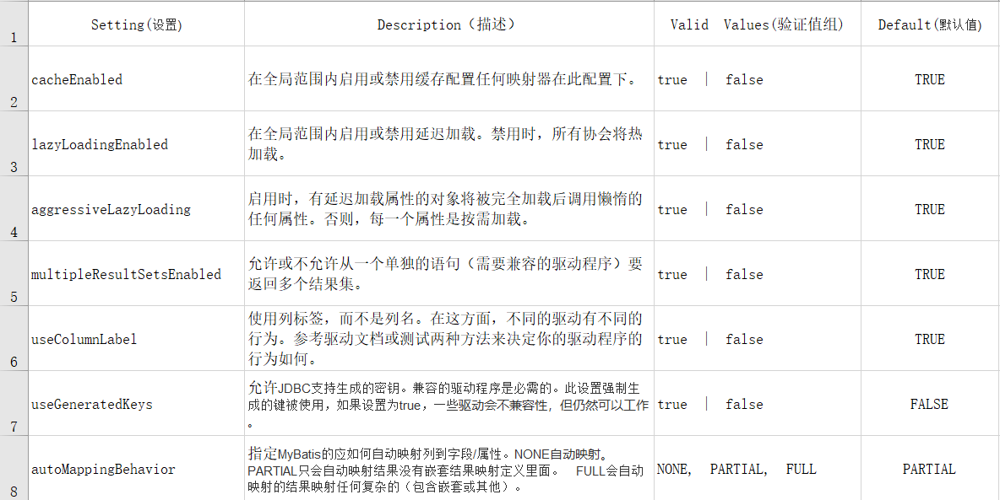

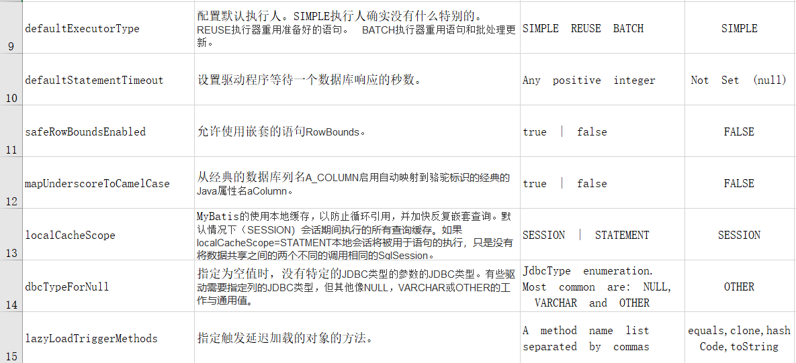

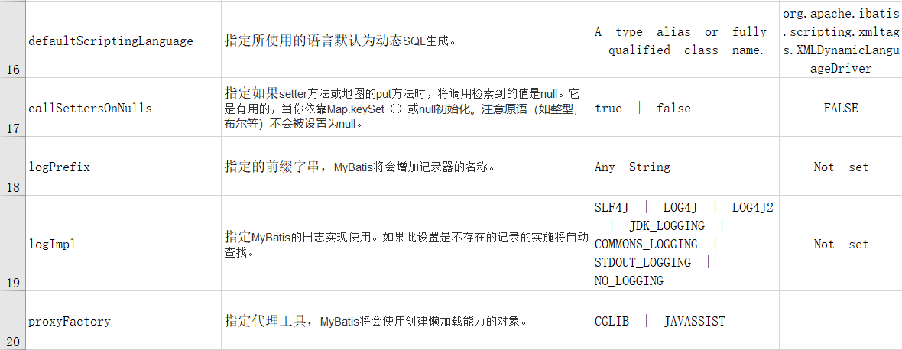

## 4、typeAliases（类型别名）

### 1 mybatis支持的别名

| 别名       | 映射的类型 |
| ---------- | ---------- |
| _byte      | byte       |
| _long      | long       |
| _short     | short      |
| _int       | int        |
| _integer   | int        |
| _double    | double     |
| _float     | float      |
| _boolean   | boolean    |
| string     | String     |
| byte       | Byte       |
| long       | Long       |
| short      | Short      |
| int        | Integer    |
| integer    | Integer    |
| double     | Double     |
| float      | Float      |
| boolean    | Boolean    |
| date       | Date       |
| decimal    | BigDecimal |
| bigdecimal | BigDecimal |

### 2 自定义别名

在SqlMapConfig.xml中配置

```xml
<typeAliases>
	<!-- 单个别名定义 -->
	<typeAlias alias="user" type="cn.itcast.mybatis.po.User"/>
	<!-- 批量别名定义，扫描整个包下的类，别名为类名（首字母大写或小写都可以） -->
	<package name="cn.itcast.mybatis.po"/>
	<package name="其它包"/>
</typeAliases>
```

## 5、typeHandlers（类型处理器）

类型处理器用于java类型和jdbc类型映射，如下

```xml
<select id="findUserById" parameterType="int" resultType="user">
		select * from user where id = #{id}
</select>
```

mybatis自带的类型处理器基本上满足日常需求，不需要单独定义。

mybatis支持类型处理器：

| 类型处理器              | **Java**类型          | **JDBC**类型                                               |
| :---------------------- | --------------------- | ---------------------------------------------------------- |
| BooleanTypeHandler      | Boolean，boolean      | 任何兼容的布尔值                                           |
| ByteTypeHandler         | Byte，byte            | 任何兼容的数字或字节类型                                   |
| ShortTypeHandler        | Short，short          | 任何兼容的数字或短整型                                     |
| IntegerTypeHandler      | Integer，int          | 任何兼容的数字和整型                                       |
| LongTypeHandler         | Long，long            | 任何兼容的数字或长整型                                     |
| FloatTypeHandler        | Float，float          | 任何兼容的数字或单精度浮点型                               |
| DoubleTypeHandler       | Double，double        | 任何兼容的数字或双精度浮点型                               |
| BigDecimalTypeHandler   | BigDecimal            | 任何兼容的数字或十进制小数类型                             |
| StringTypeHandler       | String                | CHAR和VARCHAR类型                                          |
| ClobTypeHandler         | String                | CLOB和LONGVARCHAR类型                                      |
| NStringTypeHandler      | String                | NVARCHAR和NCHAR类型                                        |
| NClobTypeHandler        | String                | NCLOB类型                                                  |
| ByteArrayTypeHandler    | byte[]                | 任何兼容的字节流类型                                       |
| BlobTypeHandler         | byte[]                | BLOB和LONGVARBINARY类型                                    |
| DateTypeHandler         | Date（java.util）     | TIMESTAMP类型                                              |
| DateOnlyTypeHandler     | Date（java.util）     | DATE类型                                                   |
| TimeOnlyTypeHandler     | Date（java.util）     | TIME类型                                                   |
| SqlTimestampTypeHandler | Timestamp（java.sql） | TIMESTAMP类型                                              |
| SqlDateTypeHandler      | Date（java.sql）      | DATE类型                                                   |
| SqlTimeTypeHandler      | Time（java.sql）      | TIME类型                                                   |
| ObjectTypeHandler       | 任意                  | 其他或未指定类型                                           |
| EnumTypeHandler         | Enumeration类型       | VARCHAR-任何兼容的字符串类型，作为代码存储（而不是索引）。 |

## 6、mappers（映射器）

```xml
<!-- 使用相对于类路径的资源引用 -->
<mappers>
  <mapper resource="org/mybatis/builder/AuthorMapper.xml"/>
  ...
</mappers>
```

Mapper配置的几种方法：

### 1 `<mapper resource=" " />`

使用相对于类路径的资源，如：

```xml
<mapper resource="sqlmap/User.xml" />
```

### 2 `<mapper url=" " />`

使用完全限定路径，如：

```xml
<mapper url="file:///D:\workspace_spingmvc\mybatis_01\config\sqlmap\User.xml" />
```

### 3 `<mapper class=" " />`

使用mapper接口类路径，如：

```xml
<mapper class="cn.itcast.mybatis.mapper.UserMapper"/>
```

**注意：此种方法要求mapper接口名称和mapper映射文件名称相同，且放在同一个目录中。**

### 4 `<package name=""/>`

注册指定包下的所有mapper接口，如：

```xml
<package name="cn.itcast.mybatis.mapper"/>
```

**注意：此种方法要求mapper接口名称和mapper映射文件名称相同，且放在同一个目录中。**

# 四、Mapper.xml映射文件

Mapper.xml映射文件中定义了操作数据库的sql，每个sql是一个statement，映射文件是mybatis的核心。

## 1、parameterType(输入类型)

### 1 传递简单类型

参考前面#{}和${}

### 2 传递pojo对象

Mybatis使用ognl表达式解析对象字段的值，如下例子：

```xml
<!—传递pojo对象综合查询用户信息 -->
<select id="findUserByUser" parameterType="user" resultType="user">
	select * from user where id=#{id} and username like '%${username}%'
</select>
```

id、username是对象中的字段名

**测试**

```java
Public void testFindUserByUser()throws Exception{
    //获取session
    SqlSession session = sqlSessionFactory.openSession();
    //获限mapper接口实例
    UserMapper userMapper = session.getMapper(UserMapper.class);
    //构造查询条件user对象
    User user = new User();
    user.setId(1);
    user.setUsername("管理员");
    //传递user对象查询用户列表
    List<User>list = userMapper.findUserByUser(user);
    //关闭session
    session.close();
}
```

### 3 传递pojo包装对象

​	开发中通过pojo传递查询条件 ，查询条件是综合的查询条件，不仅包括用户查询条件还包括其它的查询条件（比如将用户购买商品信息也作为查询条件），这时可以使用包装对象传递输入参数。

（1）定义包装对象

定义包装对象将查询条件(pojo)以类组合的方式包装起来

```java
public class QueryVo {
	
	private User user;	
	//自定义用户扩展类
	private UserCustom userCustom;
```

（2）mapper.xml映射文件

```xml
<!—传递pojo对象综合查询用户信息 -->
<select id="findUserByUser" parameterType="queryVo" resultType="user">
	select * from user where username = #{user.username}
</select>
```

​	说明：mybatis底层通过ognl从pojo中获取属性值：#{user.username}，user即是传入的包装对象的属性。queryVo是别名，即上边定义的包装对象类型。

### 4 传递hashmap

Sql映射文件定义如下：

```xml
<!-- 传递hashmap综合查询用户信息 -->
<select id="findUserByHashmap" parameterType="hashmap" resultType="user">
	select * from user where id=#{id} and username like '%${username}%'
</select>
```

上面id、username是map中的key

**测试**

```java
Public void testFindUserByHashmap()throws Exception{
		//获取session
		SqlSession session = sqlSessionFactory.openSession();
		//获限mapper接口实例
		UserMapper userMapper = session.getMapper(UserMapper.class);
		//构造查询条件Hashmap对象
		HashMap<String, Object> map = new HashMap<String, Object>();
		map.put("id", 1);
		map.put("username", "管理员");
		
		//传递Hashmap对象查询用户列表
		List<User>list = userMapper.findUserByHashmap(map);
		//关闭session
		session.close();
	}
```

异常测试：

传递的map中的key和sql中解析的**key不一致**。测试结果没有报错，只是通过key获**取值为空**。

## 2、resultType(输出类型)

### 1 输出简单类型

Mapper.xml文件

```xml
<!-- 获取用户列表总数 -->
<select id="findUserCount" parameterType="user" resultType="int">
	select count(1) from user
</select>
```

Mapper接口

```java
public int findUserCount(User user) throws Exception;
```

调用：

```java
Public void testFindUserCount() throws Exception{
		//获取session
		SqlSession session = sqlSessionFactory.openSession();
		//获取mapper接口实例
		UserMapper userMapper = session.getMapper(UserMapper.class);
	
		User user = new User();
		user.setUsername("管理员");

		//传递Hashmap对象查询用户列表
		int count = userMapper.findUserCount(user);
		
		//关闭session
		session.close();
	}
```

**总结：**

输出简单类型必须查询出来的结果集有一条记录，最终将第一个字段的值转换为输出类型。使用session的selectOne可查询单条记录。

### 2 输出pojo对象

Mapper.xml

```
<!-- 根据id查询用户信息 -->
<select id="findUserById" parameterType="int" resultType="user">
	select * from user where id = #{id}
</select>
```

Mapper接口：

```java
public User findUserById(int id) throws Exception;
```

测试：

```java
Public void testFindUserById() throws Exception {
		//获取session
		SqlSession session = sqlSessionFactory.openSession();
		//获限mapper接口实例
		UserMapper userMapper = session.getMapper(UserMapper.class);
		//通过mapper接口调用statement
		User user = userMapper.findUserById(1);
		System.out.println(user);
		//关闭session
		session.close();
	}
```


使用session调用selectOne查询单条记录。

### 3 输出pojo列表

参考selectUserByName的定义：
Mapper.xml

```xml
<!-- 根据名称模糊查询用户信息 -->
<select id="findUserByUsername" parameterType="string" resultType="user">
	select * from user where username like '%${value}%'
</select>
```

Mapper接口：

```
public List<User> findUserByUsername(String username) throws Exception;
```

测试：

```java
Public void testFindUserByUsername()throws Exception{
		//获取session
		SqlSession session = sqlSessionFactory.openSession();
		//获限mapper接口实例
		UserMapper userMapper = session.getMapper(UserMapper.class);
		//如果使用占位符号则必须人为在传参数中加%
		//List<User> list = userMapper.selectUserByName("%管理员%");
		//如果使用${}原始符号则不用人为在参数中加%
		List<User> list = userMapper.findUserByUsername("管理员");
		//关闭session
		session.close();
	}
```

使用session的selectList方法获取pojo列表。

### 4 输出hashmap

输出pojo对象可以改用hashmap输出类型，将输出的字段名称作为map的key，value为字段值。

### 5 resultType总结：

​	输出pojo对象和输出pojo列表在sql中定义的resultType是一样的。

​	返回单个pojo对象要保证sql查询出来的结果集为单条，内部使用session.selectOne方法调用，mapper接口使用pojo对象作为方法返回值。

​	返回pojo列表表示查询出来的结果集可能为多条，内部使用session.selectList方法，mapper接口使用List\<pojo>对象作为方法返回值。

## 3、resultMap

​     resultType可以指定pojo将查询结果映射为pojo，但需要pojo的属性名和sql查询的列名一致方可映射成功。

​     如果sql查询字段名和pojo的属性名不一致，可以通过resultMap将字段名和属性名作一个对应关系 ，resultMap实质上还需要将查询结果映射到pojo对象中。

​     resultMap可以实现将查询结果映射为复杂类型的pojo，比如在查询结果映射对象中包括pojo和list实现一对一查询和一对多查询。

### 1 mapper.xml定义

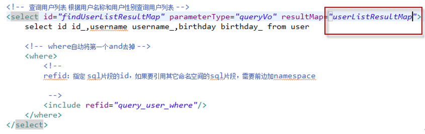

### 2 定义resultMap

由于上边的mapper.xml中sql查询列和Users.java类属性不一致，需要定义resultMap：userListResultMap将sql查询列和Users.java类属性对应起来

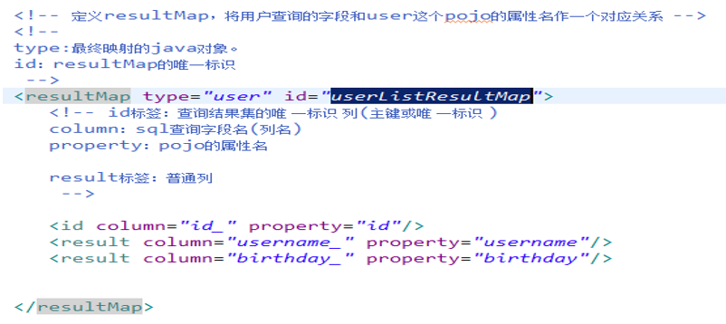

`<id/>`：此属性表示查询结果集的唯一标识，非常重要。如果是多个字段为复合唯一约束则定义多个`<id/>`。

`Property`：表示person类的属性。

`Column`：表示sql查询出来的字段名。

`Column`和property放在一块儿表示将sql查询出来的字段映射到指定的pojo类属性上。

`<result/>`：普通字段，即pojo的属性。

### 3 Mapper接口定义

```java
public List<User> findUserListResultMap() throws Exception;
```

## 4、动态sql(重点)

通过mybatis提供的各种标签方法实现动态拼接sql。

### 1 if

```xml
<!-- 传递pojo综合查询用户信息 -->
<select id="findUserList" parameterType="user" resultType="user">
    select * from user 
    where 1=1 
    <if test="id!=null and id!=''">
    	and id=#{id}
    </if>
    <if test="username!=null and username!=''">
    	and username like '%${username}%'
    </if>
</select>
```

### 2 Where

上边的sql也可以改为：

```xml
<select id="findUserList" parameterType="user" resultType="user">
    select * from user 
    <where>
        <if test="id!=null and id!=''">
           	and id=#{id}
        </if>
        <if test="username!=null and username!=''">
       		and username like '%${username}%'
        </if>
    </where>
</select>
```

`<where/>`可以**自动处理第一个and**。

### 3 foreach

向sql传递数组或List，mybatis使用foreach解析，如下：

#### 通过pojo传递list

（1）需求

传入多个id查询用户信息，用下边两个sql实现：

```sql
SELECT * FROM USERS WHERE username LIKE '%张%' AND (id =10 OR id =89 OR id=16)
SELECT * FROM USERS WHERE username LIKE '%张%' id IN (10,89,16)
```

（2）在pojo中定义list属性ids存储多个用户id，并添加getter/setter方法

```java
public class QueryVo{
	private User user;
	private UserCustom userCustom;
	private List<Integer> ids;
}
```

（3）mapper.xml

```xml
<if test="ids!=null and ids.size>0">
    <foreach collection="ids" open=" and id in(" close=")" item="id" separator="," >
    	#{id}
    </foreach>
</if>
```

（4）测试代码：

```java
List<Integer> ids = new ArrayList<Integer>();
ids.add(1);//查询id为1的用户
ids.add(10); //查询id为10的用户
queryVo.setIds(ids);
List<User> list = userMapper.findUserList(queryVo);
```

#### 传递单个List

传递List类型在编写mapper.xml没有区别，唯一不同的是**只有一个List参数时**它的**参数名为list**。

如下：

（1）Mapper.xml

```xml
<select id="selectUserByList" parameterType="java.util.List" resultType="user">
    select * from user 
    <where>
        <!-- 传递List，List中是pojo -->
        <if test="list!=null">
        <foreach collection="list" item="item" open="and id in("separator=","close=")">
        	#{item.id} 
        </foreach>
        </if>
    </where>
</select>
```

（2）Mapper接口

```java
public List<User> selectUserByList(List userlist) throws Exception;
```

（3）测试

```java
Public void testselectUserByList()throws Exception{
		//获取session
		SqlSession session = sqlSessionFactory.openSession();
		//获限mapper接口实例
		UserMapper userMapper = session.getMapper(UserMapper.class);
		//构造查询条件List
		List<User> userlist = new ArrayList<User>();
		User user = new User();
		user.setId(1);
		userlist.add(user);
		user = new User();
		user.setId(2);
		userlist.add(user); 
		//传递userlist列表查询用户列表
		List<User>list = userMapper.selectUserByList(userlist);
		//关闭session
		session.close();
	}
```

#### 传递单个pojo数组

```xml
<!-- 传递数组综合查询用户信息 -->
<select id="selectUserByArray" parameterType="Object[]" resultType="user">
    select * from user 
    <where>
    <!-- 传递数组 -->
        <if test="array!=null">
            <foreach collection="array" index="index" item="item" open="and id 	 
            in(" separator="," close=")">
            #{item.id} 
        </foreach>
        </if>
    </where>
</select>
```

sql只接收一个数组参数，这时sql解析参数的名称mybatis固定为array，如果数组是通过一个pojo传递到sql则参数的名称为pojo中的属性名。

index：为数组的下标。

item：为数组每个元素的名称，名称随意定义

open：循环开始

close：循环结束

separator：中间分隔输出

#### 传递单个字符串数组

```xml
<!-- 传递数组综合查询用户信息 -->
<select id="selectUserByArray" parameterType="Object[]" resultType="user">
    select * from user 
    <where>
        <!-- 传递数组 -->
        <if test="array!=null">
        <foreach collection="array" index="index" item="item" open="and id 
        in(" separator="," close=")">
            #{item} 
        </foreach>
        </if>
    </where>
</select>
```

如果数组中是简单类型则写为#{item}，不用再通过ognl获取对象属性值了

### 4 Sql片段

Sql中可将重复的sql提取出来，使用时用include引用即可，最终达到sql重用的目的，如下：

```xml
<!-- 传递pojo综合查询用户信息 -->
<select id="findUserList" parameterType="user" resultType="user">
    select * from user 
    <where>
        <if test="id!=null and id!=''">
        	and id=#{id}
        </if>
        <if test="username!=null and username!=''">
        	and username like '%${username}%'
        </if>
    </where>
</select>
```

将where条件抽取出来

```xml
<sql id="query_user_where">
	<if test="id!=null and id!=''">
		and id=#{id}
	</if>
	<if test="username!=null and username!=''">
		and username like '%${username}%'
	</if>
</sql>
```

使用include引用

```xml
<select id="findUserList" parameterType="user" resultType="user">
    select * from user 
    <where>
    	<include refid="query_user_where"/>
    </where>
</select>
```

注意：如果引用其它mapper.xml的sql片段，则在引用时需要加上namespace，如下：

```xml
<include refid=*"*namespace.sql片段”/>
```

# 五、关联查询

## 1、一对一查询

（1）方法一

​	编写多表查询sql语句，创建vo，他将包含两个实体类中所有的属性，可以通过字段少的类**继承**字段多的类来实现，mapper.xml中的returnType就是创建的vo

（2）方法二

​	使用resultMap，定义专门的resultMap用于映射一对一查询结果。

​	在Orders类中加入User属性，user属性中用于存储关联查询的用户信息，因为订单关联查询用户是一对一关系，所以这里使用单个User对象存储关联查询的用户信息。


Mapper.xml

```xml
<select id="findOrdersListResultMap" resultMap="userordermap">
    SELECT
    orders.*,
    user.username,
    user.address
    FROM
    orders,	user
    WHERE orders.user_id = user.id 
</select>
```


定义resultMap

​	需要关联查询映射的是用户信息，使用association将用户信息映射到订单对象的用户属性中。

```xml
<!-- 订单信息resultmap -->
<resultMap type="cn.itcast.mybatis.po.Orders" id="userordermap">
    <!-- 这里的id，是mybatis在进行一对一查询时将user字段映射为user对象时要使用，必须写 -->
    <id property="id" column="id"/>
    <result property="user_id" column="user_id"/>
    <result property="number" column="number"/>
    <association property="user" javaType="cn.itcast.mybatis.po.User">
        <!-- 这里的id为user的id，如果写上表示给user的id属性赋值 -->
        <id property="id" column="user_id"/>
        <result property="username" column="username"/>
        <result property="address" column="address"/>
    </association>
</resultMap>
```

`association`：表示进行关联查询单条记录

`property`：表示关联查询的结果存储在cn.itcast.mybatis.po.Orders的user属性中

`javaType`：表示关联查询的结果类型

`<id property=*"id"* column=*"user_id"*/>`：查询结果的user_id列对应关联对象的id属性，这里是`<id />`表示user_id是关联查询对象的唯一标识。

`<result property=*"username"* column=*"username"*/>`：查询结果的username列对应关联对象的username属性。


Mapper接口

```java
public List<Orders> findOrdersListResultMap() throws Exception;
```


测试：

```java
Public void testfindOrdersListResultMap()throws Exception{
		//获取session
		SqlSession session = sqlSessionFactory.openSession();
		//获限mapper接口实例
		UserMapper userMapper = session.getMapper(UserMapper.class);
		//查询订单信息
		List<Orders> list = userMapper.findOrdersList2();
		System.out.println(list);
		//关闭session
		session.close();
	}
```


小结：

使用association完成关联查询，将关联查询信息映射到pojo对象中。

## 2、一对多查询

案例：查询所有订单信息及订单下的订单明细信息。

订单信息与订单明细为一对多关系。

使用resultMap实现如下：

### 1 Sql语句： 

```sql
SELECT 
 orders.*,
 user.username,
 user.address,
 orderdetail.id orderdetail_id,
 orderdetail.items_id,
 orderdetail.items_num
FROM
 orders,user,orderdetail
WHERE orders.user_id = user.id 
AND orders.id = orderdetail.orders_id
```

### 2 定义po类

在Orders类中加入User属性。

在Orders类中加入`List<Orderdetail>` orderdetails属性

### 3 Mapper.xml 

```sql
<select id=*"findOrdersDetailList"* resultMap=*"userorderdetailmap"*>
  SELECT
  orders.*,
  user.username,
  user.address,
  orderdetail.id orderdetail_id,
  orderdetail.items_id,
  orderdetail.items_num
  FROM orders,user,orderdetail
  WHERE orders.user_id = user.id
  AND orders.id = orderdetail.orders_id
</select>
```

### 4 定义resultMap

```xml
<!-- 订单信息resultmap -->
<resultMap type="cn.itcast.mybatis.po.Orders" id="userorderdetailmap">
    <id property="id"column="id"/>
    <result property="user_id" column="user_id"/>
    <result property="number" column="number"/>
    <association property="user" javaType="cn.itcast.mybatis.po.User">
        <id property="id" column="user_id"/>
        <result property="username" column="username"/>
        <result property="address" column="address"/>
    </association>
    <collection property="orderdetails" ofType="cn.itcast.mybatis.po.Orderdetail">
        <id property="id" column="orderdetail_id"/>
        <result property="items_id" column="items_id"/>
        <result property="items_num" column="items_num"/>
    </collection>
</resultMap>
```

黄色部分和上边一对一查询订单及用户信息定义的resultMap相同，

collection部分定义了查询订单明细信息。

`collection`：表示关联查询结果集

`property="orderdetails"`：关联查询的结果集存储在cn.itcast.mybatis.po.Orders上哪个属性。

`ofType="cn.itcast.mybatis.po.Orderdetail"`：指定关联查询的结果集中的对象类型即List中的对象类型。

`<id />`及`<result/>`的意义同一对一查询。

### 5 resultMap使用继承

上边定义的resultMap中黄色部分和一对一查询订单信息的resultMap相同，这里使用继承可以不再填写重复的内容，如下： 

```xml
<resultMap type="cn.itcast.mybatis.po.Orders" id="userorderdetailmap" extends="userordermap">
<collection property="orderdetails" ofType="cn.itcast.mybatis.po.Orderdetail">
	<id property="id" column="orderdetail_id"/>
	<result property="items_id" column="items_id"/>
	<result property="items_num" column="items_num"/>
</collection>
</resultMap>
```

使用extends继承订单信息`userordermap`。 

### 6 Mapper接口：

```java
public List<Orders>findOrdersDetailList () throws Exception;
```

### 7 测试： 

```java
Public void testfindOrdersDetailList()throws Exception{
		//获取session
		SqlSession session = sqlSessionFactory.openSession();
		//获限mapper接口实例
		UserMapper userMapper = session.getMapper(UserMapper.class);
		//查询订单信息
		List<Orders> list = userMapper.findOrdersDetailList();
		System.out.println(list);
		//关闭session
		session.close();
	}
```

### 8 小结

使用collection完成关联查询，将关联查询信息映射到集合对象。

## 3、多对多查询

### 1.需求

查询用户购买的商品信息。

### 2.sql

需要查询所有用户信息，关联查询订单及订单明细信息，订单明细信息中关联查询商品信息

```sql
SELECT
	orders.*, 
	USER .username,
	USER .address,
	orderdetail.id orderdetail_id,
	orderdetail.items_id,
	orderdetail.items_num,
	items.name items_name,
	items.detail items_detail
FROM
	orders,
	USER,
	orderdetail,
	items
WHERE
	orders.user_id = USER .id
AND orders.id = orderdetail.orders_id
AND orderdetail.items_id = items.id
```

### 3.po定义

​     在*User*中添加`List<Orders> orders `属性，在Orders类中加入`List<Orderdetail> orderdetails`属性

### 4.resultMap 

需要关联查询映射的信息是：订单、订单明细、商品信息

订单：一个用户对应多个订单，使用collection映射到用户对象的订单列表属性中

订单明细：一个订单对应多个明细，使用collection映射到订单对象中的明细属性中

商品信息：一个订单明细对应一个商品，使用association映射到订单明细对象的商品属性中。

```xml
<!-- 一对多查询
查询用户信息、关联查询订单、订单明细信息、商品信息
-->
<resultMap type="cn.itcast.mybatis.po.User" id="userOrderListResultMap">
    <id column="user_id" property="id"/>
    <result column="username" property="username"/>
    
    <collection property="orders" ofType="cn.itcast.mybatis.po.Orders">
        <id  column="id" property="id"/>
        <result property="number" column="number"/>
        
    	<collection property="orderdetails" ofType="cn.itcast.mybatis.po.Orderdetail">
    	
            <id  column="orderdetail_id" property="id"/>
            <result property="ordersId" column="id"/>
            <result property="itemsId" column="items_id"/>
            <result property="itemsNum" column="items_num"/>
            
            <association property="items" javaType="cn.itcast.mybatis.po.Items">
                <id column="items_id" property="id"/>
                <result column="items_name" property="name"/>
                <result column="items_detail" property="detail"/>
            </association>            
       	</collection>
       	
    </collection>
</resultMap>
```

### 5.小结

一对多是多对多的特例，如下需求：

查询用户购买的商品信息，用户和商品的关系是多对多关系。

需求1：

查询字段：用户账号、用户名称、用户性别、商品名称、商品价格(最常见)

企业开发中常见明细列表，用户购买商品明细列表，

使用resultType将上边查询列映射到pojo输出。

需求2：

查询字段：用户账号、用户名称、购买商品数量、商品明细（鼠标移上显示明细）

使用resultMap将用户购买的商品明细列表映射到user对象中。

## 4、resultMap小结

**resultType：**

作用：

​     将查询结果按照sql列名pojo属性名一致性映射到pojo中。

场合：

​     常见一些明细记录的展示，比如用户购买商品明细，将关联查询信息全部展示在页面时，此时可直接使用resultType将每一条记录映射到pojo中，在前端页面遍历list（list中是pojo）即可。

**resultMap：**

​     使用association和collection完成一对一和一对多高级映射（对结果有特殊的映射要求）。

**association：**

作用：

​     将关联查询信息映射到一个pojo对象中。

场合：

​     为了方便查询关联信息可以使用association将关联订单信息映射为用户对象的pojo属性中，比如：查询订单及关联用户信息。

​     使用resultType无法将查询结果映射到pojo对象的pojo属性中，根据对结果集查询遍历的需要选择使用resultType还是resultMap。  

**collection：**

作用：

​     将关联查询信息映射到一个list集合中。

场合：

​     为了方便查询遍历关联信息可以使用collection将关联信息映射到list集合中，比如：查询用户权限范围模块及模块下的菜单，可使用collection将模块映射到模块list中，将菜单列表映射到模块对象的菜单list属性中，这样的作的目的也是方便对查询结果集进行遍历查询。

​     如果使用resultType无法将查询结果映射到list集合中。

## 5、 延迟加载

​     需要查询关联信息时，使用mybatis延迟加载特性可有效的减少数据库压力，首次查询只查询主要信息，关联信息等用户获取时再加载。

### 1.打开延迟加载开关

在mybatis核心配置文件中配置：

lazyLoadingEnabled、aggressiveLazyLoading

| 设置项                | 描述                                                         | 允许值        | 默认值 |
| --------------------- | ------------------------------------------------------------ | ------------- | ------ |
| lazyLoadingEnabled    | 全局性设置懒加载。如果设为‘false’，则所有相关联的都会被初始化加载。 | true \| false | false  |
| aggressiveLazyLoading | 当设置为‘true’的时候，懒加载的对象可能被任何懒属性全部加载。否则，每个属性都按需加载。 | true \| false | true   |

```xml
<settings>
		<setting name="lazyLoadingEnabled" value="true"/>
		<setting name="aggressiveLazyLoading" value="false"/>
</settings>
```

### 2.小结

**作用：**

​     当需要查询关联信息时再去数据库查询，默认不去关联查询，提高数据库性能。

​     只有使用resultMap支持延迟加载设置。

**场合：**

​     当只有部分记录需要关联查询其它信息时，此时可按需延迟加载，需要关联查询时再向数据库发出sql，以提高数据库性能。

​     当全部需要关联查询信息时，此时不用延迟加载，直接将关联查询信息全部返回即可，可使用resultType或resultMap完成映射。

# 六、查询缓存

## 1、mybatis缓存介绍

如下图，是mybatis一级缓存和二级缓存的区别图解：

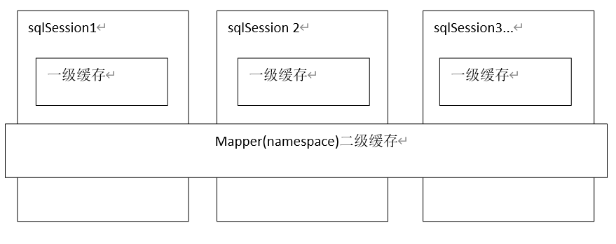

​	Mybatis一级缓存的**作用域**是**同一个SqlSession**，在同一个sqlSession中**两次执行相同**的sql语句，**第一次**执行完毕会将**数据库中查询**的数据写到缓存（内存），**第二次**会**从缓存中获取**数据将不再从数据库查询，从而提高查询效率。当一个**sqlSession结束后**该sqlSession中的**一级缓存也就不存在**了。Mybatis**默认开启**一级缓存。 

​	Mybatis二级缓存是多个SqlSession共享的，其**作用域**是mapper的**同一个namespace**，不同的sqlSession两次执行**相同namespace**下的sql语句且向sql中传递参数也相同即最终执行相同的sql语句，第一次执行完毕会将数据库中查询的数据写到缓存（内存），第二次会从缓存中获取数据将不再从数据库查询，从而提高查询效率。Mybatis**默认没有开启**二级缓存需要在setting全局参数中配置开启二级缓存。

## 2、 一级缓存

### 1.原理

下图是根据id查询用户的一级缓存图解：

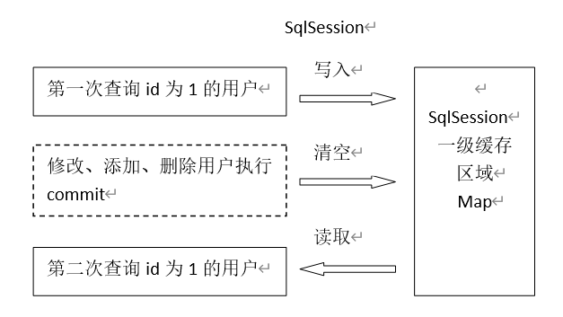

一级缓存区域是**根据SqlSession**为单位**划分**的。

每次查询会**先从缓存区域**找，如果**找不到**从**数据库查询**，查询到数据将数据写入缓存。

Mybatis内部存储缓存使用一个HashMap，key为hashCode+sqlId+Sql语句。value为从查询出来映射生成的java对象

sqlSession**执行insert、update、delete**等操作**commit提交**后**会清空缓存**区域。

## 3、二级缓存

### 1.原理

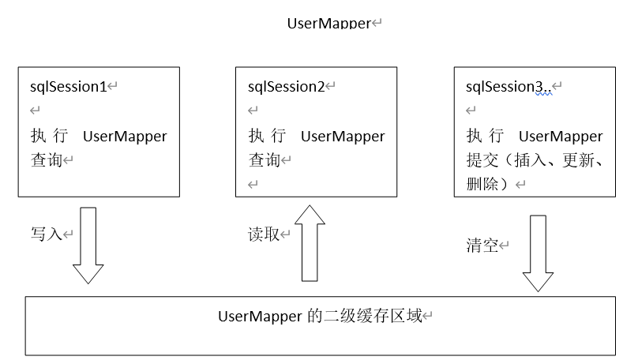

二级缓存区域是根据mapper的**namespace划分**的，相同namespace的mapper查询数据放在同一个区域，如果使用mapper代理方法每个mapper的namespace都不同，此时可以理解为二级缓存区域是根据mapper划分。

每次查询会先从缓存区域找，如果找不到从数据库查询，查询到数据将数据写入缓存。

Mybatis内部存储缓存使用一个HashMap，key为hashCode+sqlId+Sql语句。value为从查询出来映射生成的java对象

sqlSession执行insert、update、delete等操作commit提交后会清空缓存区域。

### 2.开启二级缓存：

在核心配置文件SqlMapConfig.xml中加入

```xml
<setting name="cacheEnabled" value="true"/>
```

|              | 描述                                              | 允许值     | 默认值 |
| ------------ | ------------------------------------------------- | ---------- | ------ |
| cacheEnabled | 对在此配置文件下的所有cache 进行全局性开/关设置。 | true false | true   |

### 3.实现序列化

​     二级缓存需要查询结果映射的pojo对象实现java.io.Serializable接口实现序列化和反序列化操作，注意如果存在父类、成员pojo都需要实现序列化接口。

```java
public class Orders implements Serializable
public class User implements Serializable
```

### 4.测试

```java
//获取session1
SqlSession session1 = sqlSessionFactory.openSession();
UserMapper userMapper = session1.getMapper(UserMapper.class);
//使用session1执行第一次查询
User user1 = userMapper.findUserById(1);
System.out.println(user1);
//关闭session1
session1.close();
//获取session2
SqlSession session2 = sqlSessionFactory.openSession();
UserMapper userMapper2 = session2.getMapper(UserMapper.class);
//使用session2执行第二次查询，由于开启了二级缓存这里从缓存中获取数据不再向数据库发出sql
User user2 = userMapper2.findUserById(1);
System.out.println(user2);
//关闭session2
session2.close();
```

### 5.禁用二级缓存

在statement中设置useCache=false可以禁用当前select语句的二级缓存，即每次查询都会发出sql去查询，默认情况是true，即该sql使用二级缓存。

```xml
<select id="findOrderListResultMap" resultMap="ordersUserMap" useCache="false">
```

### 6.刷新缓存

在mapper的同一个namespace中，如果有其它insert、update、delete操作数据后需要刷新缓存，如果不执行刷新缓存会出现脏读。

设置statement配置中的flushCache="true" 属性，默认情况下为true即刷新缓存，如果改成false则不会刷新。使用缓存时如果手动修改数据库表中的查询数据会出现脏读。

```xml
<insert id="insertUser" parameterType="cn.itcast.mybatis.po.User" flushCache="true">
```

### 7.Mybatis Cache参数

`flushInterval`（刷新间隔）可以被设置为任意的正整数，而且它们代表一个合理的毫秒形式的时间段。默认情况是不设置，也就是没有刷新间隔，缓存仅仅调用语句时刷新。

`size`（引用数目）可以被设置为任意正整数，要记住你缓存的对象数目和你运行环境的可用内存资源数目。默认值是1024。

`readOnly`（只读）属性可以被设置为true或false。只读的缓存会给所有调用者返回缓存对象的相同实例。因此这些对象不能被修改。这提供了很重要的性能优势。可读写的缓存会返回缓存对象的拷贝（通过序列化）。这会慢一些，但是安全，因此默认是false。

如下例子：

```xml
<cache eviction="FIFO" flushInterval="60000" size="512" readOnly="true"/>
```

这个更高级的配置创建了一个 FIFO 缓存,并每隔 60 秒刷新,存数结果对象或列表的 512 个引用,而且返回的对象被认为是只读的,因此在不同线程中的调用者之间修改它们会导致冲突。可用的收回策略有, 默认的是 LRU:

1. LRU – 最近最少使用的:移除最长时间不被使用的对象。

2. FIFO – 先进先出:按对象进入缓存的顺序来移除它们。

3. SOFT – 软引用:移除基于垃圾回收器状态和软引用规则的对象。

4. WEAK – 弱引用:更积极地移除基于垃圾收集器状态和弱引用规则的对象。

### 8.应用场景

​     对于访问多的查询请求且用户对查询结果实时性要求不高，此时可采用mybatis二级缓存技术降低数据库访问量，提高访问速度，业务场景比如：耗时较高的统计分析sql、电话账单查询sql等。

​     实现方法如下：通过设置刷新间隔时间，由mybatis每隔一段时间自动清空缓存，根据数据变化频率设置缓存刷新间隔flushInterval，比如设置为30分钟、60分钟、24小时等，根据需求而定。

### 9.局限性

​     mybatis二级缓存对细粒度的数据级别的缓存实现不好，比如如下需求：对商品信息进行缓存，由于商品信息查询访问量大，但是要求用户每次都能查询最新的商品信息，此时如果使用mybatis的二级缓存就无法实现当一个商品变化时只刷新该商品的缓存信息而不刷新其它商品的信息，因为mybaits的二级缓存区域以mapper为单位划分，当一个商品信息变化会将所有商品信息的缓存数据全部清空。解决此类问题需要在业务层根据需求对数据有针对性缓存。

# 七、与spring整合

> 实现mybatis与spring进行整合，通过spring管理SqlSessionFactory、mapper接口。

## 1、mybatis与spring整合jar

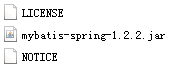

## 2、Mybatis配置文件

在classpath下创建*mybatis/SqlMapConfig.xml*

```xml
<?xml version="1.0" encoding="UTF-8" ?>
<!DOCTYPE configuration
PUBLIC "-//mybatis.org//DTD Config 3.0//EN"
"http://mybatis.org/dtd/mybatis-3-config.dtd">
<configuration>

    <!—使用自动扫描器时，mapper.xml文件如果和mapper.java接口在一个目录则此处不用定义mappers -->
    <mappers>
    	<package name="cn.itcast.mybatis.mapper" />
    </mappers>
</configuration>
```

使用**自动扫描器**时，**mapper.xml文件**如果和mapper.java**接口**在**一个目录**则此处**不用定义mappers**

## 3、Spring配置文件：

​     在classpath下创建applicationContext.xml，定义数据库链接池、SqlSessionFactory。

```xml
<beans xmlns="http://www.springframework.org/schema/beans"
	xmlns:xsi="http://www.w3.org/2001/XMLSchema-instance" xmlns:mvc="http://www.springframework.org/schema/mvc"
	xmlns:context="http://www.springframework.org/schema/context"
	xmlns:aop="http://www.springframework.org/schema/aop" xmlns:tx="http://www.springframework.org/schema/tx"
	xsi:schemaLocation="http://www.springframework.org/schema/beans 
		http://www.springframework.org/schema/beans/spring-beans-3.2.xsd 
		http://www.springframework.org/schema/mvc 
		http://www.springframework.org/schema/mvc/spring-mvc-3.2.xsd 
		http://www.springframework.org/schema/context 
		http://www.springframework.org/schema/context/spring-context-3.2.xsd 
		http://www.springframework.org/schema/aop 
		http://www.springframework.org/schema/aop/spring-aop-3.2.xsd 
		http://www.springframework.org/schema/tx 
		http://www.springframework.org/schema/tx/spring-tx-3.2.xsd ">
<!-- 加载配置文件 -->
<context:property-placeholder location="classpath:db.properties"/>

<!-- 数据库连接池 -->
<bean id="dataSource" class="org.apache.commons.dbcp.BasicDataSource" destroy-method="close">
       	<property name="driverClassName" value="${jdbc.driver}"/>
		<property name="url" value="${jdbc.url}"/>
		<property name="username" value="${jdbc.username}"/>
		<property name="password" value="${jdbc.password}"/>
		<property name="maxActive" value="10"/>
		<property name="maxIdle" value="5"/>
</bean>	
	<!-- mapper配置 -->
	<!-- 让spring管理sqlsessionfactory 使用mybatis和spring整合包中的 -->
	<bean id="sqlSessionFactory" class="org.mybatis.spring.SqlSessionFactoryBean">
		<!-- 数据库连接池 -->
		<property name="dataSource" ref="dataSource" />
		<!-- 加载mybatis的全局配置文件 -->
		<property name="configLocation" value="classpath:mybatis/SqlMapConfig.xml" />
	</bean>
</beans>
```

注意：在定义sqlSessionFactory时指定数据源dataSource和mybatis的配置文件。

## 4、Mapper编写的三种方法

### 1.继承SqlSessionDaoSupport

> ### 使用org.mybatis.spring.mapper.MapperFactoryBean

使用此种方法即原始dao开发方法，需要编写dao接口，dao接口实现类、映射文件。

1） 在sqlMapConfig.xml中配置映射文件的位置

```xml
<mappers>
  	<mapper resource="mapper.xml文件的地址" />
	<mapper resource="mapper.xml文件的地址" />
</mappers>
```

2） 定义dao接口

3）dao接口实现类集成SqlSessionDaoSupport 

dao接口实现类方法中可以`this.getSqlSession()`进行数据增删改查。

 4）spring 配置

```xml
<bean id=" "class="mapper接口的实现">
	<property name="sqlSessionFactory" ref="sqlSessionFactory"></property>
</bean>
```

### 2.使用MapperFactoryBean

> 使用org.mybatis.spring.mapper.MapperFactoryBean

此方法即mapper接口开发方法，只需定义mapper接口，不用编写mapper接口实现类。每个mapper接口都需要在spring配置文件中定义。

1） 在sqlMapConfig.xml中配置mapper.xml的位置

如果mapper.xml和mappre接口的名称相同且在同一个目录，这里可以不用配置

```xml
<mappers>
    <mapper resource="mapper.xml文件的地址" />
    <mapper resource="mapper.xml文件的地址" />
</mappers>
```

2） 定义mapper接口

3） Spring中定义

```xml
<bean id="" class="org.mybatis.spring.mapper.MapperFactoryBean">
	<property name="mapperInterface" value="mapper接口地址"/>
	<property name="sqlSessionFactory" ref="sqlSessionFactory"/>
</bean>
```

### 3.使用mapper扫描器

​     此方法即mapper接口开发方法，只需定义mapper接口，不用编写mapper接口实现类。只需要在spring配置文件中定义一个mapper扫描器，自动扫描包中的mapper接口生成代代理对象。

1） mapper.xml文件编写 

2） 定义mapper接口

注意mapper.xml的文件名和mapper的接口**名称保持一致**，且**放在同一个目录**

3） 配置mapper扫描器

```xml
<bean class="org.mybatis.spring.mapper.MapperScannerConfigurer">
    <property name="basePackage" value="mapper接口包地址"></property>
	<property name="sqlSessionFactoryBeanName" value="sqlSessionFactory"/>
</bean>
```

4） 使用扫描器后从spring容器中获取mapper的实现对象

### 4.SqlSessionFactoryBean-推荐

1）spring中创建SqlSessionFactoryBean

```xml
<bean id="sqlSession" class="org.mybatis.spring.SqlSessionFactoryBean">
    <property name="typeAliasesPackage" value="com.tmall.pojo" />
    <property name="dataSource" ref="dataSource"/>
    <property name="mapperLocations" value="classpath:mapper/*.xml"/>
    <!--分页插件-->
    <property name="plugins">
        <array>
            <bean class="com.github.pagehelper.PageInterceptor">
                <property name="properties">
                <value></value>
                </property>
            </bean>
        </array>
    </property>
</bean>
```

创建会话工厂bean时，指定mapper.xml的位置，类似Mybatis全局配置文件中`<mapper resource="" />`映射器

SqlSessionFactoryBean就相当于一个全局配置文件

2）扫描mapper接口

```xml
 <bean class="org.mybatis.spring.mapper.MapperScannerConfigurer">
        <property name="basePackage" value="com.tmall.mapper"/>
 </bean>
```

