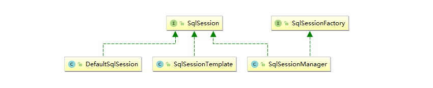
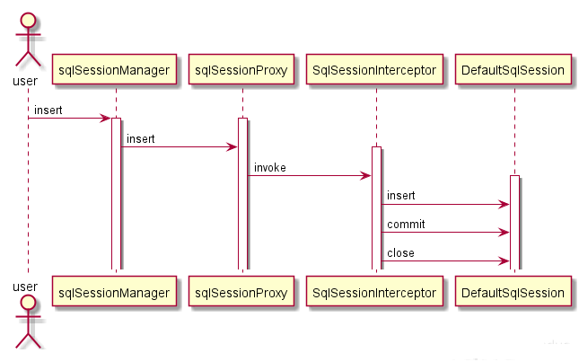

> 文章摘自：https://blog.csdn.net/wuqinduo/article/details/103736862

## 三个SqlSession

DefaultSqlSession与SqlSessionManager 与SqlSessionTemplate 是我们常见的3种sqlsesion



从类图可以看出他们三个都实现了了SqlSession，也就是他们都可以表示一个会话。与其他不同的是SqlSessionManager实现了SqlSessionFactory

**这三种sqlsession的区别是啥？他们的应用场景是啥呢？**

这一切我们从DefaultSqlSession开始说起。

## DefaultSqlSession

DefaultSqlSession 是SqlSession的默认实现。

当我们单独使用Mybatis时，我们通常使用DefaultSqlSession 来执行SQL，操作数据库。

```java
String resource = "mybatis-config.xml";
// 读取配置文件
InputStream inputStream = Resources.getResourceAsStream(resource);
// 构建sqlSessionFactory
SqlSessionFactory sqlSessionFactory = new SqlSessionFactoryBuilder().build(inputStream);
// 获取sqlSession
SqlSession sqlSession = sqlSessionFactory.openSession();
try {
    User user = sqlSession.selectOne("MyMapper.selectUser", 1);
    System.out.println(user);
} finally {
    sqlSession.close();
}
```

但是DefaultSqlSession存在两个不足。

1. 我们需要自己手动关闭sqlsesion，我们知道，人总是不可靠的。忘关sqlsession 是有很大概率发生的
2. 线程安全问题：DefaultSqlSession是线程不安全的Sqlsession 。也就是说DefaultSqlSession不能是单例，

如何解决这两个问题？

**自动关闭Session问题**：

1. 我们可以自己做一个切面，专门处理session关闭问题
2. Mybatis为我们提供了升级版的DefaultSqlSession， SqlSessionManager可以解决这个问题

**线程安全问题**：

1. 既然不能共用，很自然的，我们每次使用DefaultSqlSession的时候都从SqlSessionFactory当中获取一个就可以了啊。
2. 但是我们仍然想使用单例版的Sqlsession怎么办？别慌，Mybatis为我们提供了升级版的DefaultSqlSession ，SqlSessionManager可以解决这个问题。

## SqlSessionManager

> 个人认为，与其说SqlSessionManager是DefaultSqlSession 的升级版，不如说SqlSessionManager是DefaultSqlSession代理版（或者封装版）

为什么这样说？来看看SqlSessionManager能干吗

### 1.获取DefaultSqlSession的能力

```java
String resource = "mybatis-config.xml";
// 读取配置文件
InputStream inputStream = Resources.getResourceAsStream(resource);
SqlSessionManager sqlSessionManager =SqlSessionManager.newInstance(inputStream);

//获取一个SqlSession
SqlSession session = sqlSessionManager.openSession();
//SqlSessionManager 类的openSession
public SqlSession openSession() {
    return sqlSessionFactory.openSession();
}
```

从这个角度看，其实他跟SqlSession没有什么区别。他只是封装了SqlSession ，具体工作还是交给SqlSession去做的.
`sqlSessionManager.openSession() = sqlSessionFactory.openSession()`

得到的Sqlsession自然也是DefaultSqlSession

### 2.解决DefaultSqlSession的不足

#### 2.1解决自动关闭问题

> 为了解决自动关闭问题，SqlSessionManager使用了代理技术来实现了自动关闭问题。

使用JDK动态代理技术，动态生成代理对象sqlSessionProxy ，并用内部类SqlSessionInterceptor来对SqlSession的执行方法进行增强。

```java
private SqlSessionManager(SqlSessionFactory sqlSessionFactory) {
    this.sqlSessionFactory = sqlSessionFactory;
    //使用JDK代理技术，生成一个代理对象
    this.sqlSessionProxy = (SqlSession) Proxy.newProxyInstance(
        SqlSessionFactory.class.getClassLoader(),
        new Class[]{SqlSession.class},
        new SqlSessionInterceptor());
}
```

我们以insert为例来看看

```java
sqlSessionManager.insert()

    public int insert(String statement) {
    return sqlSessionProxy.insert(statement);
}
```

当执行insert()方法时，sqlSessionManager内部是调用sqlsessionProxy代理对象的insert方法。之后执行增强器的SqlSessionInterceptor#invoke方法。

```java
@Override
public Object invoke(Object proxy, Method method, Object[] args) throws Throwable {
    final SqlSession sqlSession = SqlSessionManager.this.localSqlSession.get();
    if (sqlSession != null) {// 当使用线程本地变量
        try {
            return method.invoke(sqlSession, args);
        } catch (Throwable t) {
            throw ExceptionUtil.unwrapThrowable(t);
        }
    } else {//不使用线程本地变量。
        //从sqlSessionFactory获取一个DefaultSqlSession
        final SqlSession autoSqlSession = openSession();
        try {
            final Object result = method.invoke(autoSqlSession, args);
            autoSqlSession.commit();//提交
            return result;
        } catch (Throwable t) {
            autoSqlSession.rollback();//回滚
            throw ExceptionUtil.unwrapThrowable(t);
        } finally {
            autoSqlSession.close();//关闭sqlsession
        }
    }
}
```

invoke方法内部，调用openSession() 从sqlSessionFactory中获取一个DefaultSqlSession，执行对应的方法，并在`finally`中执行关闭sqlsession

最后的执行时序



sqlSessionManager.insert() 的背后依然是DefaultSqlSession.insert 。并且帮助我们close 了DefaultSqlSession。

开发人员再也不必担心，忘记关闭DefaultSqlSession 了。

> 在执行sqlSessionManager的sqlsession方法时， 其本质也是每次都创建DefaultSqlSession ，不正是**线程安全**的吗？

单例是sqlSessionManager ；但真正执行的是DefaultSqlSession

#### 2.1解决线程安全问题。

解决线程安全问题，sqlSessionManager 还有另一个方式，那就是使用线程本地变量，不同于每次执行CURD操作都重新获取一个DefaultSqlSession 。 线程本地变量这种方式是一个线程内使用同一个请求，这就大大节省了创建DefaultSqlSession 的时间，并且是线程安全的。

使用：

```java
sqlSessionManager.startManagedSession();//绑定Session到线程本地变量
sqlSessionManager.insert()
```

原理：

```java
private ThreadLocal<SqlSession> localSqlSession = new ThreadLocal<SqlSession>();

public void startManagedSession() {
    this.localSqlSession.set(openSession());
}
```

当startManagedSession()开始线程本地变量时，会从sqlSessionFactory获取一个session 放入到线程本地localSqlSession中，绑定到当前线程。

当我们执行sqlSessionManager.insert方法时，执行到增强器的invoke方法时，会从localSqlSession获取绑定到当前线程的sqlsession 

```java
@Override
public Object invoke(Object proxy, Method method, Object[] args) throws Throwable {
    //从线程本地变量里获取
    final SqlSession sqlSession = SqlSessionManager.this.localSqlSession.get();
    if (sqlSession != null) {
        try {
            return method.invoke(sqlSession, args);
        } catch (Throwable t) {
            throw ExceptionUtil.unwrapThrowable(t);
        }
    }
}
```

> 小结：我们可以看出，SqlSessionManager通过动态代理技术+线程本地变量，升级了DefaultSqlSession的使用。

## SqlSessionTemplate

SqlSessionTemplate 是Mybatis与Spring 整合时的线程安全sqlsession .

来看其构造方法

```java
    public SqlSessionTemplate(SqlSessionFactory sqlSessionFactory, ExecutorType executorType,
          PersistenceExceptionTranslator exceptionTranslator) {
    
        this.sqlSessionFactory = sqlSessionFactory;
        this.executorType = executorType;
        this.exceptionTranslator = exceptionTranslator;
        this.sqlSessionProxy = (SqlSession) newProxyInstance(
            SqlSessionFactory.class.getClassLoader(),
            new Class[] { SqlSession.class },
            new SqlSessionInterceptor());
      }
1234567891011
```

会发现他和SqlSessionManager 类似，SqlSessionTemplate 也使用了JDK动态代理技术来实现。SqlSessionTemplate 也有一个内部类增强器SqlSessionInterceptor。

```java
private class SqlSessionInterceptor implements InvocationHandler {
    @Override
    public Object invoke(Object proxy, Method method, Object[] args) throws Throwable {
        //获取连接
        SqlSession sqlSession = getSqlSession(
            SqlSessionTemplate.this.sqlSessionFactory,
            SqlSessionTemplate.this.executorType,
            SqlSessionTemplate.this.exceptionTranslator);
        try {
            //执行sqlsession 目标方法
            Object result = method.invoke(sqlSession, args);
            if (!isSqlSessionTransactional(sqlSession, SqlSessionTemplate.this.sqlSessionFactory)) {
                sqlSession.commit(true);
            }
            return result;
        } catch (Throwable t) {
            Throwable unwrapped = unwrapThrowable(t);
            if (SqlSessionTemplate.this.exceptionTranslator != null && 
                unwrapped instanceof PersistenceException) {
                // release the connection to avoid a deadlock if the translator is no loaded. See issue #22
                closeSqlSession(sqlSession, SqlSessionTemplate.this.sqlSessionFactory);
                sqlSession = null;
                Throwable translated = SqlSessionTemplate.this.exceptionTranslator.
                    translateExceptionIfPossible((PersistenceException) unwrapped);
                if (translated != null) {
                    unwrapped = translated;
                }
            }
            throw unwrapped;
        } finally {
            if (sqlSession != null) {
                closeSqlSession(sqlSession, SqlSessionTemplate.this.sqlSessionFactory);
            }
        }
    }
}
```

我们也从自动关闭与线程安全两个角度来看看SqlSessionTemplate

### 1.解决线程安全问题

> 不同于SqlSessionManager 自己管理session的方式，SqlSessionTemplate 把session的管理外包出去了

SqlSessionTemplate 把获取sqlsession的工作交给了SqlSessionUtils去做了。

```java
public static SqlSession getSqlSession(SqlSessionFactory sessionFactory, ExecutorType executorType, 
                                       PersistenceExceptionTranslator exceptionTranslator) {
    //从事务同步器中获取Sqlsession。
    SqlSessionHolder holder = (SqlSessionHolder) TransactionSynchronizationManager.
        getResource(sessionFactory);

    SqlSession session = sessionHolder(executorType, holder);
    if (session != null) {
        return session;
    }

    if (LOGGER.isDebugEnabled()) {
        LOGGER.debug("Creating a new SqlSession");
    }

    session = sessionFactory.openSession(executorType);

    registerSessionHolder(sessionFactory, executorType, exceptionTranslator, session);

    return session;
}
```

SqlSessionUtils 会先尝试从`TransactionSynchronizationManager`事务同步器中获取sqlsesion，获取不到再从工厂内获取。

```java
public static SqlSession getSqlSession(SqlSessionFactory sessionFactory, ExecutorType executorType, PersistenceExceptionTranslator exceptionTranslator) {

    SqlSessionHolder holder = (SqlSessionHolder) TransactionSynchronizationManager.getResource(sessionFactory);//从事务同步器中获取sqlsession
    SqlSession session = sessionHolder(executorType, holder);
    if (session != null) {
        return session;
    }
    session = sessionFactory.openSession(executorType);
    registerSessionHolder(sessionFactory, executorType, exceptionTranslator, session);
    return session;
}
```

`TransactionSynchronizationManager` [在spring源码系列11:事务代理对象的执行](https://blog.csdn.net/wuqinduo/article/details/102673622) 一文提过。是spring事务实现原理的重要组件。

TransactionSynchronizationManager 本身也是一个线程本地变量管理器。

> 从这一点来看，他和SqlSessionManager 是一样的。只是管理的方式不同，一个自己管，一个外包

### 2.解决自动关闭问题

同SqlSessionManager一样，在执行完session后，也会帮助close.
不同的是，

- session 如果是由TransactionSynchronizationManager管理的，则只会更新引用计数器，让**Spring在托管事务结束**时调用close回调，关闭session。
- session不是由TransactionSynchronizationManager 管理的，则直接关闭session

```java
public static void closeSqlSession(SqlSession session, SqlSessionFactory sessionFactory) {

    SqlSessionHolder holder = (SqlSessionHolder) TransactionSynchronizationManager.getResource(sessionFactory);
    if ((holder != null) && (holder.getSqlSession() == session)) {
        //计数减1
        holder.released();
    } else {
        //关闭session
        session.close();
    }
}
```

## 总结

- `DefaultSqlSession` 与 `SqlSessionManager` 是Mybatis 默认提供的两个sqlsesion；`SqlSessionTemplate`是Mybatis与Spring整合时用的sqlsesion
- `DefaultSqlSession` 是单例线程不安全的，SqlSessionManager与SqlSessionTemplate 是单例线程安全的
- `SqlSessionManager`与`SqlSessionTemplate` 都对通过动态代理技术对DefaultSqlSession 自动关闭问题进行了优化
- `SqlSessionManager`是自己管理sqlsession，`SqlSessionTemplate`外包给`TransactionSynchronizationManager`管理sqlsession。