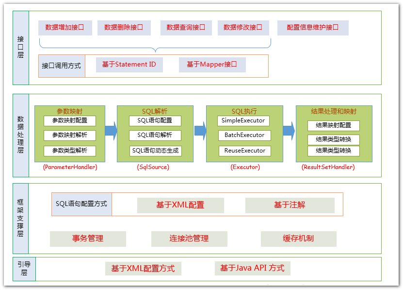
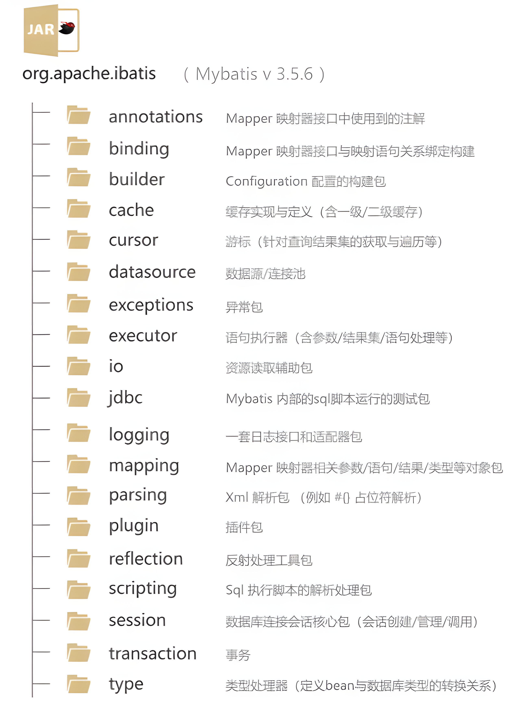
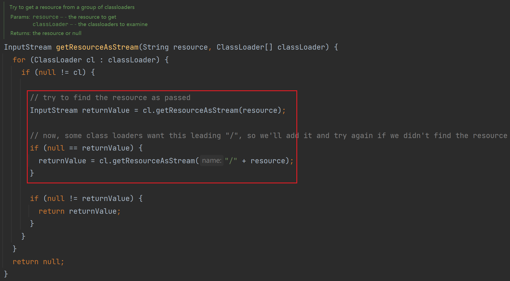
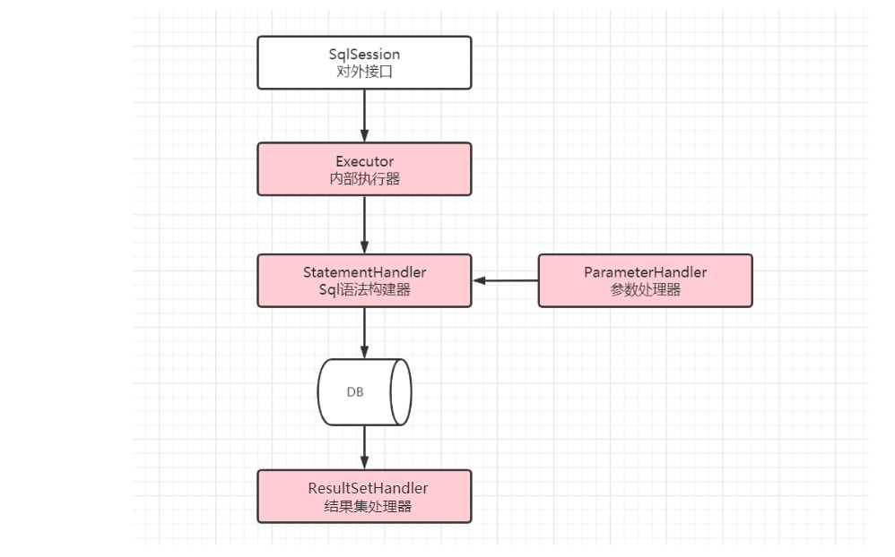
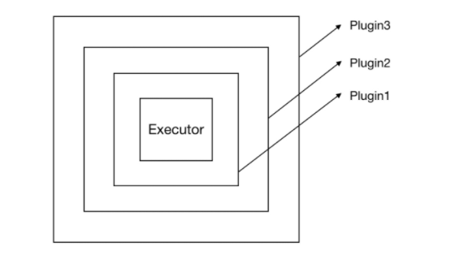
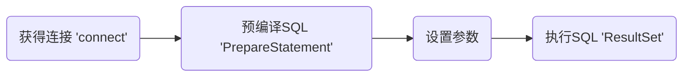

# Mybatis源码解读

## 架构设计



nybatis架构四层作用是什么呢？

+ Api接口层：提供API增加、删除、修改、查询等接口，通过API接口对数据库进行操作
+ 数据处理层：主要负责SQL的查询、解析、执行以及结果映射的处理，主要作用解析Sq根据调用请求完成一次数据库操作。
+ 框架支撑层：负责通用基础服务支撑，包含事务管理、连接池管理、缓存管理等共用组件的封装，为上层提供基础服务支撑
+ 引导层：引导层是配置和启动M小/Batis配置信息的方式

## 源码目录结构



## 初始化

### 加载配置文件

我们使用下面的代码来加载资源

```java
InputStream inputStream = Resources.getResourceAsStream("sqlMapConfig.xml");
```



`Resources` 最终会调用上面的方法，它会对路径添加 `/` 进行二次加载重试操作。

### 解析核心配置文件

```java
SqlSessionFactory sqlSessionFactory = 
    new SqlSessionFactoryBuilder().build(inputStream);
```


## 插件机制

### 插件介绍

Mybatis插件本质上来说就是一个拦截器，它体现了`JDK动态代理和责任链设计模式的综合运用`

Mybatis中针对四大组件提供了扩展机制，这四个组件分别是：



Mybatis中所允许拦截的方法如下：

- Executor 【SQL执行器】【update,query,commit,rollback】
- StatementHandler 【Sql语法构建器对象】【prepare,parameterize,batch,update,query等】
- ParameterHandler 【参数处理器】【getParameterObject,setParameters等】
- ResultSetHandler 【结果集处理器】【handleResultSets,handleOuputParameters等】

#### 能干什么？

* 分页功能：mybatis的分页默认是基于内存分页的（查出所有，再截取），数据量大的情况下效率较低，不过使用mybatis插件可以改变该行为，只需要拦截StatementHandler类的prepare方法，改变要执行的SQL语句为分页语句即可

* 性能监控：对于SQL语句执行的性能监控，可以通过拦截Executor类的update, query等方法，用日志记录每个方法执行的时间

#### 如何自定义插件？

1. 创建 `Interceptor` 的实现类，重写方法

```java
public interface Interceptor {
  /**
   * 真正方法被拦截执行的逻辑
   *
   * @param invocation 主要目的是将多个参数进行封装
   */
  Object intercept(Invocation invocation) throws Throwable;
    
  // 生成目标对象的代理对象
  default Object plugin(Object target) {
    return Plugin.wrap(target, this);
  }
  // 可以拦截器设置一些属性
  default void setProperties(Properties properties) {
    // NOP
  }
}
```

2. 使用 `@Intercepts` 注解完成插件签名，表明插件应用到拦截四大对象的哪一个方法当中

`@Intercepts` 注解

```java
@Documented
@Retention(RetentionPolicy.RUNTIME)
@Target(ElementType.TYPE)
public @interface Intercepts {  
  Signature[] value();
}
```

`@Signature` 注解

```java
@Documented
@Retention(RetentionPolicy.RUNTIME)
@Target({})
public @interface Signature {
  // 拦截的类
  Class<?> type();
  // 拦截的方法
  String method();
  // 拦截方法的参数    
  Class<?>[] args();
 } 
```

3. 将写好的插件注册到全局配置文件中

```xml
<?xml version="1.0" encoding="UTF-8" ?>
<!DOCTYPE configuration PUBLIC "-//mybatis.org//DTD Config 3.0//EN"
        "http://mybatis.org/dtd/mybatis-3-config.dtd">
<configuration>
    <plugins>
        <plugin interceptor="com.hemou.interceptor.MyPlugin">
            <property name="dialect" value="mysql" />
        </plugin>
    </plugins>
</configuration>
```

#### 自定义插件示例

**需求**：把Mybatis所有执行的sql都记录下来

**步骤**：

1、创建Interceptor的实现类，重写方法

```java
public class MyPlugin implements Interceptor {
	private final Logger logger = LoggerFactory.getLogger(this.getClass());
	// //这里是每次执行操作的时候，都会进行这个拦截器的方法内 
	
	Override
	public Object intercept(Invocation invocation) throws Throwable { 
	//增强逻辑
	 StatementHandler statementHandler = (StatementHandler) invocation.getTarget();
        BoundSql boundSql = statementHandler.getBoundSql();
        String sql = boundSql.getSql();
        logger.info("mybatis intercept sql:{}", sql);
		return invocation.proceed(); //执行原方法 
} 
	
	/**
	*
	*	^Description包装目标对象 为目标对象创建代理对象
	*	@Param target为要拦截的对象
	*	@Return代理对象
	*/
	Override 
	public Object plugin(Object target) {
		System.out.println("将要包装的目标对象："+target); 
		return Plugin.wrap(target,this);
    }
    
	/**获取配置文件的属性**/
	//插件初始化的时候调用，也只调用一次，插件配置的属性从这里设置进来
	Override
    public void setProperties(Properties properties) {
		System.out.println("插件配置的初始化参数："+properties );
	}
}
```

2、使用@Intercepts注解完成插件签名 说明插件的拦截四大对象之一的哪一个对象的哪一个方法

```java
@Intercepts({ @Signature(type = StatementHandler.class, 
                         method = "prepare", 
                         args = { Connection.class, Integer.class}) })
public class SQLStatsInterceptor implements Interceptor {
```

3、将写好的插件注册到全局配置文件中

```java
<?xml version="1.0" encoding="UTF-8" ?>
<!DOCTYPE configuration PUBLIC "-//mybatis.org//DTD Config 3.0//EN"
        "http://mybatis.org/dtd/mybatis-3-config.dtd">
<configuration>
    <plugins>
        <plugin interceptor="com.itheima.interceptor.MyPlugin">
            <property name="dialect" value="mysql" />
        </plugin>
    </plugins>
</configuration>
```

### 源码分析

#### 如何实例化插件？

在 xml 定义好如下的插件后，mybatis 如何解析的呢

```java
<?xml version="1.0" encoding="UTF-8" ?>
<!DOCTYPE configuration PUBLIC "-//mybatis.org//DTD Config 3.0//EN"
        "http://mybatis.org/dtd/mybatis-3-config.dtd">
<configuration>
    <plugins>
        <plugin interceptor="com.itheima.interceptor.MyPlugin">
            <property name="dialect" value="mysql" />
        </plugin>
    </plugins>
</configuration>
```

对应的解析代码如下（XMLConfigBuilder#pluginElement）：

```java
private void pluginElement(XNode parent) throws Exception {
    if (parent != null) {
      for (XNode child : parent.getChildren()) {
        // 获取拦截器
        String interceptor = child.getStringAttribute("interceptor");
        // 获取配置的Properties属性
        Properties properties = child.getChildrenAsProperties();
        // 根据配置文件中配置的插件类的全限定名 进行反射初始化
        Interceptor interceptorInstance = (Interceptor) resolveClass(interceptor).getDeclaredConstructor().newInstance();
        // 将属性添加到Intercepetor对象
        interceptorInstance.setProperties(properties);
        // 添加到配置类的InterceptorChain属性，InterceptorChain类维护了一个List<Interceptor>
        configuration.addInterceptor(interceptorInstance);
      }
    }
  }
```

主要做了以下工作：

1. 遍历解析plugins标签下每个plugin标签
2. 根据解析的类信息创建Interceptor对象
3. 调用setProperties方法设置属性
4. 将拦截器添加到Configuration类的IntercrptorChain拦截器链中

#### 如何生成代理对象？

Executor代理对象（Configuration#newExecutor）

```java
public Executor newExecutor(Transaction transaction, ExecutorType executorType) {
    executorType = executorType == null ? defaultExecutorType : executorType;
    executorType = executorType == null ? ExecutorType.SIMPLE : executorType;
    Executor executor;
    if (ExecutorType.BATCH == executorType) {
      executor = new BatchExecutor(this, transaction);
    } else if (ExecutorType.REUSE == executorType) {
      executor = new ReuseExecutor(this, transaction);
    } else {
      executor = new SimpleExecutor(this, transaction);
    }
    if (cacheEnabled) {
      executor = new CachingExecutor(executor);
    }
    // 生成Executor代理对象逻辑
    executor = (Executor) interceptorChain.pluginAll(executor);
    return executor;
  }
```

ParameterHandler代理对象（Configuration#newParameterHandler）

```java
public ParameterHandler newParameterHandler(MappedStatement mappedStatement, Object parameterObject, BoundSql boundSql) {
    ParameterHandler parameterHandler = mappedStatement.getLang().createParameterHandler(mappedStatement, parameterObject, boundSql);
    // 生成ParameterHandler代理对象逻辑 
    parameterHandler = (ParameterHandler) interceptorChain.pluginAll(parameterHandler);
    return parameterHandler;
  }
```

ResultSetHandler代理对象（Configuration#newResultSetHandler）

```java
public ResultSetHandler newResultSetHandler(Executor executor, MappedStatement mappedStatement, RowBounds rowBounds, ParameterHandler parameterHandler,
      ResultHandler resultHandler, BoundSql boundSql) {
    ResultSetHandler resultSetHandler = new DefaultResultSetHandler(executor, mappedStatement, parameterHandler, resultHandler, boundSql, rowBounds);
    // 生成ResultSetHandler代理对象逻辑
    resultSetHandler = (ResultSetHandler) interceptorChain.pluginAll(resultSetHandler);
    return resultSetHandler;
  }
```

StatementHandler代理对象（Configuration#newStatementHandler）

```java
public StatementHandler newStatementHandler(Executor executor, MappedStatement mappedStatement, Object parameterObject, RowBounds rowBounds, ResultHandler resultHandler, BoundSql boundSql) {
    StatementHandler statementHandler = new RoutingStatementHandler(executor, mappedStatement, parameterObject, rowBounds, resultHandler, boundSql);
    // 生成StatementHandler代理对象逻辑
    statementHandler = (StatementHandler) interceptorChain.pluginAll(statementHandler);
    return statementHandler;

}
```

通过查看源码会发现，所有代理对象的生成都是通过`InterceptorChain#pluginAll`方法来创建的，进一步查看pluginAll方法

```java
public Object pluginAll(Object target) {
    for (Interceptor interceptor : interceptors) {
        target = interceptor.plugin(target);
    }
    return target;

}
```

InterceptorChain#pluginAll内部通过遍历Interceptor#plugin方法来创建代理对象，并将生成的代理对象又赋值给target,如果存在多个拦截器的话，生成的代理对象会被另一个代理对象所代理，从而形成一个代理链，执行的时候，依次执行所有拦截器的拦截逻辑代码，我们再跟进去

```java
default Object plugin(Object target) {
  return Plugin.wrap(target, this);
}
```


`Interceptor#plugin`方法最终将目标对象和当前的拦截器交给`Plugin.wrap`方法来创建代理对象。该方法是默认方法，是Mybatis框架提供的一个典型plugin方法的实现。让我们看看在`Plugin#wrap`方法中是如何实现代理对象的

```java
public static Object wrap(Object target, Interceptor interceptor) {
    // 1.解析该拦截器所拦截的所有接口及对应拦截接口的方法
    Map<Class<?>, Set<Method>> signatureMap = getSignatureMap(interceptor);
    Class<?> type = target.getClass();
    // 2.获取目标对象实现的所有被拦截的接口
    Class<?>[] interfaces = getAllInterfaces(type, signatureMap);
    // 3.目标对象有实现被拦截的接口，生成代理对象并返回
    if (interfaces.length > 0) {
        // 通过JDK动态代理的方式实现
      return Proxy.newProxyInstance(
          type.getClassLoader(),
          interfaces,
          new Plugin(target, interceptor, signatureMap));
    }
    // 目标对象没有实现被拦截的接口，直接返回原对象
    return target;

}
```

最终我们看到其实是通过JDK提供的Proxy.newProxyInstance方法来生成代理对象

#### 拦截逻辑的执行

通过上面的分析，我们知道Mybatis框架中执行Executor、ParameterHandler、ResultSetHandler和StatementHandler中的方法时真正执行的是代理对象对应的方法。而且该代理对象是通过JDK动态代理生成的，所以执行方法时实际上是调用InvocationHandler#invoke方法（Plugin类实现InvocationHandler接口）,下面是Plugin#invoke方法

```java
@Override
  public Object invoke(Object proxy, Method method, Object[] args) throws Throwable {
    try {
      Set<Method> methods = signatureMap.get(method.getDeclaringClass());
      if (methods != null && methods.contains(method)) {
        return interceptor.intercept(new Invocation(target, method, args));
      }
      return method.invoke(target, args);
    } catch (Exception e) {
      throw ExceptionUtil.unwrapThrowable(e);
    }
}
```


**注：一个对象被代理很多次**

问题：同一个组件对象的同一个方法是否可以被多个拦截器进行拦截？

答案是肯定的，所以我们**配置在最前面的拦截器最先被代理，但是执行的时候却是最外层的先执行**。

具体点：

假如依次定义了三个插件：`插件1`，`插件2 和 插件3`。

那么List中就会按顺序存储：`插件1`，`插件2` 和 `插件3`。

而解析的时候是遍历list，所以解析的时候也是按照：`插件1 `,`插件2`,`插件3`的顺序。

但是执行的时候就要反过来了，执行的时候是按照：`插件3`，`插件2`和`插件1`的顺序进行执行。



当 Executor 的某个方法被调用的时候，插件逻辑会先行执行。执行顺序由外而内，比如上图的执行顺序为 `plugin3 → plugin2 → Plugin1 → Executor`。

## ~~old~~

[源码阅读网](http://coderead.cn)



1. 动态代理`MapperProxy`
2. SQL会话`SqlSession`
3. 执行器`Executor`
4. JDBC处理器`StatementHandler`


执行器

MyBatis执行过程

1. SqlSession，使用门面模式，提供一个统一的门面接口API，使系统更容易使用，提供如下api
   1. 基本API，增删改查
   2. 辅助API，提交、关闭会话
2. Executor 执行器，sqlsession只提供接口方法，而不做具体操作，相应的执行器则完成相应的具体操作。
   1. 基本功能：改（增删改可以全部归到改中）、查、缓存维护
   2. 辅助功能：提交、关闭执行器，批处理刷新

