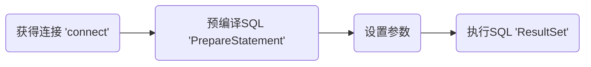

# Mybatis源码解读

[源码阅读网](http://coderead.cn)

```mermaid
graph LR
A(获得连接 'connect') --> B(预编译SQL 'PrepareStatement') --> C(设置参数) --> D(执行SQL 'ResultSet')
```

1. 动态代理`MapperProxy`
2. SQL会话`SqlSession`
3. 执行器`Executor`
4. JDBC处理器`StatementHandler`

## 执行器

### MyBatis执行过程

1. SqlSession，使用门面模式，提供一个统一的门面接口API，使系统更容易使用，提供如下api
   1. 基本API，增删改查
   2. 辅助API，提交、关闭会话
2. Executor 执行器，sqlsession只提供接口方法，而不做具体操作，相应的执行器则完成相应的具体操作。
   1. 基本功能：改（增删改可以全部归到改中）、查、缓存维护
   2. 辅助功能：提交、关闭执行器，批处理刷新

