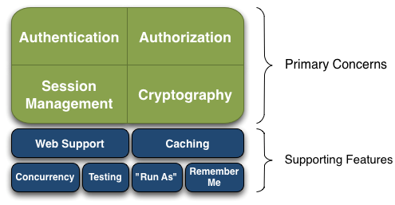
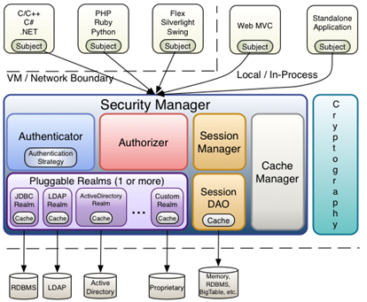
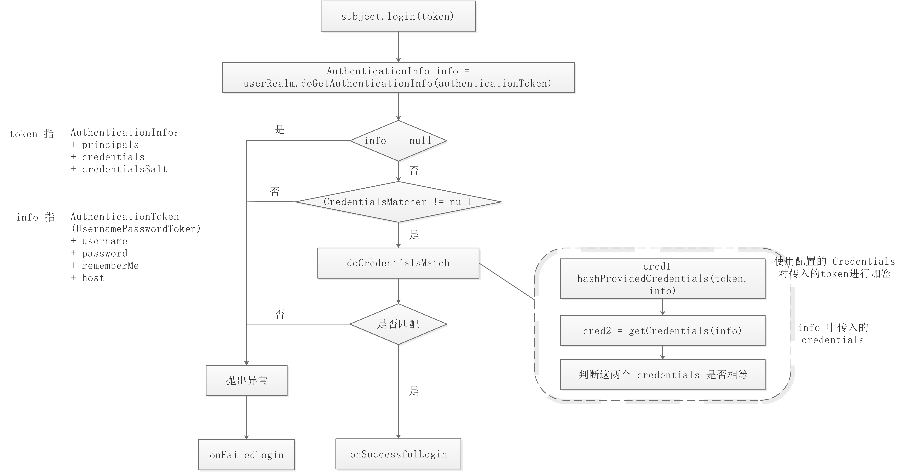

# Shiro

## 简介

Apache Shiro 是 Java 的一个安全框架。目前，使用 Apache Shiro 的人越来越多，因为它相当简单，对比 Spring Security，可能没有 Spring Security 做的功能强大，但是在实际工作时可能并不需要那么复杂的东西，所以使用小而简单的 Shiro 就足够了。对于它俩到底哪个好，这个不必纠结，能更简单的解决项目问题就好了。

Shiro 可以非常容易的开发出足够好的应用，其不仅可以用在 JavaSE 环境，也可以用在 JavaEE 环境。Shiro 可以帮助我们完成：认证、授权、加密、会话管理、与 Web 集成、缓存等。这不就是我们想要的嘛，而且 Shiro 的 API 也是非常简单；其基本功能点如下图所示：



**Authentication**：身份认证 / 登录，验证用户是不是拥有相应的身份；

**Authorization**：授权，即权限验证，验证某个已认证的用户是否拥有某个权限；即判断用户是否能做事情，常见的如：验证某个用户是否拥有某个角色。或者细粒度的验证某个用户对某个资源是否具有某个权限；

**Session Manager**：会话管理，即用户登录后就是一次会话，在没有退出之前，它的所有信息都在会话中；会话可以是普通 JavaSE 环境的，也可以是如 Web 环境的；

**Cryptography**：加密，保护数据的安全性，如密码加密存储到数据库，而不是明文存储；

**Web Support**：Web 支持，可以非常容易的集成到 Web 环境；

**Caching**：缓存，比如用户登录后，其用户信息、拥有的角色 / 权限不必每次去查，这样可以提高效率；

**Concurrency**：shiro 支持多线程应用的并发验证，即如在一个线程中开启另一个线程，能把权限自动传播过去；

**Testing**：提供测试支持；

**Run As**：允许一个用户假装为另一个用户（如果他们允许）的身份进行访问；

**Remember Me**：记住我，这个是非常常见的功能，即一次登录后，下次再来的话不用登录了。

**记住一点，Shiro 不会去维护用户、维护权限；这些需要我们自己去设计 / 提供；然后通过相应的接口注入给 Shiro 即可。**

接下来我们分别从外部和内部来看看 Shiro 的架构，对于一个好的框架，从外部来看应该具有非常简单易于使用的 API，且 API 契约明确；从内部来看的话，其应该有一个可扩展的架构，即非常容易插入用户自定义实现，因为任何框架都不能满足所有需求。

首先，我们从外部来看 Shiro 吧，即从应用程序角度的来观察如何使用 Shiro 完成工作。如下图：


可以看到：应用代码直接交互的对象是 Subject，也就是说 Shiro 的对外 API 核心就是 Subject；其每个 API 的含义：

**Subject**：主体，代表了当前 “用户”，这个用户不一定是一个具体的人，与当前应用交互的任何东西都是 Subject，如网络爬虫，机器人等；即一个抽象概念；所有 Subject 都绑定到 SecurityManager，与 Subject 的所有交互都会委托给 SecurityManager；可以把 Subject 认为是一个门面；SecurityManager 才是实际的执行者；

**SecurityManager**：安全管理器；即所有与安全有关的操作都会与 SecurityManager 交互；且它管理着所有 Subject；可以看出它是 Shiro 的核心，它负责与后边介绍的其他组件进行交互，如果学习过 SpringMVC，你可以把它看成 DispatcherServlet 前端控制器；

**Realm**：域，Shiro 从从 Realm 获取安全数据（如用户、角色、权限），就是说 SecurityManager 要验证用户身份，那么它需要从 Realm 获取相应的用户进行比较以确定用户身份是否合法；也需要从 Realm 得到用户相应的角色 / 权限进行验证用户是否能进行操作；可以把 Realm 看成 DataSource，即安全数据源。

也就是说对于我们而言，最简单的一个 Shiro 应用：

1. 应用代码通过 Subject 来进行认证和授权，而 Subject 又委托给 SecurityManager；
2. 我们需要给 Shiro 的 SecurityManager 注入 Realm，从而让 SecurityManager 能得到合法的用户及其权限进行判断。

**从以上也可以看出，Shiro 不提供维护用户 / 权限，而是通过 Realm 让开发人员自己注入。**

接下来我们来从 Shiro 内部来看下 Shiro 的架构，如下图所示：



**Subject**：主体，可以看到主体可以是任何可以与应用交互的 “用户”；

**SecurityManager**：相当于 SpringMVC 中的 DispatcherServlet 或者 Struts2 中的 FilterDispatcher；是 Shiro 的心脏；所有具体的交互都通过 SecurityManager 进行控制；它管理着所有 Subject、且负责进行认证和授权、及会话、缓存的管理。

**Authenticator**：认证器，负责主体认证的，这是一个扩展点，如果用户觉得 Shiro 默认的不好，可以自定义实现；其需要认证策略（Authentication Strategy），即什么情况下算用户认证通过了；

**Authrizer**：授权器，或者访问控制器，用来决定主体是否有权限进行相应的操作；即控制着用户能访问应用中的哪些功能；

**Realm**：可以有 1 个或多个 Realm，可以认为是安全实体数据源，即用于获取安全实体的；可以是 JDBC 实现，也可以是 LDAP 实现，或者内存实现等等；由用户提供；注意：Shiro 不知道你的用户 / 权限存储在哪及以何种格式存储；所以我们一般在应用中都需要实现自己的 Realm；

**SessionManager**：如果写过 Servlet 就应该知道 Session 的概念，Session 呢需要有人去管理它的生命周期，这个组件就是 SessionManager；而 Shiro 并不仅仅可以用在 Web 环境，也可以用在如普通的 JavaSE 环境、EJB 等环境；所有呢，Shiro 就抽象了一个自己的 Session 来管理主体与应用之间交互的数据；这样的话，比如我们在 Web 环境用，刚开始是一台 Web 服务器；接着又上了台 EJB 服务器；这时想把两台服务器的会话数据放到一个地方，这个时候就可以实现自己的分布式会话（如把数据放到 Memcached 服务器）；

**SessionDAO**：DAO 大家都用过，数据访问对象，用于会话的 CRUD，比如我们想把 Session 保存到数据库，那么可以实现自己的 SessionDAO，通过如 JDBC 写到数据库；比如想把 Session 放到 Memcached 中，可以实现自己的 Memcached SessionDAO；另外 SessionDAO 中可以使用 Cache 进行缓存，以提高性能；

**CacheManager**：缓存控制器，来管理如用户、角色、权限等的缓存的；因为这些数据基本上很少去改变，放到缓存中后可以提高访问的性能

**Cryptography**：密码模块，Shiro 提高了一些常见的加密组件用于如密码加密 / 解密的。

到此 Shiro 架构及其组件就认识完了，接下来挨着学习 Shiro 的组件吧。

## 小总结

+ `SecurityManager`：Shiro的核心，Shiroi通过SecurityManager提供安全服务；：
+ `Authenticator`：认证器，管理主体的登录、登出；
+ `Authorizer`：授权器，赋予主体有哪些权限
+ `SessionManager`： Session管理器，可以脱离web容器；
+ `SessionDao`：提供Session的增删改查操作；
+ `CacheManager`：缓存管理器，可以缓存主体的角色、权限数据；
+ `Realm`： Shiro和数据源之间的桥梁，通过Realm获取认证、角色和权限数据等

## 入门程序

### 配置shiro环境

```java
// for this simple example quickstart, make the SecurityManager
// accessible as a JVM singleton.  Most applications wouldn't do this
// and instead rely on their container configuration or web.xml for
// webapps.  That is outside the scope of this simple quickstart, so
// we'll just do the bare minimum so you can continue to get a feel
// for things.
Factory<SecurityManager> factory = new IniSecurityManagerFactory("classpath:shiro.ini");
SecurityManager securityManager = factory.getInstance();
SecurityUtils.setSecurityManager(securityManager);
```

这一段并不是主要的，因为大多数都是在容器或webapp的web.xml中配置

### 获取当前用户对象

```java
// get the currently executing user:
//获取当前用户对象
Subject currentUser = SecurityUtils.getSubject();

// Do some stuff with a Session (no need for a web or EJB container!!!)
Session session = currentUser.getSession();
session.setAttribute("someKey", "aValue");
String value = (String) session.getAttribute("someKey");
if (value.equals("aValue")) {
    log.info("Retrieved the correct value! [" + value + "]");
}
```

通过`SecurityUtils.getSubject()`获取当前用户对象，并通过当前用户获取`session`，`session`可以通过`setAttribute(‘key’， ‘value’)`或`getAttribute("someKey")`设置或读取属性

### 认证

```java
// let's login the current user so we can check against roles and permissions:
// 判断当前用户是否认证
if (!currentUser.isAuthenticated()) {
    // 通过账号密码获取当前用户的令牌，也就是token
    UsernamePasswordToken token = new UsernamePasswordToken("lonestarr", "vespa");
    // 设置记住我
    token.setRememberMe(true);
    try {
        // 执行登录操作
        currentUser.login(token);
    } catch (UnknownAccountException uae) {
        log.info("There is no user with username of " + token.getPrincipal());
    } catch (IncorrectCredentialsException ice) {
        log.info("Password for account " + token.getPrincipal() + " was incorrect!");
    } catch (LockedAccountException lae) {
        log.info("The account for username " + token.getPrincipal() + " is locked.  " +
                 "Please contact your administrator to unlock it.");
    }
    // ... catch more exceptions here (maybe custom ones specific to your application?
    catch (AuthenticationException ae) {
        //unexpected condition?  error?
    }
}
```

### 角色

```java
//test a role:
if (currentUser.hasRole("schwartz")) {
    log.info("May the Schwartz be with you!");
} else {
    log.info("Hello, mere mortal.");
}
```

### 权限

```java
//test a typed permission (not instance-level)
if (currentUser.isPermitted("lightsaber:wield")) {
    log.info("You may use a lightsaber ring.  Use it wisely.");
} else {
    log.info("Sorry, lightsaber rings are for schwartz masters only.");
}

//a (very powerful) Instance Level permission:
if (currentUser.isPermitted("winnebago:drive:eagle5")) {
    log.info("You are permitted to 'drive' the winnebago with license plate (id) 'eagle5'.  " +
             "Here are the keys - have fun!");
} else {
    log.info("Sorry, you aren't allowed to drive the 'eagle5' winnebago!");
}
```

### 注销

```java
//all done - log out!
currentUser.logout();
```

## 认证流程



注意：token 中的 credentials 必须是加密过的，因为后面需要调用相应的方法对 credentials 进行解密

## 授权流程


## 整合thymeleaf

### 引入依赖

```xml
<dependency>
    <groupId>com.github.theborakompanioni</groupId>
    <artifactId>thymeleaf-extras-shiro</artifactId>
    <version>2.0.0</version>
</dependency>
```

### ShiroDialect

```java
// 配置thymeleaf模板
@Bean
public ShiroDialect shiroDialect(){
    return new ShiroDialect();
}
```

### html约束

```html
<html xmlns:shiro="http://www.pollix.at/thymeleaf/shiro" xmlns:th="http://www.thymeleaf.org">
```

### 使用

```html
<div th:if="${session.loginUser==null}">
    <a th:href="@{/login}"></a>    
</div>

<div shiro:hasPermission="user:add">
    <a th:href="@{/user/add}">添加</a><br>
</div>

<div shiro:hasPermission="user:update">
    <a th:href="@{/user/update}">修改</a>
</div>
```


