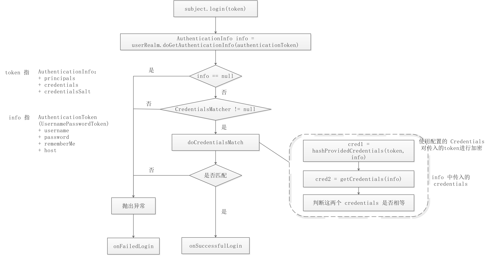

# Spring+Shiro+Redis

## 引入依赖

+ Spring相关

  + spring-context

  + spring-webmvc

+ Shiro相关

  + shiro-core

  + shiro-spring，整合spring包

+ Redis相关

  + spring-data-redis

  + lettuce-core

## 配置文件

### 配置 `WEB-INF/web.xml`

+ springMVC
  + 使用 servlet，并设置 `init-param` 以及 `load-on-startup`
+ spring
  + 设置 `context-param` 以及 `listener`
+ shiro
  + 配置 shiroFilter

```xml
<!DOCTYPE web-app PUBLIC
        "-//Sun Microsystems, Inc.//DTD Web Application 2.3//EN"
        "http://java.sun.com/dtd/web-app_2_3.dtd" >

<web-app xmlns="http://java.sun.com/xml/ns/javaee"
         xmlns:xsi="http://www.w3.org/2001/XMLSchema-instance"
         xsi:schemaLocation="http://java.sun.com/xml/ns/javaee
                      http://java.sun.com/xml/ns/javaee/web-app_3_0.xsd"
         version="3.0"
         metadata-complete="true">
    <display-name>Archetype Created Web Application</display-name>

    <!-- SpringMVC -->
    <servlet>
        <servlet-name>springMVC</servlet-name>
        <servlet-class>
            org.springframework.web.servlet.DispatcherServlet
        </servlet-class>
        <init-param>
            <param-name>contextConfigLocation</param-name>
            <param-value>classpath:spring-mvc.xml</param-value>
        </init-param>
        <load-on-startup>1</load-on-startup>
    </servlet>
    <servlet-mapping>
        <servlet-name>springMVC</servlet-name>
        <url-pattern>/</url-pattern>
    </servlet-mapping>

    <!-- Spring -->
    <context-param>
        <param-name>contextConfigLocation</param-name>
        <param-value>classpath:spring-core.xml</param-value>
    </context-param>
    <listener>
        <listener-class>
            org.springframework.web.context.ContextLoaderListener
        </listener-class>
    </listener>

    <!-- Shiro -->
    <filter>
        <filter-name>shiroFilter</filter-name>
        <filter-class>
            org.springframework.web.filter.DelegatingFilterProxy
        </filter-class>
    </filter>
    <filter-mapping>
        <filter-name>shiroFilter</filter-name>
        <url-pattern>/*</url-pattern>
    </filter-mapping>

</web-app>
```

### 配置 `spring-mvc.xml` 

+ 添加包扫描
+ 添加视图解析器

```xml
<?xml version="1.0" encoding="UTF-8"?>
<beans xmlns="http://www.springframework.org/schema/beans"
       xmlns:xsi="http://www.w3.org/2001/XMLSchema-instance"
       xmlns:context="http://www.springframework.org/schema/context"
       xsi:schemaLocation="http://www.springframework.org/schema/beans http://www.springframework.org/schema/beans/spring-beans.xsd http://www.springframework.org/schema/context https://www.springframework.org/schema/context/spring-context.xsd">

    <!-- mvc 包扫描 -->
    <context:component-scan base-package="com.hemou.controller" />

    <!-- 视图解析器 -->
    <bean class="org.springframework.web.servlet.view.InternalResourceViewResolver">
        <property name="prefix" value="/WEB-INF/pages/"/>
        <property name="suffix" value=".jsp"/>
    </bean>
    
    <!-- 启用 shiro 注解 -->
    <bean class="org.springframework.aop.framework.autoproxy.DefaultAdvisorAutoProxyCreator" depends-on="lifecycleBeanPostProcessor"/>

</beans>
```

### 配置 `spring-shiro.xml`

> 因为我们在 `web.xml` 中配置了 shiroFilter
>
> ```xml
> <filter>
>     <filter-name>shiroFilter</filter-name>
>     <filter-class>
>         org.springframework.web.filter.DelegatingFilterProxy
>     </filter-class>
> </filter>
> ```
>
> 因此在 IoC 容器中必须存在一个和 `filter-name` 名字一样的 bean，不然会报错


我们通过 `ShiroFilterFactoryBean` 来创建一个名为 `shiroFilter` 的 bean。

```xml
<?xml version="1.0" encoding="UTF-8"?>
<beans xmlns="http://www.springframework.org/schema/beans"
       xmlns:xsi="http://www.w3.org/2001/XMLSchema-instance"
       xsi:schemaLocation="http://www.springframework.org/schema/beans http://www.springframework.org/schema/beans/spring-beans.xsd">

    <import resource="spring-redis.xml"/>

    <bean id="shiroFilter" class="org.apache.shiro.spring.web.ShiroFilterFactoryBean">
        <property name="securityManager" ref="securityManager"/>
        <property name="loginUrl" value="/login"/>
        <property name="successUrl" value="/index"/>
        <property name="unauthorizedUrl" value="/unauth"/>
        <property name="filterChainDefinitions">
            <value>
                /login = anon
                /logout = logout
                /** = authc
            </value>
        </property>
    </bean>

    <bean id="securityManager" class="org.apache.shiro.web.mgt.DefaultWebSecurityManager">
        <property name="sessionManager" ref="sessionManager"/>
        <property name="realm" ref="userRealm" />
    </bean>

    <bean id="sessionManager" class="org.apache.shiro.web.session.mgt.DefaultWebSessionManager">
        <property name="sessionDAO" ref="sessionDAO"/>
    </bean>

    <bean id="sessionDAO" class="com.hemou.framework.shiro.RedisSessionDAO">
        <property name="redisTemplate" ref="redisTemplate"/>
    </bean>

    <bean id="userRealm" class="com.hemou.framework.shiro.UserRealm">
        <property name="credentialsMatcher">
            <bean class="org.apache.shiro.authc.credential.HashedCredentialsMatcher">
                <property name="hashAlgorithmName" value="MD5"/>
                <property name="hashIterations" value="2"/>
            </bean>
        </property>
    </bean>

    <!-- 启用注解 -->
    <bean class="org.apache.shiro.spring.LifecycleBeanPostProcessor" />
    <bean class="org.apache.shiro.spring.security.interceptor.AuthorizationAttributeSourceAdvisor">
        <property name="securityManager" ref="securityManager"/>
    </bean>

</beans>
```

可能发生的错误：

+ 28-Dec-2023 17:04:02.737 严重 [http-nio-8080-exec-22] org.apache.catalina.core.StandardWrapperValve.invoke 在路径为的上下文中，Servlet[springMVC]的Servlet.service（）引发了具有根本原因的异常Request processing failed; nested exception is org.apache.shiro.authc.AuthenticationException: Authentication failed for token submission [org.apache.shiro.authc.UsernamePasswordToken - admin, rememberMe=false].  Possible unexpected error? (Typical or expected login exceptions should extend from AuthenticationException).
  	java.lang.ClassCastException: [C cannot be cast to java.lang.String
  + 在 UserRealm 中，获取的 `Credentials` 是 `char[]` 类型，不能直接转为 `String`
+ Request processing failed; nested exception is org.apache.shiro.authc.IncorrectCredentialsException: Submitted credentials for token [org.apache.shiro.authc.UsernamePasswordToken - admin, rememberMe=false] did not match the expected credentials.
  + 输入账号密码错误，或者使用 Credentials 加密有问题，比如 salt 不一致
  
+ 配置了 shiro 注解，但是不起效果

  + ```xml
    <bean class="org.springframework.aop.framework.autoproxy.DefaultAdvisorAutoProxyCreator" depends-on="lifecycleBeanPostProcessor"/>
    ```

    上面这个配置要配置 spring-mvc.xml 中

  + ```xml
    <bean class="org.apache.shiro.spring.LifecycleBeanPostProcessor" />
    <bean class="org.apache.shiro.spring.security.interceptor.AuthorizationAttributeSourceAdvisor">
        <property name="securityManager" ref="securityManager"/>
    </bean>
    ```

    上面这两个 bean 可以放在其他地方


### 配置 `spring-redis.xml`

+ 配置 Redis 连接信息
+ 配置 LettuceConnectionFactory
+ 配置 RedisTemplate

```xml
<?xml version="1.0" encoding="UTF-8"?>
<beans xmlns="http://www.springframework.org/schema/beans"
       xmlns:xsi="http://www.w3.org/2001/XMLSchema-instance"
       xmlns:context="http://www.springframework.org/schema/context"
       xsi:schemaLocation="http://www.springframework.org/schema/beans http://www.springframework.org/schema/beans/spring-beans.xsd http://www.springframework.org/schema/context https://www.springframework.org/schema/context/spring-context.xsd">

    <!-- 引入 properties -->
    <context:property-placeholder location="classpath:db.properties"/>

    <!-- 第一步：配置 Redis 连接信息 -->
    <bean id="redisStandaloneConfiguration" class="org.springframework.data.redis.connection.RedisStandaloneConfiguration">
        <property name="hostName" value="${redis.host}"/>
        <property name="port" value="${redis.port}"/>
        <property name="password">
            <bean class="org.springframework.data.redis.connection.RedisPassword">
                <constructor-arg value="${redis.password}"/>
            </bean>
        </property>
        <property name="database" value="${redis.database}"/>
    </bean>

    <!-- 第二步: 配置 LettuceConnectionFactory -->
    <bean id="lettuceConnectionFactory" class="org.springframework.data.redis.connection.lettuce.LettuceConnectionFactory">
        <constructor-arg ref="redisStandaloneConfiguration"/>
    </bean>

    <!-- 第三步：配置 RedisTemplate -->
    <bean id="redisTemplate" class="org.springframework.data.redis.core.RedisTemplate">
        <property name="connectionFactory" ref="lettuceConnectionFactory"/>
        <property name="keySerializer">
            <bean class="org.springframework.data.redis.serializer.StringRedisSerializer"/>
        </property>
        <property name="valueSerializer">
            <bean class="org.springframework.data.redis.serializer.JdkSerializationRedisSerializer"/>
        </property>
    </bean>
</beans>
```

## shiro认证流程



注意：token 中的 credentials 必须是加密过的，因为后面需要调用相应的方法对 credentials 进行解密

## 参考文件

### `RedisCacheManager.java`

```java
import org.apache.shiro.cache.Cache;
import org.apache.shiro.cache.CacheException;
import org.apache.shiro.cache.CacheManager;
import org.springframework.data.redis.core.RedisTemplate;

import java.util.Collection;
import java.util.Set;

@SuppressWarnings({"rawtypes", "unchecked"})
public class RedisCacheManager implements CacheManager {

    private RedisTemplate redisTemplate;

    public void setRedisTemplate(RedisTemplate redisTemplate) {
        this.redisTemplate = redisTemplate;
    }

    @Override
    public <K, V> Cache<K, V> getCache(String s) throws CacheException {
        return new RedisCache<>();
    }

    class RedisCache<K, V> implements Cache<K, V>  {

        private static final String CACHE_KEY = "shiro-cache";

        @Override
        public V get(K k) throws CacheException {
            return (V) redisTemplate.boundHashOps(CACHE_KEY).get(k);
        }

        @Override
        public V put(K k, V v) throws CacheException {
            redisTemplate.boundHashOps(CACHE_KEY).put(k, v);
            return v;
        }

        @Override
        public V remove(K k) throws CacheException {
            V v = get(k);
            redisTemplate.boundHashOps(CACHE_KEY).delete(k);
            return v;
        }

        @Override
        public void clear() throws CacheException {
            redisTemplate.delete(CACHE_KEY);
        }

        @Override
        public int size() {
            Long size = redisTemplate.boundHashOps(CACHE_KEY).size();
            assert size != null;
            return size.intValue();
        }

        @Override
        public Set<K> keys() {
            return redisTemplate.boundHashOps(CACHE_KEY).keys();
        }

        @Override
        public Collection<V> values() {
            return redisTemplate.boundHashOps(CACHE_KEY).values();
        }
    }
}
```

### `RedisSessionDAO.java`

```java
package com.hemou.framework.shiro;

import org.apache.shiro.session.Session;
import org.apache.shiro.session.UnknownSessionException;
import org.apache.shiro.session.mgt.eis.AbstractSessionDAO;
import org.apache.shiro.util.CollectionUtils;
import org.springframework.beans.factory.annotation.Autowired;
import org.springframework.data.redis.core.RedisTemplate;

import java.io.Serializable;
import java.util.Collection;
import java.util.Collections;
import java.util.HashSet;
import java.util.Set;
import java.util.concurrent.TimeUnit;

@SuppressWarnings({"rawtypes", "unchecked"})
public class RedisSessionDAO extends AbstractSessionDAO {

    public static final int DEFAULT_TIMEOUT = 30;
    public static final String SESSION_PREFIX = "shiro-session:";

    private RedisTemplate redisTemplate;

    public void setRedisTemplate(RedisTemplate redisTemplate) {
        this.redisTemplate = redisTemplate;
    }

    private String getKey(Serializable id) {
        return SESSION_PREFIX + id;
    }

    @Override
    protected Serializable doCreate(Session session) {
        Serializable sessionId = this.generateSessionId(session);
        this.assignSessionId(session, sessionId);
        this.storeSession(session);
        return sessionId;
    }

    private void storeSession(Session session) {
        if (session != null && session.getId() != null) {
            redisTemplate.opsForValue().set(getKey(session.getId()), session, DEFAULT_TIMEOUT, TimeUnit.MINUTES);
        }
    }

    @Override
    protected Session doReadSession(Serializable serializable) {
        if (serializable != null) {
            return (Session) redisTemplate.opsForValue().get(getKey(serializable));
        }
        return null;
    }

    @Override
    public void update(Session session) throws UnknownSessionException {
        this.storeSession(session);
    }

    @Override
    public void delete(Session session) {
        if (session != null && session.getId() != null) {
            redisTemplate.delete(getKey(session.getId()));
        }
    }

    @Override
    public Collection<Session> getActiveSessions() {
        Set<Session> values = new HashSet<>();
        Set<byte[]> keys = redisTemplate.keys(SESSION_PREFIX + "*");
        if (!CollectionUtils.isEmpty(keys)) {
            for (byte[] key : keys) {
                values.add((Session) redisTemplate.opsForValue().get(key));
            }
        }
        return values;
    }
}
```

### `UserRealm.java`

```java
package com.hemou.framework.shiro;

import com.hemou.utils.ShiroUtils;
import org.apache.shiro.authc.AuthenticationException;
import org.apache.shiro.authc.AuthenticationInfo;
import org.apache.shiro.authc.AuthenticationToken;
import org.apache.shiro.authc.SimpleAuthenticationInfo;
import org.apache.shiro.authz.AuthorizationInfo;
import org.apache.shiro.authz.SimpleAuthorizationInfo;
import org.apache.shiro.realm.AuthorizingRealm;
import org.apache.shiro.subject.PrincipalCollection;

import java.util.HashSet;
import java.util.Set;

public class UserRealm extends AuthorizingRealm {
    @Override
    protected AuthorizationInfo doGetAuthorizationInfo(PrincipalCollection principalCollection) {
        SimpleAuthorizationInfo authorizationInfo = new SimpleAuthorizationInfo();

        Set<String> roles = new HashSet<>();
        roles.add("admin");
        authorizationInfo.setRoles(roles);

        Set<String> perms = new HashSet<>();
        // perms.add("user:list");
        authorizationInfo.setStringPermissions(perms);

        return authorizationInfo;
    }

    @Override
    protected AuthenticationInfo doGetAuthenticationInfo(AuthenticationToken authenticationToken) throws AuthenticationException {
        String username = (String) authenticationToken.getPrincipal();
        String password = new String((char[]) authenticationToken.getCredentials());

        System.out.println("username: " + username);
        System.out.println("password: " + password);
        if ("admin".equals(username) && "admin".equals(password)) {
            return new SimpleAuthenticationInfo(username, ShiroUtils.md5(password), getName());
        }
        return null;
    }
}
```

### `ShiroUtils.java`

```java
public class ShiroUtils {

    public static String md5(String password) {
        return new Md5Hash(password, null, 2).toString();
    }

    public static Subject getSubject() {
        return SecurityUtils.getSubject();
    }
}
```

