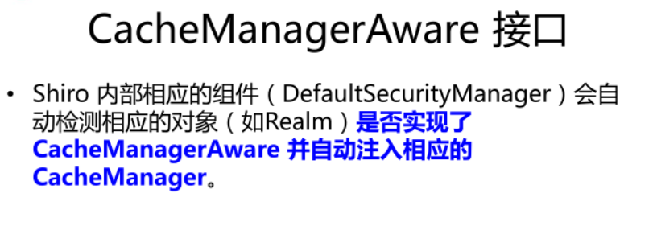

# Spring+Shiro

## 引入依赖

+ spring-context
+ spring-webmvc
+ shiro-core
+ shiro-spring，整合spring包

```xml
<?xml version="1.0" encoding="UTF-8"?>

<project xmlns="http://maven.apache.org/POM/4.0.0" xmlns:xsi="http://www.w3.org/2001/XMLSchema-instance"
  xsi:schemaLocation="http://maven.apache.org/POM/4.0.0 http://maven.apache.org/xsd/maven-4.0.0.xsd">
  <modelVersion>4.0.0</modelVersion>

  <groupId>com</groupId>
  <artifactId>shiro-spring</artifactId>
  <version>1.0-SNAPSHOT</version>
  <packaging>war</packaging>

  <name>shiro-spring Maven Webapp</name>
  <!-- FIXME change it to the project's website -->
  <url>http://www.example.com</url>

  <properties>
    <project.build.sourceEncoding>UTF-8</project.build.sourceEncoding>
    <maven.compiler.source>1.8</maven.compiler.source>
    <maven.compiler.target>1.8</maven.compiler.target>
    <spring.version>4.3.25.RELEASE</spring.version>
  </properties>

  <dependencies>
    <dependency>
      <groupId>junit</groupId>
      <artifactId>junit</artifactId>
      <version>4.11</version>
      <scope>test</scope>
    </dependency>

    <dependency>
      <groupId>org.springframework</groupId>
      <artifactId>spring-test</artifactId>
      <version>${spring.version}</version>
    </dependency>

    <dependency>
      <groupId>org.springframework</groupId>
      <artifactId>spring-core</artifactId>
      <version>${spring.version}</version>
      <exclusions>
        <exclusion>
          <groupId>commons-logging</groupId>
          <artifactId>commons-logging</artifactId>
        </exclusion>
      </exclusions>
    </dependency>

    <dependency>
      <groupId>org.springframework</groupId>
      <artifactId>spring-context</artifactId>
      <version>${spring.version}</version>
    </dependency>

    <dependency>
      <groupId>org.springframework</groupId>
      <artifactId>spring-webmvc</artifactId>
      <version>${spring.version}</version>
    </dependency>

    <dependency>
      <groupId>org.aspectj</groupId>
      <artifactId>aspectjweaver</artifactId>
      <version>1.9.5</version>
    </dependency>

    <!--slf4j-->
    <dependency>
      <groupId>org.slf4j</groupId>
      <artifactId>slf4j-api</artifactId>
      <version>1.7.30</version>
    </dependency>
    <dependency>
      <groupId>org.slf4j</groupId>
      <artifactId>slf4j-log4j12</artifactId>
      <version>1.7.30</version>
    </dependency>
    <dependency>
      <groupId>log4j</groupId>
      <artifactId>log4j</artifactId>
      <version>1.2.17</version>
    </dependency>
    <!--偷天换日包-->
    <dependency>
      <groupId>org.slf4j</groupId>
      <artifactId>jcl-over-slf4j</artifactId>
      <version>1.7.30</version>
    </dependency>

    <!-- json -->
    <dependency>
      <groupId>com.fasterxml.jackson.core</groupId>
      <artifactId>jackson-core</artifactId>
      <version>2.7.3</version>
    </dependency>
    <dependency>
      <groupId>com.fasterxml.jackson.core</groupId>
      <artifactId>jackson-databind</artifactId>
      <version>2.7.3</version>
    </dependency>
    <dependency>
      <groupId>com.fasterxml.jackson.core</groupId>
      <artifactId>jackson-annotations</artifactId>
      <version>2.7.3</version>
    </dependency>

    <dependency>
      <groupId>org.apache.shiro</groupId>
      <artifactId>shiro-all</artifactId>
      <version>1.4.0</version>
    </dependency>
  </dependencies>

  <build>
    <finalName>shiro-spring</finalName>
    <pluginManagement><!-- lock down plugins versions to avoid using Maven defaults (may be moved to parent pom) -->
      <plugins>
        <plugin>
          <artifactId>maven-clean-plugin</artifactId>
          <version>3.1.0</version>
        </plugin>
        <!-- see http://maven.apache.org/ref/current/maven-core/default-bindings.html#Plugin_bindings_for_war_packaging -->
        <plugin>
          <artifactId>maven-resources-plugin</artifactId>
          <version>3.0.2</version>
        </plugin>
        <plugin>
          <artifactId>maven-compiler-plugin</artifactId>
          <version>3.8.0</version>
        </plugin>
        <plugin>
          <artifactId>maven-surefire-plugin</artifactId>
          <version>2.22.1</version>
        </plugin>
        <plugin>
          <artifactId>maven-war-plugin</artifactId>
          <version>3.2.2</version>
        </plugin>
        <plugin>
          <artifactId>maven-install-plugin</artifactId>
          <version>2.5.2</version>
        </plugin>
        <plugin>
          <artifactId>maven-deploy-plugin</artifactId>
          <version>2.8.2</version>
        </plugin>
      </plugins>
    </pluginManagement>

    <resources>
      <resource>
        <directory>src/main/resources</directory>
        <includes>
          <include>**/*.properties</include>
          <include>**/*.xml</include>
          <include>**/*.tld</include>
        </includes>
        <filtering>false</filtering>
      </resource>
      <resource>
        <directory>src/main/java</directory>
        <includes>
          <include>**/*.properties</include>
          <include>**/*.xml</include>
        </includes>
        <filtering>false</filtering>
      </resource>
    </resources>
  </build>
</project>
```

和Shiro有关的就一个

```xml
<dependency>
    <groupId>org.apache.shiro</groupId>
    <artifactId>shiro-all</artifactId>
    <version>1.4.0</version>
</dependency>
```

## 配置

### web.xml

```xml
<filter>
    <filter-name>shiroFilter</filter-name>
    <filter-class>org.springframework.web.filter.DelegatingFilterProxy</filter-class>
</filter>
<filter-mapping>
    <filter-name>shiroFilter</filter-name>
    <url-pattern>/*</url-pattern>
</filter-mapping>
```

### SecurityManager

```xml
<!-- =========================================================
         Shiro Core Components - Not Spring Specific
         ========================================================= -->
<!-- Shiro's main business-tier object for web-enabled applications
         (use DefaultSecurityManager instead when there is no web environment)-->
<!--  
    1. 配置 SecurityManager!
    -->     
<bean id="securityManager" class="org.apache.shiro.web.mgt.DefaultWebSecurityManager">
    <property name="cacheManager" ref="cacheManager"/>
    <property name="authenticator" ref="authenticator"></property>

    <property name="realms">
        <list>
            <ref bean="jdbcRealm"/>
            <ref bean="secondRealm"/>
        </list>
    </property>

    <property name="rememberMeManager.cookie.maxAge" value="10"></property>
</bean>
```

### CacheManager

```xml
<!-- Let's use some enterprise caching support for better performance.  You can replace this with any enterprise
         caching framework implementation that you like (Terracotta+Ehcache, Coherence, GigaSpaces, etc -->
<!--  
    2. 配置 CacheManager. 
    2.1 需要加入 ehcache 的 jar 包及配置文件. 
    -->     
<bean id="cacheManager" class="org.apache.shiro.cache.ehcache.EhCacheManager">
    <!-- Set a net.sf.ehcache.CacheManager instance here if you already have one.  If not, a new one
             will be creaed with a default config:
             <property name="cacheManager" ref="ehCacheManager"/> -->
    <!-- If you don't have a pre-built net.sf.ehcache.CacheManager instance to inject, but you want
             a specific Ehcache configuration to be used, specify that here.  If you don't, a default
             will be used.: -->
    <property name="cacheManagerConfigFile" value="classpath:ehcache.xml"/> 
</bean>
```

### Realm

```xml
<!-- Used by the SecurityManager to access security data (users, roles, etc).
         Many other realm implementations can be used too (PropertiesRealm,
         LdapRealm, etc. -->
<!-- 
     3. 配置 Realm 
     3.1 直接配置实现了 org.apache.shiro.realm.Realm 接口的 bean
    -->     
<bean id="jdbcRealm" class="com.atguigu.shiro.realms.ShiroRealm">
    <property name="credentialsMatcher">
        <bean class="org.apache.shiro.authc.credential.HashedCredentialsMatcher">
            <property name="hashAlgorithmName" value="MD5"></property>
            <property name="hashIterations" value="1024"></property>
        </bean>
    </property>
</bean>
```

### lifecycleBeanPostProcessor

```xml
<!-- =========================================================
         Shiro Spring-specific integration
         ========================================================= -->
<!-- Post processor that automatically invokes init() and destroy() methods
         for Spring-configured Shiro objects so you don't have to
         1) specify an init-method and destroy-method attributes for every bean
            definition and
         2) even know which Shiro objects require these methods to be
            called. -->
<!--  
    4. 配置 LifecycleBeanPostProcessor. 可以自定的来调用配置在 Spring IOC 容器中 shiro bean 的生命周期方法. 
    -->       
<bean id="lifecycleBeanPostProcessor" class="org.apache.shiro.spring.LifecycleBeanPostProcessor"/>
```

### Shiro注解

```xml
<!-- Enable Shiro Annotations for Spring-configured beans.  Only run after
     the lifecycleBeanProcessor has run: -->
<!--  
5. 启用 IOC 容器中使用 shiro 的注解. 但必须在配置了 LifecycleBeanPostProcessor 之后才可以使用. 
-->     
<bean class="org.springframework.aop.framework.autoproxy.DefaultAdvisorAutoProxyCreator"
      depends-on="lifecycleBeanPostProcessor"/>
<bean class="org.apache.shiro.spring.security.interceptor.AuthorizationAttributeSourceAdvisor">
    <property name="securityManager" ref="securityManager"/>
</bean>
```
### shiroFilter

```xml
<!-- Define the Shiro Filter here (as a FactoryBean) instead of directly in web.xml -
         web.xml uses the DelegatingFilterProxy to access this bean.  This allows us
         to wire things with more control as well utilize nice Spring things such as
         PropertiesPlaceholderConfigurer and abstract beans or anything else we might need: -->
<!--  
    6. 配置 ShiroFilter. 
    6.1 id 必须和 web.xml 文件中配置的 DelegatingFilterProxy 的 <filter-name> 一致.
                      若不一致, 则会抛出: NoSuchBeanDefinitionException. 因为 Shiro 会来 IOC 容器中查找和 <filter-name> 名字对应的 filter bean.
    -->     
<bean id="shiroFilter" class="org.apache.shiro.spring.web.ShiroFilterFactoryBean">
    <property name="securityManager" ref="securityManager"/>
    <property name="loginUrl" value="/login.jsp"/>
    <property name="successUrl" value="/list.jsp"/>
    <property name="unauthorizedUrl" value="/unauthorized.jsp"/>

    <property name="filterChainDefinitionMap" ref="filterChainDefinitionMap"></property>

    <!--  
         配置哪些页面需要受保护. 
         以及访问这些页面需要的权限. 
         1). anon 可以被匿名访问
         2). authc 必须认证(即登录)后才可能访问的页面. 
         3). logout 登出.
         4). roles 角色过滤器
        -->
    <!--  
        <property name="filterChainDefinitions">
            <value>
                /login.jsp = anon
                /shiro/login = anon
                /shiro/logout = logout

                /user.jsp = roles[user]
                /admin.jsp = roles[admin]

                # everything else requires authentication:
                /** = authc
            </value>
        </property>
        -->
</bean>
```
#### 注意

`bean`的名字必须和web.xml中的`DelegatingFilterProxy`的filter名字一致，否则会报错

因为在`DelegatingFilterProxy`中有如下说明

```
Proxy for a standard Servlet Filter, delegating to a Spring-managed bean that
* implements the Filter interface. Supports a "targetBeanName" filter init-param
* in {@code web.xml}, specifying the name of the target bean in the Spring
* application context.
*
* <p>{@code web.xml} will usually contain a {@code DelegatingFilterProxy} definition,
* with the specified {@code filter-name} corresponding to a bean name in
* Spring's root application context. All calls to the filter proxy will then
* be delegated to that bean in the Spring context, which is required to implement
* the standard Servlet Filter interface.
```

## 授权URL匹配


## 认证

### 步骤

1. 获取当前的 Subject. 调用 SecurityUtils.getSubject();
2. 测试当前的用户是否已经被认证. 即是否已经登录. 调用 Subject 的 isAuthenticated() 
3. 若没有被认证, 则把用户名和密码封装为 UsernamePasswordToken 对象
1). 创建一个表单页面
2). 把请求提交到 SpringMVC 的 Handler
3). 获取用户名和密码. 
4. 执行登录: 调用 Subject 的 login(AuthenticationToken) 方法. 
5. 自定义 Realm 的方法, 从数据库中获取对应的记录, 返回给 Shiro.
1). 实际上需要继承 org.apache.shiro.realm.AuthenticatingRealm 类
2). 实现 doGetAuthenticationInfo(AuthenticationToken) 方法. 
6. 由 shiro 完成对密码的比对. 

**AccountController**

```java
@Controller
@RequestMapping("/shiro")
public class AccountController {

    @RequestMapping("/login")
    public String login(@RequestParam("username")String username
            , @RequestParam("password") String password){
        Subject currentUser = SecurityUtils.getSubject();
        if(!currentUser.isAuthenticated()){
            UsernamePasswordToken token = new UsernamePasswordToken(username, password);
            token.setRememberMe(true);
            try{
                currentUser.login(token);
                System.out.println("toke: 1." + token);
            }catch (AuthenticationException e){
                System.out.println("登录失败:" + e.getMessage());
            }
        }
        return "redirect:success";
    }
}
```

**ShiroRealm**

```java
public class ShiroRealm extends AuthenticatingRealm {

    @Override
    protected AuthenticationInfo doGetAuthenticationInfo(AuthenticationToken token) throws AuthenticationException {
        //1. 把 AuthenticationToken 转换为 UsernamePasswordToken 
        UsernamePasswordToken upToken = (UsernamePasswordToken) token;

        //2. 从 UsernamePasswordToken 中来获取 username
        String username = upToken.getUsername();

        //3. 调用数据库的方法, 从数据库中查询 username 对应的用户记录
        System.out.println("从数据库中获取 username: " + username + " 所对应的用户信息.");

        //4. 若用户不存在, 则可以抛出 UnknownAccountException 异常
        if("unknown".equals(username)){
            throw new UnknownAccountException("用户不存在!");
        }

        //5. 根据用户信息的情况, 决定是否需要抛出其他的 AuthenticationException 异常. 
        if("monster".equals(username)){
            throw new LockedAccountException("用户被锁定");
        }

        //6. 根据用户的情况, 来构建 AuthenticationInfo 对象并返回. 通常使用的实现类为: SimpleAuthenticationInfo
        //以下信息是从数据库中获取的.
        //1). principal: 认证的实体信息. 可以是 username, 也可以是数据表对应的用户的实体类对象. 
        Object principal = username;
        //2). credentials: 密码. 
        Object credentials = null; //"fc1709d0a95a6be30bc5926fdb7f22f4";
        if("admin".equals(username)){
            credentials = "038bdaf98f2037b31f1e75b5b4c9b26e";
        }else if("user".equals(username)){
            credentials = "098d2c478e9c11555ce2823231e02ec1";
        }

        //3). realmName: 当前 realm 对象的 name. 调用父类的 getName() 方法即可
        String realmName = getName();
        //4). 盐值. 
        ByteSource credentialsSalt = ByteSource.Util.bytes(username);

        SimpleAuthenticationInfo info = null; //new SimpleAuthenticationInfo(principal, credentials, realmName);
        info = new SimpleAuthenticationInfo(principal, credentials, credentialsSalt, realmName);
        return info;
    }
}
```

### 盐值

```java
ByteSource credentialsSalt = ByteSource.Util.bytes(username);
```

## 密码比对

密码的比对:
通过 AuthenticatingRealm 的 credentialsMatcher 属性来进行的密码的比对!

## 替换加密方式

### 加密前端密码

1. 如何把前台传递的字符串加密为 MD5 
2. 替换当前 Realm 的 credentialsMatcher 属性. 直接使用 HashedCredentialsMatcher 对象, 并设置加密算法即可. 

```xml
<bean id="jdbcRealm" class="com.hemou.shiro.ShiroRealm">
    <property name="credentialsMatcher">
        <bean class="org.apache.shiro.authc.credential.HashedCredentialsMatcher">
            <!--加密算法-->
            <property name="hashAlgorithmName" value="MD5"/>
            <!--加密次数-->
            <property name="hashIterations" value="1024"/>
        </bean>
    </property>
</bean>
```

### 加密明文密码

#### MD5加密

```java
public static void main(String[] args) {
    String hashAlgorithmName = "MD5";
    Object credentials = "123456";
    Object salt = ByteSource.Util.bytes("user");;
    int hashIterations = 1024;

    Object result = new SimpleHash(hashAlgorithmName, credentials, salt, hashIterations);
    System.out.println(result);
}
```

#### SHA1加密

只需要改一下加密算法即可

```java
public static void main(String[] args) {
    String hashAlgorithmName = "MD5";
    Object credentials = "123456";
    Object salt = ByteSource.Util.bytes("user");;
    int hashIterations = 1024;

    Object result = new SimpleHash(hashAlgorithmName, credentials, salt, hashIterations);
    System.out.println(result);
}
```


## 多Realm

1. 首先创建一个新的Realm

```java
public class SecondRealm extends AuthenticatingRealm {

    @Override
    protected AuthenticationInfo doGetAuthenticationInfo(AuthenticationToken token) throws AuthenticationException {
        System.out.println("[SecondRealm]");
```

2. 在springContext中配置新的Realm

```xml
<bean id="secondRealm" class="com.hemou.shiro.SecondRealm">
    <property name="credentialsMatcher">
        <bean class="org.apache.shiro.authc.credential.HashedCredentialsMatcher">
            <!--加密算法-->
            <property name="hashAlgorithmName" value="SHA1"/>
            <!--加密次数-->
            <property name="hashIterations" value="1024"/>
        </bean>
    </property>
</bean>
```

3. 配置认证器ModularRealmAuthenticator

```xml
<bean class="org.apache.shiro.authc.pam.ModularRealmAuthenticator">
  <property name="realms">
    <list>
      <ref bean="jdbcRealm"/>
      <ref bean="secondRealm"/>
    </list>
  </property>
</bean>
```

4. 修改securityManager

添加`authenticator`属性，移除`realms`属性

```xml
<bean id="securityManager" class="org.apache.shiro.web.mgt.DefaultWebSecurityManager">
    <property name="cacheManager" ref="cacheManager"/>
    <property name="authenticator" ref="authenticator"/>
</bean>
```

==或者==修改第三步，不在`ModularRealmAuthenticator`中配置Realms，而是在securityManager中配置

```xml
<bean id="securityManager" class="org.apache.shiro.web.mgt.DefaultWebSecurityManager">
    <property name="cacheManager" ref="cacheManager"/>
    <property name="authenticator" ref="authenticator"/>
    <property name="realms">
        <list>
            <ref bean="jdbcRealm"/>
            <ref bean="secondRealm"/>
        </list>
    </property>
</bean>
```


## 认证策略


### 修改Authenticator认证器

```xml
<bean id="authenticator" class="org.apache.shiro.authc.pam.ModularRealmAuthenticator">
    <property name="realms">
        <list>
            <ref bean="jdbcRealm"/>
            <ref bean="secondRealm"/>
        </list>
    </property>
    <property name="authenticationStrategy">
        <bean class="org.apache.shiro.authc.pam.AllSuccessfulStrategy"/>
    </property>
</bean>
```

## 授权方式


## 拦截器


### 身份相关的过滤器


## 授权

首先继承`AuthorizingRealm`类，然后实现`doGetAuthorizationInfo`方法

```java
@Override
protected AuthorizationInfo doGetAuthorizationInfo(PrincipalCollection principals) {
    System.out.println("认证中...");
    Set<String> roles = new HashSet<>();
    roles.add("user");
    Object principal = principals.getPrimaryPrincipal();
    if("admin".equals(principal)){
        roles.add("admin");
    }
    SimpleAuthorizationInfo info = new SimpleAuthorizationInfo(roles);
    return info;
}
```


## 标签

```html
<shiro:guest>
    游客访问 <a href = "login.jsp"></a>
</shiro:guest>
 
user 标签：用户已经通过认证\记住我 登录后显示响应的内容
<shiro:user>
    欢迎[<shiro:principal/>]登录 <a href = "logout">退出</a>
</shiro:user>
 
authenticated标签：用户身份验证通过，即 Subjec.login 登录成功 不是记住我登录的
<shiro:authenticted>
    用户[<shiro:principal/>] 已身份验证通过
</shiro:authenticted>
 
notAuthenticated标签：用户未进行身份验证，即没有调用Subject.login进行登录,包括"记住我"也属于未进行身份验证
<shiro:notAuthenticated>
    未身份验证(包括"记住我")
</shiro:notAuthenticated>
 
 
principal 标签：显示用户身份信息，默认调用
Subjec.getPrincipal()获取，即Primary Principal
<shiro:principal property = "username"/>
 
hasRole标签：如果当前Subject有角色将显示body体内的内容
<shiro:hashRole name = "admin">
    用户[<shiro:principal/>]拥有角色admin
</shiro:hashRole>
 
hasAnyRoles标签：如果Subject有任意一个角色(或的关系)将显示body体里的内容
<shiro:hasAnyRoles name = "admin,user">
    用户[<shiro:pricipal/>]拥有角色admin 或者 user
</shiro:hasAnyRoles>
 
lacksRole:如果当前 Subjec没有角色将显示body体内的内容
<shiro:lacksRole name = "admin">
    用户[<shiro:pricipal/>]没有角色admin
</shiro:lacksRole>
 
hashPermission:如果当前Subject有权限将显示body体内容
<shiro:hashPermission name = "user:create">
    用户[<shiro:pricipal/>] 拥有权限user:create
</shiro:hashPermission>
 
lacksPermission:如果当前Subject没有权限将显示body体内容
<shiro:lacksPermission name = "org:create">
    用户[<shiro:pricipal/>] 没有权限org:create
</shiro:lacksPermission>
```

## 注解

```java
@RequiresAuthenthentication:表示当前Subject已经通过login进行身份验证;即 Subjec.isAuthenticated()返回 true
 
@RequiresUser:表示当前Subject已经身份验证或者通过记住我登录的,
 
@RequiresGuest:表示当前Subject没有身份验证或者通过记住我登录过，即是游客身份
 
@RequiresRoles(value = {"admin","user"},logical = Logical.AND):表示当前Subject需要角色admin和user
 
@RequiresPermissions(value = {"user:delete","user:b"},logical = Logical.OR):表示当前Subject需要权限user:delete或者user:b
```

## 从数据库中初始化权限

如果权限设置过多，一个一个在xml会显得是非的麻烦，因此我们可以通过数据库获取这些信息。

因为`filterChainDefinitions`对应的是一个Map，所以我们通过spring的factory-bean就可以创建一个map

1. 首先创建Map工厂

```java
public class FilterChainDefinitionMapBuilder {

    public LinkedHashMap<String, String> buildFilter(){
        LinkedHashMap<String, String> map = new LinkedHashMap<>();

        map.put("/login.jsp", "anon");
        map.put("/shiro/login", "anon");
        map.put("/logout", "logout");
        map.put("/admin*", "roles[admin]");
        map.put("/user*", "roles[user]");
        map.put("/**", "authc");
        return map;
    }
}
```

2. 然后再把这个工厂交给spring管理

```xml
<bean id="chainDefinitionMapBuilder" class="com.hemou.shiro.FilterChainDefinitionMapBuilder"/>
```

3. 接着通过factory-bean创建这个Map

```xml
<bean id="chainDefinitionMap" factory-bean="chainDefinitionMapBuilder" factory-method="buildFilter"/>
```

4. 最后将这个map交给filter

```xml
<bean id="shiroFilter" class="org.apache.shiro.spring.web.ShiroFilterFactoryBean">
    <property name="securityManager" ref="securityManager"/>
    <property name="loginUrl" value="/login.jsp"/>
    <property name="successUrl" value="/success.jsp"/>
    <property name="unauthorizedUrl" value="/unauthorized.jsp"/>
    <!-- map -->
    <property name="filterChainDefinitionMap" ref="chainDefinitionMap"/>
</bean>
```

## 会话管理

Shiro 提供了完整的企业级会话管理功能，不依赖于底层容器（如web容器tomcat )，不管JavaSE还是JavaEE环境都可以使用，提供了会话管理、会话事件监听、会话存储/持久化、容器无关的集群、失效/过期支持、对Web的透明支持、SSO单点登录的支持等特性。

### 会话相关的 API


+ `Subject.getSession()`：即可获取会话；其等价于Subject.getSession(true)，即如果当前没有创建 Session 对象会创建一个；Subject.getSession(false)，如果当前没有创建 Session则返回null
+ `session.getId()`：获取当前会话的唯一标识
+ `session.getHost()`：获取当前Subject的主机地址
+ `session.getTimeout() & session.setTimeout(毫秒)`：获取/设置当前Session的过期时间
+ `session.getStartTimestamp() & session.getLastAccessTime()`：获取会话的启动时间及最后访问时间；如果是 JavaSE 应用需要自己定期调用 session.touch() 去更新最后访问时间；如果是 Web 应用，每次进入 ShiroFilter 都会自动调用 session.touch() 来更新最后访问时间。
+ `session.touch() & session.stop()`：更新会话最后访问时间及销毁会话；当Subject.logout()时会自动调用 stop 方法来销毁会话。如果在web中，调用 HttpSession. invalidate()也会自动调用Shiro Session.stop 方法进行销毁Shiro 的会话
+ `session.setAttribute(key, val) &session.getAttribute(key) &session.removeAttribute(key)`：设置/获取/删除会话属性；在整个会话范围内都可以对这些属性进行操作

### 会话验证


### 会话监听器


## SessionDao


+  AbstractSessionDAO 提供了 SessionDAO 的基础实现，如生成会话ID等
+ CachingSessionDAO 提供了对开发者透明的会话缓存的功能，需要设置相应的 CacheManager
+ MemorySessionDAO 直接在内存中进行会话维护
+ EnterpriseCacheSessionDAO 提供了缓存功能的会话维护，默认情况下使用 MapCache 实现，内部使用ConcurrentHashMap 保存缓存的会话。

### 配置

```xml
<!--Session ID 生成器-->
<bean id="sessionIdGenerator" class="org.apache.shiro.session.mgt.eis.JavaUuidSessionIdGenerator"/>

<!--SessionDao 继承 EnterpriseCacheSessionDAO-->
<bean id="sessionDao" class="com.hemou.shiro.MySessionDao">
    <property name="activeSessionsCacheName" value="shiro-activeSessionCache"/>
    <property name="sessionIdGenerator" ref="sessionIdGenerator"/>
</bean>

<!--会话管理器-->
<bean class="org.apache.shiro.session.mgt.DefaultSessionManager">
    <property name="globalSessionTimeout" value="1800000"/>
    <property name="deleteInvalidSessions" value="true"/>
    <property name="sessionValidationSchedulerEnabled" value="true"/>
    <property name="sessionDAO" ref="sessionDao"/>
</bean>
```

可以在ehcache.xml中配置其他信息，如下

```xml
<cache name="shiro-activeSessionCache"
       maxEntriesLocalHeap="2000"
       eternal="false"
       timeToIdleSeconds="3600"
       timeToLiveSeconds="0"
       overflowToDisk="false"
       statistics="true">
</cache>
```

### Session序列化

想要把Session存储到数据库中，首先要序列化


### 增删改查


## 缓存

### CacheManagerAware接口



### Realm缓存


### Session缓存


在本案例项目中，就是CacheManager的配置，如下

```xml
<bean id="cacheManager" class="org.apache.shiro.cache.ehcache.EhCacheManager">
    <property name="cacheManagerConfigFile" value="classpath:ehcache.xml"/>
</bean>
```

如果我们将他去掉后，每次访问一个页面都要进行一次验证

而且我们也可以在Realm中单独的配置缓存管理器


## 记住我

### 概述


### 认证和记住我


### 实现


### 配置


```xml
<bean id="securityManager" class="org.apache.shiro.web.mgt.DefaultWebSecurityManager">
    <property name="cacheManager" ref="cacheManager"/>
    <property name="authenticator" ref="authenticator"/>
    <property name="realms">
        <list>
            <ref bean="jdbcRealm"/>
            <ref bean="secondRealm"/>
        </list>
    </property>
    <property name="rememberMeManager.cookie.maxAge" value="10"></property>
</bean>
```