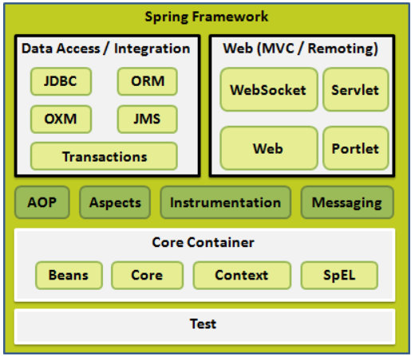
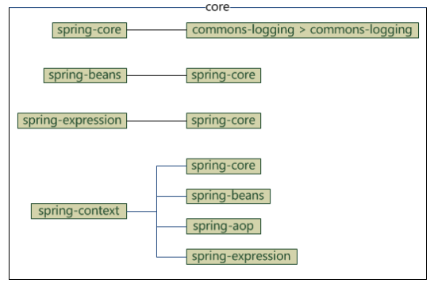
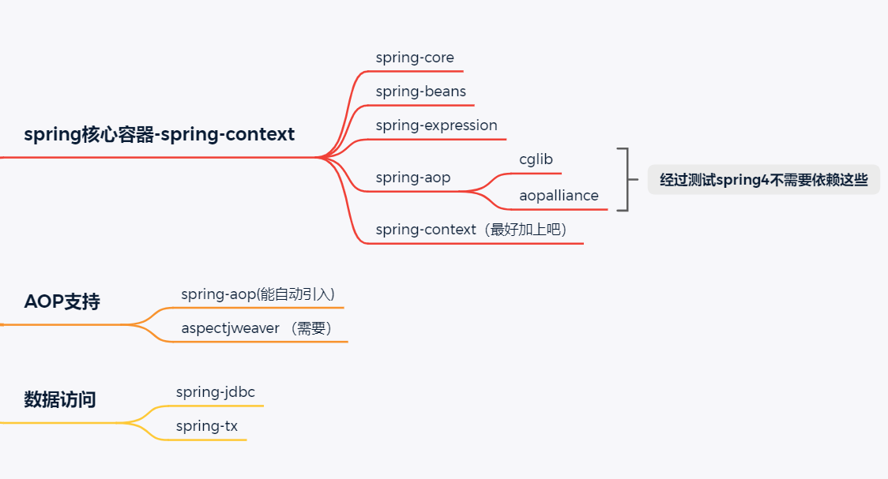

[toc]

# Spring 笔记

# 一、概述

## 1、简介

>Spring 是最受欢迎的企业级 Java 应用程序开发框架，数以百万的来自世界各地的开发人员使用 Spring 框架来创建性能好、易于测试、可重用的代码。

> Spring 框架是一个开源的 Java 平台，它最初是由 Rod Johnson 编写的，并且于 2003 年 6 月首次在 Apache 2.0 许可下发布。

> Spring 是轻量级的框架，其基础版本只有 2 MB 左右的大小。

> Spring 框架的核心特性是可以用于开发任何 Java 应用程序，但是在 Java EE 平台上构建 web 应用程序是需要扩展的。 Spring 框架的目标是使 J2EE 开发变得更容易使用，通过启用基于 POJO 编程模型来促进良好的编程实践。

## 2、spring核心部分

**（1）aop：面向切片变成，拓展功能不是修改源代码实现**

​	Spring 框架的一个关键组件是**面向方面的程序设计（AOP）**框架。一个程序中跨越多个点的功能被称为**横切关注点**，这些横切关注点在概念上独立于应用程序的业务逻辑。有各种各样常见的很好的关于方面的例子，比如日志记录、声明性事务、安全性，和缓存等等。

​	在 OOP 中模块化的关键单元是类，而在 AOP 中模块化的关键单元是方面。AOP 帮助你将横切关注点从它们所影响的对象中分离出来，然而依赖注入帮助你将你的应用程序对象从彼此中分离出来。

Spring 框架的 AOP 模块提供了面向方面的程序设计实现，可以定义诸如方法拦截器和切入点等，从而使实现功能的代码彻底的解耦出来。使用源码级的元数据，可以用类似于.Net属性的方式合并行为信息到代码中。我将在一个独立的章节中讨论更多关于 [Spring AOP](https://www.w3cschool.cn/wkspring/izae1h9w.html) 的概念。

**（2）ioc：控制反转，把对象的创建交给spring配置来实现**

​	Spring 最认同的技术是控制反转的**依赖注入（DI）**模式。控制反转（IoC）是一个通用的概念，它可以用许多不同的方式去表达，依赖注入仅仅是控制反转的一个具体的例子。

​	当编写一个复杂的 Java 应用程序时，应用程序类应该尽可能的独立于其他的 Java 类来增加这些类可重用可能性，当进行单元测试时，可以使它们独立于其他类进行测试。依赖注入（或者有时被称为配线）有助于将这些类粘合在一起，并且在同一时间让它们保持独立。

​	到底什么是依赖注入？让我们将这两个词分开来看一看。这里将依赖关系部分转化为两个类之间的关联。例如，类 A 依赖于类 B。现在，让我们看一看第二部分，注入。所有这一切都意味着类 B 将通过 IoC 被注入到类 A 中。

​	依赖注入可以以向构造函数传递参数的方式发生，或者通过使用 setter 方法 post-construction。由于依赖注入是 Spring 框架的核心部分，所以我将在一个单独的章节中利用很好的例子去解释这一概念。

## 3、spring的体系结构

### 1 核心容器

​	核心容器由**spring-core，spring-beans，spring-context，spring-context-support和spring-expression**（SpEL，Spring表达式语言，Spring Expression Language）等模块组成

- **spring-core**模块提供了框架的基本组成部分，包括 IoC 和依赖注入功能。
- **spring-beans** 模块提供 BeanFactory，工厂模式的微妙实现，它移除了编码式单例的需要，并且可以把配置和依赖从实际编码逻辑中解耦。
- **context**模块建立在由**core**和 **beans** 模块的基础上建立起来的，它以一种类似于JNDI注册的方式访问对象。Context模块继承自Bean模块，并且添加了国际化（比如，使用资源束）、事件传播、资源加载和透明地创建上下文（比如，通过Servelet容器）等功能。Context模块也支持Java EE的功能，比如EJB、JMX和远程调用等。**ApplicationContext**接口是Context模块的焦点。**spring-context-support**提供了对第三方库集成到Spring上下文的支持，比如缓存（EhCache, Guava, JCache）、邮件（JavaMail）、调度（CommonJ, Quartz）、模板引擎（FreeMarker, JasperReports, Velocity）等。
- **spring-expression**模块提供了强大的表达式语言，用于在运行时查询和操作对象图。它是JSP2.1规范中定义的统一表达式语言的扩展，支持set和get属性值、属性赋值、方法调用、访问数组集合及索引的内容、逻辑算术运算、命名变量、通过名字从Spring IoC容器检索对象，还支持列表的投影、选择以及聚合等。

​	它们的完整依赖关系如下图所示：

如果是maven项目的话可以只引入`spring-context`，maven会自动引入其他的依赖

### 2 数据访问/集成

数据访问/集成层包括 JDBC，ORM，OXM，JMS 和事务处理模块，它们的细节如下：

（注：JDBC=Java Data Base Connectivity，ORM=Object Relational Mapping，OXM=Object XML Mapping，JMS=Java Message Service）

- **JDBC** 模块提供了JDBC抽象层，它消除了冗长的JDBC编码和对数据库供应商特定错误代码的解析。
- **ORM** 模块提供了对流行的对象关系映射API的集成，包括JPA、JDO和Hibernate等。通过此模块可以让这些ORM框架和spring的其它功能整合，比如前面提及的事务管理。
- **OXM** 模块提供了对OXM实现的支持，比如JAXB、Castor、XML Beans、JiBX、XStream等。
- **JMS** 模块包含生产（produce）和消费（consume）消息的功能。从Spring 4.1开始，集成了spring-messaging模块。。
- **事务**模块为实现特殊接口类及所有的 POJO 支持编程式和声明式事务管理。（注：编程式事务需要自己写beginTransaction()、commit()、rollback()等事务管理方法，声明式事务是通过注解或配置由spring自动处理，编程式事务粒度更细）

### 3 Web

Web 层由 Web，Web-MVC，Web-Socket 和 Web-Portlet 组成，它们的细节如下：

- **Web** 模块提供面向web的基本功能和面向web的应用上下文，比如多部分（multipart）文件上传功能、使用Servlet监听器初始化IoC容器等。它还包括HTTP客户端以及Spring远程调用中与web相关的部分。。
- **Web-MVC** 模块为web应用提供了模型视图控制（MVC）和REST Web服务的实现。Spring的MVC框架可以使领域模型代码和web表单完全地分离，且可以与Spring框架的其它所有功能进行集成。
- **Web-Socket** 模块为 WebSocket-based 提供了支持，而且在 web 应用程序中提供了客户端和服务器端之间通信的两种方式。
- **Web-Portlet** 模块提供了用于Portlet环境的MVC实现，并反映了spring-webmvc模块的功能。

### 4 其他

还有其他一些重要的模块，像 [AOP](https://www.w3cschool.cn/wkspring/izae1h9w.html)，Aspects，Instrumentation，Web 和测试模块，它们的细节如下：

- **AOP** 模块提供了面向方面的编程实现，允许你定义方法拦截器和切入点对代码进行干净地解耦，从而使实现功能的代码彻底的解耦出来。使用源码级的元数据，可以用类似于.Net属性的方式合并行为信息到代码中。
- **Aspects** 模块提供了与 **AspectJ** 的集成，这是一个功能强大且成熟的面向切面编程（AOP）框架。
- **Instrumentation** 模块在一定的应用服务器中提供了类 instrumentation 的支持和类加载器的实现。
- **Messaging** 模块为 STOMP 提供了支持作为在应用程序中 WebSocket 子协议的使用。它也支持一个注解编程模型，它是为了选路和处理来自 WebSocket 客户端的 STOMP 信息。
- **测试**模块支持对具有 JUnit 或 TestNG 框架的 Spring 组件的测试。

### 5 环境搭建

