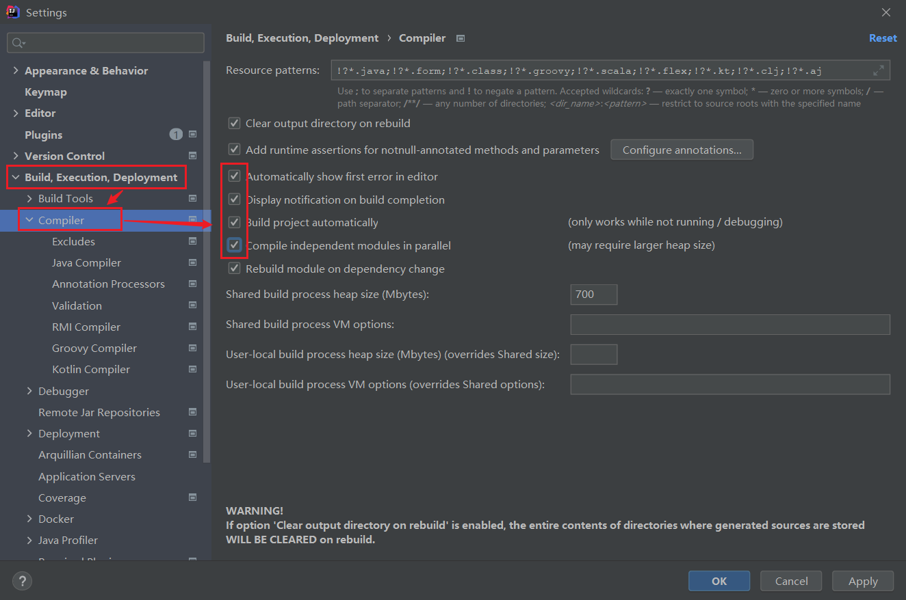
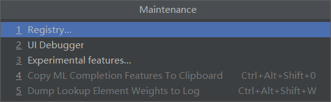
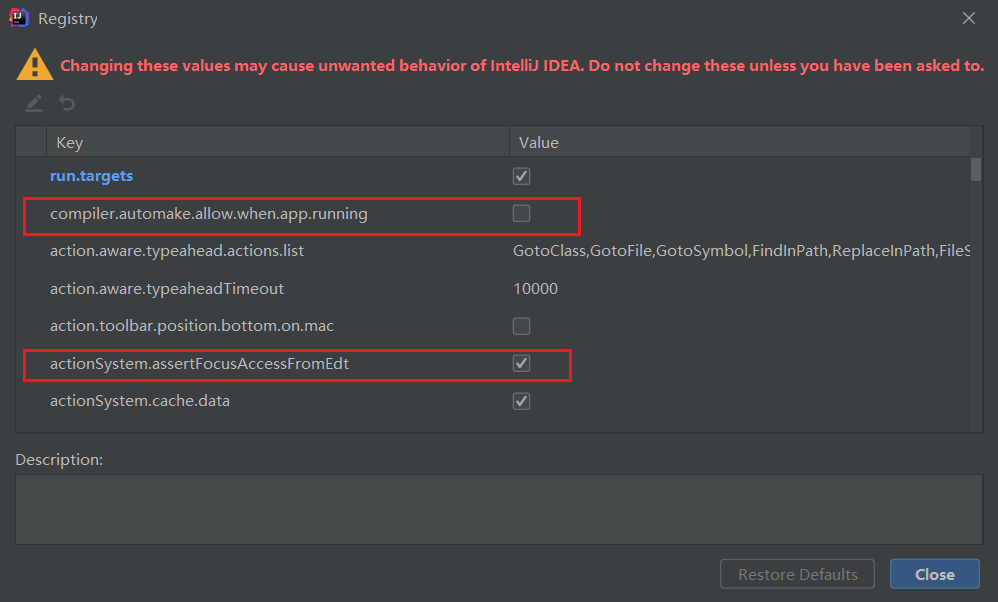

# SpringBoot热部署


## 开启热部署 

1. 添加devtools到maven依赖中

```xml
<!--devtools-->
<dependency>
    <groupId>org.springframework.boot</groupId>
    <artifactId>spring-boot-devtools</artifactId>
</dependency>
```

2. 添加依赖

```xml
<build>
    <plugins>
        <plugin>
            <groupId>org.springframework.boot</groupId>
            <artifactId>spring-boot-maven-plugin</artifactId>
            <configuration>
                <fork>true</fork>
                <addResources>true</addResources>
            </configuration>
        </plugin>
    </plugins>
</build>
```

3. 开启自动编译选项



4. 修改配置

首先按住快捷键`ctrl+shift+alt+/`，然后选择registry



勾选



