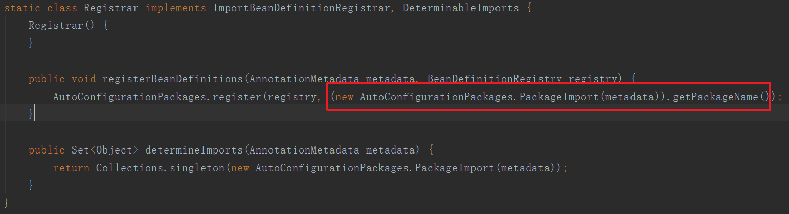
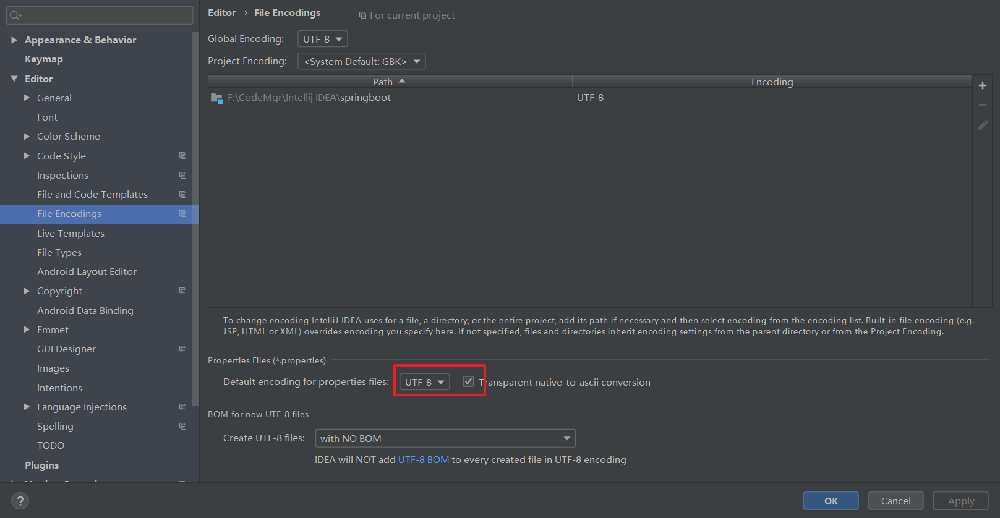
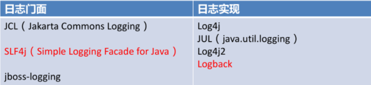
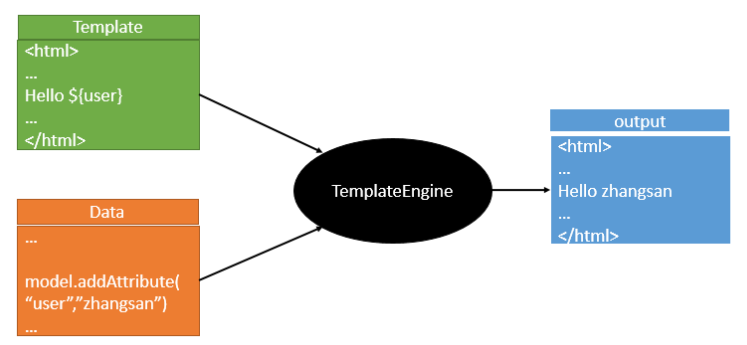
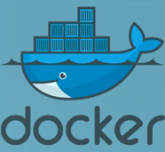
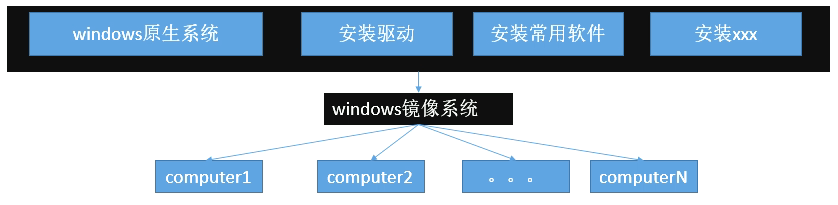
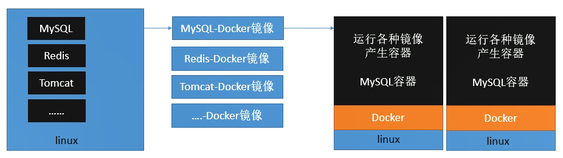
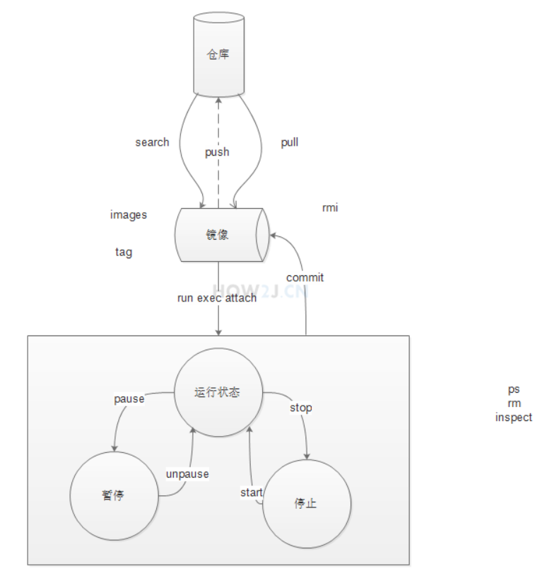
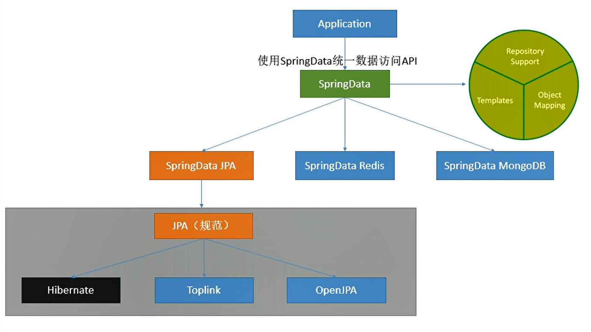

[TOC]

# 一、SpringBoot入门

## 1、简介

> 简化Spring应用开发的一个框架；
>
> 整个Spring技术栈的一个大整合；
>
> J2EE开发的一站式解决方案；

## 2、POM文件

### 2.1 父项目

```xml
<!-- 父项目 -->
<parent>    
    <groupId>org.springframework.boot</groupId>    			
    <artifactId>spring-boot-starter-parent</artifactId>  
    <version>2.2.1.RELEASE</version>    
    <relativePath/> <!-- lookup parent from repository -->
</parent>

<!-- 祖父项目 -->
<!-- 包含了所有的依赖及其版本信息 -->
<parent>
    <groupId>org.springframework.boot</groupId>
    <artifactId>spring-boot-dependencies</artifactId>
    <version>2.2.1.RELEASE</version>
    <relativePath>../../spring-boot-dependencies</relativePath>
</parent>
```

所以以后导入依赖就不需要写版本信息

### 2.2 依赖的导入

直接引入场景依赖就行，也就是添加场景启动器，其会自动导入相应的jar包，例如

```xml
<dependency>    
    <groupId>org.springframework.boot</groupId>    
    <artifactId>spring-boot-starter-web</artifactId>
</dependency>
```

所以spring boot它将所有的场景给提取出来，做成一个个启动器，需要什么就引入这些启动器就可以

完成某项功能。

### 2.3 主方法

```java
@SpringBootApplication
public class SpringbootApplication {    
    public static void main(String[] args) {
        SpringApplication.run(SpringbootApplication.class, args);    
    }
}
```

点进**@SpringBootApplication**，如下

```java
@Target({ElementType.TYPE})
@Retention(RetentionPolicy.RUNTIME)
@Documented
@Inherited
@SpringBootConfiguration
@EnableAutoConfiguration
@ComponentScan(
    excludeFilters = {@Filter(
    type = FilterType.CUSTOM,
    classes = {TypeExcludeFilter.class}
), @Filter(
    type = FilterType.CUSTOM,
    classes = {AutoConfigurationExcludeFilter.class}
)}
)
public @interface SpringBootApplication {
```

在这里**@SpringBootConfiguration**代表的是本类是springboot的的配置类，定义如下

```java
@Target({ElementType.TYPE})
@Retention(RetentionPolicy.RUNTIME)
@Documented
@Configuration
public @interface SpringBootConfiguration {
```

**@Configuration**：标注此类是一个配置类，且配置也是容器中的一个组件

**@EnableAutoConfiguration**：表示开启自动配置，将一些组件自动配置，无需再手写xml文件了，其定义如下

```java
@Target({ElementType.TYPE})
@Retention(RetentionPolicy.RUNTIME)
@Documented
@Inherited
@AutoConfigurationPackage
@Import({AutoConfigurationImportSelector.class})
public @interface EnableAutoConfiguration {
```

==**@AutoConfigurationPackage**：自动配置包==，其定义如下

```java
@Target({ElementType.TYPE})
@Retention(RetentionPolicy.RUNTIME)
@Documented
@Inherited
@Import({Registrar.class})
public @interface AutoConfigurationPackage {
}
```

**@Import**是spring的底层注解，用来给容器导入一个组件，其导入的是Registrar.class，查看其源码，可发现标记中的代码，它的值就是标注了**@SpringBootConfiguration**注解的包的名字。因此==**@AutoConfigurationPackage**的作用就是将主配置类所在包即子包内的所有组件扫描到spring容器中。==



==**@Import({AutoConfigurationImportSelector.class})**：自动配置导入选择器==

前面**@AutoConfigurationPackage**注解的作用是将主配置类下的组件扫描进spring容器中，打个比方，在以往配置springMVC环境的时候我们不仅需要将组件导入到Ioc容器中，而且还要写xml配置文件，而这个注解的作用就是来替代xml文件的。它可以导入非常多的自动配置类，就是给容器中导入这个场景需要的所有组件，并配置好这些组件。

自动配置类在spring-boot-autoconfigure.jar包下

# 二、配置文件

## 1、YAML语法

### 1.1 基本语法

k:(空格)v：表示一对键值对（空格必须有）；

以**空格**的缩进来控制层级关系；只要是左对齐的一列数据，都是同一个层级的

```yaml
server:
    port: 8081
    path: /hello
```

属性和值也是大小写敏感；

### 1.2 值的写法

+ 字面量

> 普通的值（数字，字符串，布尔）

​	k: v：字面直接来写；

​		字符串默认不用加上单引号或者双引号；

​		""：双引号；不会转义字符串里面的特殊字符；特殊字符会作为本身想表示的意思

​				name:   "zhangsan \n lisi"：输出；zhangsan 换行  lisi

​		''：单引号；会转义特殊字符，特殊字符最终只是一个普通的字符串数据

​				name:   ‘zhangsan \n lisi’：输出；zhangsan \n  lisi


+ 对象

> 对象、Map（属性和值）（键值对）

​	k: v：在下一行来写对象的属性和值的关系；注意缩进

​		对象还是k: v的方式

```yaml
friends:
		lastName: zhangsan
		age: 20
```

行内写法：

```yaml
friends: {lastName: zhangsan,age: 18}
```

+ 数组

> （List、Set）

用- 值表示数组中的一个元素

```yaml
pets:
 - cat
 - dog
 - pig
```

行内写法

```yaml
pets: [cat,dog,pig]
```

##  2、配置文件注入

### 2.0 配置注入

首先引入配置文件处理器，这样写配置时会有提示功能

```xml
<!--导入配置文件处理器，配置文件进行绑定就会有提示-->
<dependency>
    <groupId>org.springframework.boot</groupId>
    <artifactId>spring-boot-configuration-processor</artifactId>
    <optional>true</optional>
</dependency>
```

然后开始写配置文件信息，yml如下

```yml
user:
  name: lisi
  password: 123
```

注意yml配置中不能出现下划线，如果标签头出现下划线将会报错，属性出现的话可能会获取不到值。

我们需要读取这个yaml文件的内容，为了字段一一对应，我们会专门为它创建一个实体类，比如下面的 User。

```java
/**
 * 将配置文件中配置的每一个属性的值，映射到这个组件中
 */
@Component
@ConfigurationProperties(prefix = "user")
public class User {

    private String name;
    private String password;
```

如果我们自己来读取 yaml 中的数据到这个实体类中就会十分的麻烦，Springboot 已经为我们想好了解决方案，那就是使用 `@ConfigurationProperties` 注解，它可以将类中的所有属性与配置文件中的相关配置进行绑定。

为了避免混淆，这个注解还提供了一个 prefix 字段，只有在其下面的值才回自动注入到类中。要注意，只有这个**组件是容器中的组件，才能使用容器提供的@ConfigurationProperties功能**，因此我们要给这个配置类添加 `@Component` 注解

### 2.1 SpringBoot单元测试

在要进行测试的类上标注注解**@SpringBootTest**，再加上**@RunWith(SpringRunner.class)**，需要spring-boot-starter-test启动器，如下

```java
@RunWith(SpringRunner.class)
@SpringBootTest
public class SpringbootApplicationTests {
```

### 2.2 properties乱码问题

> properties配置文件在idea中乱码问题



### 2.3 配置文件注入值校验

通过给配置类加上 `@Validated` 注解，我们就可以使用一些校验注解了，比如email格式等等。。

```java
@Component
@ConfigurationProperties(prefix = "person")
@Validated
public class Person {

    /**
     * <bean class="Person">
     *      <property name="lastName" value="字面量/${key}从环境变量、配置文件中获取值/#{SpEL}"></property>
     * <bean/>
     */

   //lastName必须是邮箱格式
    @Email
    //@Value("${person.last-name}")
    private String lastName;
```

### 2.4 @Value和@Config…获取值比较

> @Value获取值和@ConfigurationProperties获取值比较

|                      | @ConfigurationProperties | @Value     |
| -------------------- | ------------------------ | ---------- |
| 功能                 | 批量注入配置文件中的属性 | 一个个指定 |
| 松散绑定（松散语法） | 支持                     | 不支持     |
| SpEL                 | 不支持                   | 支持       |
| JSR303数据校验       | 支持                     | 不支持     |
| 复杂类型封装         | 支持                     | 不支持     |

配置文件yml还是properties他们都能获取到值，**@configurationProperties**除了不支持SpEL其他都支持，**@Value**则恰恰相反

如果说，我们只是在某个业务逻辑中需要获取一下配置文件中的某项值，使用@Value；

如果说，我们专门编写了一个javaBean来和配置文件进行映射，我们就直接使用@ConfigurationProperties；

### 2.5 加载指定配置文件

@**PropertySource**：加载指定的配置文件

当不使用**@PropertySource**时，springboot默认会从全局配置文件寻找匹配信息，全局配置文件有两个，`application.properties`和`application.yml`

```java
/**
 * 将配置文件中配置的每一个属性的值，映射到这个组件中
 * @ConfigurationProperties：告诉SpringBoot将本类中的所有属性和配置文件中相关的配置进行绑定；
 *      prefix = "person"：配置文件中哪个下面的所有属性进行一一映射
 *
 * 只有这个组件是容器中的组件，才能容器提供的@ConfigurationProperties功能；
 *  @ConfigurationProperties(prefix = "person")默认从全局配置文件中获取值；
 *
 */
@PropertySource(value = {"classpath:person.properties"})
@Component
@ConfigurationProperties(prefix = "person")
public class Person {
```

### 2.6 Spring配置文件

#### 1、导入spring配置文件

@**ImportResource**：导入Spring的配置文件，让配置文件里面的内容生效；

Spring Boot里面没有Spring的配置文件，我们自己编写的配置文件，也不能自动识别；

想让Spring的配置文件生效，加载进来；@**ImportResource**标注在一个配置类上

```java
@ImportResource(locations = {"classpath:beans.xml"})
导入Spring的配置文件让其生效
```

接下来编写Spring的配置文件

```xml
<?xml version="1.0" encoding="UTF-8"?>
<beans xmlns="http://www.springframework.org/schema/beans"
       xmlns:xsi="http://www.w3.org/2001/XMLSchema-instance"
       xsi:schemaLocation="http://www.springframework.org/schema/beans http://www.springframework.org/schema/beans/spring-beans.xsd">


    <bean id="helloService" class="com.atguigu.springboot.service.HelloService"></bean>
</beans>
```

#### 2、编写配置类

SpringBoot推荐给容器中添加组件的方式；推荐使用全注解的方式

1、配置类**@Configuration**------>Spring配置文件

2、使用**@Bean**给容器中添加组件

```java
/**
 * @Configuration：指明当前类是一个配置类；就是来替代之前的Spring配置文件
 *
 * 在配置文件中用<bean><bean/>标签添加组件
 *
 */
@Configuration
public class MyAppConfig {

    //将方法的返回值添加到容器中；容器中这个组件默认的id就是方法名
    @Bean
    public HelloService helloService02(){
        System.out.println("配置类@Bean给容器中添加组件了...");
        return new HelloService();
    }
}
```

## 3、配置文件占位符

### 3.1 随机数

```java
${random.value}、${random.int}、${random.long}
${random.int(10)}、${random.int[1024,65536]}

```


### 3.2 获取之前配置值

> 占位符获取之前配置的值，如果没有可以是用:指定默认值

```properties
person.last-name=张三${random.uuid}
person.age=${random.int}
person.birth=2017/12/15
person.boss=false
person.maps.k1=v1
person.maps.k2=14
person.lists=a,b,c
person.dog.name=${person.hello:hello}_dog
person.dog.age=15
```

可以通过一个在占位符后面添加一个冒号`:`来指定默认值

## 4、Profile

### 4.1 多Profile文件

我们在主配置文件编写的时候，文件名可以是   application-{profile}.properties/yml

默认使用application.properties的配置；

### 4.2 yml支持多文档块方式

```yml
server:
  port: 8081
spring:
  profiles:
    active: prod

---
server:
  port: 8083
spring:
  profiles: dev


---

server:
  port: 8084
spring:
  profiles: prod  #指定属于哪个环境
```

### 4.3 激活指定profile

​	1、在配置文件中指定  

```properties
spring.profiles.active=dev
```

​	2、命令行：

```cmd
java -jar springboot.jar --spring.profiles.active=dev
```

可以直接在测试的时候，配置传入命令行参数

​	3、虚拟机参数；

```
-Dspring.profiles.active=dev
```

## 5、配置文件加载位置

springboot 启动会扫描以下位置的application.properties或者application.yml文件作为Spring boot的默认配置文件

–file:./config/

–file:./

–classpath:/config/

–classpath:/

优先级由高到底，**高优先级的配置会覆盖低优先级的配置**；

SpringBoot会从这四个位置全部加载主配置文件；**互补配置**

但是还有更高优先级的，就是使用**spring.config.location**，把项目打包好后，用命令行参数启动项目，这时指定的配置文件路径时最高优先的，如下

```cmd
java -jar springboot.jar --spring.config.location=G:/application.properties
```

## 6、外部配置加载顺序

**==SpringBoot也可以从以下位置加载配置； 优先级从高到低；高优先级的配置覆盖低优先级的配置，所有的配置会形成互补配置==**

**1.命令行参数**

所有的配置都可以在命令行上进行指定

```
java -jar springboot.jar --server.port=8087 --server.context-path=/abc
```

多个配置用空格分开； --配置项=值

2.来自java:comp/env的JNDI属性

3.Java系统属性（System.getProperties()）

4.操作系统环境变量

5.RandomValuePropertySource配置的random.*属性值


==**由jar包外向jar包内进行寻找；**==

==**优先加载带profile**==

**6.jar包外部的application-{profile}.properties或application.yml(带spring.profile)配置文件**

**7.jar包内部的application-{profile}.properties或application.yml(带spring.profile)配置文件**


==**再来加载不带profile**==

**8.jar包外部的application.properties或application.yml(不带spring.profile)配置文件**

**9.jar包内部的application.properties或application.yml(不带spring.profile)配置文件**


10.@Configuration注解类上的@PropertySource

11.通过SpringApplication.setDefaultProperties指定的默认属性

所有支持的配置加载来源：[参考官方文档](https://docs.spring.io/spring-boot/docs/1.5.9.RELEASE/reference/htmlsingle/#boot-features-external-config)

## 7、自动配置原理

>配置文件到底能写什么？怎么写？[配置文件能配置的属性参照](https://docs.spring.io/spring-boot/docs/1.5.9.RELEASE/reference/htmlsingle/#common-application-properties)

### 7.1 配置原理

+ spring的注解**@EnableAutoConfiguration**开启了自动配置，他将当前主类所在包内的所有组件扫描到容器中，并开启自动配置

其中有方法如下

```java
List<String> configurations = this.getCandidateConfigurations(annotationMetadata, attributes);
```

它可以获取所有候选的自动配置类，在文件 `META-INF/spring.factories`中

```properties
# Auto Configure
org.springframework.boot.autoconfigure.EnableAutoConfiguration=\
org.springframework.boot.autoconfigure.admin.SpringApplicationAdminJmxAutoConfiguration,\
org.springframework.boot.autoconfigure.aop.AopAutoConfiguration,\
org.springframework.boot.autoconfigure.amqp.RabbitAutoConfiguration,\
org.springframework.boot.autoconfigure.batch.BatchAutoConfiguration,\
org.springframework.boot.autoconfigure.cache.CacheAutoConfiguration,\
org.springframework.boot.autoconfigure.cassandra.CassandraAutoConfiguration,\
org.springframework.boot.autoconfigure.cloud.CloudServiceConnectorsAutoConfiguration,\
org.springframework.boot.autoconfigure.context.ConfigurationPropertiesAutoConfiguration,\
org.springframework.boot.autoconfigure.context.MessageSourceAutoConfiguration,\
org.springframework.boot.autoconfigure.context.PropertyPlaceholderAutoConfiguration,\
……
```

每一个这样的  xxxAutoConfiguration类都是容器中的一个组件，都加入到容器中；用他们来做自动配置；

以**HttpEncodingAutoConfiguration**为例

```java
//表示当前类是一个配置类，与以前的xml配置文件一样可以给容器中添加组件
@Configuration(
    proxyBeanMethods = false
)
//启动指定的ConfigurationProperties功能，将配置文件中的值与指定的类属性绑定起来，并添加到Ioc容器中
@EnableConfigurationProperties({HttpProperties.class})
//@Conditional能判断条件，如果满足条件配置类就会生效
//在这里就是判断是否时web应用
@ConditionalOnWebApplication(
    type = Type.SERVLET
)
//判断是否存在CharacterEncodingFilter类
@ConditionalOnClass({CharacterEncodingFilter.class})
//@ConditionalOnProperty判断是否存在某个配置，在这里即判断spring.http.encoding.enabled是否存在
//matchIfMissing意思时即使之前的配置不存在，配置类也会生效
@ConditionalOnProperty(
    prefix = "spring.http.encoding",
    value = {"enabled"},
    matchIfMissing = true
)
public class HttpEncodingAutoConfiguration {
```

### 7.2、拓展

 **1、@Conditional派生注解（Spring注解版原生的@Conditional作用）**

作用：必须是@Conditional指定的条件成立，才给容器中添加组件，配置配里面的所有内容才生效

| @Conditional扩展注解            | 作用（判断是否满足当前指定条件）                 |
| ------------------------------- | ------------------------------------------------ |
| @ConditionalOnJava              | 系统的java版本是否符合要求                       |
| @ConditionalOnBean              | 容器中存在指定Bean；                             |
| @ConditionalOnMissingBean       | 容器中不存在指定Bean；                           |
| @ConditionalOnExpression        | 满足SpEL表达式指定                               |
| @ConditionalOnClass             | 系统中有指定的类                                 |
| @ConditionalOnMissingClass      | 系统中没有指定的类                               |
| @ConditionalOnSingleCandidate   | 容器中只有一个指定的Bean，或者这个Bean是首选Bean |
| @ConditionalOnProperty          | 系统中指定的属性是否有指定的值                   |
| @ConditionalOnResource          | 类路径下是否存在指定资源文件                     |
| @ConditionalOnWebApplication    | 当前是web环境                                    |
| @ConditionalOnNotWebApplication | 当前不是web环境                                  |
| @ConditionalOnJndi              | JNDI存在指定项                                   |

**自动配置类必须在一定的条件下才能生效；**

我们怎么知道哪些自动配置类生效；

**==我们可以通过启用  debug=true属性；来让控制台打印自动配置报告==**，这样我们就可以很方便的知道哪些自动配置类生效；

```java
=========================
AUTO-CONFIGURATION REPORT
=========================


Positive matches:（自动配置类启用的）
-----------------

   DispatcherServletAutoConfiguration matched:
      - @ConditionalOnClass found required class 'org.springframework.web.servlet.DispatcherServlet'; @ConditionalOnMissingClass did not find unwanted class (OnClassCondition)
      - @ConditionalOnWebApplication (required) found StandardServletEnvironment (OnWebApplicationCondition)
        
    
Negative matches:（没有启动，没有匹配成功的自动配置类）
-----------------

   ActiveMQAutoConfiguration:
      Did not match:
         - @ConditionalOnClass did not find required classes 'javax.jms.ConnectionFactory', 'org.apache.activemq.ActiveMQConnectionFactory' (OnClassCondition)

   AopAutoConfiguration:
      Did not match:
         - @ConditionalOnClass did not find required classes 'org.aspectj.lang.annotation.Aspect', 'org.aspectj.lang.reflect.Advice' (OnClassCondition)
        
```

# 三、日志框架

## 1、简述

市场上存在非常多的日志框架。JUL（java.util.logging），JCL（Apache Commons Logging），Log4j，Log4j2，Logback、SLF4j、jboss-logging等。Spring Boot在框架内容部使用JCL，spring-boot-starter-logging采用了sif4j+logback的形式，Spring Boot也能自动适配（jul、log4j2、logback）并简化配置



日志框架历史：

+ JCL：是Apache的一个日志框架，由于是Jakarta小组写的所以命名为JCL，但是最近的一次更新也是在2014年，所以太老了，不推荐使用
+ jboss-logging：使用的场景太少了，不适合使用
+ Log4j：首次出来，使用状况还不错，但是存在性能问题，所以作者准备升级一下
+ Logback：Log4j的作者觉得重写框架可能太费时间，于是重新写了一个，这就是日志实现
+ SLF4j：这个就是Log4j2的日志门面
+ Log4j2：是Apache所写的，但是写的太好，许多框架并不适配它

**Spring**使用**JCL**也就是commons-logging

**SpringBoot**选用 **SLF4j**和**logback**


## 2、SLF4j的使用

> [如何在系统中使用SLF4j](https://www.slf4j.org) 

以后开发的时候，日志记录方法的调用，不应该来直接调用日志的实现类，而是调用日志抽象层里面的方法；

给系统里面导入slf4j的jar和  logback的实现jar

```java
import org.slf4j.Logger;
import org.slf4j.LoggerFactory;

public class HelloWorld {
  public static void main(String[] args) {
    Logger logger = LoggerFactory.getLogger(HelloWorld.class);
    logger.info("Hello World");
  }
}
```

图示；


每一个日志的实现框架都有自己的配置文件。使用slf4j以后，**配置文件还是做成日志实现框架自己本身的配置文件；**

## 3、遗留问题

a（slf4j+logback）: Spring（commons-logging）、Hibernate（jboss-logging）、MyBatis、xxxx

统一日志记录，即使是别的框架和我一起统一使用slf4j进行输出？


**如何让系统中所有的日志都统一到slf4j；**

1、将系统中其他日志框架先排除出去；

2、用中间包来替换原有的日志框架；

3、我们导入slf4j其他的实现

## 4、SpringBoot日志关系

```xml
<dependency>
    <groupId>org.springframework.boot</groupId>
    <artifactId>spring-boot-starter</artifactId>
</dependency>
```


SpringBoot使用它来做日志功能；

```xml
<dependency>
    <groupId>org.springframework.boot</groupId>
    <artifactId>spring-boot-starter-logging</artifactId>
</dependency>
```

底层依赖关系


总结：

​	1）、SpringBoot底层也是使用slf4j+logback的方式进行日志记录

​	2）、SpringBoot也把其他的日志都替换成了slf4j；

​	3）、中间替换包？

```java
@SuppressWarnings("rawtypes")
public abstract class LogFactory {

    static String UNSUPPORTED_OPERATION_IN_JCL_OVER_SLF4J = "http://www.slf4j.org/codes.html#unsupported_operation_in_jcl_over_slf4j";

    static LogFactory logFactory = new SLF4JLogFactory();
```

​	4）、如果我们要引入其他框架？一定要把这个框架的默认日志依赖移除掉？

​			Spring框架用的是commons-logging；

```xml
		<dependency>
			<groupId>org.springframework</groupId>
			<artifactId>spring-core</artifactId>
			<exclusions>
				<exclusion>
					<groupId>commons-logging</groupId>
					<artifactId>commons-logging</artifactId>
				</exclusion>
			</exclusions>
		</dependency>
```

**==SpringBoot能自动适配所有的日志，而且底层使用slf4j+logback的方式记录日志，引入其他框架的时候，只需要把这个框架依赖的日志框架排除掉即可；==**

### 4.1 默认配置

SpringBoot默认帮我们配置好了日志；

```java
	//记录器
	Logger logger = LoggerFactory.getLogger(getClass());
	@Test
	public void contextLoads() {
		//System.out.println();

		//日志的级别；
		//由低到高   trace<debug<info<warn<error
		//可以调整输出的日志级别；日志就只会在这个级别以以后的高级别生效
		logger.trace("这是trace日志...");
		logger.debug("这是debug日志...");
		//SpringBoot默认给我们使用的是info级别的，没有指定级别的就用SpringBoot默认规定的级别；root级别
		logger.info("这是info日志...");
		logger.warn("这是warn日志...");
		logger.error("这是error日志...");


	}
```

```
    日志输出格式：
		%d表示日期时间，
		%thread表示线程名，
		%-5level：级别从左显示5个字符宽度
		%logger{50} 表示logger名字最长50个字符，否则按照句点分割。 
		%msg：日志消息，
		%n是换行符
    -->
    %d{yyyy-MM-dd HH:mm:ss.SSS} [%thread] %-5level %logger{50} - %msg%n
```

SpringBoot修改日志的默认配置

```properties
logging.level.com.atguigu=trace


#logging.path=
# 不指定路径在当前项目下生成springboot.log日志
# 可以指定完整的路径；
#logging.file=G:/springboot.log

# 在当前磁盘的根路径下创建spring文件夹和里面的log文件夹；使用 spring.log 作为默认文件
logging.path=/spring/log

#  在控制台输出的日志的格式
logging.pattern.console=%d{yyyy-MM-dd} [%thread] %-5level %logger{50} - %msg%n
# 指定文件中日志输出的格式
logging.pattern.file=%d{yyyy-MM-dd} === [%thread] === %-5level === %logger{50} ==== %msg%n
```

| logging.file | logging.path | Example  | Description                        |
| ------------ | ------------ | -------- | ---------------------------------- |
| (none)       | (none)       |          | 只在控制台输出                     |
| 指定文件名   | (none)       | my.log   | 输出日志到my.log文件               |
| (none)       | 指定目录     | /var/log | 输出到指定目录的 spring.log 文件中 |

### 4.2 指定配置

给类路径下放上每个日志框架自己的配置文件即可；SpringBoot就不使用他默认配置的了

| Logging System          | Customization                                                |
| ----------------------- | ------------------------------------------------------------ |
| Logback                 | `logback-spring.xml`, `logback-spring.groovy`, `logback.xml` or `logback.groovy` |
| Log4j2                  | `log4j2-spring.xml` or `log4j2.xml`                          |
| JDK (Java Util Logging) | `logging.properties`                                         |

logback.xml：直接就被日志框架识别了；

**logback-spring.xml**：日志框架就不直接加载日志的配置项，由SpringBoot解析日志配置，可以使用SpringBoot的高级Profile功能

```xml
<springProfile name="staging">
    <!-- configuration to be enabled when the "staging" profile is active -->
  	可以指定某段配置只在某个环境下生效
</springProfile>

```

如：

```xml
<appender name="stdout" class="ch.qos.logback.core.ConsoleAppender">
        <!--
        日志输出格式：
			%d表示日期时间，
			%thread表示线程名，
			%-5level：级别从左显示5个字符宽度
			%logger{50} 表示logger名字最长50个字符，否则按照句点分割。 
			%msg：日志消息，
			%n是换行符
        -->
        <layout class="ch.qos.logback.classic.PatternLayout">
            <springProfile name="dev">
                <pattern>%d{yyyy-MM-dd HH:mm:ss.SSS} ----> [%thread] ---> %-5level %logger{50} - %msg%n</pattern>
            </springProfile>
            <springProfile name="!dev">
                <pattern>%d{yyyy-MM-dd HH:mm:ss.SSS} ==== [%thread] ==== %-5level %logger{50} - %msg%n</pattern>
            </springProfile>
        </layout>
    </appender>
```


如果使用logback.xml作为日志配置文件，还要使用profile功能，会有以下错误

 `no applicable action for [springProfile]`

## 5、切换日志框架

可以按照slf4j的日志适配图，进行相关的切换；

slf4j+log4j的方式；

```xml
<dependency>
  <groupId>org.springframework.boot</groupId>
  <artifactId>spring-boot-starter-web</artifactId>
  <exclusions>
    <exclusion>
      <artifactId>logback-classic</artifactId>
      <groupId>ch.qos.logback</groupId>
    </exclusion>
    <exclusion>
      <artifactId>log4j-over-slf4j</artifactId>
      <groupId>org.slf4j</groupId>
    </exclusion>
  </exclusions>
</dependency>

<dependency>
  <groupId>org.slf4j</groupId>
  <artifactId>slf4j-log4j12</artifactId>
</dependency>

```

切换为log4j2

```xml
   <dependency>
            <groupId>org.springframework.boot</groupId>
            <artifactId>spring-boot-starter-web</artifactId>
            <exclusions>
                <exclusion>
                    <artifactId>spring-boot-starter-logging</artifactId>
                    <groupId>org.springframework.boot</groupId>
                </exclusion>
            </exclusions>
        </dependency>

<dependency>
  <groupId>org.springframework.boot</groupId>
  <artifactId>spring-boot-starter-log4j2</artifactId>
</dependency>
```

# 四、Web开发

## 1、静态资源的映射

+ 所有的`/webjars/**`都去`classpath:/META-INF/resources/webjars/` 找资源

> [webjars](http://www.webjars.org/)：以jar包的方式引入静态资源

例如`jquery`

```xml
<!--引入jquery-webjar-->在访问的时候只需要写webjars下面资源的名称即可
<dependency>
    <groupId>org.webjars</groupId>
    <artifactId>jquery</artifactId>
    <version>3.3.1</version>
</dependency>
```

+ `/**` 访问当前项目的任何资源，都去（静态资源的文件夹）找映射

```
"classpath:/META-INF/resources/", 
"classpath:/resources/",
"classpath:/static/", 
"classpath:/public/" 
"/"：当前项目的根路径
```

+ 欢迎页： 静态资源文件夹下的所有`index.html`页面；被`/**`映射
+ 网页图标：所有的 `**/favicon.ico`  都是在静态资源文件下找

## 2、模板引擎

> JSP、Velocity、Freemarker、Thymeleaf，基本上所有的模板引擎都有同一个原理



SpringBoot推荐`Thymeleaf`


## 3、引入thymeleaf

```xml
<dependency>
    <groupId>org.springframework.boot</groupId>
    <artifactId>spring-boot-starter-thymeleaf</artifactId>
    2.1.6
</dependency>
<!--切换thymeleaf版本-->
<properties>
    <thymeleaf.version>3.0.9.RELEASE</thymeleaf.version>
    <!-- 布局功能的支持程序  thymeleaf3主程序  layout2以上版本 -->
    <!-- thymeleaf2   layout1-->
    <thymeleaf-layout-dialect.version>2.2.2</thymeleaf-layout-dialect.version>
</properties>
```

### 3.1 Thymeleaf使用

```java
@ConfigurationProperties(prefix = "spring.thymeleaf")
public class ThymeleafProperties {

	private static final Charset DEFAULT_ENCODING = Charset.forName("UTF-8");

	private static final MimeType DEFAULT_CONTENT_TYPE = MimeType.valueOf("text/html");

	public static final String DEFAULT_PREFIX = "classpath:/templates/";

	public static final String DEFAULT_SUFFIX = ".html";
```

只要我们把HTML页面放在classpath:/templates/，thymeleaf就能自动渲染；

导入thymeleaf的名称空间

```xml
<html lang="en" xmlns:th="http://www.thymeleaf.org">
```

### 3.2 标签


### 3.3 表达式

```properties
Simple expressions:（表达式语法）
	Variable Expressions: ${...}：获取变量值；OGNL；
    1）、获取对象的属性、调用方法
    2）、使用内置的基本对象：
        #ctx : the context object.
        #vars: the context variables.
        #locale : the context locale.
        #request : (only in Web Contexts) the HttpServletRequest object.
        #response : (only in Web Contexts) the HttpServletResponse object.
        #session : (only in Web Contexts) the HttpSession object.
        #servletContext : (only in Web Contexts) the ServletContext object.
        ${session.foo}
	3）、内置的一些工具对象：
#execInfo : information about the template being processed.
#messages : methods for obtaining externalized messages inside variables expressions, in the same way as they would be obtained using #{…} syntax.
#uris : methods for escaping parts of URLs/URIs
#conversions : methods for executing the configured conversion service (if any).
#dates : methods for java.util.Date objects: formatting, component extraction, etc.
#calendars : analogous to #dates , but for java.util.Calendar objects.
#numbers : methods for formatting numeric objects.
#strings : methods for String objects: contains, startsWith, prepending/appending, etc.
#objects : methods for objects in general.
#bools : methods for boolean evaluation.
#arrays : methods for arrays.
#lists : methods for lists.
#sets : methods for sets.
#maps : methods for maps.
#aggregates : methods for creating aggregates on arrays or collections.
#ids : methods for dealing with id attributes that might be repeated (for example, as a result of an iteration).

Selection Variable Expressions: *{...}：
选择表达式：和${}在功能上是一样；
补充：配合 th:object="${session.user}    
Message Expressions: #{...}：获取国际化内容
Link URL Expressions: @{...}：定义URL；		
Literals（字面量）
      Text literals: 'one text' , 'Another one!' ,…
      Number literals: 0 , 34 , 3.0 , 12.3 ,…
      Boolean literals: true , false
      Null literal: null
      Literal tokens: one , sometext , main ,…
Text operations:（文本操作）
    String concatenation: +
    Literal substitutions: |The name is ${name}|
Arithmetic operations:（数学运算）
    Binary operators: + , - , * , / , %
    Minus sign (unary operator): -
Boolean operations:（布尔运算）
    Binary operators: and , or
    Boolean negation (unary operator): ! , not
Comparisons and equality:（比较运算）
    Comparators: > , < , >= , <= ( gt , lt , ge , le )
    Equality operators: == , != ( eq , ne )
Conditional operators:条件运算（三元运算符）
    If-then: (if) ? (then)
    If-then-else: (if) ? (then) : (else)
    Default: (value) ?: (defaultvalue)
Special tokens:
    No-Operation: _ 
```

### 3.3 公共页面抽取

```html
1、抽取公共片段
<div th:fragment="copy">
&copy; 2011 The Good Thymes Virtual Grocery
</div>

2、引入公共片段
<div th:insert="~{footer :: copy}"></div>
~{templatename::selector}：模板名::选择器
~{templatename::fragmentname}:模板名::片段名

3、默认效果：
insert的公共片段在div标签中
如果使用th:insert等属性进行引入，可以不用写~{}：
行内写法可以加上：[[~{}]];[(~{})]；
```

+ 三种引入公共片段的th属性
  + **th:insert**：将公共片段整个插入到声明引入的元素中
  + **th:replace**：将声明引入的元素替换为公共片段
  + **th:include**：将被引入的片段的内容包含进这个标签中

```html
<footer th:fragment="copy">
&copy; 2011 The Good Thymes Virtual Grocery
</footer>

引入方式
<div th:insert="footer :: copy"></div>
<div th:replace="footer :: copy"></div>
<div th:include="footer :: copy"></div>

效果
<div>
    <footer>
    &copy; 2011 The Good Thymes Virtual Grocery
    </footer>
</div>

<footer>
&copy; 2011 The Good Thymes Virtual Grocery
</footer>

<div>
&copy; 2011 The Good Thymes Virtual Grocery
</div>
```

### 3.4 链接

```html
<a class="btn btn-warning" th:href="@{/hall/edit(id=1)}">修改</a>
<a class="btn btn-danger" th:href="@{/hall/delete/{id}/{name}(id=1,name='adf')}">删除</a>
```


## 4、springMVC 

### 4.1 springMVC自动配置

在springboot官方文档中`Spring Boot Features`->`Developing Web Applications`模块下，如下

Spring Boot为Spring MVC提供了自动配置，可与大多数应用程序完美配合。

自动配置在Spring的默认设置之上添加了以下功能：

+ 包含`ContentNegotiatingViewResolver`和`BeanNameViewResolver` Bean。

+ 支持提供静态资源，包括对WebJars的支持（在本文档的后面部分有介绍）。

+ 自动注册`Converter`，`GenericConverter`和`Formatter` Bean。

+ 对`HttpMessageConverters`的支持（在本文档后面介绍）。

+ 自动注册`MessageCodesResolver`（在本文档后面介绍）。

+ 静态`index.html`支持。

+ 自定义`Favicon`支持（在本文档后面介绍）。

+ 自动使用`ConfigurableWebBindingInitializer` Bean（在本文档后面介绍）。

自动使用ConfigurableWebBindingInitializer Bean（在本文档后面介绍）。

### 4.2 拓展springMVC

如果要保留这些Spring Boot MVC定制并进行更多的MVC定制（拦截器，格式化程序，视图控制器和其他功能），则可以添加自己的类型为WebMvcConfigurer的`@Configuration`类，但不要使用`@EnableWebMvc`。

如果要提供`RequestMappingHandlerMapping`，`RequestMappingHandlerAdapter`或`ExceptionHandlerExceptionResolver`的自定义实例，并且仍然保留Spring Boot MVC自定义，则可以声明`WebMvcRegistrations`类型的bean，并使用它提供那些组件的自定义实例。

### 4.3 全面接管springMVC

如果要完全控制Spring MVC，则可以添加用@EnableWebMvc注释的自己的`@Configuration`，或者按照`@EnableWebMvc`的Javadoc中的说明添加自己的`@Configuration`注释的`DelegatingWebMvcConfiguration`。

## 5、错误处理

### 5.1 错误处理机制

自动配置由`ErrorMvcAutoConfiguration`配置类管理，它给容器添加有以下组件

+ `DefaultErrorAttributes`，添加以下数据到模型中

  +     timestamp：时间戳
  +     status：状态码
  +     error：错误提示
  +     exception：异常信息
  +     message：错误消息
  +     errors：JSR303数据校验

+ `BasicErrorController`，错误页控制器，控制返回的视图对象


```java
@Controller
@RequestMapping("${server.error.path:${error.path:/error}}")
public class BasicErrorController extends AbstractErrorController {
      @RequestMapping(produces = "text/html")//产生html类型的数据；浏览器发送的请求来到这个方法处理
	public ModelAndView errorHtml(HttpServletRequest request,
			HttpServletResponse response) {
		HttpStatus status = getStatus(request);
		Map<String, Object> model = Collections.unmodifiableMap(getErrorAttributes(
				request, isIncludeStackTrace(request, MediaType.TEXT_HTML)));
		response.setStatus(status.value());
        
        //去哪个页面作为错误页面；包含页面地址和页面内容
		ModelAndView modelAndView = resolveErrorView(request, response, status, model);
		return (modelAndView == null ? new ModelAndView("error", model) : modelAndView);
	}

	@RequestMapping
	@ResponseBody    //产生json数据，其他客户端来到这个方法处理；
	public ResponseEntity<Map<String, Object>> error(HttpServletRequest request) {
		Map<String, Object> body = getErrorAttributes(request,
				isIncludeStackTrace(request, MediaType.ALL));
		HttpStatus status = getStatus(request);
		return new ResponseEntity<Map<String, Object>>(body, status);
	}
```


+ `ErrorPageCustomizer`，发送错误请求默认到`/error`

```java
@Value("${error.path:/error}")
private String path = "/error";  //系统出现错误以后来到error请求进行处理；（web.xml注册的错误页面规则）
```

+ `DefaultErrorViewResolver`

@Override
	public ModelAndView resolveErrorView(HttpServletRequest request, HttpStatus status,
			Map<String, Object> model) {
		ModelAndView modelAndView = resolve(String.valueOf(status), model);
		if (modelAndView == null && SERIES_VIEWS.containsKey(status.series())) {
			modelAndView = resolve(SERIES_VIEWS.get(status.series()), model);
		}
		return modelAndView;
	}

```java
private ModelAndView resolve(String viewName, Map<String, Object> model) {
    //默认SpringBoot可以去找到一个页面？  error/404
	String errorViewName = "error/" + viewName;
    
    //模板引擎可以解析这个页面地址就用模板引擎解析
	TemplateAvailabilityProvider provider = this.templateAvailabilityProviders
			.getProvider(errorViewName, this.applicationContext);
	if (provider != null) {
        //模板引擎可用的情况下返回到errorViewName指定的视图地址
		return new ModelAndView(errorViewName, model);
	}
    //模板引擎不可用，就在静态资源文件夹下找errorViewName对应的页面   error/404.html
	return resolveResource(errorViewName, model);
}
```
小结：一旦出现4xx或5xx的错误`ErrorPageCustomizer`就会生效，发送去`/error`的请求，然后被`BasicErrorController`处理，最后由`DefaultErrorViewResolver`来解析响应页面

### 5.2 定制错误响应页面

**1、有模板引擎的情况下**

error/状态码【将错误页面命名为  错误状态码.html 放在模板引擎文件夹里面的 error文件夹下】，发生此状态码的错误就会来到  对应的页面；

**2、没有模板引擎的情况下**

去静态资源文件加下寻找

**3、以上都不存在**

响应默认的springboot错误页面

### 5.3 定制错误json数据

1、编写标注了`@ControllerAdvice`的异常处理类

2、添加标注了`@ExceptionHandler`的方法，方法体返回包含错误信息的json数据（通过添加`@ResponseBody`注解）

以上方法虽能返回json数据，但是不管是客户端访问还是浏览器访问都是返回json数据，没有自适应的效果。

**实现自适应效果**

1、编写标注了`@ControllerAdvice`的异常处理类

2、添加标注了`@ExceptionHandler`的方法，将错误信息封装在Map中，然后返回字符串，将页面转发到`/error`，额外要注意的是需要**在`request`域添加`javax.servlet.error.status_code`属性信息**，如下

```java
 @ExceptionHandler(UserNotExistException.class)
 public String handleException(Exception e, HttpServletRequest request){
        Map<String,Object> map = new HashMap<>();
 	request.setAttribute("javax.servlet.error.status_code",500);
        map.put("code","user.notexist");
        map.put("message",e.getMessage());
        //转发到/error
        return "forward:/error";
    }
```

### 5.3 将自定义错误信息携带出去

出现错误以后，会来到/error请求，会被BasicErrorController处理，响应出去可以获取的数据是由getErrorAttributes得到的（是AbstractErrorController（ErrorController）规定的方法）；

​	1、完全来编写一个ErrorController的实现类【或者是编写AbstractErrorController的子类】，放在容器中；

​	2、页面上能用的数据，或者是json返回能用的数据都是通过errorAttributes.getErrorAttributes得到；

​			容器中DefaultErrorAttributes.getErrorAttributes()；默认进行数据处理的；

自定义ErrorAttributes

```java
//给容器中加入我们自己定义的ErrorAttributes
@Component
public class MyErrorAttributes extends DefaultErrorAttributes {

    @Override
    public Map<String, Object> getErrorAttributes(RequestAttributes requestAttributes, boolean includeStackTrace) {
        Map<String, Object> map = super.getErrorAttributes(requestAttributes, includeStackTrace);
        map.put("company","atguigu");
        return map;
    }
}
```

最终的效果：响应是自适应的，可以通过定制ErrorAttributes改变需要返回的内容

## 6、配置嵌入式Servlet容器

### 6.1 定制Servlet容器配置

1、修改和server有关的配置（ServerProperties）；

```properties
server.port=8081
server.context-path=/crud

server.tomcat.uri-encoding=UTF-8

//通用的Servlet容器设置
server.xxx
//Tomcat的设置
server.tomcat.xxx
```

2、编写一个**EmbeddedServletContainerCustomizer**：嵌入式的Servlet容器的定制器；来修改Servlet容器的配置

```java
@Bean  //一定要将这个定制器加入到容器中
public EmbeddedServletContainerCustomizer embeddedServletContainerCustomizer(){
    return new EmbeddedServletContainerCustomizer() {

        //定制嵌入式的Servlet容器相关的规则
        @Override
        public void customize(ConfigurableEmbeddedServletContainer container) {
            container.setPort(8083);
        }
    };
}
```

### 6.2 注册Servlet三大组件

由于SpringBoot默认是以jar包的方式启动嵌入式的Servlet容器来启动SpringBoot的web应用，没有web.xml文件。

注册三大组件用以下方式

ServletRegistrationBean

```java
//注册三大组件
@Bean
public ServletRegistrationBean myServlet(){
    ServletRegistrationBean registrationBean = new ServletRegistrationBean(new MyServlet(),"/myServlet");
    return registrationBean;
}

```

FilterRegistrationBean

```java
@Bean
public FilterRegistrationBean myFilter(){
    FilterRegistrationBean registrationBean = new FilterRegistrationBean();
    registrationBean.setFilter(new MyFilter());
    registrationBean.setUrlPatterns(Arrays.asList("/hello","/myServlet"));
    return registrationBean;
}
```

ServletListenerRegistrationBean

```java
@Bean
public ServletListenerRegistrationBean myListener(){
    ServletListenerRegistrationBean<MyListener> registrationBean = new ServletListenerRegistrationBean<>(new MyListener());
    return registrationBean;
}
```

SpringBoot帮我们配置springMVC的时候，就是自动注册springMVC的前端控制器

```java
@Bean(name = DEFAULT_DISPATCHER_SERVLET_REGISTRATION_BEAN_NAME)
@ConditionalOnBean(value = DispatcherServlet.class, name = DEFAULT_DISPATCHER_SERVLET_BEAN_NAME)
public DispatcherServletRegistrationBean dispatcherServletRegistration(DispatcherServlet dispatcherServlet,
      WebMvcProperties webMvcProperties, ObjectProvider<MultipartConfigElement> multipartConfig) {
   DispatcherServletRegistrationBean registration = new DispatcherServletRegistrationBean(dispatcherServlet,
         webMvcProperties.getServlet().getPath());
   registration.setName(DEFAULT_DISPATCHER_SERVLET_BEAN_NAME);
   registration.setLoadOnStartup(webMvcProperties.getServlet().getLoadOnStartup());
   multipartConfig.ifAvailable(registration::setMultipartConfig);
   return registration;
}
```

### 6.3 替换为其他嵌入式Servlet容器


默认支持：

Tomcat（默认使用）

```xml
<dependency>
   <groupId>org.springframework.boot</groupId>
   <artifactId>spring-boot-starter-web</artifactId>
   引入web模块默认就是使用嵌入式的Tomcat作为Servlet容器；
</dependency>
```

Jetty

```xml
<!-- 引入web模块 -->
<dependency>
   <groupId>org.springframework.boot</groupId>
   <artifactId>spring-boot-starter-web</artifactId>
   <exclusions>
      <exclusion>
         <artifactId>spring-boot-starter-tomcat</artifactId>
         <groupId>org.springframework.boot</groupId>
      </exclusion>
   </exclusions>
</dependency>

<!--引入其他的Servlet容器-->
<dependency>
   <artifactId>spring-boot-starter-jetty</artifactId>
   <groupId>org.springframework.boot</groupId>
</dependency>
```

Undertow

```xml
<!-- 引入web模块 -->
<dependency>
   <groupId>org.springframework.boot</groupId>
   <artifactId>spring-boot-starter-web</artifactId>
   <exclusions>
      <exclusion>
         <artifactId>spring-boot-starter-tomcat</artifactId>
         <groupId>org.springframework.boot</groupId>
      </exclusion>
   </exclusions>
</dependency>

<!--引入其他的Servlet容器-->
<dependency>
   <artifactId>spring-boot-starter-undertow</artifactId>
   <groupId>org.springframework.boot</groupId>
</dependency>
```

# 五、Docker

## 1、简介

**Docker**是一个开源的应用容器引擎；是一个轻量级容器技术；

Docker支持将软件编译成一个镜像；然后在镜像中各种软件做好配置，将镜像发布出去，其他使用者可以直接使用这个镜像；

运行中的这个镜像称为容器，容器启动是非常快速的。







## 2、核心概念

docker主机(Host)：安装了Docker程序的机器（Docker直接安装在操作系统之上）；

docker客户端(Client)：连接docker主机进行操作；

docker仓库(Registry)：用来保存各种打包好的软件镜像；

docker镜像(Images)：软件打包好的镜像；放在docker仓库中；

docker容器(Container)：镜像启动后的实例称为一个容器；容器是独立运行的一个或一组应用


使用Docker的步骤：

1）、安装Docker

2）、去Docker仓库找到这个软件对应的镜像；

3）、使用Docker运行这个镜像，这个镜像就会生成一个Docker容器；

4）、对容器的启动停止就是对软件的启动停止；

## 3、安装docker

### 3.2 安装

```shell
1、检查内核版本，必须是3.10及以上
uname -r
2、安装docker
yum install docker
3、输入y确认安装
4、启动docker
[root@localhost ~]# systemctl start docker
[root@localhost ~]# docker -v
Docker version 1.12.6, build 3e8e77d/1.12.6
5、开机启动docker
[root@localhost ~]# systemctl enable docker
Created symlink from /etc/systemd/system/multi-user.target.wants/docker.service to /usr/lib/systemd/system/docker.service.
6、停止docker
systemctl stop docker
```

### 3.2 Docker换源

默认docker源下载东西十分的慢，因此需要换源

1、首先修改`daemon.json` 文件

```shell
[root@localhost ~]# vi /etc/docker/daemon.json
```

2、替换成以下内容

```json
{
"registry-mirrors": ["https://mj9kvemk.mirror.aliyuncs.com"]
}
```

3、重启`docker`

```shell
service docker restart
```

演示如下

```shell
[root@localhost ~]# vi /etc/docker/daemon.json
[root@localhost ~]# cat /etc/docker/daemon.json
{
"registry-mirrors": ["https://mj9kvemk.mirror.aliyuncs.com"]
}
[root@localhost ~]# service docker restart
Redirecting to /bin/systemctl restart docker.service
```

## 4、Docker常用命令

### 4.1 镜像相关操作

**1、检索** 

`docker search [keyword]`

**2、拉取**

`docker pull [镜像名]:[tag]`

**3、查看本地镜像**

`docker images`

**4、删除本地镜像**

`docker rmi image-[id]`

Docker的相关镜像可以去[网页](https://hub.docker.com)查看

### 4.2 容器相关操作



**1、运行镜像**

`docker run --name [container-name] -d [image-name]`

`--name`：自定义容器名

`-d`：后台运行

`-i`：提供交互接口

`-t`：提供一个 tty (伪终端)，与 -i 配合就可以通过 ssh 工具连接到 这个容器里面去了

`image-name`：指定镜像模板

**2、查看运行中的容器**

`docker ps`

**3、停止运行中的容器**

`docker stop [container-id|container-name]`

**4、查看所有的容器**

`docker ps -a`

**5、删除容器**

`docker rm [container-id|container-name]`

注：容器必须是停止的

**6、端口映射**

`-p [外部端口:内部端口]`

```shell
[root@localhost ~]# docker run -d -p 8080:8080 tomcat
```

**7、查看容器日志**

`docker logs [container-name|container-id]`

### 4.3 其他操作

**1、查看防火墙状态**

`service firewalld status`

**2、临时关闭防火墙**

`service firewalld stop`

**3、以命令行的方式运行容器**

`docker exec -it [container-id|contain-name] bash`

# 六、springBoot与数据访问

## 1、JDBC

```xml
<dependency>
    <groupId>org.springframework.boot</groupId>
    <artifactId>spring-boot-starter-jdbc</artifactId>
</dependency>
<dependency>
    <groupId>mysql</groupId>
    <artifactId>mysql-connector-java</artifactId>
    <scope>runtime</scope>
</dependency>
```

```yaml
spring:
  datasource:
    username: root
    password: root
    url: jdbc:mysql://192.168.15.22:3306/jdbc
    driver-class-name: com.mysql.jdbc.Driver
```

**自动配置原理**

1、参考`DataSourceConfiguration`，根据配置创建数据源；可以使用`spring.datasource.type`指定自定义的数据源类型；

2、SpringBoot默认可以支持；

```properties
org.apache.tomcat.jdbc.pool.DataSource、HikariDataSource、BasicDataSource、
```

3、自定义数据源类型

```java
/**
 * Generic DataSource configuration.
 */
@ConditionalOnMissingBean(DataSource.class)
@ConditionalOnProperty(name = "spring.datasource.type")
static class Generic {

   @Bean
   public DataSource dataSource(DataSourceProperties properties) {
       //使用DataSourceBuilder创建数据源，利用反射创建响应type的数据源，并且绑定相关属性
      return properties.initializeDataSourceBuilder().build();
   }

}
```

4、**DataSourceInitializer：ApplicationListener**；

	作用：
	
		1）、runSchemaScripts();运行建表语句；
	
		2）、runDataScripts();运行插入数据的sql语句；

默认只需要将文件命名为：

```properties
schema-*.sql、data-*.sql
默认规则：schema.sql，schema-all.sql；
可以使用   
	schema:
      - classpath:department.sql
      指定位置
```

5、操作数据库：自动配置了JdbcTemplate操作数据库

## 2、整合Druid数据源

```yml
spring:
  messages:
    basename: i18n.login
  datasource:
    url: jdbc:mysql://localhost:3306/test?characterEncoding=utf8&useSSL=false&serverTimezone = GMT
    driver-class-name: com.mysql.cj.jdbc.Driver
    username: root
    password: root
    type: com.alibaba.druid.pool.DruidDataSource
    initialsize: 5
    minIdle: 5
    maxActive: 20
    maxWait: 60000
    timeBetweenEvictionRunsMillis: 60000
    minEvictableIdleTimeMillis: 300000
    validationQuery: SELECT 1
    testWhileIdle: true
    testOnBorrow: false
    testOnReturn: false
    poolPreparedStatements: true
    #配置监控统计拦截的filters，去掉后监控界面sql无法统计，'wall用于防火墙
    filters: [stat, wall, log4j]
    maxPoolPreparedStatementPerConnectionSize: 20
    useGlobalDataSourceStat: true
    connectionProperties: druid.stat.mergeSql=true, druid.stat.slowSqlMillis=500
```

```java
@Bean
@ConfigurationProperties("spring.datasource")
public DataSource dataSource(){
    return new DruidDataSource();
}

@Bean
public ServletRegistrationBean statViewServlet(){
    ServletRegistrationBean bean = new ServletRegistrationBean(new StatViewServlet(), "/druid/*");
    Map<String, String> initParams = new HashMap<String, String>();
    initParams.put("loginUsername", "root");
    initParams.put("loginPassword", "root");
    initParams.put("allow", "");
    bean.setInitParameters(initParams);
    return bean;
}

@Bean
public FilterRegistrationBean webStatFilter(){
    FilterRegistrationBean bean = new FilterRegistrationBean();
    bean.setFilter(new WebStatFilter());
    Map<String, String> initParams = new HashMap<>();
    initParams.put("exclusions", "*.js, *.css, /druid/*");
    bean.setInitParameters(initParams);
    bean.setUrlPatterns(Arrays.asList("/*"));
    return bean;
}
```

## 3、整合Mybatis

```xml
<dependency>
    <groupId>org.mybatis.spring.boot</groupId>
    <artifactId>mybatis-spring-boot-starter</artifactId>
    <version>1.3.1</version>
</dependency>
```

### 3.1 注解版

```java
//指定这是一个操作数据库的mapper
@Mapper
public interface DepartmentMapper {

    @Select("select * from department where id=#{id}")
    public Department getDeptById(Integer id);

    @Delete("delete from department where id=#{id}")
    public int deleteDeptById(Integer id);

    @Options(useGeneratedKeys = true,keyProperty = "id")
    @Insert("insert into department(departmentName) values(#{departmentName})")
    public int insertDept(Department department);

    @Update("update department set departmentName=#{departmentName} where id=#{id}")
    public int updateDept(Department department);
}
```

问题：自定义`MyBatis`的配置规则；给容器中添加一个`ConfigurationCustomizer`；

```java
@org.springframework.context.annotation.Configuration
public class MyBatisConfig {

    @Bean
    public ConfigurationCustomizer configurationCustomizer(){
        return new ConfigurationCustomizer(){

            @Override
            public void customize(Configuration configuration) {
                configuration.setMapUnderscoreToCamelCase(true);
            }
        };
    }
}
```

```java
使用MapperScan批量扫描所有的Mapper接口；
@MapperScan(value = "com.atguigu.springboot.mapper")
@SpringBootApplication
public class SpringBoot06DataMybatisApplication {

	public static void main(String[] args) {
		SpringApplication.run(SpringBoot06DataMybatisApplication.class, args);
	}
}
```

### 3.2 配置文件版

```yaml
mybatis:
  config-location: classpath:mybatis/mybatis-config.xml 指定全局配置文件的位置
  mapper-locations: classpath:mybatis/mapper/*.xml  指定sql映射文件的位置
```

更多使用[参照](http://www.mybatis.org/spring-boot-starter/mybatis-spring-boot-autoconfigure/)

## 4、整合SpringData JPA



JPA:ORM（Object Relational Mapping）；

1）编写一个实体类（bean）和数据表进行映射，并且配置好映射关系；

```java
//使用JPA注解配置映射关系
@Entity //告诉JPA这是一个实体类（和数据表映射的类）
@Table(name = "tbl_user") //@Table来指定和哪个数据表对应;如果省略默认表名就是user；
public class User {

    @Id //这是一个主键
    @GeneratedValue(strategy = GenerationType.IDENTITY)//自增主键
    private Integer id;

    @Column(name = "last_name",length = 50) //这是和数据表对应的一个列
    private String lastName;
    @Column //省略默认列名就是属性名
    private String email;
```

2）编写一个Dao接口来操作实体类对应的数据表（Repository）

```java
//继承JpaRepository来完成对数据库的操作
public interface UserRepository extends JpaRepository<User,Integer> {
}

```

3）基本的配置JpaProperties

```yaml
spring:  
 jpa:
    hibernate:
#     更新或者创建数据表结构
      ddl-auto: update
#    控制台显示SQL
    show-sql: true
```

# 七、启动配置原理

## 1、事件回调机制

配置在META-INF/spring.factories

**ApplicationContextInitializer**

**SpringApplicationRunListener**

只需要放在ioc容器中

**ApplicationRunner**

**CommandLineRunner**

## 2、启动流程

### 2.1 创建SpringApplication对象

```java
initialize(sources);
private void initialize(Object[] sources) {
    //保存主配置类
    if (sources != null && sources.length > 0) {
        this.sources.addAll(Arrays.asList(sources));
    }
    //判断当前是否一个web应用
    this.webEnvironment = deduceWebEnvironment();
    //从类路径下找到META-INF/spring.factories配置的所有ApplicationContextInitializer；然后保存起来
    setInitializers((Collection) getSpringFactoriesInstances(
        ApplicationContextInitializer.class));
    //从类路径下找到ETA-INF/spring.factories配置的所有ApplicationListener
    setListeners((Collection) getSpringFactoriesInstances(ApplicationListener.class));
    //从多个配置类中找到有main方法的主配置类
    this.mainApplicationClass = deduceMainApplicationClass();
}
```

### 2.2运行run方法

```java
public ConfigurableApplicationContext run(String... args) {
   StopWatch stopWatch = new StopWatch();
   stopWatch.start();
   ConfigurableApplicationContext context = null;
   FailureAnalyzers analyzers = null;
   configureHeadlessProperty();
    
   //获取SpringApplicationRunListeners；从类路径下META-INF/spring.factories
   SpringApplicationRunListeners listeners = getRunListeners(args);
    //回调所有的获取SpringApplicationRunListener.starting()方法
   listeners.starting();
   try {
       //封装命令行参数
      ApplicationArguments applicationArguments = new DefaultApplicationArguments(
            args);
      //准备环境
      ConfigurableEnvironment environment = prepareEnvironment(listeners,
            applicationArguments);
       		//创建环境完成后回调SpringApplicationRunListener.environmentPrepared()；表示环境准备完成
       
      Banner printedBanner = printBanner(environment);
       
       //创建ApplicationContext；决定创建web的ioc还是普通的ioc
      context = createApplicationContext();
       
      analyzers = new FailureAnalyzers(context);
       //准备上下文环境;将environment保存到ioc中；而且applyInitializers()；
       //applyInitializers()：回调之前保存的所有的ApplicationContextInitializer的initialize方法
       //回调所有的SpringApplicationRunListener的contextPrepared()；
       //
      prepareContext(context, environment, listeners, applicationArguments,
            printedBanner);
       //prepareContext运行完成以后回调所有的SpringApplicationRunListener的contextLoaded（）；
       
       //s刷新容器；ioc容器初始化（如果是web应用还会创建嵌入式的Tomcat）；Spring注解版
       //扫描，创建，加载所有组件的地方；（配置类，组件，自动配置）
      refreshContext(context);
       //从ioc容器中获取所有的ApplicationRunner和CommandLineRunner进行回调
       //ApplicationRunner先回调，CommandLineRunner再回调
      afterRefresh(context, applicationArguments);
       //所有的SpringApplicationRunListener回调finished方法
      listeners.finished(context, null);
      stopWatch.stop();
      if (this.logStartupInfo) {
         new StartupInfoLogger(this.mainApplicationClass)
               .logStarted(getApplicationLog(), stopWatch);
      }
       //整个SpringBoot应用启动完成以后返回启动的ioc容器；
      return context;
   }
   catch (Throwable ex) {
      handleRunFailure(context, listeners, analyzers, ex);
      throw new IllegalStateException(ex);
   }
}
```

**3、事件监听机制**

配置在META-INF/spring.factories

**ApplicationContextInitializer**

```java
public class HelloApplicationContextInitializer implements ApplicationContextInitializer<ConfigurableApplicationContext> {
    @Override
    public void initialize(ConfigurableApplicationContext applicationContext) {
        System.out.println("ApplicationContextInitializer...initialize..."+applicationContext);
    }
}

```

**SpringApplicationRunListener**

```java
public class HelloSpringApplicationRunListener implements SpringApplicationRunListener {

    //必须有的构造器
    public HelloSpringApplicationRunListener(SpringApplication application, String[] args){

    }

    @Override
    public void starting() {
        System.out.println("SpringApplicationRunListener...starting...");
    }

    @Override
    public void environmentPrepared(ConfigurableEnvironment environment) {
        Object o = environment.getSystemProperties().get("os.name");
        System.out.println("SpringApplicationRunListener...environmentPrepared.."+o);
    }

    @Override
    public void contextPrepared(ConfigurableApplicationContext context) {
        System.out.println("SpringApplicationRunListener...contextPrepared...");
    }

    @Override
    public void contextLoaded(ConfigurableApplicationContext context) {
        System.out.println("SpringApplicationRunListener...contextLoaded...");
    }

    @Override
    public void finished(ConfigurableApplicationContext context, Throwable exception) {
        System.out.println("SpringApplicationRunListener...finished...");
    }
}

```

配置（META-INF/spring.factories）

```properties
org.springframework.context.ApplicationContextInitializer=\
com.atguigu.springboot.listener.HelloApplicationContextInitializer

org.springframework.boot.SpringApplicationRunListener=\
com.atguigu.springboot.listener.HelloSpringApplicationRunListener
```

只需要放在ioc容器中

**ApplicationRunner**

```java
@Component
public class HelloApplicationRunner implements ApplicationRunner {
    @Override
    public void run(ApplicationArguments args) throws Exception {
        System.out.println("ApplicationRunner...run....");
    }
}
```

**CommandLineRunner**

```java
@Component
public class HelloCommandLineRunner implements CommandLineRunner {
    @Override
    public void run(String... args) throws Exception {
        System.out.println("CommandLineRunner...run..."+ Arrays.asList(args));
    }
}
```

# 八、自定义starter

## 1、模式

> 启动器只能用来做**依赖导入**，并且以来自动配置，别人只需要引入启动器

**starter**

1）确定此场景的依赖

2）如何编写自动配置

1. 指定一个类为配置类

   + 指定配置类生效的条件

   + 指定自动配置类的顺序
   + 给容器中加组件

2. 结合xxxProperties来绑定相关的配置，让xxxPropertes生效

3. **将需要启动就要加载的自动配置类，配置在META-INF/spring.factories**

```java
@Configuration //指定一个类为配置类
@ConditionOnxxx // 指定配置类生效的条件
@AutoConfigurationAfter //指定自动配置类的顺序
@Bean //给容器中加组件

@configurationProperties //结合xxxProperties来绑定相关的配置
@EnableConfigurationProperties //让xxxPropertes生效

//加载自动配置类
//将需要启动就要加载的自动配置类，配置在META-INF/spring.factories
org.springframework.boot.autoconfigure.EnableAutoConfiguration=\
org.springframework.boot.autoconfigure.admin.SpringApplicationAdminJmxAutoConfiguration,\
org.springframework.boot.autoconfigure.aop.AopAutoConfiguration,\
```

**命名规则**

1、官方

spring-boot-starter-[模块]

2、自定义

[模块]-spring-boot-starter