[toc]

# SpringBoot 高级

# 一、SpringBoot与缓存

## 1、JSR107

> JSR是Java Specification Requests的缩写，意思是Java 规范提案。

Java Caching定义了5个核心接口，分别是CachingProvider，CacheManager，Cache，Entry和Expiry。

+ CachingProvider定义了创建、配置、获取、管理和控制多个CacheManager。一个应用可以在运行期访问多个CachingProvider。
+ CacheManager定义了创建、配置、获取、管理和控制多个唯一命名的Cache，这些Cache存在于CacheManager的上下文中。一个CacheManager仅被一个CachingProvider所拥有。
+ Cache是一个类似Map的数据结构并临时存储以Key为索引的值。一个Cache仅被一个CacheManager所拥有。
+ Entry是一个存储在Cache中的key-value对。
+ Expiry 每一个存储在Cache中的条目有一个定义的有效期。一旦超过这个时间，条目为过期的状态。一旦过期，条目将不可访问、更新和删除。缓存有效期可以通过ExpiryPolicy设置。

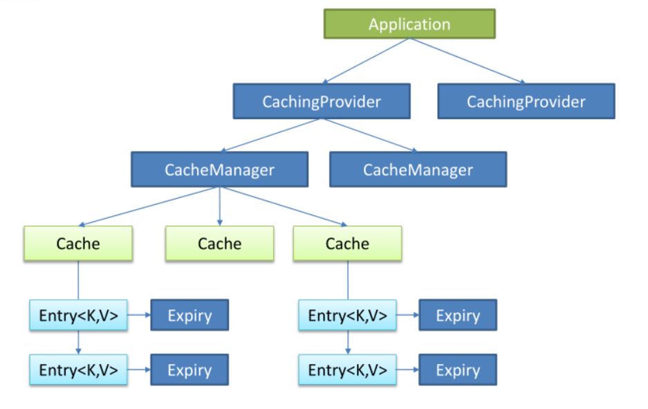

需要导入的依赖

```xml
<dependency>
    <groupId>javax.cache</groupId>
    <artifactId>cache-api</artifactId>
</dependency>
```

## 2、Spring缓存抽象

> Spring从3.1开始定义了org.springframework.cache.Cache和org.springframework.cache.CacheManager接口来统一不同的缓存技术；并支持使用JCache（JSR-107）注解简化我们开发

+ Cache接口为缓存的组件规范定义，包含缓存的各种操作集合
+ Cache接口下Spring提供了各种`xxxCache`的实现，如`RedisCache`，`EhCacheCache`，`ConcurrentMapCache`等
+ 每次调用需要缓存功能的方法时，Spring会检查指定参数的指定的目标方法是否已经被调用过，如果有就直接从缓存中获取方法调用后的结果，如过没有就调用并缓存结果后返给用户。下次调用直接从缓存中获取。
+ 使用Spring缓存抽象时我们需要关注以下两点；
  + 确定方法需要被缓存以及他们的缓存策略
  + 从缓存中读取之前缓存存储的数据

## 3、重要概念与缓存注解

+ `Cache`：缓存接口，定义缓存操作。实现有：RedisCache、EhCacheCache、ConcurrentMapCache等
+ `CacheManager`： 缓存管理器，管理各种缓存（Cache）组件
  + 用来管理缓存，具体的实现有各种缓存Cache组件来完成
  + 管理多个Cache组件，对缓存的CRUD操作在Cache组件中
  + 每一个缓存组件都有自己唯一的名字
+ `@Cacheable`：主要针对方法配置，能够根据方法的请求参数对其结果进行缓存
  + 当标注的方法调用后，先查看缓存存不存在数据，若缓存中存在数据则直接返回缓存中的值。否则执行方法体内容，并将返回值存入缓存。
+ `@CacheEvict` ：清空缓存
  + 标注在方法上时，表示将数据从缓存中删除
+ `@CachePut`： 保证方法被调用，又希望结果被缓存。
  + 调用标注此注解的方法时，不管缓存中存不存在，首先运行方法体内容，然后将返回值存入缓存。
+ `@Enablecaching`： 开启基于注解的缓存keyGenerator 缓存数据时key生成策略
  + 想要使用上面的注解，首先要将注解给开启
+ `serialize`：缓存数据时value序列化策略
+ `@Caching`：用来定义复杂的缓存规则，如下

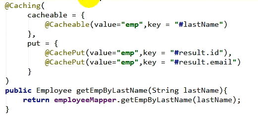

+ `@CacheConfig`：在类上标注，可以统一指定缓存的相关设置


## 4、缓存的使用

**（1）引入依赖**

```xml
<dependency>
    <groupId>org.springframework.boot</groupId>
    <artifactId>spring-boot-starter-cache</artifactId>
</dependency>
```

**（2）给项目开启缓存**

在`springboot`的主方法上加上`@EnableCaching`注解

**（3）标注缓存注解**

`CacheManager`可以管理多个`Cache`组件，对缓存的真正CRUD操作都是在组件中完成的，每一个组件都有自己唯一的一个名字，以下是上文`@Cacheable`、`@CachePut`和`@CacheEvict` 注解的内部属性。

+ `cacheNames/value`：指定缓存组件的名字
+ `key`：缓存数据使用的key。默认使用方法传递的参数值，可以通过spEL表达式获取，如下。

| 名字          | 位置               | 描述                                                         | 示例                 |
| ------------- | ------------------ | ------------------------------------------------------------ | -------------------- |
| methodName    | root object        | 当前被调用的方法名                                           | #root.methodName     |
| method        | root object        | 当前被调用的方法                                             | #root.method.name    |
| target        | root object        | 当前被调用的目标对象                                         | #root.target         |
| targetClass   | root object        | 当前被调用的目标对象类                                       | #root.targetClass    |
| args          | root object        | 当前被调用的方法的参数列表                                   | #root.args[0]        |
| caches        | root object        | 当前方法调用使用的缓存列表（如@Cacheable（value={"cache1"，"cache2"}）），则有两个cache | #root.caches[0].name |
| argument name | evaluation context | 方法参数的名字.可以直接#参数名，也可以使用#p0或#a0的形式，0代表参数的索引 | #iban、#a0、#p0      |
| result        | evaluation context | 方法执行后的返回值（仅当方法执行之后的判断有效，如‘unless'，'cache put'的表达式'cache evict'的表达式beforelnvocation=false） | #result              |

+ `keyGenerator`：key的生成器，可以自己指定key的生成器的组件id。注意key/keyGenerator二选一使用
+ `cacheManager`：指定缓存管理器
+ `cacheResolver`：指定获取解析器。与`cacheManager`二选一使用
+ `condition`：制定符合条件的情况下缓存
+ `unless`：否定缓存，当`unless`指定的值为`true`，方法的返回值则不会缓存
+ `sync`：是否指定异步模式
+ `allEntries`：写在`@CacheEvict`的属性内，则会删除所有的缓存
+ `beforeInvocation`：写在`@CacheEvict`的属性内，在方法执行之前清除缓存，默认是方法执行之后清除缓存

## 5、缓存的工作原理

（1）自动配置类`CacheAutoConfiguration`进行自动配置

（2）上述标注的`CacheConfigurationImportSelector`类在满足一定条件下会自动回调`selectImports`方法来进行配置类的导入。

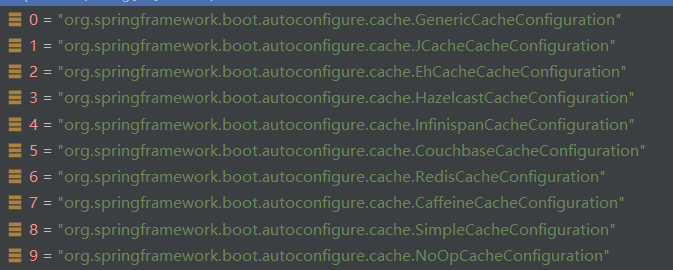

（3）默认情况下只有`SimpleCacheConfiguration`生效，而他的作用就是给容器注册一个`ConcurrentMapCacheManager`缓存管理器

（4）上述的缓存管理器可以获取和创建`ConcurrentMapCache`，它可以将数据保存在`ConcurrentMap`中

**@Cacheable运行流程**

（1）方法运行之前，先去查询Cache（缓存组件），按照cacheNames指定的名字获取
（CacheManager先获取相应的缓存），第一次获取缓存如果没有Cache组件会自动创建。

（2）去Cache中查找缓存的内容，使用一个key，默认就是方法的参数；key是按照某种策略生成的；默认是使用keyGenerator生成的，默认使用SimplekeyGenerator生成key

+ SimplekeyGenerator生成key的默认策略
  + 如果没有参数；key=new Simplekey（）
  + 如果有一个参数：key=参数的值
  + 如果有多个参数：key=new SimpleKey（params）；

（3）没有查到缓存就调用目标方法；

（4）将目标方法返回的结果，放进缓存中

（5）若查到缓存则直接将其返回

## 6、RedisTempate

（1）首先引入依赖

```xml
<dependency>
    <groupId>org.springframework.boot</groupId>
    <artifactId>spring-boot-starter-data-redis</artifactId>
</dependency>
```

（2）简介

Redis常见的五大数据类型
String（字符串）、List（列表）、set（集合）、Hash（散列）、ZSet（有序集合）

```
stringRedis Template.opsForValue()	[String（字符串）]
stringRedis Template.opsForlist()	[List（列表）]
stringRedis Template.opsForSet()	[Set（集合）]
stringRedis Template.opsForHash()	[Hash（散列）]
stringRedis Template.opsForZSet()	[ZSet（有序集合）]
```

（3）保存字符串

先自动注入`StringRedisTemplate`

```java
@Autowired
StringRedisTemplate stringRedisTemplate;
```

然后就可以使用`stringRedisTemplate`模板进行相关操作了

例如**保存数据**

```
stringRedisTemplate.opsForValue().append("msg", "hello");
```

获取数据

```java
String msg = stringRedisTemplate.opsForValue().get("msg");
System.out.println(msg);
```

（4）保存对象

因为Redis默认采用jdk的序列化方式，这会使保存的数据可读性非常的差，我们可以自定义配置，让准备缓存的数据以json的格式缓存下来，首先编写配置类

```java
@Configuration
public class RedisConfig {

    @Bean
    public RedisTemplate<Object, Employee> empRedisTemplate(RedisConnectionFactory redisConnectionFactory)
            throws UnknownHostException {
        RedisTemplate<Object, Employee> template = new RedisTemplate<>();
        template.setConnectionFactory(redisConnectionFactory);
        //设置默认的序列化方式为json
        template.setDefaultSerializer(new Jackson2JsonRedisSerializer<>(Employee.class));
        return template;
    }
}
```

然后保存

```java
@Test
void test02(){
    Employee employee = employeeMapper.getEmployeeById(1);
    empRedisTemplate.opsForValue().set("emp01", employee);
}
```

这样从客户端里看的数据就是json格式的了

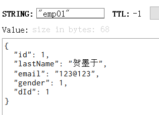

## 7、自定义RedisCacheManage

**（1）原理**

原本默认springboot会使用SimpleCacheConfigration配置类来进行配置

但在引入redis-starter后，springboot的注解通过判断就不使用默认的CacheManage，而去使用**RedisCacheManage**

**（2）使用Json保存**

默认RedisCacheManage操作Redis的时候使用的是`RedisTemplate<Object，Object>`

而`RedisTemplate<Object，Object>`默认使用的是jdk序列化机制

```java
@Bean
public CacheManager cacheManager(RedisConnectionFactory redisConnectionFactory) {
    //初始化一个RedisCacheWriter
    RedisCacheWriter redisCacheWriter = RedisCacheWriter.nonLockingRedisCacheWriter(redisConnectionFactory);
    //设置CacheManager的值序列化方式为json序列化
    RedisSerializer<Object> jsonSerializer = new GenericJackson2JsonRedisSerializer();
    RedisSerializationContext.SerializationPair<Object> pair = RedisSerializationContext.SerializationPair
            .fromSerializer(jsonSerializer);
    RedisCacheConfiguration defaultCacheConfig=RedisCacheConfiguration.defaultCacheConfig()
            .serializeValuesWith(pair);
    //设置默认超过期时间是30秒
    defaultCacheConfig.entryTtl(Duration.ofSeconds(30));
    //初始化RedisCacheManager
    return new RedisCacheManager(redisCacheWriter, defaultCacheConfig);
}
```

（3）当使用了多个cacheManage时，需要添加**@Prime**注解来标注他为默认的缓存管理器

（4）编码的方式实现缓存

首先自动注入cacheManage到类属性中

```java
@Qualifier("deptCacheManager")
@Autowired
RedisCacheManager deptCacheManager;
```

编码实现缓存

```java
public Department getDeptById(int id){
	Department department = departmentMapper.getDeptById(id);
	Cache dept = deptCacheManager.getCache("dept");
	dept.put("dept:1", department);
	return department;
}
```

# 二、Spring Boot与消息

## 1、概述

+ 大多应用中，可通过消息服务中间件来提升系统异步通信、扩展解耦能力
+ 消息服务中两个重要概念：**消息代理**（message broker）和**目的地**（destination）
  当消息发送者发送消息以后，将由消息代理接管，消息代理保证消息传递到指定目的地。
+ 消息队列主要有两种形式的目的地
  + 队列（queue）：点对点消息通信（point-to-point）
  + 主题（topic）：发布（publish）/订阅（subscribe）消息通信
+ 点对点式：
  + 消息发送者发送消息，消息代理将其放入一个队列中，消息接收者从队列中获取消息内容，消息读取后被移出队列
  + 消息只有唯一的发送者和接受者，但并不是说只能有一个接收者
+ 发布订阅式：
  + 发送者（发布者）发送消息到主题，多个接收者（订阅者）监听（订阅）这个主题，那么就会在消息到达时同时收到消息
+ JMS（Java Message Service）JAVA消息服务：
  + 基于JVM消息代理的规范。ActiveMQ、HornetMQ是JMS实现
+ AMQP（Advanced Message Queuing Protocol）
  + 高级消息队列协议，也是一个消息代理的规范，兼容JMS
  + RabbitMQ是AMQP的实现

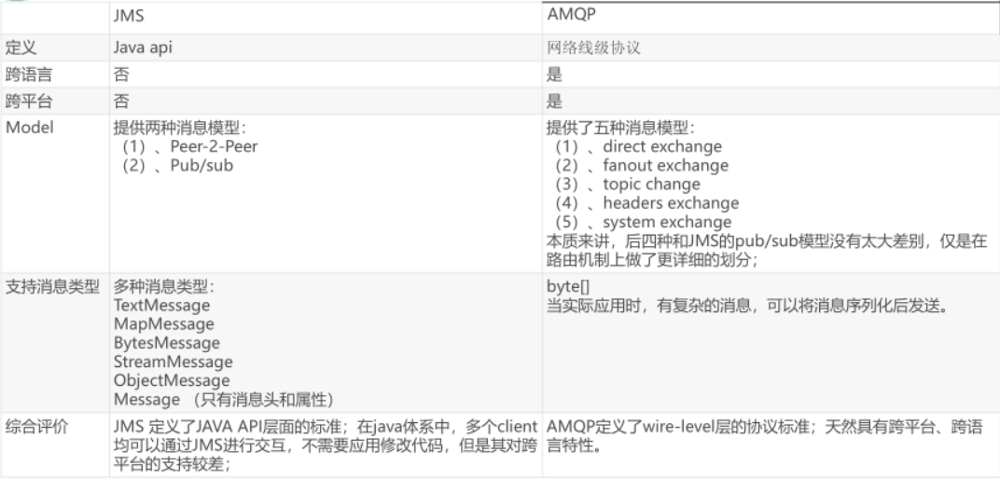

+ Spring支持
  + spring-jms提供了对JMS的支持
  + spring-rabbit提供了对AMQP的支持
  + 需要ConnectionFactory的实现来连接消息代理
  + 提供jmsTemplate、Rabbit Template来发送消息
  + @JmsListener（JMS）、@RabbitListener（AMQP）注解在方法上监听消息代理发布的消息
  + @EnableJms、@EnableRabbit开启支持
+ Spring Boot自动配置
  + JmsAutoConfiguration
  + RabbitAutoConfiguration

## 2、RabbitMQ简介

**RabbitMQ简介**
	RabbitMQ是一个由erlang开发的AMQP（Advanved Message Queue Protocol）的开源实现。
核心概念

+ Message
  + 消息，消息是不具名的，它由消息头和消息体组成。消息体是不透明的，而消息头则由一系列的可选属性组成，这些属性包括routing-key（路由键）、priority（相对于其他消息的优先权）、delivery-mode（指出该消息可能需要持久性存储）等。
+ Publisher
  + 消息的生产者，也是一个向交换器发布消息的客户端应用程序。
+ Exchange
  + 交换器，用来接收生产者发送的消息并将这些消息路由给服务器中的队列。
    Exchange有4种类型：direct（默认），fanout，topic，和headers，不同类型的Exchange转发消息的策略有所区别

+ Queue
  + 消息队列，用来保存消息真到发送给消费者。它是消息的容器，也是消息的终点。
  + 一个消息可投入一个或多个队列。
  + 消息一直在队列面面，等待消费者连接到这个队列将其取走。

+ Binding
  + 绑定，用于消息队列和交换器之间的关联。
  + 一个绑定就是基于路由键将交换器和消息队列连接起来的路由规则
  + 所以可以将交换器理解成一个由绑定构成的路由表。
  + Exchange 和Queue的绑定可以是多对多的关系。
+ Connection
  + 网络连接，比如一个TCP连接。
+ Channel
  + 信道，多路复用连接中的一条独立的双向数据流通道。
  + 信道是建立在真实的TCP连接内的虚拟连接，AMQP命令都是通过信道发出去的，不管是发布消息、订阅队列还是接收消息，些寿作都是通过信道完成。
  + 因为对于操作素统来说建立和销毁TcP 都是非常昂贵的开销，所人引入了信道的概念，以复用一条TCP连接。

+ Consumer
  + 消息的消费者，表示一个从消息队列中取得消息的客户端应用程序。
+ Virtual Host
  + 虚拟主机，表示一批交换器、消息队列和相关对象。
  + 虚拟主机是共享相同的身份认证和加密环境的独立服务器域。
  + 每个vhost本质上就是一个mini版的RabbitMQ服务器，拥有自己的队列、交换器、绑定和权限机制。
  + vhost是AMQP概念的基础，必须在连接时指定，RabbitMQ默认的vhost是/。
+ Broker
  + 表示消息队列服务器实体

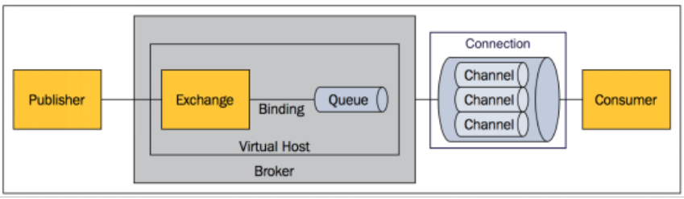

## 3、RabbitMQ运行机制

+ AMQP中的消息路由
  + AMQP中消息的路由过程和Java 开发者熟悉的JMS 存在一些差别，AMQP中增加了Exchange 和Binding 的角色。
  + 生产者把消息发布到Exchange上，消息最终到达队列并被消费者接收，而Binding 决定交换器的消息应该发送到那个队列。

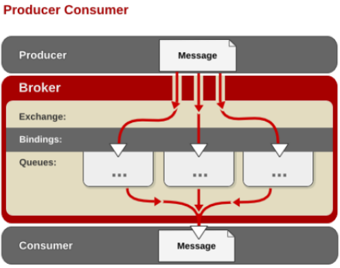

### Exchange 类型

Exchange分发消息时根据类型的不同分发策略有区别，目前共四种类型：

+ direct
+ fanout
+ topic
+ headers
  + headers 匹配AMQP 消息的 header而不是路由键，headers 交换器和direct 交换器完全一致，但性能差很多，目前几乎用不到了，所以直接着另外三种类型

#### Direct Exchange

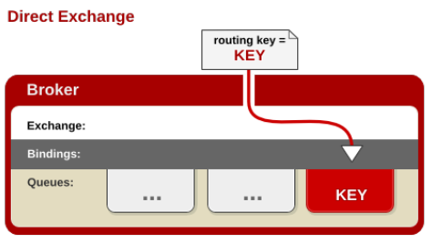

消息中的路由键（routing key）如果和Binding中的binding key一致，交换器就将消息发到对应的队列中。

路由键与队列名完全匹配，如果一个队列绑定到交换机要求路由键为“dog”，则只转发routing key标记为“dog”的消息，不会转发“dog.puppy”，也不会转发“dog.guard”等等。它是完全匹配、单播的模式。

#### Fanout Exchange

每个发到fanout类型交换器的消息都会分到所有绑定的队列上去。

fanout交换器不处理路由键，只是简单的将队列绑定到交换器上，每个发送到交换器的消息都会被转发到与该交换器绑定的所有队列上。

很像子网广播，每台子网内的主机都获得了一份复制的消息。fanout类型转发消息是最快的。

#### Topic Exchange

topic交换器通过模式匹配分配消息的路由键属性，将路由键和某个模式进行匹配，此时队列需要绑定到一个模式上。

它将路由键和绑定键的字符串切分成单词，这些单词之间用点隔开。

它同样也会识别两个通配符：符号`#`和符号`*`。#匹配0个或多个单词，*匹配一个单词。

## 4、RabbitTemplate

+ 自动配置
  + 1、RabbitAutoConfiguration
  + 2、有自动配置了连接工厂ConnectionFactory；
  + 3、RabbitProperties 封装了RabbitMQ的配置
  + 4、RabbitTemplate：给RabbitMQ发送和接受消息；
  + 5、AmqpAdmin:RabbitMQ系统管理功能组件  

**发送消息**

```java
//Message需要自己构造一个；定义消息体内容和消息头
rabbitTemplate.send(exchange, routingkey, message);
//object默认当成消息体，只需要传入要发送的对象，自动序列化发送给rabbitmq；
rabbitTemplate.convertAndSend(exchange, routingkey, message);
```

```java
Map<String, Object> map = new HashMap<>();
map.put("name", "土狗");
map.put("data", "这是一则消息");
rabbitTemplate.convertAndSend("exchange.direct", "motan.news", map);
```

发送对象时，会使用默认的序列化方式

**接受消息**

```java
Object o = rabbitTemplate.receiveAndConvert("motan.news");
```

**使用json序列化对象**

```java
@Configuration
public class RabbitMQConfig {
    /**
     * 定制JSON格式的消息转换器
     * @return
     */
    @Bean
    public MessageConverter messageConverter(){
        return new Jackson2JsonMessageConverter();
    }
```

## 5、基于注解的RabbitMQ模式

首先在项目主类上添加`@EnableRabbit`注解

```java
@EnableRabbit
@SpringBootApplication
public class Application {

    public static void main(String[] args) {
        SpringApplication.run(Application.class, args);
    }

}
```

然后使用`@RabbitListener`监听消息队列

```java
@service 
public class BookService{

    @RabbitListener(queues="atguigu.news")
    public void receive(Book book){
        System.out.print1n(“收到消息：“+book)；                          
    }
    
    @RabbitListener(queues="atguigu")                       
    public void receivee2(Message message){
        System.out.println(message.getBody())；
        System.out.println（message.getMessageProperties()；
    }
}
```

## 6、AmqpAdmin管理组件

```java
 @Autowired
    private AmqpAdmin amqpAdmin;
    @Autowired
    private RabbitTemplate rabbitTemplate;

    /**
     * 使用AmqpAdmin管理员API定制消息组件
     */
    @Test
    public void amqpAdmin() {
        // 1、定义fanout类型的交换器
        amqpAdmin.declareExchange(new FanoutExchange("fanout_exchange"));
        // 2、定义两个默认持久化队列，分别处理email和sms
        amqpAdmin.declareQueue(new Queue("fanout_queue_email"));
        amqpAdmin.declareQueue(new Queue("fanout_queue_sms"));
        // 3、将队列分别与交换器进行绑定
        amqpAdmin.declareBinding(new Binding("fanout_queue_email",Binding.DestinationType.QUEUE,"fanout_exchange","",null));
        amqpAdmin.declareBinding(new Binding("fanout_queue_sms",Binding.DestinationType.QUEUE,"fanout_exchange","",null));
    }
```


# 三、Spring Boot与检索

> 我们的应用经常需要添加检索功能，开源的 ElasticSearch 是目前全文搜索引擎的首选。他可以快速的存储、搜索和分析海量数据。Spring Boot通过整合SpringData ElasticSearch为我们提供了非常便捷的检索功能支持；
>
> Elasticsearch是一个分布式搜索服务，提供Restful API，底层基于Lucene，采用多shard（分片）的方式保证数据安全，并且提供自动resharding的功能，github等大型的站点也是采用了ElasticSearch作为其搜索服务

## 1、概念

+ 以 员工文档 的形式存储为例：一个文档代表一个员工数据。存储数据到ElasticSearch 的行为叫做 索引 ，但在索引一个文档之前，需要确定将文档存储在哪里。
+  一个 ElasticSearch 集群可以 包含多个 索引 ，相应的每个索引可以包含多
  个 类型 。 这些不同的类型存储着多个 文档 ，每个文档又有 多个 属性 。
+  类似关系：
  + 索引-数据库
  + 类型-表
  + 文档-表中的记录
  + 属性-列

# 四、Spring Boot与任务

## 1、异步任务

在Java应用中，绝大多数情况下都是通过同步的方式来实现交互处理的；

但是在处理与第三方系统交互的时候，容易造成响应迟缓的情况，之前大部分都是使用多线程来完成此类任务，其实，在Spring 3.x之后，就已经内置了@Async来完美解决这个问题。

**使用**

首先在主类上标注`@EnableAsync`注解

```java
@EnableAsync        // 开启基于注解的异步任务支持
@SpringBootApplication
public class Application {

    public static void main(String[] args) {
        SpringApplication.run(Application.class, args);
    }

}
```

然后再相关的业务方法上标注`@Async`即可实现异步操作

```java
@Service
public class MyAsyncService {
    /**
     * 模拟无返回值的异步任务处理
     * @throws Exception
     */
    @Async
    public void sendSMS() throws Exception {
        System.out.println("调用短信验证码业务方法...");
        Long startTime = System.currentTimeMillis();
        Thread.sleep(5000);
        Long endTime = System.currentTimeMillis();
        System.out.println("短信业务执行完成耗时：" + (endTime - startTime));
    }
```

## 2、定时任务

项目开发中经常需要执行一些定时任务，比如需要在每天凌晨时候，分析一次前一天的日志信息。Spring为我们提供了异步执行任务调度的方式，提供TaskExecutor 、TaskScheduler 接口。

**使用**

首先在主类上标注`@EnableScheduling`注解，开启基于注解的定时任务支持

```java
@EnableScheduling    // 开启基于注解的定时任务支持
@EnableAsync        // 开启基于注解的异步任务支持
@SpringBootApplication
public class Application {

    public static void main(String[] args) {
        SpringApplication.run(Application.class, args);
    }
}
```

然后再相关的业务方法上标注`@Scheduled`，即可。此注解的`cron`属性用来编写时间规则

```java
@Service
public class ScheduledTaskService {
    private static final SimpleDateFormat dateFormat = new SimpleDateFormat("yyyy-MM-dd HH:mm:ss");
    private int count；
    
    @Scheduled(cron = "0 * * * * *")
    public void scheduledTaskCron(){
        System.out.println(String.format("cron第%s次执行，当前时间为：%s",count++, dateFormat.format(new Date())));
    }

}
```

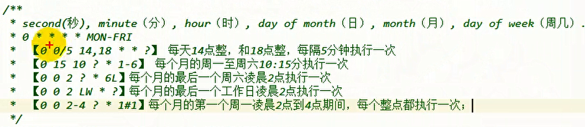

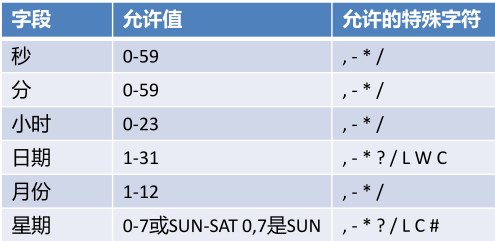

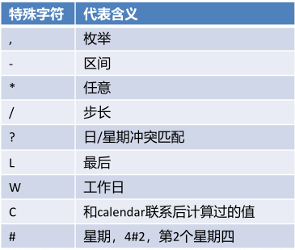

## 3、邮件任务

**邮件发送需要引入spring-boot-starter-mail**

首先在`application.properties`中配置邮件发送者信息

```properties
spring.mail.host=smtp.qq.com
spring.mail.username=[邮箱]
spring.mail.password=xxxx # 授权码
spring.mail.properties.mail.smtp.ssl.enable=true # 开启安全连接
```

发送普通文本邮件

```java
public class SendEmailService {
    @Autowired
    private JavaMailSenderImpl mailSender;
    @Value("${spring.mail.username}")
    private String from;

    /**
     * 发送纯文本邮件
     * @param to       收件人地址
     * @param subject  邮件标题
     * @param text     邮件内容
     */
    public void sendSimpleEmail(String to,String subject,String text){
        // 定制纯文本邮件信息SimpleMailMessage
        SimpleMailMessage message = new SimpleMailMessage();
        message.setFrom(from);
        message.setTo(to);
        message.setSubject(subject);
        message.setText(text);
        try {
            // 发送邮件
            mailSender.send(message);
            System.out.println("纯文本邮件发送成功");
        } catch (MailException e) {
            System.out.println("纯文本邮件发送失败 "+e.getMessage());
            e.printStackTrace();
        }
    }
```

发送复杂文本邮件

```java
/**
     * 发送复杂邮件（包括静态资源和附件）
     * @param to           收件人地址
     * @param subject      邮件标题
     * @param text         邮件内容
     * @param filePath     附件地址
     * @param rscId        静态资源唯一标识
     * @param rscPath      静态资源地址
     */
public void sendComplexEmail(String to,String subject,String text,String filePath,String rscId,String rscPath){
    // 定制复杂邮件信息MimeMessage
    MimeMessage message = mailSender.createMimeMessage();
    try {
        // 使用MimeMessageHelper帮助类，并设置multipart多部件使用为true
        MimeMessageHelper helper = new MimeMessageHelper(message, true);
        helper.setFrom(from);
        helper.setTo(to);
        helper.setSubject(subject);
        helper.setText(text, true);
        // 设置邮件静态资源
        FileSystemResource res = new FileSystemResource(new File(rscPath));
        helper.addInline(rscId, res);
        // 设置邮件附件
        FileSystemResource file = new FileSystemResource(new File(filePath));
        String fileName = filePath.substring(filePath.lastIndexOf(File.separator));
        helper.addAttachment(fileName, file);
        // 发送邮件
        mailSender.send(message);
        System.out.println("复杂邮件发送成功");
    } catch (MessagingException e) {
        System.out.println("复杂邮件发送失败 "+e.getMessage());
        e.printStackTrace();
    }
}

/**
     * 发送模板邮件
     * @param to       收件人地址
     * @param subject  邮件标题
     * @param content  邮件内容
     */
public void sendTemplateEmail(String to, String subject, String content) {
    MimeMessage message = mailSender.createMimeMessage();
    try {
        // 使用MimeMessageHelper帮助类，并设置multipart多部件使用为true
        MimeMessageHelper helper = new MimeMessageHelper(message, true);
        helper.setFrom(from);
        helper.setTo(to);
        helper.setSubject(subject);
        helper.setText(content, true);
        // 发送邮件
        mailSender.send(message);
        System.out.println("模板邮件发送成功");
    } catch (MessagingException e) {
        System.out.println("模板邮件发送失败 "+e.getMessage());
        e.printStackTrace();
    }
}
```


# 五、Spring Boot与安全

> 应用程序的两个主要区域是“认证"和“授权”（或者访问控制）。这两个主要区域是Spring Security的两个目标。
>
> “认证”（Authentication），是建立一个他声明的主体的过程（一个“主体”一般是指用户，设备或一些可以在你的应用程序中执行动作的其他系统）。
>
> “授权”（Authorization）指确定一个主体是否允许在你的应用程序执行一个动作的过程。为了抵达需要授权的店，主体的身份已经有认证过程建立。
>
> 这个概念是通用的而不只在Spring Security中。

## 1、编写安全配置类

编写一个类，让其继承`WebSecurityConfigurerAdapter`，并标注`@EnableWebSecurity`表示开启security的安全支持

```java
@EnableWebSecurity  // 开启MVC security安全支持
public class SecurityConfig extends WebSecurityConfigurerAdapter {
	...
}
```

下面是`@EnableWebSecurity`的源码，可以看到其中有`@configuration`注解，表示他就是个配置类

```java
@Retention(RetentionPolicy.RUNTIME)
@Target({ElementType.TYPE})
@Documented
@Import({WebSecurityConfiguration.class, SpringWebMvcImportSelector.class, OAuth2ImportSelector.class})
@EnableGlobalAuthentication
@Configuration
public @interface EnableWebSecurity {
    boolean debug() default false;
}
```

## 2、自定义授权规则

+ 定制授权规则
  + 重写`protected void configure(HttpSecurity http) throws Exception`方法
  + 使用`http.authorizeRequests()`定制规则
  + 使用``antMatchers()`匹配路劲
  + 使用`permitAll()、hasRole()`等授于权限
+ 开启配置的登录功能，若没有登录，没有权限就会来到登录页面
  + 重写`protected void configure(HttpSecurity http) throws Exception`方法
  + 使用`http.formLogin()`开启登录功能
    + 开启登录功能后，访问`/login`会来到登录页
    + 重定向到`/login？error`表示登录失败
    + 需要重写`configGlobal`方法来配置用户权限信息
  + 自定义登录页`loginPage()`
    + 默认`/login?GET`用来去登录页面
    + 默认`/login?POST`用来处理认证请求
    + 通过`usernameParameter()`和`passwordParameter`设置用户名密码参数
    + 当使用了`loginPage()`方法后，则将使用`loginPage("xxx")`方法中的参数，即`xxx?POST`处理登录请求
    + 也可以使用`loginProcessingUrl()`方法自定义请求路径
+ 定义认证规则
  + 重写`protected void configure(AuthenticationManagerBuilder auth) throws Exception`方法
  + 使用`auth.inMemoryAuthentication()`将认证的信息配置到内存中，仅作测试用
+ 开启自定义的注销功能
  + 在`protected void configure(HttpSecurity http)`方法中
  + `http.logout()方法`可以指定注销链接
  + `logoutSuccessUrl()方法`指定注销后返回到那个界面
+ 开启记住我功能
  + `http.rememberMe()`登陆成功以后，将cookie发给浏览器保存，以后访问页面带上这个cookie，只要通过检查就可以免登录点击注销会删除cookie
  + `rememberMeParameter()`方法设置记住我的表单参数

```java
@EnableWebSecurity  // 开启MVC security安全支持
public class SecurityConfig extends WebSecurityConfigurerAdapter {
    /**
     * 用户授权管理自定义配置
     * @param http
     * @throws Exception
     */
    @Override
    protected void configure(HttpSecurity http) throws Exception {
        // 自定义用户授权管理
        http.authorizeRequests()
                .antMatchers("/").permitAll()
                // 需要对static文件夹下静态资源进行统一放行
                .antMatchers("/login/**").permitAll()
                .antMatchers("/detail/common/**").hasRole("common")
                .antMatchers("/detail/vip/**").hasRole("vip")
                .anyRequest().authenticated();

        // 自定义用户登录控制
        http.formLogin()
                .loginPage("/userLogin").permitAll()
                .usernameParameter("name").passwordParameter("pwd")
                .defaultSuccessUrl("/")
                .failureUrl("/userLogin?error");

        // 自定义用户退出控制
        http.logout()
                .logoutUrl("/mylogout")
                .logoutSuccessUrl("/");

        // 定制Remember-me记住我功能
        http.rememberMe()
                .rememberMeParameter("rememberme")
                .tokenValiditySeconds(200)
                // 对cookie信息进行持久化管理
                .tokenRepository(tokenRepository());

        // 可以关闭Spring Security默认开启的CSRF防护功能
//        http.csrf().disable();

    }
    
        /**
         * 用户身份认证自定义配置
         * @param auth
         * @throws Exception
         */
    @Override
    protected void configure(AuthenticationManagerBuilder auth) throws Exception {
        //  密码需要设置编码器
        BCryptPasswordEncoder encoder = new BCryptPasswordEncoder();
        // 1、使用内存用户信息，作为测试使用
        auth.inMemoryAuthentication().passwordEncoder(encoder)
                .withUser("shitou").password(encoder.encode("123456")).roles("common")
                .and()
                .withUser("李四").password(encoder.encode("123456")).roles("vip");

//        // 2、使用JDBC进行身份认证
//        String userSQL ="select username,password,valid from t_customer " +
//                "where username = ?";
//        String authoritySQL="select c.username,a.authority from t_customer c,t_authority a,"+
//                "t_customer_authority ca where ca.customer_id=c.id " +
//                "and ca.authority_id=a.id and c.username =?";
//        auth.jdbcAuthentication().passwordEncoder(encoder)
//                .dataSource(dataSource)
//                .usersByUsernameQuery(userSQL)
//                .authoritiesByUsernameQuery(authoritySQL);

        // 3、使用UserDetailsService进行身份认证
//        auth.userDetailsService(userDetailsService).passwordEncoder(encoder);
    }
    
```

## 3、thymeleaf安全模块模板引擎

首先在html中引入约束

```html
<html xmlns:sec="http://www.thymeleaf.org/thymeleaf-extras-springsecurity5">
```

获取认证状态

```html
<div sec:authorize="isAnonymous()">
    ...
</div>
```

获取拥有的角色

```html
<span sec:authentication="principal.authorities"></span>
```

获取用户名

```HTML
<span sec:authentication="name"></span>
```

判断是否拥有某角色

```html
<div sec:authorize="hasRole('common')">
    ...
</div>
```

## 新的 ★

## 1、权限管理的相关概念

代码底层流程：重点看三个过滤器：

+ FilterSecurityInterceptor：是一个方法级的权限过滤器，基本位于过滤链的最底部。下面来看看源码

  ```java
  public class FilterSecurityInterceptor extends AbstractSecurityInterceptor implements Filter {
  
      @Override
      public void doFilter(ServletRequest request, ServletResponse response, FilterChain chain)
          throws IOException, ServletException {
          invoke(new FilterInvocation(request, response, chain));
      }
  
      public void invoke(FilterInvocation filterInvocation) throws IOException, ServletException {
          if (isApplied(filterInvocation) && this.observeOncePerRequest) {
              // filter already applied to this request and user wants us to observe
              // once-per-request handling, so don't re-do security checking
              filterInvocation.getChain().doFilter(filterInvocation.getRequest(),
                                                   filterInvocation.getResponse());
              return;
          }
          // first time this request being called, so perform security checking
          if (filterInvocation.getRequest() != null && this.observeOncePerRequest) {
              filterInvocation.getRequest().setAttribute(FILTER_APPLIED, Boolean.TRUE);
          }
          // ①
          InterceptorStatusToken token = super.beforeInvocation(filterInvocation);
          try {
              // ②
              filterInvocation.getChain().doFilter(filterInvocation.getRequest(),
                                                   filterInvocation.getResponse());
          }
          finally {
              super.finallyInvocation(token);
          }
          // ③
          super.afterInvocation(token, null);
      }
  ```

  可以看出 FilterSecurityInterceptor 它继承了 Filter，接着重点看 实现的 doFilter 方法，它调用了内部的invoke 

  + ① 处的 `super.beforeInvocation(filterInvocation)` 标识查看之前的 filter 是否通过
  + ② 处的`fi.getChain().doFilter(fi.getRequest(),fi.getResponse());` 表示调用真正的后台服务

+ ExceptionTranslationFilter：是个异常过滤器，用来处理在认证授权过程中抛出的异常。

+ UsernamePasswordAuthenticationFilter：对/login的POST请求做拦截，校验表单中用户名，密码。

## 2、过滤器加载过程

1. 使用 SpringSecurity 配置过滤器
   + DelegatingFilterProxy
     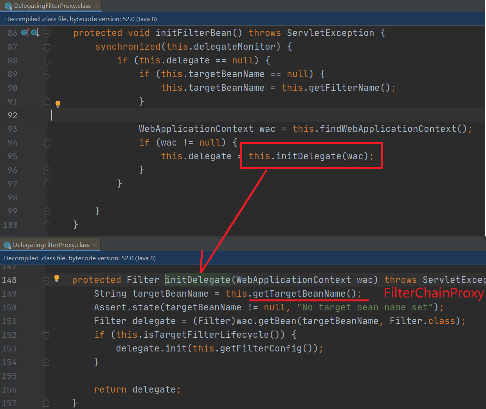
   + 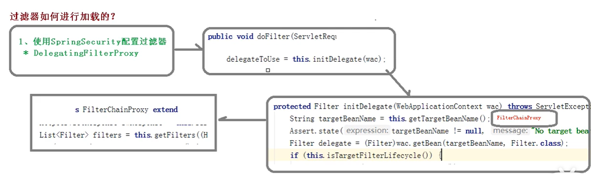

## 3、两个重要的接口

### UserDetailsService

UserDetailsService接口：查询数据库用户名和密码过程

1. 创建类继承UsernamePasswordAuthenticationFilter，重写三个方法
2. 创建类实现UserDetailService，编写查询数据过程，返回User对象，这个User对象是安全框架提供对象

### PasswordEncoder

PasswordEncoder数据加密接口，用于返回User对象里面密码加密

```java
public class SecurityConfig extends WebSecurityConfigurerAdapter{
    @Override
    protected void configure(AuthenticationManagerBuilder auth) throws Exception {
        // 强散列哈希加密实现
        auth.userDetailsService(userDetailsService).
            passwordEncoder(new BCryptPasswordEncoder());
    }
}
```

## 4、用户认证

### 设置用户名密码

1. 通过配置文件
   application.properties

   ```properties
   spring.security.user.name=hemou
   spring.security.user.password=root
   ```

2. 通过配置类

   ```java
   public class SecurityConfig extends WebSecurityConfigurerAdapter{
       @Override
       protected void configure(AuthenticationManagerBuilder auth) throws Exception {
           //  密码需要设置编码器
           BCryptPasswordEncoder encoder = new BCryptPasswordEncoder();
           // 1、使用内存用户信息，作为测试使用
           auth.inMemoryAuthentication().passwordEncoder(encoder)
               .withUser("shitou").password(encoder.encode("123456")).roles("common")
               .and()
               .withUser("李四").password(encoder.encode("123456")).roles("vip");
       }
   }
   ```

   ==必须要通过 `auth.inMemoryAuthentication().passwordEncoder(encoder)` 设置密码加密方式，不然会报错==，或者通过 @Bean 的方式创建一个 PasswordEncoder

3. 自定义实现类

   1. 第一步：创建配置类，设置使用哪个 userDetailService 实现类

      ```java
      public class SecurityConfig extends WebSecurityConfigurerAdapter {
      
          /**
           * 自定义用户认证逻辑
           */
          @Autowired
          private UserDetailsService userDetailsService;
      
          /**
           * 强散列哈希加密实现
           */
          @Bean
          public BCryptPasswordEncoder bCryptPasswordEncoder() {
              return new BCryptPasswordEncoder();
          }
      
          @Override
          protected void configure(AuthenticationManagerBuilder auth) throws Exception {
              auth.userDetailsService(userDetailsService).
                  passwordEncoder(bCryptPasswordEncoder());
          }
      }
      ```

   2. 第二步：编写配置类，返回 User 对象，User 对象有用户名密码和操作权限

      ```java
      @Service("userDetailsService")
      public class UserDetailServiceImpl implements UserDetailsService {
      
          @Autowired
          private ISysUserService userService;
      
          @Override
          public UserDetails loadUserByUsername(String username) throws 
              UsernameNotFoundException {
              List<GrantedAuthority> auths = AuthorityUtils.
                  commaSeparatedStringToAuthorityList("role");
              return new User("marray", new BCryptPasswordEncoder().encode("1234"), auths);
          }
      }
      ```

      + 首先要注意 @Service 要写上 service 的name，如 @Service("userDetailsService")，这样才能在前面的 SecurityConfig 成功注入进去
      + loadUserByUsername 要求返回一个 UserDetail，这里有两种做法
        + 编写一个实现 UserDetail 的类
        + 使用 spring security 内置的一个 User 类，它本身实现了 UserDetail 这个接口
      + 在本例中 User 的构造方法接受三个参数，用户名、加密后的密码和权限，注意权限不能为空，这里就随便写了一个权限

### 自定义登录退出页

**SecurityConfig.java**

```java
public class SecurityConfig extends WebSecurityConfigurerAdapter {
    /**
     * 用户授权管理自定义配置
     * @param http
     * @throws Exception
     */
    @Override
    protected void configure(HttpSecurity http) throws Exception {
        // 自定义用户授权管理
        http.authorizeRequests()
                .antMatchers("/", "/index").permitAll()
                // 需要对static文件夹下静态资源进行统一放行
                .antMatchers("/login/**").permitAll()
                .antMatchers("/detail/common/**").hasRole("common")
                .antMatchers("/detail/vip/**").hasRole("vip")
                .anyRequest().authenticated();

        // 自定义用户登录控制
        http.formLogin()
                .loginPage("/userLogin")
            	.loginProcessingUrl("/user/login").permitAll() // controller 处理路径
                .usernameParameter("name").passwordParameter("pwd")
                .defaultSuccessUrl("/") // 成功转到页面
                .failureUrl("/userLogin?error");        
        
        // 自定义用户退出控制
        http.logout()
                .logoutUrl("/mylogout")
                .logoutSuccessUrl("/");
        
        // 可以关闭Spring Security默认开启的CSRF防护功能
        http.csrf().disable();
    }
}
```

## 5、用户授权

### 授权

1. 角色授权：授权代码需要加ROLE_前缀，controller上使用时不要加前缀
2. 权限授权：设置和使用时，名称保持一至即可

```java
@Component
public class MyUserDetailService implements UserDetailsService {
    
  @Autowired
  private PasswordEncoder passwordEncoder;

  @Override
  public UserDetails loadUserByUsername(String name) throws UsernameNotFoundException {
    User user = new User(name, passwordEncoder.encode("123456"),
        AuthorityUtils.commaSeparatedStringToAuthorityList("read,ROLE_USER"));//设置权限和角色
    // 1. commaSeparatedStringToAuthorityList放入角色时需要加前缀ROLE_，而在controller使用时不需要加ROLE_前缀
    // 2. 放入的是权限时，不能加ROLE_前缀，hasAuthority与放入的权限名称对应即可
    return user;
  }
}
```


### 判断

**1、hasAuthority()** 

如果当前的主体具有指定的权限，则返回true，否则返回false

1. 在配置类中设置当前访问地址需要哪些权限

   SecurityConfig.java

   ```java
   http.authorizeRequests().antMatchers("/user").hasAuthority("admin")
   ```

2. 在 UserDetailService，把返回的 User 对象设置权限

   ```java
   List<GrantedAuthority> auths = AuthorityUtils.commaSeparatedStringToAuthorityList("role");
   return new User("marray", new BCryptPasswordEncoder().encode("1234"), auths);
   
   ```

**2、hasAnyAuthority()**

和 hasAuthority() 类似，拥有其中一个权限即可访问 `hasAnyAuthority("admin,user")`，不同权限用逗号隔开

**3、hasRole()**

与 hasAuthority() 稍有不同，先看源码

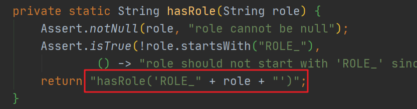

他会自动给权限加上 `ROLE_` 的前缀，所以我们在分配权限时，要加上他

```java
List<GrantedAuthority> auths = AuthorityUtils.commaSeparatedStringToAuthorityList("ROLE_role");
```

**4、hasAnyRole()**

与之前的类似

### 注解

#### @Secured

判断用户具有某个角色，只有具有相应角色才可以调用方法

1. 开启注解功能

   使用注解先要开启注解功能！可以在启动类上，也可以在配置类上添加

   ```java
   @EnableGlobalMethodSecurity(securedEnabled = true)
   ```

2. 在控制器方法上添加注解

   ```java
   @GetMapping("update")
   @Security({"ROLE_sale", "ROLE_manager"})
   public String update(){
   ```

   判断是否具有角色，另外需要注意的是这里匹配的字符串需要添加前缀“ROLE_"

#### @PreAuthorize

在进入方法前进行权限验证

1. 开启方法前后验证注解

   ```java
   @EnableGlobalMethodSecurity(securedEnabled = true, prePostEnabled = true)
   ```

   也就是 `prePostEnable = true`

2. 在控制器方法上面添加注解

   ```java
   @GetMapping
   @PreAuthorize("hasAnyAuthority('admin')")
   public String update(){
   ```

#### @PostAuthorize

在进入方法后进行权限验证

1. 开启验证注解，同上

2. 在控制器方法上面添加注解

   ```java
   @GetMapping
   @PostAuthorize("hasAnyAuthority('admin')")
   public String update(){
   ```

#### @PreFilter

进入控制器之前对数据进行过滤

```java
@GetMapping
@PostAuthorize("hasAnyAuthority('admin')")
@PreFilter(value = "filterObject.id%2==0")
public String update(@RequestBody List<UserInfo> list){
    list.forEach(t -> {
		System.out.println(t.getId() + ":" + t.getName());
    })
```

上述注解的作用就是，如果 UserInfo 的 id 能被 2 整除，就传递 list 中

#### @PostFilter

```java
@GetMapping
@PostAuthorize("hasAnyAuthority('admin')")
@PreFilter(value = "filterObject.username=='admin'")
public String update(@RequestBody List<UserInfo> list){ 
    ArrayList<User> list = new ArrayList<>();
    list.add(new User(1, "admin"));
	list.add(new User(1, "user"));
    return list
}
```

上述注解的作用就是，留下 list 中 username 为 admin 的对象

## 6、自定义403页面

```java
http.exceptionHandling().accessDeniedPage("unauth.html")
```

## 7、记住我自动登录

#### 原理

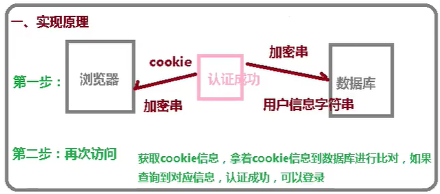

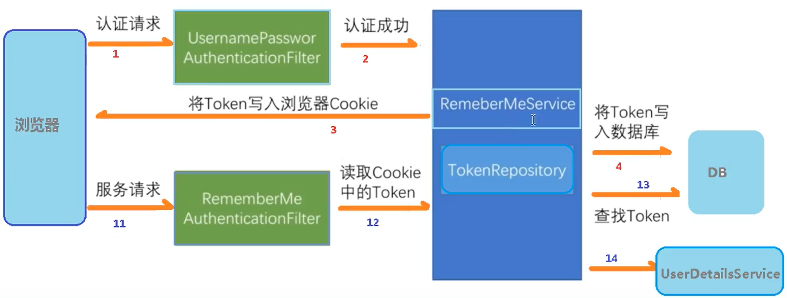

#### 实现

1. 创建数据库表，或在第二步中自动建表

2. 配置类，注入数据源，配置操作数据库对象

   SecurityConfig.java

   ```java
   @Autowired
   private DataSource dataSource;
   
   @Bean
   public PersistentTokenRepository persistentTokenRepository(){
       JdbcTokenRepositoryImpl jdbcTokenRepository = new JdbcTokenRepositoryImpl();
       jdbcTokenRepository.setDataSource(dataSource);
       jdbcTokenRepository.setCreateTableOnStartup(true);
       return jdbcTokenRepository;
   }
   ```

3. 配置类自动登录

   SecurityConfig.java

   ```java
   @Override
   protected void configure(HttpSecurity http) throws Exception {
       // 定制Remember-me记住我功能
       http.rememberMe()
           .rememberMeParameter("rememberme") // 默认 remember-me
           .tokenValiditySeconds(200)// 单位秒
           .tokenRepository(persistentTokenRepository()); // 对cookie信息进行持久化管理
   ```

## 8、CSRF

### CSRF的原理

​	CSRF攻击原理比较简单，例如Web A为存在CSRF漏洞的网站，Web B为攻击者构建的恶意网站，User C为Web A网站的合法用户。

1. 用户C打开浏览器，访问受信任网站A，输入用户名和密码请求登录网站A；在用户信息通过验证后，网站A产生Cookie信息并返回给浏览器，此时用户登录网站A成功，可以正常发送请求到网站A；并且，此后从用户浏览器发送请求给网站A时都会默认带上用户的Cookie信息；

2. 用户未退出网站A之前，在同一浏览器中，打开一个TAB页访问网站B；

3. 网站B接收到用户请求后，返回一些攻击性代码，并发出一个请求要求访问第三方站点A；

4. 浏览器在接收到这些攻击性代码后，根据网站B的请求，在用户不知情的情况下携带Cookie信息，向网站A发出请求。网站A并不知道该请求的最终发起者其实是由B发起的，所以会根据用户C的Cookie信息以C的权限处理该请求，导致来自网站B的恶意代码被执行。

SpringSecurity的防CSRF的功能是开启的，一般也建议开启。

从Spring Security4.0开始，默认情况下会启用CSRF保护，以防止CSRF攻击应用程序，Spring Security CSRF会针对PATCH，POST，PUT和DELETE方法进行防护。


# 六、Spring Boot与分布式

# 七、Spring Boot与监控管理

# 八、Spring Boot与部署

