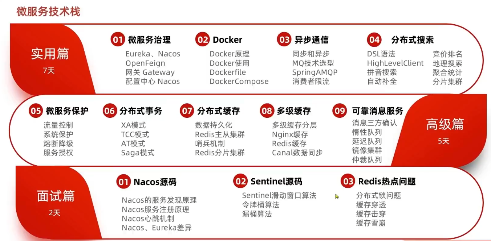

# 微服务理论

## 发展演变

**单体架构**（单一应用架构）

> 当网站流量很小时，只需一个应用，将**所有功能都部署在一起**，以减少部署节点和成本。此时，用于简化增删改查工作量的数据访问框架(ORM)是关键。
>
> 简单来说就是将业务的所有功能集中在一个项目中开发，达成一个包部署。

优点：

+ 部署简单易用
+ 部署成本低

缺点：

+ 耦合度高
+ 性能扩展比较难
+ 协同开发问题
+ 不利于升级维护

**垂直应用架构**

> 当访问量逐渐增大，单一应用增加机器带来的加速度越来越小，将**应用拆成互不相干的几个项目**，形成多个独立的单体架构，以提升效率。（此时，用于加速前端页面开发的Web框架(MVC)是关键）

通过切分业务来实现各个模块独立部署，有以下特点

优点：

+ 降低了维护和部署的难度
+ 团队各司其职更易管理
+ 性能扩展也更方便，更有针对性。

缺点： 

+ 公用模块无法重复利用，开发性的浪费

**分布式架构**

> 《分布式系统原理与范型》定义：“**分布式系统是若干独立计算机的集合，这些计算机对于用户来说就像单个相关系统**”
>
> 分布式架构是指在垂直架构的基础上，**将公共业务模块抽取出来，作为独立的服务**，供其他调用者消费，以实现服务的共享和重用。
>
> 当垂直应用越来越多，应用之间交互不可避免，将核心业务抽取出来，作为独立的服务，逐渐形成稳定的服务中心，使前端应用能更快速的响应多变的市场需求。此时，用于提高业务复用及整合的**分布式服务框架(RPC)**是关键。
>
> + RPC： Remote Procedure Call 远程过程调用。有非常多的协议和技术来都实现了RPC的过程。比如：HTTP REST风格，Java RMI规范、WebService SOAP协议、Hession等等。

1、优点：

+ 降低服务耦合
+ 有利于服务升级拓展

2、缺点：

+ 服务提供方一旦产生变更，所有消费方都需要变更

3、分布式架构要考虑的问题：

+ 服务拆分力度如何？
+ 服务集群地址如何维护？
+ 服务之间如何实现远程调用？
+ 服务健康状态如何感知？

为了解决上述问题，出现了许多技术，比如ESB、Hession、Dubbo、Spring Cloud等等，但是目前最流行火热的方案称之为微服务

**流动计算架构**

> SOA：（Service-Oriented Architecture，面向服务的架构）是一个组件模型，它将应用程序的不同功能单元（称为服务）进行拆分，并通过这些服务之间定义良好的接口和契约联系起来。
>
> 当服务越来越多，容量的评估，小服务资源的浪费等问题逐渐显现，此时需增加一个调度中心基于访问压力实时管理集群容量，提高集群利用率。此时，用于**提高机器利用率的资源调度和治理中心是关键**。

ESB：(Enterparise Servce Bus) 企业服务总线，服务中介。主要是提供了一个服务于服务之间的交互。ESB 包含的功能如：负载均衡，流量控制，加密处理，服务的监控，异常处理，监控告急等等。

Dubbo 是 SOA时代的产物

**微服务架构**

> 微服务架构是在 SOA 上做的升华，微服务架构强调的一个重点是“业务需要**彻底的组件化和服务化**”，原有的单个业务系统会拆分为多个可以独立开发、设计、运行的小应用。这些小应用之间通过服务完成交互和集成。
>
> **微服务架构 = 80%的SOA服务架构思想 + 100%的组件化架构思想 + 80%的领域建模思想**

微服务是一种经过良好架构设计的**分布式架构方案**，它具有以下特征：

特点（解释一）：

+ 服务实现组件化：开发者可以自由选择开发技术。也不需要协调其他团队

+ 服务之间交互一般使用REST API

+ 去中心化：每个微服务有自己私有的数据库持久化业务数据

+ 自动化部署：把应用拆分成为一个一个独立的单个服务，方便自动化部署、测试、运维

特征（解释二）：

+ 单一职责：微服务拆分力度更小，每一个服务都对应唯一的业务能力，能做到单一职责，避免重复业务开发
+ 面向服务：微服务对外暴露业务接口
+ 自治：团队独立、技术独立、数据独立、部署独立
+ 隔离性强：服务调用做好隔离、容错、降级、避免出现级联问题

微服务架构是一种架构模式，它提倡将单一应用程序划分成一组小的服务，服务之间互相协调、互相配合，为用户提供最终价值。每个服务运行在其独立的进程中，服务与服务间采用轻量级的通信机制互相协作（通常是基于HTTP协议的RESTful API)。每个服务都围绕着具体业务进行构建，并且能够被独立的部署到生产环境、类生产环境等。另外，应当尽量避免统一的、集中式的服务管理机制，对具体的一个服务而言，应根据业务上下文，选择合适的语言、工具对其进行构建。

SpringCloud 是微服务时代的产物

## 相关组件

**基于分布式的微服务架构，满足那些维度，支撑起这些维度的具体技术？**

服务注册与发现、服务调用、服务熔断、负载均衡、服务降级、服务消息队列、配置中心管理、服务网关、服务监控、全链路追踪、自动化构建部署、服务定时任务调度操作

**1、注册中心**

传统的单体架构，所有的业务功能全部写在一起，随着业务越来越多，代码耦合的也就越来越严重，将来的升级维护就会变的非常困难

所以大型的公司就会对业务进行拆分，将不同的业务拆成多个独立的项目，每一个项目将完成一部分业务功能，将来独立开发和部署，我们将这个单独的业务称之为服务，到项目越来越大服务就会变得越多，其中的服务相互间的调用关系就会变得越来越复杂

以往需要调用其他服务时，我们要知道它的ip端口等信息，十分的麻烦，这时我们就可以通过注册中心来**拉取和注册服务信息**

**2、配置中心**

不用的服务有不同的配置，为了方便统一管理，我们需要一个配置中心，它可以拉取配置信息，也能对配置进行热更新

**3、服务网关**

限制能访问服务的内容，可以**请求路由**，进行**负载均衡**

**4、分布式缓存**

当用户非常多时，数据库集群肯定无法抗住非常大的高并发，这时就需要缓存了，它存储部分数据库内容在内存中，速度比数据库会快很多，当查询数据时先查缓存，未命中再去查找数据库

**5、分布式搜索**

进行普通的搜索利用缓存就能实现，但是进行海量数据的复杂搜索或者统计与分析就不能直接使用缓存了，这就要用到分布式搜索

==数据库将来的功能主要就是进行写操作，或者事务类型对数据安全性较高的操作==

**6、消息队列**

一般情况下访问一个数据先进行请求，然后再依次调用A、B、C服务，这时一整个操作链就会变得很长，导致响应时间较长，这时我们可以使用异步服务，比如A不再是调用B服务了，而是通知B服务要进行什么操作，然后结束自己的这次执行任务，这样异步操作就会大大提高效率

**7、分布式日志服务**

对整个系统的日志进行统一管理与查看

**8、系统监控链路追踪**

监控整个系统中各节点的运行状态

**9、自动部署**

服务再将来可能达到成千上万的地步，所以通过人工进行部署服务不太现实，这时Jenkins就可以进行自动化部署，然后再经过docker打包形成镜像，或者kubernetes、rancher进行自动化部署

最后橙色框住的流程称为持续集成

## 微服务技术栈

spring cloud涵盖了微服务治理大部分内容

## 微服务实现

微服务这种方案需要技术框架来落地，全球的互联网公司都在积极尝试自己的微服务落地技术。

在国内最知名的就是SpringCloud和阿里巴巴的Dubbo。

不同对微服务的实现都有一定的差异，以下是他们之间的对比

Nacos能兼容Feign以及它自己的Dubbo

## 服务拆分以远程调用

### 拆分注意事项

+ 不同微服务，不要重复开发相同业务
+ 微服务数据独立，不要访问其它微服务的数据库
+ 微服务可以将自己的业务暴露为接口，供其它微服务调用

### 远程调用方式

通过使用Java代码发送HTTP请求，步骤如下：

1）注册`RestTemplate`

2）使用resttemplate的`getForObject`方法来获取接口数据

或者其他专门的远程调用组件Feign

## Spring Cloud

**简介**

Spring Cloud是分布式微服务架构的一站式解决方案，是多种微服务架构落地技术的集合体，俗称微服务全家桶。

+ Spring cloud是目前国内使用最广泛的微服务框架
+ Spring Cloud集成了各种微服务功能组件，并基于Spring Boot实现了这些组件的自动装配，从而提供了良好的开箱即用体验

**Spring Cloud技术栈**

服务注册与发现 —— Eureka

服务负载与调用 —— Netflix oss ribbon、Netflix feign

服务熔断降级 —— Hystrix 

服务网关 —— Netflix oos zuul

服务分布式配置 —— spring cloud config

服务开发 —— spring boot

**组件的停更以及替换**

## 版本选型

spring boot 2.x 搭配 spring could H版，具体搭配参考官网[Spring Cloud](https://spring.io/projects/spring-cloud#overview)或者版本对应[json](https://start.spring.io/actuator/info)文件

> **Spring Cloud的版本关系**
>
> Spring Cloud 采用了英国伦敦地铁站的名称来命名，并**由地铁站名称字母A-Z**依次类推的形式来发布迭代版本
>
> Spring Cloud是一个由许多子项目组成的综合项目，各子项目有不同的发布节奏。为了管理Spring Cloud与各子项目的版本依赖关系，发布了一个清单，其中包括了某个Spring Cloud版本对应的子项目版本。
>
> 为了避免Spring Cloud版本号与子项目版本号混淆，Spring Cloud版本采用了名称而非版本号的命名，这些版本的名字采用了伦敦地铁站的名字，根据字母表的顺序来对应版本时间顺序。
>
> 例如Angel是第一个版本, Brixton是第二个版本。当Spring Cloud的发布内容积累到临界点或者一个重大BUG被解决后，会发布一个 service releases 版本，简称SRx版本，比如Greenwich.SR2就是Spring Cloud发布的Greenwich版本的第2个SRX版本。

版本确定如下

+ cloud —— Hoxton.SR1
+ boot —— 2.2.2.RELEASE
+ cloud alibaba —— 2.1.0.RELEASE
+ Java —— Java8
+ Maven ———— 3.5及以上
+ Mysql —— 5.7及以上

