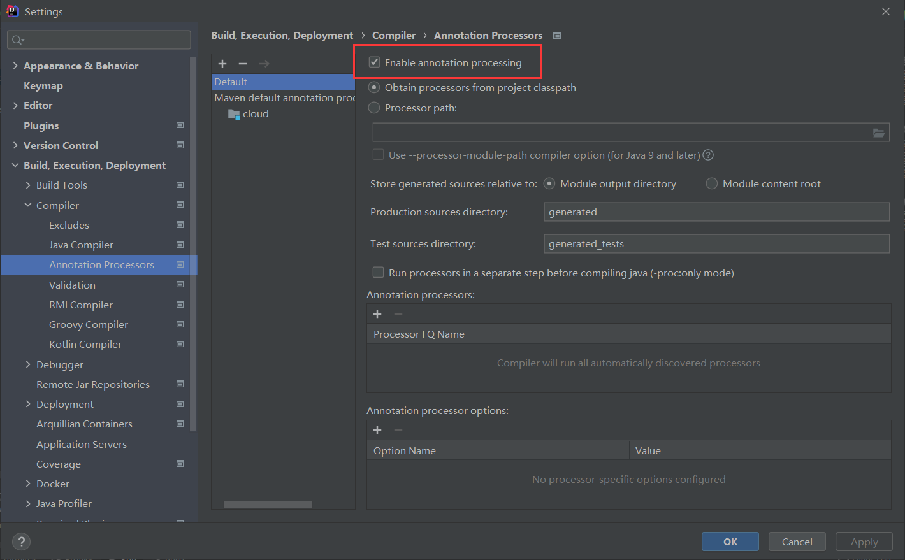
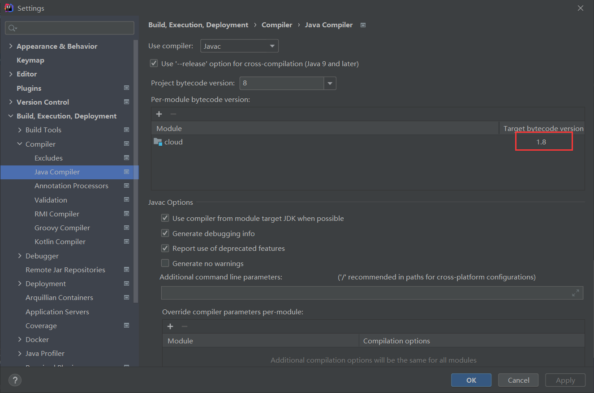
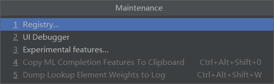
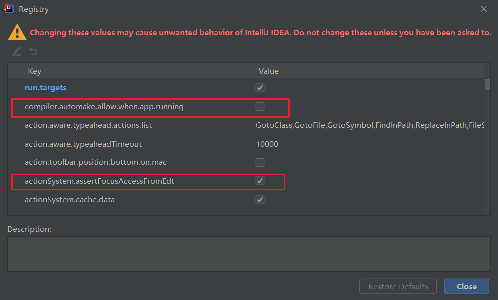

# 微服务架构编码构建

> 约定 > 配置 > 编码

## 父工程步骤

### 创建与配置

1. New Project

   

2. 聚合总父工程名字

3. Maven选版本

4. 工程名字

5. 字符编码

   

6. 注解生效激活

   

7. java编译版本选8

   

8. File Type过滤（可忽略）

9. 删除父模块的`src`文件夹

### maven配置

```xml
<?xml version="1.0" encoding="UTF-8"?>

<project xmlns="http://maven.apache.org/POM/4.0.0" xmlns:xsi="http://www.w3.org/2001/XMLSchema-instance"
  xsi:schemaLocation="http://maven.apache.org/POM/4.0.0 http://maven.apache.org/xsd/maven-4.0.0.xsd">
  <modelVersion>4.0.0</modelVersion>

  <groupId>com.chao</groupId>
  <artifactId>cloud</artifactId>
  <version>1.0-SNAPSHOT</version>
  <packaging>pom</packaging>

  <properties>
    <project.build.sourceEncoding>UTF-8</project.build.sourceEncoding>
    <maven.complier.source>1.8</maven.complier.source>
    <maven.complier.target>1.8</maven.complier.target>
    <junit.version>4.12</junit.version>
    <log4j.version>1.2.17</log4j.version>
    <lombok.version>1.16.18</lombok.version>
    <mysql.version>5.1.47</mysql.version>
    <druid.version>1.1.6</druid.version>
    <mybatis.spring.boot.version>1.3.0</mybatis.spring.boot.version>
  </properties>

  <dependencyManagement>
    <dependencies>
      <!--spring boot 2.2.2-->
      <dependency>
        <groupId>org.springframework.boot</groupId>
        <artifactId>spring-boot-dependencies</artifactId>
        <version>2.2.2.RELEASE</version>
        <type>pom</type>
        <scope>import</scope>
      </dependency>
      <!--spring cloud Hoxton.SR1-->
      <dependency>
        <groupId>org.springframework.cloud</groupId>
        <artifactId>spring-cloud-dependencies</artifactId>
        <version>Hoxton.SR1</version>
        <type>pom</type>
        <scope>import</scope>
      </dependency>
      <!--spring cloud alibaba 2.1.0.RELEASE-->
      <dependency>
        <groupId>com.alibaba.cloud</groupId>
        <artifactId>spring-cloud-alibaba-dependencies</artifactId>
        <version>2.1.0.RELEASE</version>
        <type>pom</type>
        <scope>import</scope>
      </dependency>
      <!--mysql connector-->
      <dependency>
        <groupId>mysql</groupId>
        <artifactId>mysql-connector-java</artifactId>
        <version>${mysql.version}</version>
      </dependency>
      <!--druid-->
      <dependency>
        <groupId>com.alibaba</groupId>
        <artifactId>druid</artifactId>
        <version>${druid.version}</version>
      </dependency>
      <!--log4j-->
      <dependency>
        <groupId>log4j</groupId>
        <artifactId>log4j</artifactId>
        <version>${log4j.version}</version>
      </dependency>
      <!--lombok-->
      <dependency>
        <groupId>org.projectlombok</groupId>
        <artifactId>lombok</artifactId>
        <version>${lombok.version}</version>
      </dependency>
      <!--mybatis-->
      <dependency>
        <groupId>org.mybatis.spring.boot</groupId>
        <artifactId>mybatis-spring-boot-starter</artifactId>
        <version>${mybatis.spring.boot.version}</version>
      </dependency>
      <!--junit-->
      <dependency>
        <groupId>junit</groupId>
        <artifactId>junit</artifactId>
        <version>${junit.version}</version>
        <scope>test</scope>
      </dependency>
    </dependencies>
  </dependencyManagement>
  
</project>
```

最后一点，关于maven的操作，==跳过test mode==


## 支付模块构建

### 本模块构建步骤

1. cloud-provider-payment 8001微服务提供者支付Module模块
2. 热部署`Devtools`
3. cloud-consumer-order 80 微服务消费者订单Module模块
4. 工程重构

### 微服务模块一般化步骤

1. 建 module

2. 改 pom

   ```xml
   <?xml version="1.0" encoding="UTF-8"?>
   <project xmlns="http://maven.apache.org/POM/4.0.0"
            xmlns:xsi="http://www.w3.org/2001/XMLSchema-instance"
            xsi:schemaLocation="http://maven.apache.org/POM/4.0.0 http://maven.apache.org/xsd/maven-4.0.0.xsd">
       <parent>
           <artifactId>cloud</artifactId>
           <groupId>com.chao</groupId>
           <version>1.0-SNAPSHOT</version>
       </parent>
       <modelVersion>4.0.0</modelVersion>
   
       <artifactId>cloud-provider-payment-8081</artifactId>
   
       <properties>
           <maven.compiler.source>8</maven.compiler.source>
           <maven.compiler.target>8</maven.compiler.target>
       </properties>
   
       <dependencies>
           <dependency>
               <groupId>org.springframework.boot</groupId>
               <artifactId>spring-boot-starter-web</artifactId>
           </dependency>
           <dependency>
               <groupId>org.springframework.boot</groupId>
               <artifactId>spring-boot-starter-actuator</artifactId>
           </dependency>
           <dependency>
               <groupId>org.mybatis.spring.boot</groupId>
               <artifactId>mybatis-spring-boot-starter</artifactId>
           </dependency>
           <dependency>
               <groupId>com.alibaba</groupId>
               <artifactId>druid-spring-boot-starter</artifactId>
               <version>1.1.10</version>
           </dependency>
           <dependency>
               <groupId>org.springframework.boot</groupId>
               <artifactId>spring-boot-starter-jdbc</artifactId>
           </dependency>
           <dependency>
               <groupId>org.springframework.boot</groupId>
               <artifactId>spring-boot-devtools</artifactId>
           </dependency>
           <dependency>
               <groupId>org.projectlombok</groupId>
               <artifactId>lombok</artifactId>
               <optional>true</optional>
           </dependency>
           <dependency>
               <groupId>org.springframework.boot</groupId>
               <artifactId>spring-boot-starter-test</artifactId>
               <scope>test</scope>
           </dependency>
       </dependencies>
   
   </project>
   ```

   对于`web`和`actuator`几乎永远绑定在一起，用于后面的图像化显示、坐标监控、图形处理十分重要

3. 写 yml

   1. 第一步把**端口号**和**服务名称**写上

      ```yml
      server:
        port: 8001
      
      spring:
        application:
          name: cloud-payment-service
      ```

   2. 然后数据库，持久层配置

      ```yml
      server:
        port: 8001
      
      spring:
        application:
          name: cloud-payment-service
        datasource:
          type: com.alibaba.druid.pool.DruidDataSource
          driver-class-name: org.gjt.mm.mysql.Driver
          url: jdbc:mysql://localhost:3306/spring-cloud?characterEncoding=UTF-8&serverTimezone=UTC
          username: root
          password: root
          
      mybatis:
        mapper-locations: classpath:mapper/*.xml
        type-aliases-package: com.chao.cloud.domain
      ```

4. 主启动

   ```java
   package com.chao.cloud;
   
   import org.springframework.boot.SpringApplication;
   import org.springframework.boot.autoconfigure.SpringBootApplication;
   
   /**
    * @author fangq
    */
   @SpringBootApplication
   public class PaymentMain {
   
       public static void main(String[] args) {
           SpringApplication.run(PaymentMain.class, args);
       }
   }
   ```

5. 业务类

   1. sql

      ```sql
      CREATE TABLE `payment` (
         `id` bigint(20) NOT NULL AUTO_INCREMENT,
         `serial` varchar(200) DEFAULT '',
         PRIMARY KEY (`id`)
      )ENGINE=InnoDB DEFAULT CHARSET = utf8
      ```


## 开启热部署 

1. 添加devtools到maven依赖中

```xml
<!--devtools-->
<dependency>
    <groupId>org.springframework.boot</groupId>
    <artifactId>spring-boot-devtools</artifactId>
</dependency>
```

2. 添加依赖

```xml
<build>
    <plugins>
        <plugin>
            <groupId>org.springframework.boot</groupId>
            <artifactId>spring-boot-maven-plugin</artifactId>
            <configuration>
                <fork>true</fork>
                <addResources>true</addResources>
            </configuration>
        </plugin>
    </plugins>
</build>
```

3. 开启自动编译选项


4. 修改配置

首先按住快捷键`ctrl+shift+alt+/`，然后选择registry



勾选



