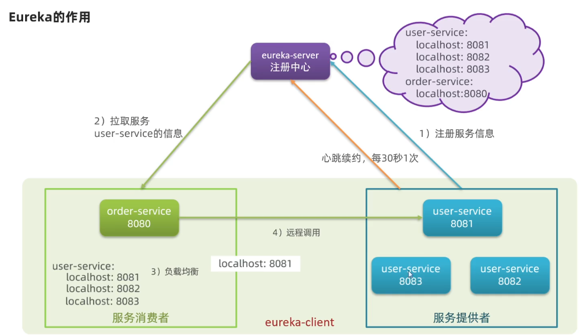
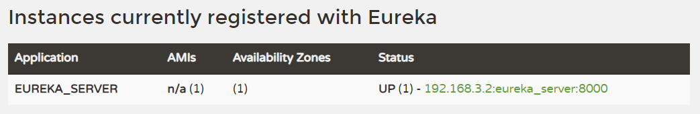
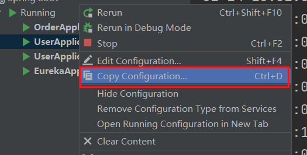
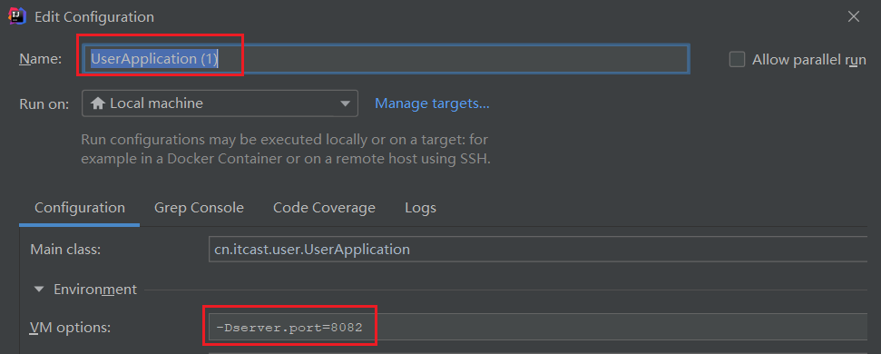

# Eureka注册中心

## 服务调用的问题

+ 服务消费者该如何获取服务提供者的地址信息?
+ 如果有多个服务提供者，消费者该如何选择?
+ 消费者如何得知服务提供者的健康状态?

## Eureka的作用

在Eureka架构中，微服务角色有两类:

+ EurekaServer:服务端，注册中心
  + 记录服务信息
  + 心跳监控
+ EurekaClient:客户端
  + Provider:服务提供者，例如案例中的user-service
    + 注册自己的信息到EurekaServer
    + 每隔30秒向EurekaServer发送心跳
  + consumer:服务消费者，例如案例中的order-service
    + 根据服务名称从EurekaServer拉取服务列表
    + 基于服务列表做负载均衡，选中一个微服务后发起远程调用



+ 服务消费者该如何获取服务提供者的地址信息?
  + 服务提供者启动时向eureka注册自己的信息
  + eureka保存这些信息
  + 消费者根据服务名称向eureka拉取提供者信息
+ 如果有多个服务提供者，消费者该如何选择?
  + 服务消费者利用负载均衡算法，从服务列表中挑选一个
+ 消费者如何得知服务提供者的健康状态?
  + 服务提供者会每隔30秒向EurekaServer发送心跳请求，报告健康状态
  + eureka会更新记录服务列表信息，心跳不正常会被剔除 
  + 消费者就可以拉取到最新的信息

## Eureka服务端搭建

1）在父项目中新建一个子模块，起名eureka-server，并引入依赖

```xml
<dependency>
    <groupId>org.springframework.cloud</groupId>
    <artifactId>spring-cloud-starter-netflix-eureka-server</artifactId>
</dependency>
```

2）创建主函数并添加Eureka启用注解

```java
@EnableEurekaServer
@SpringBootApplication
public class EurekaApplication {

    public static void main(String[] args) {
        SpringApplication.run(EurekaApplication.class, args);
    }
}
```

3）配置文件

```yml
server:
  port: 8000 # 服务端口
spring:
  application:
    name: eureka_server # eureka 服务名称
eureka:
  client:
    service-url: # eureka 地址信息
      defaultZone: http://127.0.0.1:8000/eureka
```

为什么还要在配置中配置eureka自己的地址信息，因为eureka本身就是一个服务，而到后面eureka会有自己的集群，所以这个地址配置其实就是集群的配置

最后启动主函数并访问



## 注册服务

1）给服务添加Eureka客户端依赖

```xml
<dependency>
    <groupId>org.springframework.cloud</groupId>
    <artifactId>spring-cloud-starter-netflix-eureka-client</artifactId>
</dependency>
```

2）配置yml文件

这一步需要记录Eureka服务端地址信息，保险起见直接复制服务端的配置信息

```yml
spring:
  application:
    name: order_server # eureka 服务名称
eureka:
  client:
    service-url: # eureka 服务端地址信息
      defaultZone: http://127.0.0.1:8000/eureka
```

如何想尝试同一服务多个实例注册，如下操作：



注意修改服务名和端口号`-Dserver.port=xxx`



## 服务发现

服务拉取是**基于服务名称**获取服务列表，然后在对服务列表做负载均衡

1）修改OrderService的代码，修改访问的url路径，用**服务名代替ip、端口**:

原来的操作

```java
String url = "http://localhost:8081/user" + order.getUserId();
User user = restTemplate.getForObject(url, User.class);
```

现在

```java
String url = "http://userservice/user" + order.getUserId();
User user = restTemplate.getForObject(url, User.class);
```

2）在RestTemplate上添加负载均衡注解`@LoadBalanced`

```java
@Bean
@LoadBalanced
public RestTemplate restTemplate() {
    return new RestTemplate();
}
```

## 总结

1. 搭建EurekaServer
   + 引入eureka-server依赖
   + 添加@EnableEurekaServer注解
   + 在application.yml中配置eureka地址
2. 服务注册
   + 引入eureka-client依赖
   + 在application.yml中配置eureka地址
3. 服务发现
   + 引入eureka-client依赖
   + 在application.yml中配置eureka地址
   + 给RestTemplate添加@LoadBalanced注解
   + 用服务提供者的服务名称远程调用

==需要注意的是，服务名不能有下划线==

