# Ribbon负载均衡

## 原理

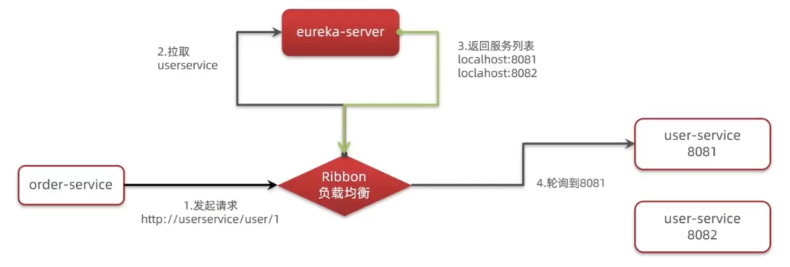

首先以服务名作为url地址在浏览器中肯定是访问不了的，所以这里面必定有一个拦截器将请求给拦截下来，下面查看源码

### 代码详解

先找到`LoadBalancerInterceptor`类，发现他继承`ClientHttpRequestInterceptor`

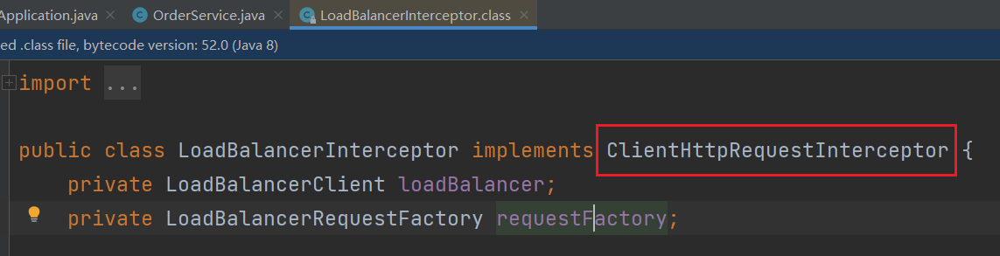

能发现`ClientHttpRequestInterceptor`就是进行HTTP拦截的

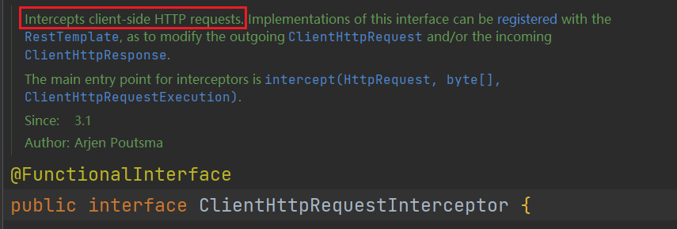

它拥有一个接口方法`intercept`如下所示

```java
ClientHttpResponse intercept(HttpRequest request, byte[] body, ClientHttpRequestExecution execution) throws IOException;
```

`LoadBalancerInterceptor`类实现了它，因此在这里打上断点方便查看

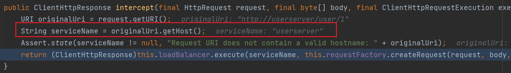

如图上图红框框住所示，在此方法中获取了服务名

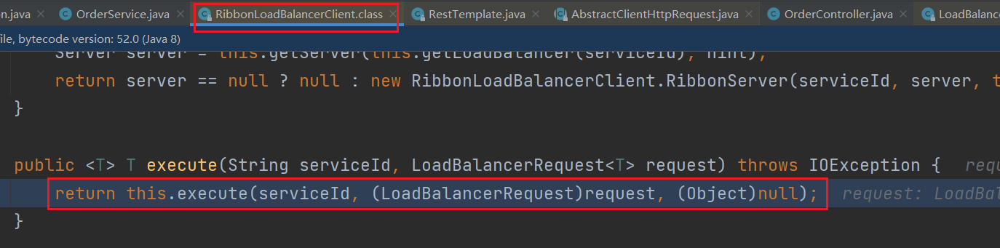

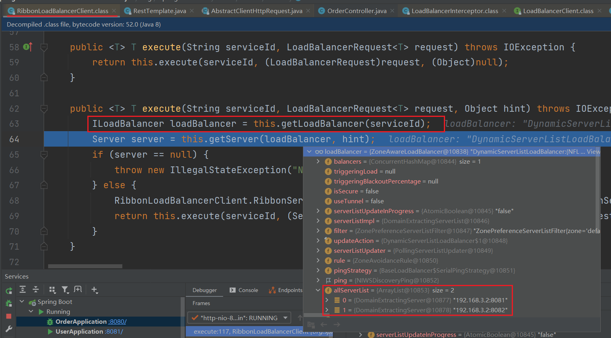

然后接着深入，发现内部能通过`getLoadBalancer`方法根据这个服务名**拉取**相对应的所有主机列表

`getLoadBalancer`方法执行完毕后，接着深入查看`getServer`方法做了什么

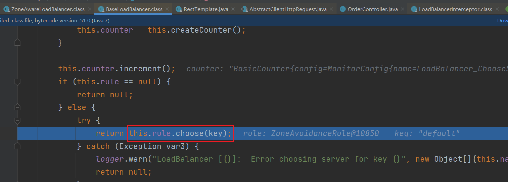

深入后发现，有一个`rule`对象

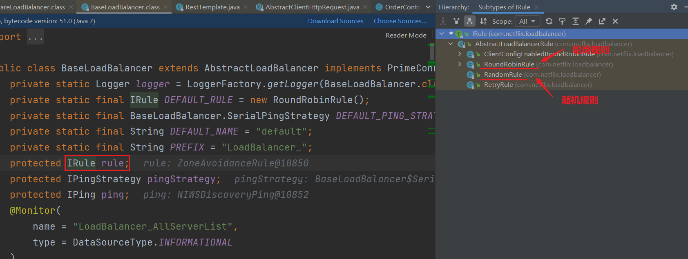

接着查看`rule`对象所属哪个类，能发现它是一个接口对象，有数个实现类，包括我们知道的轮询规则和随机规则

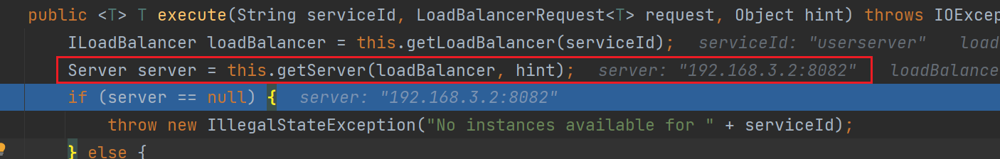

因此`getServer`的作用就是**负责均衡**，根据一定的规则选择相应的主机

### 图解流程

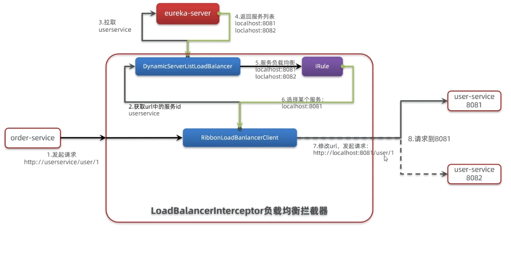

## 负载均衡策略

Ribbon的负载均衡规则是一个叫做lRule的接口来定义的，每一个子接口都是一种规则：

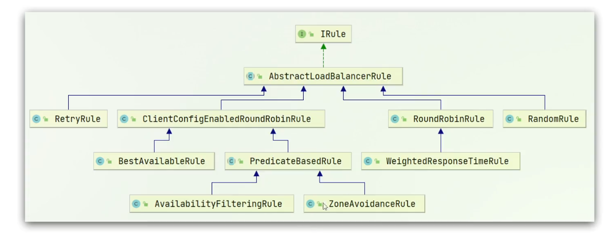

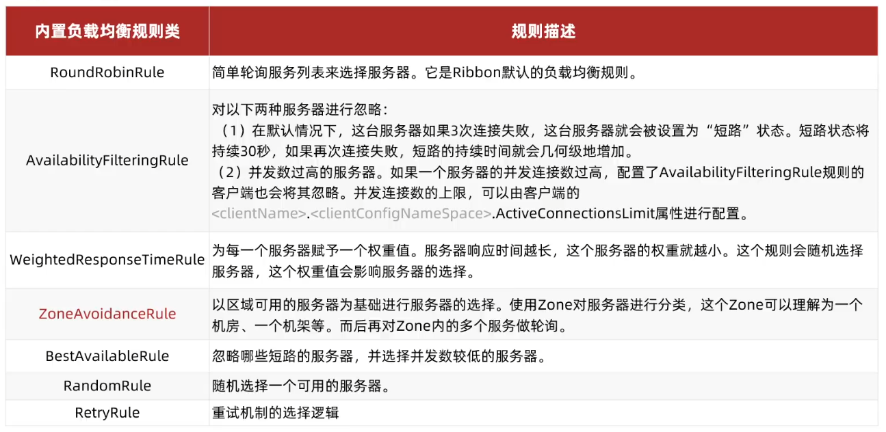

通过定义IRule实现可以修改负载均衡规则，有两种方式：

1）代码方式：在order-service中的OrderApplication类中，定义一个新的IRule:

```java
@Bean
public IRule rule() {
    return new RandomRule();
}
```

这种方法是作用于全局的，即在此模块内调用所有的微服务接口都使用这种规则

2）配置文件方式：在order-service的application.yml文件中，添加新的配置也可以修改规则

```yml
userservice:
  ribbon:
    NFLoadBalancerRuleClassName: com.netflix.loadbalancer.RandomRule
```

这种方法是作用于指定服务的

## 加载策略

由上`代码详解`可知负载均衡是通过HTTP过滤器中的`loadBalancer`实现的，而加载策略就是进行`loadBalancer`如何初始化的考虑

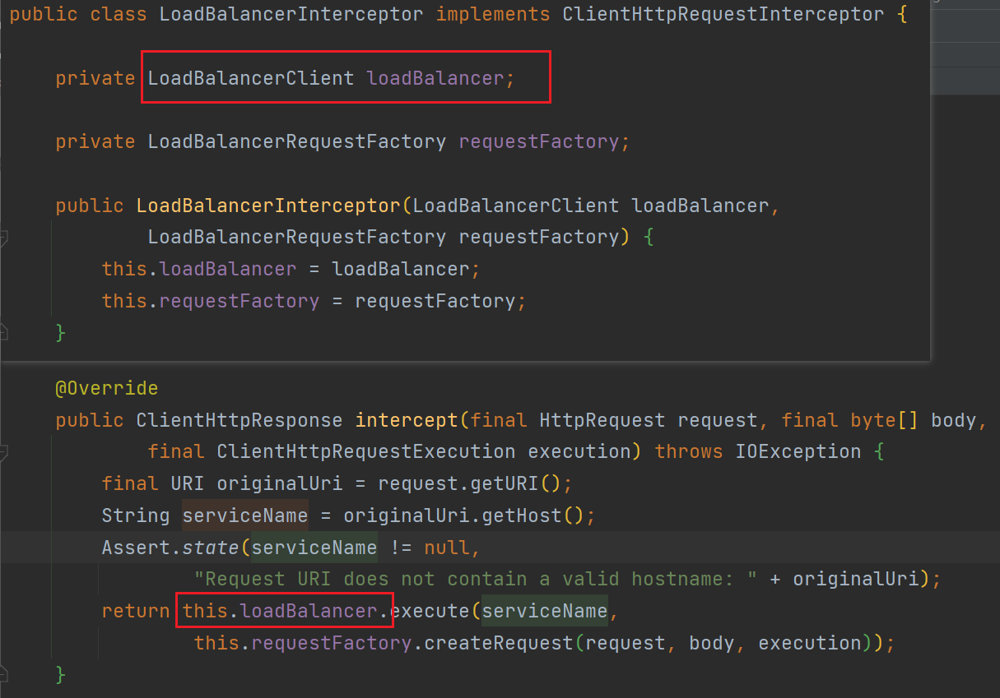

Ribbon默认是采用**懒加载**，即第一次访问时才会去创建`LoadBalanceClient`，请求时间会很长。而**饥饿加载**则会在项目启动时创建，降低第一次访问的耗时，通过下面配置开启饥饿加载：

```yml
ribbon:
  eager-load:
    enabled: true
    clients: userserver
```

## 总结

1. Ribbon负载均衡规则
+ 规则接口是IRule
+ 默认实现是ZoneAvoidanceRule，根据zone选择服务列表，然后轮询
2. 负载均衡自定义方式
   + 代码方式：配置灵活，但修改时需要重新打包发布
   + 配置方式：直观，方便，无需重新打包发布，但是无法做全局配置
3. 饥饿加载
   + 开启饥饿加载
   + 指定饥饿加载的微服务名称