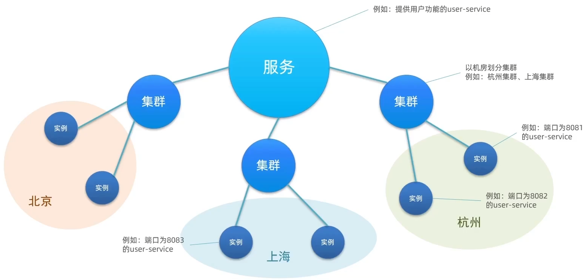
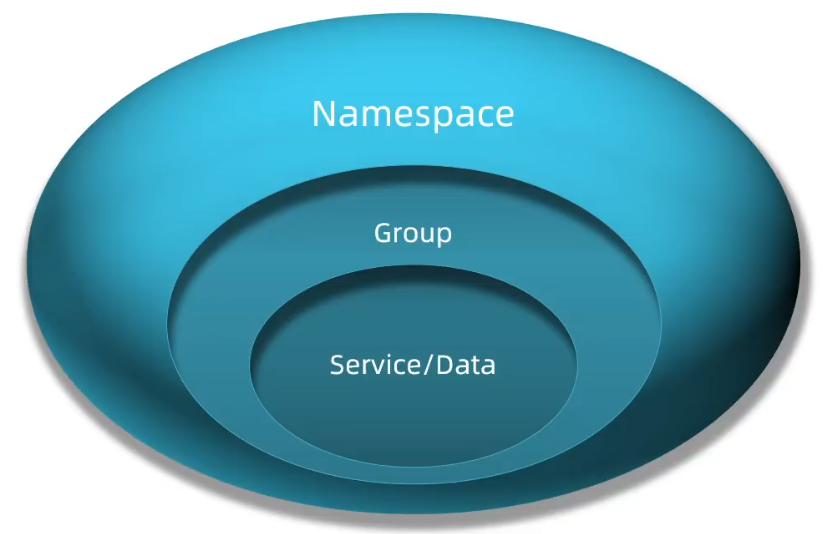
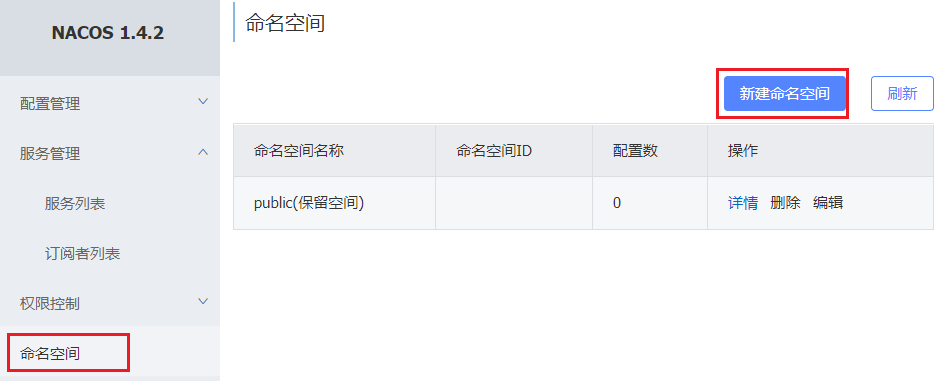
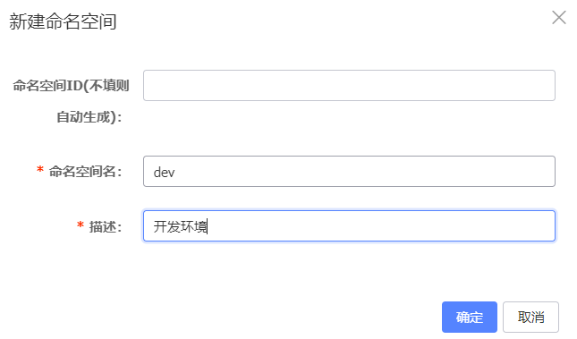
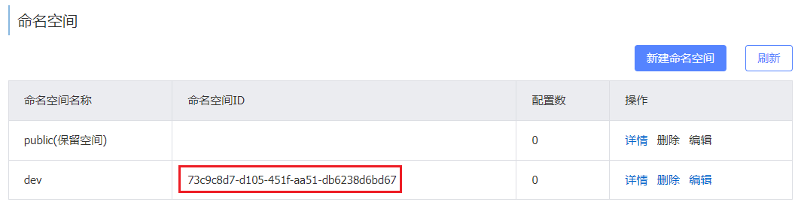
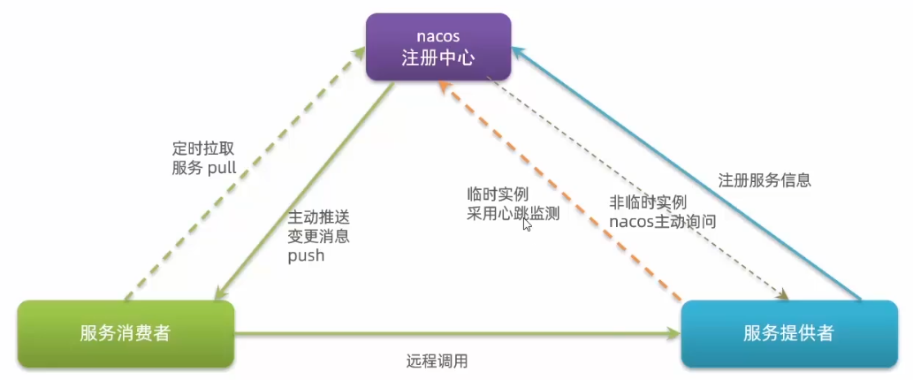

# Nacos

## 安装

1）配置端口

打开`conf`文件夹找到`application.properties`文件。其中`server.port`配置的就是端口

2）启动

+ windows命令

打开`conf`文件夹找到`startup.cmd`文件

```cmd
startup.cmd -m standalone
```

`-m standalone`：设置模式为单机模式，当然还有其他模式，如集群模式

## Nacos注册中心

### 注册服务

1）在cloud-demo父工程 中添加spring-cloud-alibaba的管理依赖

```xml
<dependency>
    <groupId>com.alibaba.cloud</groupId>
    <artifactId>spring-cloud-alibaba-dependencies</artifactId>
    <version>2.2.5.RELEASE</version>
    <type>pom</type>
    <scope>import</scope>
</dependency>
```

2）注释掉order-service和user-service中 原有的eureka依赖。

3）添加nacos的客户端依赖

```xml
<!-- nacos 依赖 -->
<dependency>
    <groupId>com.alibaba.cloud</groupId>
    <artifactId>spring-cloud-starter-alibaba-nacos-discovery</artifactId>
</dependency>
```

4）修改user-service&order-service中的application.ym文件，注释eureka地址，添加nacos地址

```yml
spring:
  cloud:
    nacos:
      server-addr: localhost:8848
```

#### 总结

1. Nacos服务搭建
+ 下载安装包
+ 解压
+ 在bin目录下运行指令: `startup.cmd -m standalone`
2. Nacos服务注册或发现
+ 引入nacos.discovery依赖
+ 配置nacos地址`spring.cloud.nacos.server-addr`

### 服务分级存储模型



**服务跨集群调用问题**

+ 服务调用尽可能选择本地集群的服务，跨集群调用延迟较高
+ 本地集群不可访问时，再去访问其它集群

#### 配置集群

1）修改application.yml

```yml
spring:
  application:
    name: userserver # eureka 服务名称
  cloud:
    nacos:
      server-addr: localhost:8848
      discovery:
        cluster-name: HZ # 配置集群名称
```

#### 总结

1. Nacos服务分级存储模型
+ 一级是服务，例如userservice
+ 二级是集群，例如杭州或.上海
+ 三级是实例，例如杭州机房的某台部署了userservice的服务器
2. 如何设置实例的集群属性
   修改application.yml文件， 添加`spring.cloud.nacos.discovery.cluster-name`属性即可

## Nacos负载均衡

### NacosRlue

在order-service的application.yml文件中指定负载均衡规则

```yml
userservice:
  ribbon:
    NFLoadBalancerRuleClassName: com.alibaba.cloud.nacos.ribbon.NacosRule
```

NacosRule可以**优先选择本地集群，在本地集群随机选择任意实例**

#### 总结

NacosRule负载均衡策略

+ 优先选择同集群服务实例列表
+ 本地集群找不到提供者，才去其它集群寻找，并且会报警告
+ 确定了可用实例列表后，再采用随机负载均衡挑选实例

### 负载权重

实际部署中会出现这样的场景：

服务器设备性能有差异，部分实例所在机器性能较好，另一-些较差，我们希望性能好的机器承担更多的用户请求

Nacos提供了权重配置来控制访问频率，权重越大则访问频率越高

修改步骤如下：

1）在Nacos控制台可以设置实例的权重值，首先选中实例后面的编辑按钮

2）将权重设置为0.1，测试可以发现该实例被访问到的频率大大降低

#### 总计

实例的权重控制

+ Nacos控制台 可以设置实例的权重值，0~1之间
+ 同集群内的多个实例，权重越高被访问的频率越高
+ 权重设置为0则完全不会被访问

## 环境隔离

Nacos中服务存储和数据存储的最外层都是一个名为namespace的东西， 用来做最外层隔离



1）在Nacos控制台可以创建namespace，用来隔离不同环境



2）填写命名空间信息



3）注意生成的命名空间id



4）修改yml配置文件

```yml
spring:
  cloud:
    nacos:
      server-addr: localhost:8848
      discovery:
        cluster-name: HZ
        namespace: 73c9c8d7-d105-451f-aa51-db6238d6bd67
```

### 总结

Nacos环境隔离

+ namespace用来做环境隔 离
+ 每个namespace都有唯一id
+ 不同namespace 下的服务不可见

## 临时实例



默认情况为临时实例，如果想修改为非临时实例可以做以下配置修改

```yml
spring:
  cloud:
    nacos:
      server-addr: localhost:8848
      discovery:
        ephemeral: false
```

### 总结

1. Nacos与eureka的共同点
  + 都支持服务注册和服务拉取
  + 都支持服务提供者心跳方式做健康检测
2. Nacos与 Eureka的区别
  + Nacos支持服务端主动检测提供者状态：临时实例采用心跳模式，非临时实例采用主动检测模式
  + 临时实例心跳不正常会被剔除，非临时实例则不会被剔除
  + Nacos支持服务列表变更的消息推送模式，服务列表更新更及时
  + Nacos集群默认采用AP方式（强调数据可用性），当集群中存在非临时实例时，采用CP模式（强调数据可靠性与一致性）; Eureka采用AP方式

