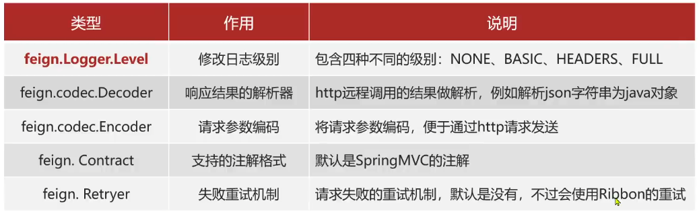
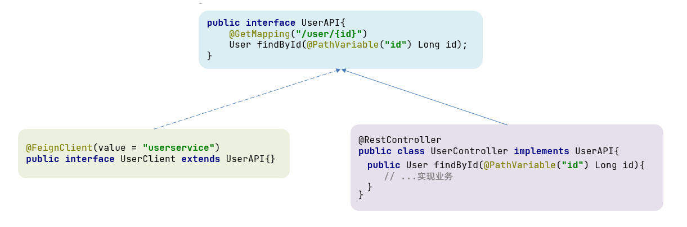

# Feign远程调用

## 问题提出

**RestTemplate方式调用存在的问题**

之前利用RestTemplate发起远程调用的代码

```java
String url = "http://userservice/user" + order.getUserId();
User user = restTemplate.getForObject(url, User.class);
```

存在下面的问题：

+ 代码可读性差，编程体验不同意
+ 参数复杂的URL难以维护

## Feign代替RestTemplate

### 定义与使用

1）引入依赖

```xml
<dependency>
    <groupId>org.springframework.cloud</groupId>
    <artifactId>spring-cloud-starter-openfeign</artifactId>
</dependency>
```

2）在启动类上添加注解开启Feign功能

```java
@EnableFeignClients
@SpringBootApplication
public class OrderApplication {
```

3）编写Fegin客户端

```java
@FeignClient("userservice")
public interface UserClient {

    @GetMapping("/user/{id}")
    User findById(@PathVariable("id") Long id);
}
```

### 总结

Feign的使用步骤

+ 引入依赖
+ 添加@EnableFeignClients注解
+ 编写FeignClient接口
+ 使用FeignClient中定义的方法代替RestTemplate

## 自定义配置

Feign运行自定义配置来覆盖默认配置,可以修改的配置如下:



一般我们要配置的就是日志级别

配置Feign日志有两种方式

方式1）配置文件方式

全局生效：

```yml
feign:
  client:
    config:
      default: # 这里用default就是全局配置，如果是写服务名称，则是针对某个微服务的配置
        loggerLevel: FULL
```

局部生效：

```yml
feign:
  client:
    config:
      userservice: # 这里用default就是全局配置，如果是写服务名称，则是针对某个微服务的配置
        loggerLevel: FULL
```

方式2）java代码方式，需要先声明一个Bean：

```java
public class FeignClientConfiguration {
	@Bean
    public Logger.Level feignLogLevel() {
        return Logger.Level.BASIC;
    }
}
```

而后如果是全局配置,则把它放到@EnableFeignClients这个注解中

```java
@EnableFeignClients(defaultConfiguration = FeignClientConfiguration.class)
```

如果是局部配置，则把它放到@FeignClient这个注解中

```java
@FeignClient(value = "userservice",
             configuration = FeignClientConfiguration.class)
```

### 总结

Feign的日志配置

1. 方式一 是配置文件, feign.client.config.xxx.loggerLevel

   + 如果xxx是default则代表全局

   + 如果xxx是服务名称，例如userservice则代表某服务

2. 方式二是java代码配置Logger.Level这个Bean

   + 如果在@EnableFeignClients注解声明则代表全局
   + 如果在@FeignClient注解中声明则代表某服务

## Feign使用优化

Feign底层的客户端实现

+ URLConnection：默认实现，不支持连接池
+ Apache HttpClient：支持连接池
+ OKHttp：支持连接池

因此优化Feign的性能主要包括

① 使用连接池代替默认的URLConnection

② 日志级别，最好用basic或none

步骤如下：

1）引入依赖

```xml
<!-- feign 的 HttpClient 支持 -->
<dependency>
    <groupId>io.github.openfeign</groupId>
    <artifactId>feign-httpclient</artifactId>
</dependency>
```

2）配置连接池

```yml
feign:
  client:
    config:
      default: # 这里用default就是全局配置，如果是写服务名称，则是针对某个微服务的配置
        loggerLevel: FULL
  httpclient:
    enabled: true # 开启feign对HttpClient的支持
    max-connections: 200 # 最大连接数
    max-connections-per-route: 50 # 每个路径的最大连接数
```

## 最佳实践

### 继承方式

一样的代码可以通过继承来共享：

1）定义一个API接口，利用定义方法，并基于SpringMVC注解做声明。

2）Feign客户端和Controller都集成改接口



优点：

- 简单
- 实现了代码共享

缺点：

- 服务提供方、服务消费方紧耦合

- 参数列表中的注解映射并不会继承，因此Controller中必须再次声明方法、参数列表、注解

### 抽取方式

将Feign的Client抽取为独立模块，并且把接口有关的POJO、默认的Feign配置都放到这个模块中，提供给所有消费者使用。

例如，将UserClient、User、Feign的默认配置都抽取到一个feign-api包中，所有微服务引用该依赖包，即可直接使用。


### 基于抽取的最佳实践

#### 抽取

首先创建一个module，命名为feign-api：


项目结构：


在feign-api中然后引入feign的starter依赖

```xml
<dependency>
    <groupId>org.springframework.cloud</groupId>
    <artifactId>spring-cloud-starter-openfeign</artifactId>
</dependency>
```


然后，order-service中编写的UserClient、User、DefaultFeignConfiguration都复制到feign-api项目中


#### 使用feign-api

首先，删除order-service中的UserClient、User、DefaultFeignConfiguration等类或接口。

在order-service的pom文件中中引入feign-api的依赖：

```xml
<dependency>
    <groupId>cn.itcast.demo</groupId>
    <artifactId>feign-api</artifactId>
    <version>1.0</version>
</dependency>
```

修改order-service中的所有与上述三个组件有关的导包部分，改成导入feign-api中的包

#### 解决扫描包问题

重启后，发现服务报错了：


这是因为UserClient现在在cn.itcast.feign.clients包下，

而order-service的@EnableFeignClients注解是在cn.itcast.order包下，不在同一个包，无法扫描到UserClient。

方式一：

指定Feign应该扫描的包：

```java
@EnableFeignClients(basePackages = "cn.itcast.feign.clients")
```

方式二：

指定需要加载的Client接口：

```java
@EnableFeignClients(clients = {UserClient.class})
```


