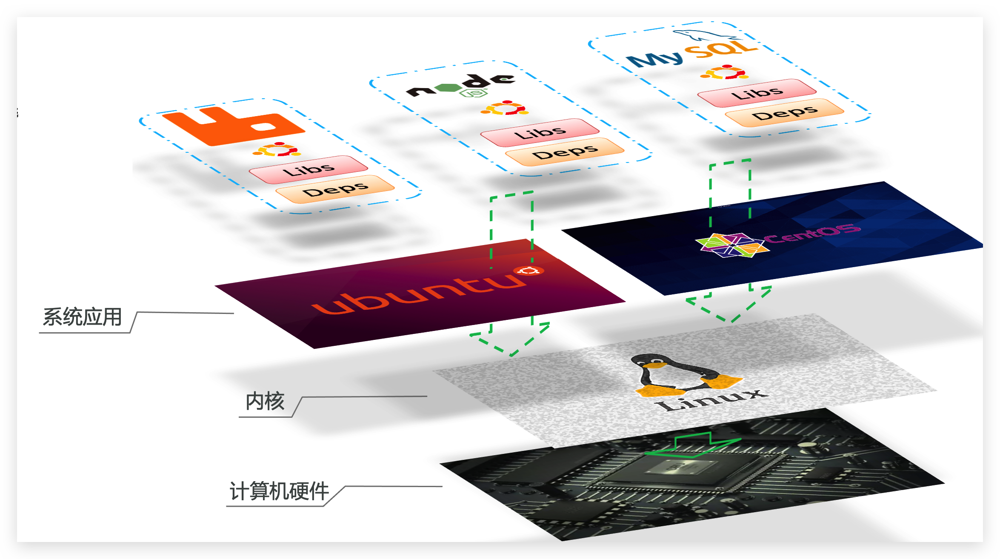

# Docker

## 初识Docker

### 什么是Docker

微服务虽然具备各种各样的优势，但服务的拆分通用给部署带来了很大的麻烦。

- 分布式系统中，依赖的组件非常多，不同组件之间部署时往往会产生一些冲突。
- 在数百上千台服务中重复部署，环境不一定一致，会遇到各种问题

#### 应用部署的环境问题

大型项目组件较多，运行环境也较为复杂，部署时会碰到一些问题：

- 依赖关系复杂，容易出现兼容性问题

- 开发、测试、生产环境有差异


例如一个项目中，部署时需要依赖于node.js、Redis、RabbitMQ、MySQL等，这些服务部署时所需要的函数库、依赖项各不相同，甚至会有冲突。给部署带来了极大的困难。

#### Docker解决依赖兼容问题

而Docker确巧妙的解决了这些问题，Docker是如何实现的呢？

Docker为了解决依赖的兼容问题的，采用了两个手段：

- 将应用的Libs（函数库）、Deps（依赖）、配置与应用一起打包

- 将每个应用放到一个隔离**容器**去运行，避免互相干扰


这样打包好的应用包中，既包含应用本身，也保护应用所需要的Libs、Deps，无需再操作系统上安装这些，自然就不存在不同应用之间的兼容问题了。

虽然解决了不同应用的兼容问题，但是开发、测试等环境会存在差异，操作系统版本也会有差异，怎么解决这些问题呢？

#### Docker解决操作系统环境差异

要解决不同操作系统环境差异问题，必须先了解操作系统结构。以一个Ubuntu操作系统为例，结构如下：


结构包括：

- 计算机硬件：例如CPU、内存、磁盘等
- 系统内核：所有Linux发行版的内核都是Linux，例如CentOS、Ubuntu、Fedora等。内核可以与计算机硬件交互，对外提供**内核指令**，用于操作计算机硬件。
- 系统应用：操作系统本身提供的应用、函数库。这些函数库是对内核指令的封装，使用更加方便。


应用于计算机交互的流程如下：

1）应用调用操作系统应用（函数库），实现各种功能

2）系统函数库是对内核指令集的封装，会调用内核指令

3）内核指令操作计算机硬件


Ubuntu和CentOSpringBoot都是基于Linux内核，无非是系统应用不同，提供的函数库有差异：


此时，如果将一个Ubuntu版本的MySQL应用安装到CentOS系统，MySQL在调用Ubuntu函数库时，会发现找不到或者不匹配，就会报错了：


Docker如何解决不同系统环境的问题？

- Docker将用户程序与所需要调用的系统(比如Ubuntu)函数库一起打包
- Docker运行到不同操作系统时，直接基于打包的函数库，借助于操作系统的Linux内核来运行

如图：




#### 小结

Docker如何解决大型项目依赖关系复杂，不同组件依赖的兼容性问题？

- Docker允许开发中将应用、依赖、函数库、配置一起**打包**，形成可移植镜像
- Docker应用运行在容器中，使用沙箱机制，相互**隔离**


Docker如何解决开发、测试、生产环境有差异的问题？

- Docker镜像中包含完整运行环境，包括系统函数库，仅依赖系统的Linux内核，因此可以在任意Linux操作系统上运行


Docker是一个快速交付应用、运行应用的技术，具备下列优势：

- 可以将程序及其依赖、运行环境一起打包为一个镜像，可以迁移到任意Linux操作系统
- 运行时利用沙箱机制形成隔离容器，各个应用互不干扰
- 启动、移除都可以通过一行命令完成，方便快捷

## Docker与虚拟机

Docker可以让一个应用在任何操作系统中非常方便的运行。而以前我们接触的虚拟机，也能在一个操作系统中，运行另外一个操作系统，保护系统中的任何应用。

两者有什么差异呢？

**虚拟机**（virtual machine）是在操作系统中**模拟**硬件设备，然后运行另一个操作系统，比如在 Windows 系统里面运行 Ubuntu 系统，这样就可以运行任意的Ubuntu应用了。

**Docker**仅仅是封装函数库，并没有模拟完整的操作系统，如图：


对比来看：


小结：

Docker和虚拟机的差异：

- docker是一个系统进程；虚拟机是在操作系统中的操作系统
- docker体积小、启动速度快、性能好；虚拟机体积大、启动速度慢、性能一般

## Dockerfile自定义镜像

常见的镜像在DockerHub就能找到，但是我们自己写的项目就必须自己构建镜像了。

而要自定义镜像，就必须先了解镜像的结构才行。

### 镜像结构

镜像是将应用程序及其需要的系统函数库、环境、配置、依赖打包而成。

我们以MySQL为例，来看看镜像的组成结构：


简单来说，镜像就是在系统函数库、运行环境基础上，添加应用程序文件、配置文件、依赖文件等组合，然后编写好启动脚本打包在一起形成的文件。


我们要构建镜像，其实就是实现上述打包的过程。


### Dockerfile语法

构建自定义的镜像时，并不需要一个个文件去拷贝，打包。

我们只需要告诉Docker，我们的镜像的组成，需要哪些BaseImage、需要拷贝什么文件、需要安装什么依赖、启动脚本是什么，将来Docker会帮助我们构建镜像。

而描述上述信息的文件就是Dockerfile文件。

**Dockerfile**就是一个文本文件，其中包含一个个的**指令(Instruction)**，用指令来说明要执行什么操作来构建镜像。每一个指令都会形成一层Layer。


更新详细语法说明，请参考官网文档： https://docs.docker.com/engine/reference/builder

### 基于Ubuntu构建Java项目

准备好jar格式的项目文件，jdk压缩包以及Dockerfile文件

其中`Dockerfile`的内容如下：

```dockerfile
# 指定基础镜像
FROM ubuntu:16.04
# 配置环境变量，JDK的安装目录
ENV JAVA_DIR=/usr/local

# 拷贝jdk和java项目的包
COPY ./jdk8.tar.gz $JAVA_DIR/
COPY ./docker-demo.jar /tmp/app.jar

# 安装JDK
RUN cd $JAVA_DIR \
 && tar -xf ./jdk8.tar.gz \
 && mv ./jdk1.8.0_144 ./java8

# 配置环境变量
ENV JAVA_HOME=$JAVA_DIR/java8
ENV PATH=$PATH:$JAVA_HOME/bin

# 暴露端口
EXPOSE 8090
# 入口，java项目的启动命令
ENTRYPOINT java -jar /tmp/app.jar
```

在当前目录运行命令，注意最后有一个`.`，表示Dockerfile所在的文件夹

```sh
docker build -t javaweb:1.0 .
```

执行完成就能创建一个image，然后按照常规方法创建一个容器

### 基于java8构建Java项目

虽然我们可以基于Ubuntu基础镜像，添加任意自己需要的安装包，构建镜像，但是却比较麻烦。所以大多数情况下，我们都可以在一些安装了部分软件的基础镜像上做改造。

例如，构建java项目的镜像，可以在已经准备了JDK的基础镜像基础上构建。

需求：基于java:8-alpine镜像，将一个Java项目构建为镜像

实现思路如下：

- ① 新建一个空的目录，然后在目录中新建一个文件，命名为Dockerfile

- ② 拷贝课前资料提供的docker-demo.jar到这个目录中

- ③ 编写Dockerfile文件：

  - a ）基于java:8-alpine作为基础镜像

  - b ）将app.jar拷贝到镜像中

  - c ）暴露端口

  - d ）编写入口ENTRYPOINT

    内容如下：

    ```dockerfile
    FROM java:8-alpine
    COPY ./app.jar /tmp/app.jar
    EXPOSE 8090
    ENTRYPOINT java -jar /tmp/app.jar
    ```

- ④ 使用docker build命令构建镜像

- ⑤ 使用docker run创建容器并运行

**小结**

1. Dockerfile的本质是一个文件，通过指令描述镜像的构建过程

2. Dockerfile的第一行必须是FROM，从一个基础镜像来构建

3. 基础镜像可以是基本操作系统，如Ubuntu。也可以是其他人制作好的镜像，例如：java:8-alpine

## Docker-Compose

Docker Compose可以基于Compose文件帮我们快速的部署分布式应用，而无需手动一个个创建和运行容器！

Compose文件是一个文本文件，通过指令定义集群中的每个容器如何运行。格式如下：

```yml
version: "3.8"

services:
  mysql:
    image: mysql:5.7.25
    environment:
    MYSQL_ROOT_PASSWORD: 123 
	volumes:
	  - "/tmp/mysql/data:/var/lib/mysql"
	  - "/tmp/mysql/conf/hmy.cnf:/etc/mysql/conf.d/hmy.cnf"
 web:
   build: .
   ports:
     - "8090:8090"

```

上面的Compose文件就描述一个项目，其中包含两个容器：

- mysql：一个基于`mysql:5.7.25`镜像构建的容器，并且挂载了两个目录
- web：一个基于`docker build`临时构建的镜像容器，映射端口时8090

DockerCompose的详细语法参考官网：https://docs.docker.com/compose/compose-file/

其实DockerCompose文件可以看做是将多个docker run命令写到一个文件，只是语法稍有差异。

### 安装

安装docker-compose，以及自动补全可以参考下列文档

+ [docker-compose: Define and run multi-container applications with Docker (github.com)](https://github.com/docker/compose)

+ [Command-line completion | Docker Documentation](https://docs.docker.com/compose/completion/)

### 部署微服务集群

**实现思路**：

① 查看课前资料提供的cloud-demo文件夹，里面已经编写好了docker-compose文件

② 修改自己的cloud-demo项目，将数据库、nacos地址都命名为docker-compose中的服务名

③ 使用maven打包工具，将项目中的每个微服务都打包为app.jar

④ 将打包好的app.jar拷贝到cloud-demo中的每一个对应的子目录中

⑤ 将cloud-demo上传至虚拟机，利用 docker-compose up -d 来部署

#### compose文件

查看课前资料提供的cloud-demo文件夹，里面已经编写好了docker-compose文件，而且每个微服务都准备了一个独立的目录：


内容如下：

```yaml
version: "3.2"

services:
  nacos:
    image: nacos/nacos-server
    environment:
      MODE: standalone
    ports:
      - "8848:8848"
  mysql:
    image: mysql:5.7.25
    environment:
      MYSQL_ROOT_PASSWORD: 123
    volumes:
      - "$PWD/mysql/data:/var/lib/mysql"
      - "$PWD/mysql/conf:/etc/mysql/conf.d/"
  userservice:
    build: ./user-service
  orderservice:
    build: ./order-service
  gateway:
    build: ./gateway
    ports:
      - "10010:10010"
```

可以看到，其中包含5个service服务：

- `nacos`：作为注册中心和配置中心
  - `image: nacos/nacos-server`： 基于nacos/nacos-server镜像构建
  - `environment`：环境变量
    - `MODE: standalone`：单点模式启动
  - `ports`：端口映射，这里暴露了8848端口
- `mysql`：数据库
  - `image: mysql:5.7.25`：镜像版本是mysql:5.7.25
  - `environment`：环境变量
    - `MYSQL_ROOT_PASSWORD: 123`：设置数据库root账户的密码为123
  - `volumes`：数据卷挂载，这里挂载了mysql的data、conf目录，其中有我提前准备好的数据
- `userservice`、`orderservice`、`gateway`：都是基于Dockerfile临时构建的


查看mysql目录，可以看到其中已经准备好了cloud_order、cloud_user表：


查看微服务目录，可以看到都包含Dockerfile文件：


内容如下：

```dockerfile
FROM java:8-alpine
COPY ./app.jar /tmp/app.jar
ENTRYPOINT java -jar /tmp/app.jar
```

#### 修改微服务配置

因为微服务将来要部署为docker容器，而容器之间互联不是通过IP地址，而是通过容器名。这里我们将order-service、user-service、gateway服务的mysql、nacos地址都修改为基于容器名的访问。

如下所示：

```yaml
spring:
  datasource:
    url: jdbc:mysql://mysql:3306/cloud_order?useSSL=false
    username: root
    password: 123
    driver-class-name: com.mysql.jdbc.Driver
  application:
    name: orderservice
  cloud:
    nacos:
      server-addr: nacos:8848 # nacos服务地址
```

#### 打包

接下来需要将我们的每个微服务都打包。因为之前查看到Dockerfile中的jar包名称都是app.jar，因此我们的每个微服务都需要用这个名称。

可以通过修改pom.xml中的打包名称来实现，每个微服务都需要修改：

```xml
<build>
  <!-- 服务打包的最终名称 -->
  <finalName>app</finalName>
  <plugins>
    <plugin>
      <groupId>org.springframework.boot</groupId>
      <artifactId>spring-boot-maven-plugin</artifactId>
    </plugin>
  </plugins>
</build>
```

打包后：


#### 拷贝jar包到部署目录

编译打包好的app.jar文件，需要放到Dockerfile的同级目录中。注意：每个微服务的app.jar放到与服务名称对应的目录，别搞错了。

user-service：


order-service：


gateway：


#### 部署

最后，我们需要将文件整个cloud-demo文件夹上传到虚拟机中，理由DockerCompose部署。

上传到任意目录：


部署：进入cloud-demo目录，然后运行下面的命令：

```sh
docker-compose up -d
```

## Docker镜像仓库 

### 搭建私有镜像仓库

搭建镜像仓库可以基于Docker官方提供的DockerRegistry来实现。

官网地址：https://hub.docker.com/_/registry

#### 简化版镜像仓库

Docker官方的Docker Registry是一个基础版本的Docker镜像仓库，具备仓库管理的完整功能，但是没有图形化界面。

搭建方式比较简单，命令如下：

```sh
docker run -d \
    --restart=always \
    --name registry	\
    -p 5000:5000 \
    -v registry-data:/var/lib/registry \
    registry
```

命令中挂载了一个数据卷registry-data到容器内的/var/lib/registry 目录，这是私有镜像库存放数据的目录。

访问http://YourIp:5000/v2/_catalog 可以查看当前私有镜像服务中包含的镜像

#### 带有图形化界面版本

使用DockerCompose部署带有图象界面的DockerRegistry，命令如下：

```yaml
version: '3.0'
services:
  registry:
    image: registry
    volumes:
      - ./registry-data:/var/lib/registry
  ui:
    image: joxit/docker-registry-ui:static
    ports:
      - 8080:80
    environment:
      - REGISTRY_TITLE=传智教育私有仓库
      - REGISTRY_URL=http://registry:5000
    depends_on:
      - registry
```

#### 配置Docker信任地址

我们的私服采用的是http协议，默认不被Docker信任，所以需要做一个配置：

```sh
# 打开要修改的文件
vi /etc/docker/daemon.json
# 添加内容：
"insecure-registries":["http://192.168.150.101:8080"]
# 重加载
systemctl daemon-reload
# 重启docker
systemctl restart docker
```

### 推送、拉取镜像

推送镜像到私有镜像服务必须先tag，步骤如下：

① 重新tag本地镜像，名称前缀为私有仓库的地址：192.168.150.101:8080/

 ```sh
docker tag nginx:latest 192.168.150.101:8080/nginx:1.0 
 ```

② 推送镜像

```sh
docker push 192.168.150.101:8080/nginx:1.0 
```

③ 拉取镜像

```sh
docker pull 192.168.150.101:8080/nginx:1.0 
```

