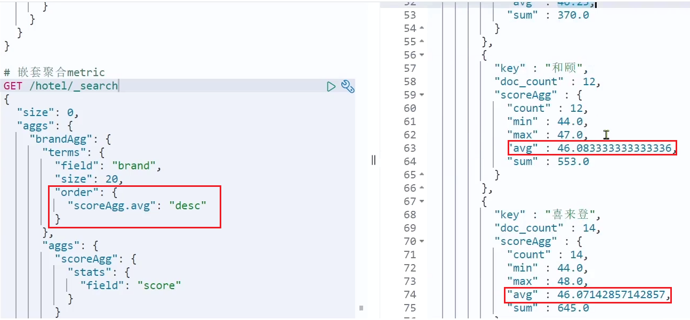

# 数据聚合

**[聚合（](https://www.elastic.co/guide/en/elasticsearch/reference/current/search-aggregations.html)[aggregations](https://www.elastic.co/guide/en/elasticsearch/reference/current/search-aggregations.html)[）](https://www.elastic.co/guide/en/elasticsearch/reference/current/search-aggregations.html)**可以让我们极其方便的实现对数据的统计、分析、运算。例如：

- 什么品牌的手机最受欢迎？
- 这些手机的平均价格、最高价格、最低价格？
- 这些手机每月的销售情况如何？

实现这些统计功能的比数据库的sql要方便的多，而且查询速度非常快，可以实现近实时搜索效果。

## 聚合的种类

聚合常见的有三类：

- **桶（Bucket）**聚合：用来对文档做分组
  - TermAggregation：按照文档字段值分组，例如按照品牌值分组、按照国家分组
  - Date Histogram：按照日期阶梯分组，例如一周为一组，或者一月为一组

- **度量（Metric）**聚合：用以计算一些值，比如：最大值、最小值、平均值等
  - Avg：求平均值
  - Max：求最大值
  - Min：求最小值
  - Stats：同时求max、min、avg、sum等
- **管道（pipeline）**聚合：其它聚合的结果为基础做聚合

> **注意：**参加聚合的字段必须是keyword、日期、数值、布尔类型

## DSL实现聚合

现在，我们要统计所有数据中的酒店品牌有几种，其实就是按照品牌对数据分组。此时可以根据酒店品牌的名称做聚合，也就是Bucket聚合。

### Bucket聚合语法

语法如下：

```json
GET /hotel/_search
{
  "size": 0,  // 设置size为0，结果中不包含文档，只包含聚合结果
  "aggs": { // 定义聚合
    "brandAgg": { //给聚合起个名字
      "terms": { // 聚合的类型，按照品牌值聚合，所以选择term
        "field": "brand", // 参与聚合的字段
        "size": 20 // 希望获取的聚合结果数量
      }
    }
  }
}
```

结果如图：


### 聚合结果排序

默认情况下，Bucket聚合会统计Bucket内的文档数量，记为_count，并且按照_count降序排序。

我们可以指定order属性，自定义聚合的排序方式：

```json
GET /hotel/_search
{
  "size": 0, 
  "aggs": {
    "brandAgg": {
      "terms": {
        "field": "brand",
        "order": {
          "_count": "asc" // 按照_count升序排列
        },
        "size": 20
      }
    }
  }
}
```

### 限定聚合范围

默认情况下，Bucket聚合是对索引库的所有文档做聚合，但真实场景下，用户会输入搜索条件，因此聚合必须是对搜索结果聚合。那么聚合必须添加限定条件。

我们可以限定要聚合的文档范围，只要添加query条件即可：

```json
GET /hotel/_search
{
  "query": {
    "range": {
      "price": {
        "lte": 200 // 只对200元以下的文档聚合
      }
    }
  }, 
  "size": 0, 
  "aggs": {
    "brandAgg": {
      "terms": {
        "field": "brand",
        "size": 20
      }
    }
  }
}
```

这次，聚合得到的品牌明显变少了：


### Metric聚合语法

上节课，我们对酒店按照品牌分组，形成了一个个桶。现在我们需要对桶内的酒店做运算，获取每个品牌的用户评分的min、max、avg等值。

这就要用到Metric聚合了，例如stat聚合：就可以获取min、max、avg等结果。

语法如下：

```json
GET /hotel/_search
{
  "size": 0, 
  "aggs": {
    "brandAgg": { 
      "terms": { 
        "field": "brand", 
        "size": 20
      },
      "aggs": { // 是brands聚合的子聚合，也就是分组后对每组分别计算
        "score_stats": { // 聚合名称
          "stats": { // 聚合类型，这里stats可以计算min、max、avg等
            "field": "score" // 聚合字段，这里是score
          }
        }
      }
    }
  }
}
```

这次的score_stats聚合是在brandAgg的聚合内部嵌套的子聚合。因为我们需要在每个桶分别计算。

另外，我们还可以给聚合结果做个排序，例如按照每个桶的酒店平均分做排序：



### 小结

aggs代表聚合，与query同级，此时query的作用是？

- 限定聚合的的文档范围

聚合必须的三要素：

- 聚合名称
- 聚合类型
- 聚合字段

聚合可配置属性有：

- size：指定聚合结果数量
- order：指定聚合结果排序方式
- field：指定聚合字段