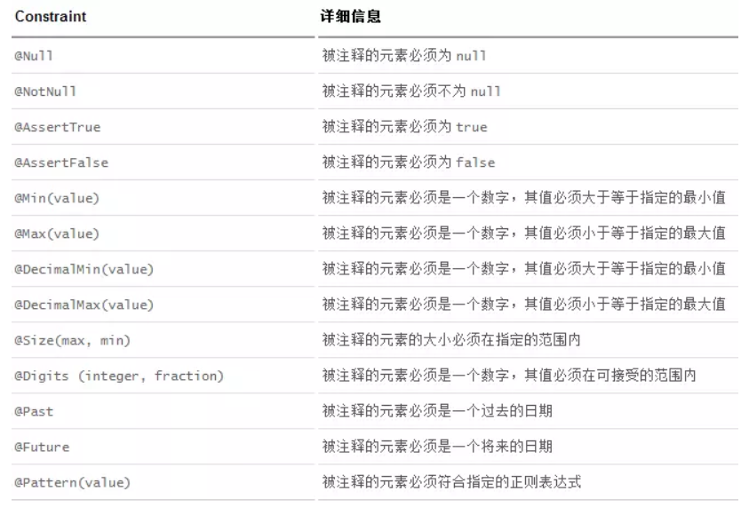
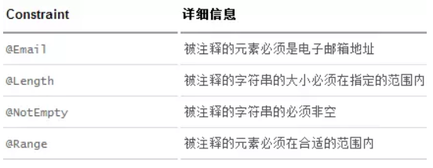
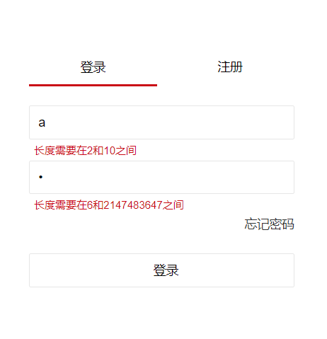
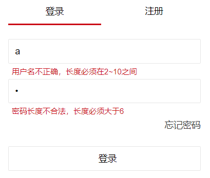
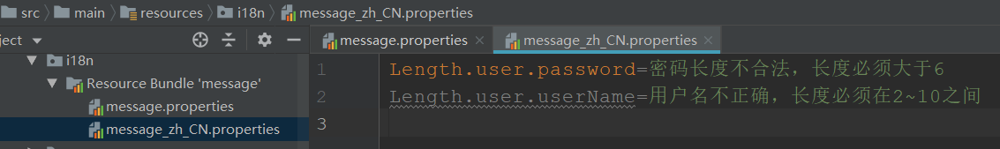
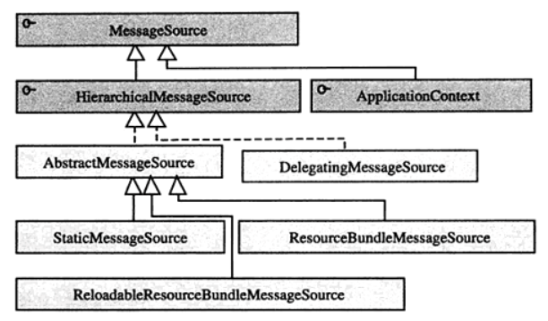

[toc]

# SpringMVC数据校验并通过国际化显示错误信息

## SpringMVC数据校验

`<mvc:annotation-driven/>`会默认装配好一个`LocalValidatorFactoryBean`，通过在处理方法的入参上标注**@Valid** 注解即可让Spring MVC在完成数据绑定后执行数据校验的工作。

首先，我们在实体类上标注JSR303校验注解

```java
public class User extends BaseDomain{
    private int userId;

	//将属性值长度限定为2~10之间，但中文占两个字符
    @Length(min = 2, max = 10)
    private String userName;
    
    //匹配4~30个数字和字母以及下划线字符
    @Pattern(regexp="w{4, 30}")
    private String name;
    
    @Length(min = 6)
    private String password;  
```

注解规则有多个可以参考下表

**JSR 303注解**



**Hibernate Validator拓展注解**



接着我们要让springMVC使用这些规则对数据进行校验，下面将使用LoginController控制器进行演示。

```java
@Controller
public class LoginController {

    @RequestMapping(value = "/login", produces="text/html;charset=UTF-8")
    public String login(
   		@Valid @ModelAttribute("user") User user, 
    	BindingResult result, HttpSession session){
        if(result.hasErrors()){
            return "forward:/loginPage";
        }else{
            session.setAttribute("user", user);
            return "home";
        }
    }
```

​	在已经标注了JSR303注解的表单/命令对象前标注一个**@Valid**，Spring MVC框架在将请求数据绑定到该入参对象后，就会调用校验框架根据注解声明的校验规则实施校验。

​	在本例中我们对User对象标注**@Valid**注解。还有要记得标注**@ModelAttribute**，并显示的指定其value值为user，在显示错误信息时我们会用到它。

​	还有一个问题就是校验所产生的校验结果保存在什么地方呢，如何传递给请求处理方法？Spring MVC是通过对处理方法签名的规约来保存校验结果的：**前一个**表单/命令对象**的校验结果**保存在**其后的入参**中，这个保存校验结果的入参必须是BindingResult 或Errors类型，这两个类都位于org.springframework.validation包中。

​	而且需校验的表单/命令对象和其绑定结果对象或错误对象是**成对出现**的，它们之间不允许声明其他的入参。

## 在页面中显示错误信息

​	由于表单/命令对象所对应的请求一般是从客户端的网页中传送过来的，如果发生了错误，我们必须通过网页显示出错误，提示用户更正错误。

```html
<div class="login-container">

        <form:form modelAttribute="user" action="login" method="post">
            <div class="login-inner">
                <div class="login-inner-item login-operaType">
                    <div class="sign-in active">登录</div>
                    <div class="sign-up">注册</div>
                </div>
                <div class="login-inner-item">
                    <input type="text" class="layui-input" placeholder="账号" name="userName" value="${user.userName}">
                    <div class="message-error">
                        <form:errors path="userName" cssClass="message-error"/>
                    </div>
                </div>
                <div class="login-inner-item">
                    <input type="password" class="layui-input" placeholder="密码" name="password" value="${user.password}">
                    <div class="message-error">
                        <form:errors path="password" cssClass="message-error"/>
                    </div>
                </div>
                <div class="login-inner-item message-error">
                    ${errorMsg}
                </div>
                <div class="login-inner-link">
                    <a href="">忘记密码</a>
                </div>
                <div class="login-inner-item .login-inner-submit">
                    <input type="submit" class="layui-input" value="登录">
                </div>
            </div>
        </form:form>
    </div>
```


首先我们修改一下form标签，并指定模型数据为user，与前面标注的@ModelAttribute一致，如下

```html
<form:form modelAttribute="user" action="login" method="post">
	...
</form:form>
```

然后使用`<form:errors />`标签来显示错误信息，path用来指定实体类中的属性，cssClass指定css样式类

```html
<form:errors path="userName" cssClass="message-error"/>
```

也可以使用如下标签显示所有的错误信息，但是不精确没必要

```html
<form:errors path="*"/>
```

接下来我们测试一下效果，如下就能显示错误信息了



​	虽然能显示错误信息，但是这些错误信息是springMVC默认的，在实际运用中我们希望使用更加人性化的设置来显示错误信息。这时我们可以给校验注解添加message属性指定错误信息。

```java
public class User extends BaseDomain{
    private int userId;

    @Length(min = 2, max = 10, message = "用户名不正确，长度必须在2~10之间")
    private String userName;

    @Length(min = 6, message = "密码长度不合法，长度必须大于6")
    private String password;
```

这样我们就能按照我们自己的想法去显示不同的错误信息，如下



​	虽然这样做成功了，能个性化的显示错误信息，但是这使用硬编码的方式依旧不推荐使用，我们希望在不修改源代码的情况下来修改这些错误信息，这时就可以使用国际化的方式来显示错误信息了。

## 通过国际化显示错误信息

当一个属性校验失败后，校验框架默认会为该属性生成4个消息代码，这些代码以**校验注解类名**为**前缀**。例如User类中的password属性标准了一个@Length注解，当该属性值不满足@pattern所定义的规则时，就会产生一下4个错误代码：

```
Length.user.password
Length.password
Length.java.lang.String
Length
```

这里我们选择最精确的一个`Length.user.password`

​	我们在类路径下添加一个文件夹`i18n`，用来存放国际化资源。然后再创建国际化资源，一个是message.properties，一个是message_zh_CH.properties，内容如下



接下来的工作是在springmvc-servlet中配置好这个国际化资源：

```xml
<bean id="messageSource" class="org.springframework.context.support.ResourceBundleMessageSource">
    <property name="basename" value="i18n.message"/>
</bean>
```

千万要注意，需要给这个bean**添加一个id**，且**其值只能是`messageSource`**，不然这个bean不会起作用。起初我配置好bean后，没给他加上id，然后配置的国际化根本不起作用，这个问题困扰我好久，最后通过查阅资料得知：

​	对Spring容器启动时的步骤进行剖析，**①处的initMessageSource()方法所执行的工作就是初始化容器中的国际化信息资源：它根据反射机制从BeanDefinitionRegistry中找出名称为“messageSource”且类型为org.springframework.context.MessageSource的Bean**，将这个Bean定义的信息资源加载为容器级的国际化信息资源。

```java
public void refresh() throws BeansException, IllegalStateException {
        synchronized(this.startupShutdownMonitor) {
            this.prepareRefresh();
            ConfigurableListableBeanFactory beanFactory = this.obtainFreshBeanFactory();
            this.prepareBeanFactory(beanFactory);

            try {
                this.postProcessBeanFactory(beanFactory);
                this.invokeBeanFactoryPostProcessors(beanFactory);
                this.registerBeanPostProcessors(beanFactory);
                //①初始化消息源
                this.initMessageSource();
                this.initApplicationEventMulticaster();
                this.onRefresh();
                this.registerListeners();
                this.finishBeanFactoryInitialization(beanFactory);
                this.finishRefresh();
            } catch (BeansException var9) {
                if (this.logger.isWarnEnabled()) {
                    this.logger.warn("Exception encountered during context initialization - cancelling refresh attempt: " + var9);
                }

                this.destroyBeans();
                this.cancelRefresh(var9);
                throw var9;
            } finally {
                this.resetCommonCaches();
            }

        }
    }
```

然后看看MessageSource类图结构



所以容器中存在ResourceBundleMessageSource这个bean，并且id为messageSource时，spring才会把这个Bean定义的信息资源加载为容器级的国际化信息资源

然后就可以把实体类中硬编码的message属性给去掉了，如下就是效果，和之前的一样


