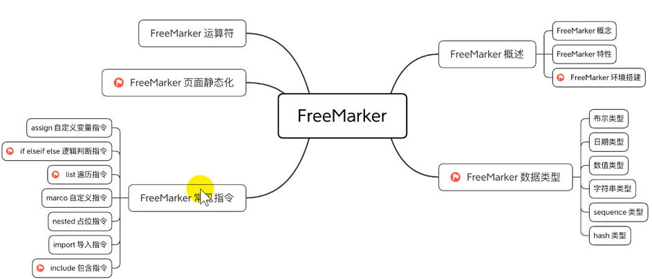
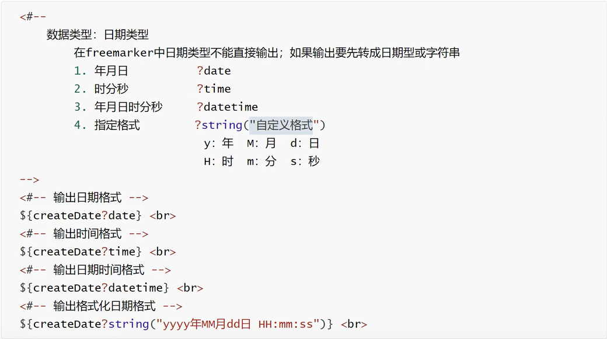
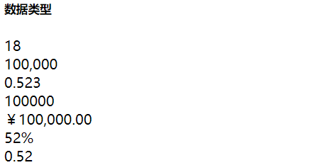
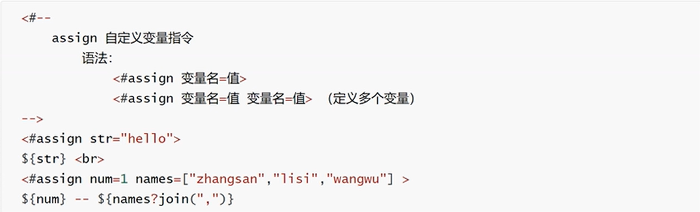
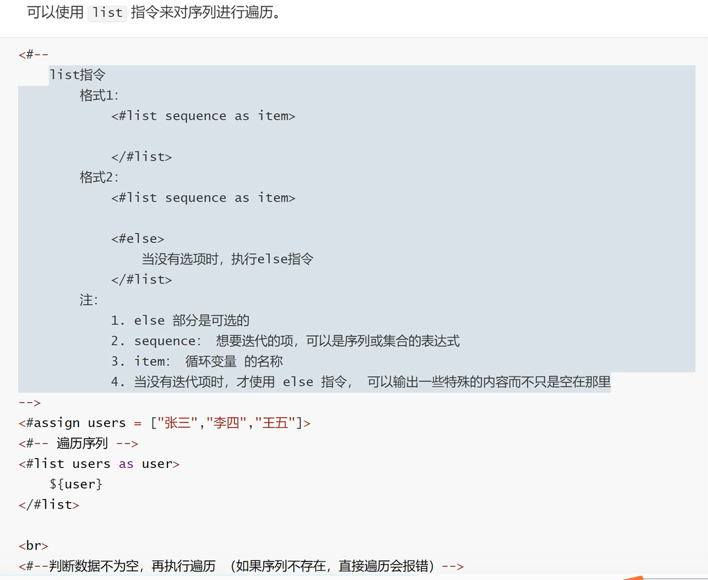
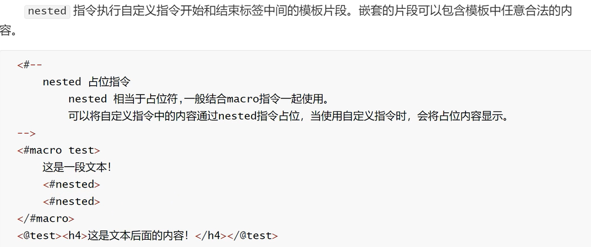
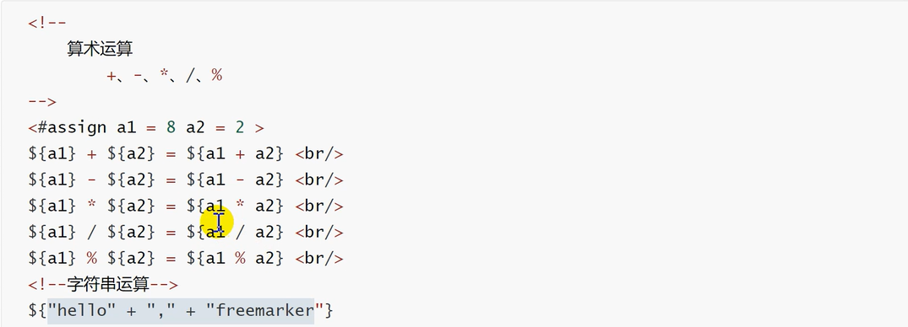
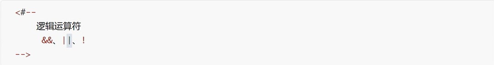
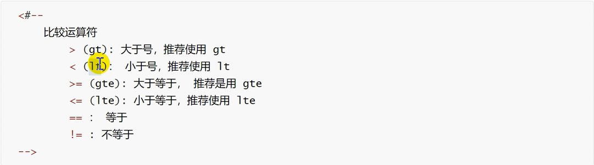
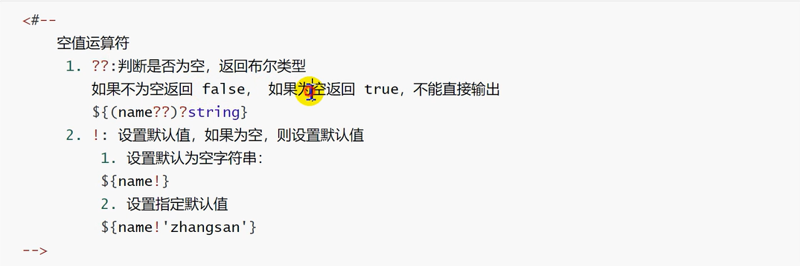

# FreeMarker

## 主要内容



## FreeMarker概述

### FreeMarker概念

FreeMarker是一款模板引擎:即一种基于模板和要改变的数据，并用来生成输出文本(HTML网页，电子邮件，配置文件，源代码等)的通用工具。是一个ava类库。

FreeMarker被设计用来生成HTML Web页面，特别是基于MVC模式的应用程序，将视图从业务逻辑中抽离处理，业务中不再包括视图的展示，而是将视图交给FreeMarker来输出。虽然FreeMarker具有一些编程的能力，但通常由Java程序准备要显示的数据，由FreeMarker生成页面，通过模板显示准备的数据


FreeMarker不是一个Web应用框架，而适合作为Web应用框架一个组件。

FreeMarker与容器无关，因为它并不知道HTTP或Servlet。FreeMarker同样可以应用于非Web应用程序环境。

FreeMarker更适合作为Model2框架（如Struts）的视图组件，你也可以在模板中使用JSP标记库。

## FreeMarker环境搭建

### 配置依赖和插件

```xml
<?xml version="1.0" encoding="UTF-8"?>

<project xmlns="http://maven.apache.org/POM/4.0.0" xmlns:xsi="http://www.w3.org/2001/XMLSchema-instance"
  xsi:schemaLocation="http://maven.apache.org/POM/4.0.0 http://maven.apache.org/xsd/maven-4.0.0.xsd">
  <modelVersion>4.0.0</modelVersion>

  <groupId>com</groupId>
  <artifactId>freemarker</artifactId>
  <version>1.0-SNAPSHOT</version>
  <packaging>war</packaging>

  <name>freemarker Maven Webapp</name>
  <!-- FIXME change it to the project's website -->
  <url>http://www.example.com</url>

  <properties>
    <project.build.sourceEncoding>UTF-8</project.build.sourceEncoding>
    <maven.compiler.source>1.7</maven.compiler.source>
    <maven.compiler.target>1.7</maven.compiler.target>
  </properties>

  <dependencies>
    <dependency>
      <groupId>junit</groupId>
      <artifactId>junit</artifactId>
      <version>4.11</version>
      <scope>test</scope>
    </dependency>
    <dependency>
      <groupId>org.freemarker</groupId>
      <artifactId>freemarker</artifactId>
      <version>2.3.30</version>
    </dependency>
    <dependency>
      <groupId>javax.servlet</groupId>
      <artifactId>javax.servlet-api</artifactId>
      <version>4.0.1</version>
    </dependency>


  </dependencies>

  <build>
    <finalName>freemarker</finalName>
    <pluginManagement><!-- lock down plugins versions to avoid using Maven defaults (may be moved to parent pom) -->
      <plugins>
        <plugin>
          <artifactId>maven-clean-plugin</artifactId>
          <version>3.1.0</version>
        </plugin>
        <!-- see http://maven.apache.org/ref/current/maven-core/default-bindings.html#Plugin_bindings_for_war_packaging -->
        <plugin>
          <artifactId>maven-resources-plugin</artifactId>
          <version>3.0.2</version>
        </plugin>
        <plugin>
          <artifactId>maven-compiler-plugin</artifactId>
          <version>3.8.0</version>
        </plugin>
        <plugin>
          <artifactId>maven-surefire-plugin</artifactId>
          <version>2.22.1</version>
        </plugin>
        <plugin>
          <artifactId>maven-war-plugin</artifactId>
          <version>3.2.2</version>
        </plugin>
        <plugin>
          <artifactId>maven-install-plugin</artifactId>
          <version>2.5.2</version>
        </plugin>
        <plugin>
          <artifactId>maven-deploy-plugin</artifactId>
          <version>2.8.2</version>
        </plugin>
      </plugins>
    </pluginManagement>
  </build>
</project>
```

### 修改配置文件 web.xml

```xml
<?xml version="1.0" encoding="UTF-8"?>
<web-app xmlns:xsi="http://www.w3.org/2001/XMLSchema-instance"
         xmlns="http://java.sun.com/xml/ns/javaee" xmlns:web="http://java.sun.com/xml/ns/javaee/web-app_3_0.xsd"
         xsi:schemaLocation="http://java.sun.com/xml/ns/javaee http://java.sun.com/xml/ns/javaee/web-app_3_0.xsd"
         id="WebApp_ID" version="3.0">

  <servlet>
    <servlet-name>freemarker</servlet-name>
    <servlet-class>freemarker.ext.servlet.FreemarkerServlet</servlet-class>
    <init-param>
      <param-name>TemplatePath</param-name>
      <param-value>/</param-value>
    </init-param>
    <init-param>
      <param-name>default_encoding</param-name>
      <param-value>UTF-8</param-value>
    </init-param>
  </servlet>
  <servlet-mapping>
    <servlet-name>freemarker</servlet-name>
    <url-pattern>*.ftl</url-pattern>
  </servlet-mapping>
</web-app>
```

## FreeMarker数据类型

### 布尔型

1、设置数据

```f#
<#-- 直接在模板中设置 -->
<#assign gender = false>
```

或者在servlet中设置

```java
req.setAttribute("flag", true);
```

2、获取数据

```f#
${flag?c}<br>
${flag?string}<br>
${flag?string('yes', 'no')}<br>
${flag?then('yes', 'no')}
```

### 日期类型



### 数值类型

```f#
<h5>数据类型</h5>
<#assign age = 18>
<#assign num = 100000>
<#assign avg = 0.523>

${age}<br>
${num}<br>
${avg}<br>

<#--将数据转化为字符串类型-->
${num?c}<br>

<#--货币类型-->
${num?string.currency}<br>

<#--百分比类型-->
${avg?string.percent}<br>

<#--指定小数位输出-->
${avg?string['0.##']}
```



### 字符类型

```f#
<h5>字符串类型</h5>
<#assign msg = 'The World Is So Big that I want to have a look!'>
<#assign msg2 = 'wokao'>
${msg}<br>

<#--截取字符串，左开右闭-->
${msg?substring(0, 5)}<br>

<#--首字母小写-->
${msg?uncap_first}<br>

<#--首字母大写-->
${msg?cap_first}<br>

<#--全部小写-->
${msg?lower_case}<br>

<#--全部大写-->
${msg?upper_case}<br>

<#--获取字符串长度-->
${msg?length}<br>

<#--是否以xx开头-->
${msg?starts_with('The')?string}<br>

<#--是否以xx结尾-->
${msg?ends_with('!')?string}<br>

<#--去除两边空白符-->
${msg?trim}<br>

<#--替换-->
${msg?replace('World', '地球')}<br>
```


### 空值处理

```F#
<h5>空值处理</h5>
<#--null和不存在的值都会报错-->
<#--<#assign str1 = null>-->
<#--${str1}-->

<#--使用 ! ?? 可以处理空值 -->
<#--使用!默认显示空字符串-->
${str2!}<br>
${str2!'wokao'}<br>

<#--??可以判断是否为空字符串，并返回布尔值-->
${(str??)?c}
```

### Sequence

序列类型

+ 数组
+ List
+ Set

```f#
<h5>序列类型</h5>

<h6>数组操作</h6>
<#list list as item>
    ${item} -- 下标: ${item?index}<br>
</#list>
序列长度：${list?size}<br>
序列第一个元素：${list?first}<br>
序列最后一个元素：${list?last}<br>

<h6>List操作</h6>
<#list cities! as city>
    ${city} -
</#list>
<br>
<#-- 倒序 -->
<#list cities!?reverse as city>
    ${city} -
</#list>
<br>
<#--升序-->
<#list cities!?sort as city>
    ${city} -
</#list>
<br>
<#--  降序  -->
<#list cities!?sort?reverse as city>
    ${city} -
</#list>

<h6>对象类型</h6>
<#list users as user>
    编号：${user.id} &nbsp; 姓名：${user.username} &nbsp; 密码：${user.password}<br>
</#list>

<#list users?sort_by('password') as user>
    编号：${user.id} &nbsp; 姓名：${user.username} &nbsp; 密码：${user.password}<br>
</#list>

<h6>Map类型</h6>
<#list maps?keys as key>
    ${key} -- ${maps[key]}<br>
</#list>

<#list maps?values as val>
    ${val}<br>
</#list>
```

## FreeMarker常见指令

### assign



```f#
<h5>assign 定义变量</h5>

<#--定义单个变量-->
<#assign str = 'hello'>
${str} <br>

<#--定义多个变量-->
<#assign num = 1 names = ['张三', '李四', '王五']>

${num}<br>

<#list names as name>
    ${name} -
</#list>

<br>

${names?join(',')}<br>
```

### if、else、elseif

```f#
<h5>if, else, elseif逻辑判断指令</h5>

<#assign score = 98>
<#if (score < 60)>
    菜狗
    <#elseif (score < 70)>
    及格就好/kb
    <#elseif (score < 80)>
    勉强可以
    <#elseif (score < 90)>
    可以的小老弟
    <#else >
    牛逼呀，我靠
</#if>
```

### list



### macro

<#…>表示freemarker内建的指令，比如<#macro>、<#if>、<#list>、<#assign>。

<@…>表示用户自定义的指令，自定义指令要先用<#macro>宏来定义。

```f#
<h5>macro 自定义指令</h5>

<#macro address>
    <h7>@1999-2015 HeMOu copyright</h7>
</#macro>

<@address></@address>
<@address></@address>

<#macro showName name>
    你好 ${name}<br>
</#macro>

<#macro showInfo id name age>
    id: ${id} - name: ${name} - age: ${age}
</#macro>

<@showName '土狗'></@showName>
<@showInfo '1' 'hemou' '21'></@showInfo>
<br>

<#macro cbf>
    <#list 1..9 as i>
        <#list 1..i as j>
            ${j} * ${i} = ${j*i} &nbsp;
        </#list>
        <br>
    </#list>
</#macro>

<@cbf></@cbf>

<#macro cbf2 num>
    <#list 1..num as i>
        <#list 1..i as j>
            ${j} * ${i} = ${j*i} &nbsp;
        </#list>
        <br>
    </#list>
</#macro>

<@cbf2 11></@cbf2>
```

### nested



### import include

```f#
<#import 'f03.ftl' as f3>

<@f3.cbf2 15></@f3.cbf2>

<#include 'common.ftl'>
```

## FreeMarker页面静态化

### 创建模板对象

```html
<!doctype html>
<html>
<head>
    <meta charset="UTF-8">
</head>
<body>
    <h2 align="center">${title}</h2>
    <p align="center">
        新闻来源：${source} &nbsp;&nbsp;
        发布时间：${pubTime}
    </p>
    <p style="text-indent: 2em">
        ${content}
    </p>
</body>
</html>
```

### 配置

```java
@WebServlet("/news")
public class NewsServlet extends HttpServlet {

    @Override
    protected void service(HttpServletRequest req, HttpServletResponse resp) throws ServletException, IOException {
        // 实例化模板对象
        Configuration configuration = new Configuration();
        // 设置加载模板的上下文以及加载模板路径
        configuration.setServletContextForTemplateLoading(getServletContext(), "/template");
        // 设置模板编码格式
        configuration.setDefaultEncoding("UTF-8");
        // 加载模板文件 获取模板对象
        Template template = configuration.getTemplate("news.ftl");
        // 设置数据模型
        Map<String, Object> map = new HashMap<>();
        map.put("title", "疫情防控平台");
        map.put("source", "中国人民网");
        map.put("pubTime", "2020年9月26日");
        map.put("content", "我靠无情！");
        // 生成
        String basePath = req.getServletContext().getRealPath("/");
        File path = new File(basePath + "/html");
        // 判断文件路劲是否存在
        if(!path.exists())path.mkdirs();
        // 生成不重复的文件名
        String filename = System.currentTimeMillis() + ".html";
        File file = new File(path, filename);
        System.out.println(file.getAbsolutePath());
        FileWriter writer = new FileWriter(file);
        try {
            template.process(map, writer);
            writer.flush();
        } catch (TemplateException e) {
            e.printStackTrace();
        } finally {
            writer.close();
        }
    }
}
```

## FreeMarker运算符

### 算术运算符



### 逻辑运算符



### 比较运算符



### 控制运算符

