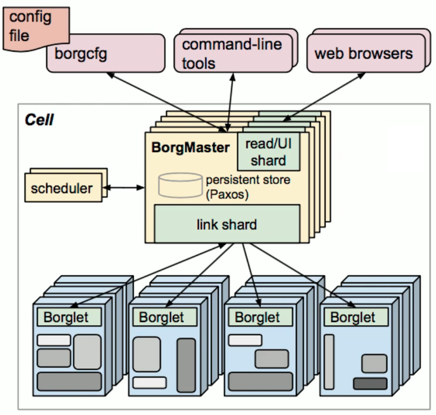
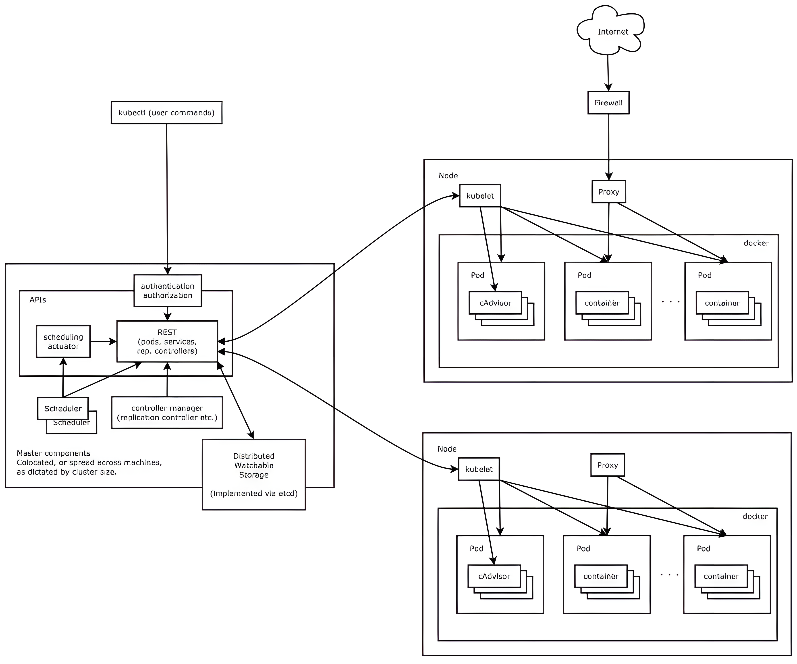
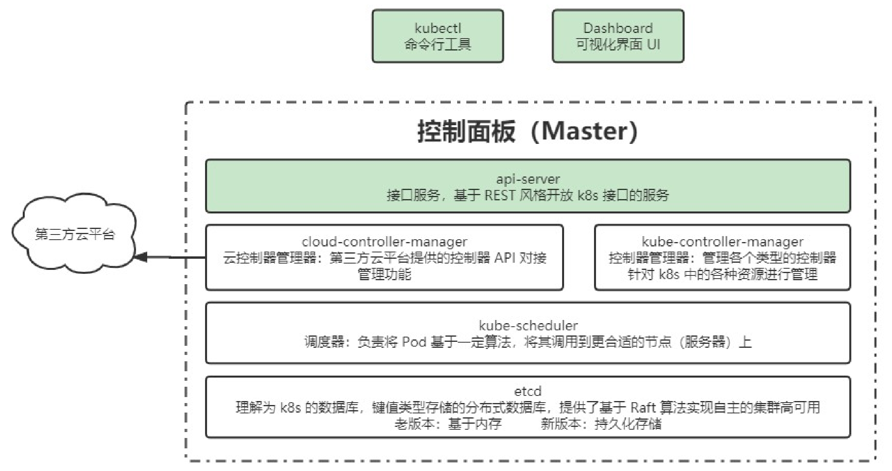
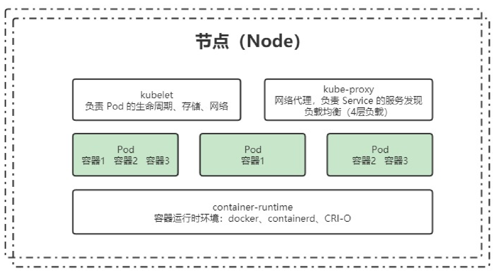
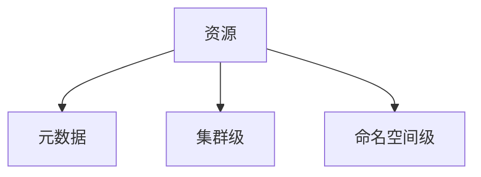
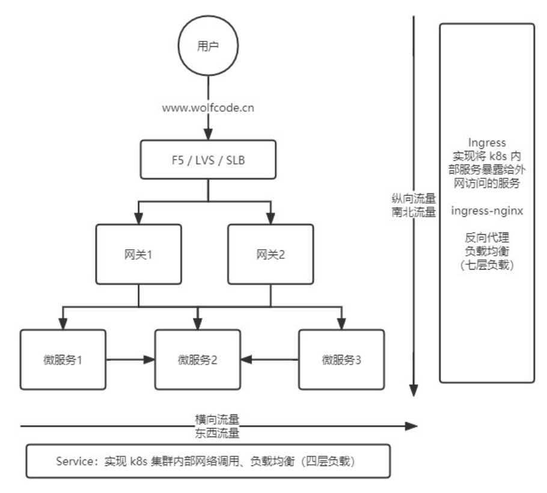

# k8s核心概念

## 认识k8s

### 什么是k8s

**Kubernetes** 是一个开源的，用于管理云平台中多个主机上的容器化的应用，Kubernetes 的目标是让部署容器化的应用简单并且高效（powerful），Kubernetes 提供了应用部署，规划，更新，维护的一种机制。是一个全新的基于容器技术的分布式架构领先方案，是谷歌严格保密十几年的秘密武器Borg系统的一个开源版本，于2014年9月发布第一个版本，2015年7月发布第一个正式版本。

kubernetes的本质是一组服务器集群，它可以在集群的每个节点上运行特定的程序，来对节点中的容器进行管理。目的是实现资源管理的自动化，主要提供了如下的主要功能：

+ 自我修复：一旦某一个容器崩溃，能够在1秒中左右迅速启动新的容器
+ 弹性伸缩：可以根据需要，自动对集群中正在运行的容器数量进行调整
+ 服务发现：服务可以通过自动发现的形式找到它所依赖的服务
+ 负载均衡：如果一个服务起动了多个容器，能够自动实现请求的负载均衡
+ 版本回退：如果发现新发布的程序版本有问题，可以立即回退到原来的版本
+ 存储编排：可以根据容器自身的需求自动创建存储卷

简单来说 k8s 就是一种管理容器化应用的平台。

> **Kubernetes** 这个名字源于希腊语，意为“舵手”或“飞行员”。k8s 这个缩写是因为 k 和 s 之间有八个字符的关系。

### 为什么需要k8s

在部署应用程序的方式上，主要经历了三个时代：

+ 传统部署：互联网早期，会直接将应用程序部署在物理机上

  + 优点：简单，不需要其它技术的参与

  + 缺点：不能为应用程序定义资源使用边界，很难合理地分配计算资源，而且程序之间容易产生影响

+ 虚拟化部署：可以在一台物理机上运行多个虚拟机，每个虚拟机都是独立的一个环境
  + 优点：程序环境不会相互产生影响，提供了一定程度的安全性
  + 缺点：增加了操作系统，浪费了部分资源
+ 容器化部署：可以理解为轻量级的虚拟化，直接共享主机硬件资源，只是通过系统提供的命名空间等技术实现资源隔离，损耗更小，且效率更高。
  + 优点：
    + 可以保证每个容器拥有自己的文件系统、CPU、内存、进程空间等
    + 运行应用程序所需要的资源都被容器包装，并和底层基础架构解耦
    + 容器化的应用程序可以跨云服务商、跨Linux操作系统发行版进行部署

### 企业级容器调度平台

+ Mesos
  + 基本概念：Mesos 是一个分布式调度系统内核，早于 Docker 产生，Mesos 作为资源管理器，从 DC/OS (数据中心操作系统)的角度提供资源视图。主/从结构工作模式，主节点分配任务，并用从节点上的 Executor 负责执行，通过 Zookeeper 给主节点提供服务注册、服务发现功能。通过 Framework Marathon 提供容器调度的能力。
  + 优势：
    + 经过时间的检验，作为资源管理器的 Apache Mesos 在容器之前就已经出现很久了，支持运行容器化化和非容器化的工作负载。可以支持应用程序的健康检查，开放的架构。支持多个框架和多个调度器，通过不同的 Framework 可以运行 Haddop/Spark/MPI等多种不同的任务。
    + 支持超大型规模的节点管理，模拟测试支持超过 5w+ 节点，在大规模上拥有较大优势。
+ Swarm
  + 基本概念：Docker Swarm 是一个由 Docker 开发的调度框架。由 Docker 自身开发的好处之一就是标准 Docker API 的使用，Swarm 由多个代理（Agent）组成，把这些代理称之为节点（Node）。这些节点就是主机，这些主机在启动 Docker Daemon 的时候就会打开相应的端口，以此支持 Docker 远程 API。这些机器会根据 Swarm 调度器分配给它们的任务，拉取和运行不同的镜像。
  + 优势：
    + 从 Docker1.12 版本开始，Swarm 随 Docker 一起默认安装发布。由于随 Docker 引擎一起发布，无需额外安装，配置简单。支持服务注册、服务发现，内置 Overlay Network 以及 Load Balancer。与 Docker CLI 非常类似的操作命令，对熟悉 Docker 的人非常容易上手学习。
    + 入门门槛、学习成本较低，使用更便捷，适用于中小型系统。
+ Kubernetes：
  + 基本概念：
    + Kubernetes 是基于 Google 在过去十五年来大量生产环境中运行工作负载的经验。Kubernetes 的实现参考了 Google 内部的资源调度框架，但并不是 Borg 的内部容器编排系统的开源，而是借鉴 Google 从运行 Borg 获得的经验教训，形成了 Kubernetes 项目。
    + 它使用 Label 和 Pod 的概念来将容器划分为逻辑单元。Pods 是同地协作（co-located）容器的集合，这些容器被共同部署和调度，形成了一个服务，这是 Kubernetes 和其他两个框架的主要区别。相比于基于相似度的容器调度方式（就像 Swarm 和Mesos），这个方法简化了对集群的管理。
  + 优势
    + 最流行等容器编排解决方案框架，基于 Google 庞大的生态圈及社区产生的产品。通过 Pods 这一抽象的概念，解决 Container 之间的依赖于通信问题。Pods，Services，Deployments 是独立部署的部分，可以通过 Selector 提供更多的灵活性。内置服务注册表和负载平衡。
    + 适用度更广，功能更强大，相较于 Mesos 来说节点规模较小，

## 集群架构

### Borg

Borg 是 Google 内部使用了很多年的一个容器化应用管理平台，而 k8s 是根据它的使用经验教训进一步开发出来的，因此可以先了解一下 Borg 的架构，如下：

Cell 作为 Borg 系统的核心，而 borgcfg、command-line tools、web browsers 作为外部的调用方式

Borg 系统系统的核心可以认为是一个主从架构：

+ 主节点 BorgMaster 
  + 可以做一些持久化的存储
  + 用来派发一些任务给从节点
+ 从节点：具体做一些任务
+ 调度器 scheduler：根据一定的算法去找到相应的从节点执行一些任务

### k8s

k8s 类似 Borg，kubectl 调用 Master components

+ Master：
  + kubectl 经过认证后，通过 REST 对 Node 进行一系列的操作
  + **Master 内部的操作全部是通过 REST API 接口完成的，可以把他看做 k8s 的中心**
  + 也可以进行一些分布式的存储工作
  + Master 既可以做主节点，又可以做从节点，需要一定的配置
+ Node：
  + Master 旗下有若干个 Node，每个 Node 包含 kubelet、Proxy、Docker(最新好像不包含) 等组件
  + kubelet：负责接口调用的功能
  + Node 内部拥有 Pod，去执行一些具体的任务

## 组件

> 一个kubernetes集群主要是由**控制节点(master)**、**工作节点(node)**构成，每个节点上都会安装不同的组件。

### 控制面板组件 Master

master：集群的控制平面，负责集群的决策 ( 管理 )

+ ApiServer : 资源操作的唯一入口，接收用户输入的命令，提供认证、授权、API注册和发现等机制
+ Scheduler : 负责集群资源调度，按照预定的调度策略将Pod调度到相应的node节点上
+ ControllerManager : 负责维护集群的状态，比如程序部署安排、故障检测、自动扩展、滚动更新等
+ Etcd ：负责存储集群中各种资源对象的信息

### 节点组件

node：集群的数据平面，负责为容器提供运行环境 ( 干活 )

+ Kubelet : 负责维护容器的生命周期，即通过控制docker，来创建、更新、销毁容器
+ KubeProxy : 负责提供集群内部的服务发现和负载均衡
+ container-runtime: 负责节点上容器的各种操作

### 其他组件

- kube-dns：负责为整个集群提供 DNS 服务，通过服务名找到对应的 id
- Ingress Controller：为服务提供外网入口，让外部网络访问到内部节点
- Prometheus：提供资源监控
- Dashboard：提供 GUI
- Federation：提供跨可用区的集群，集群间的调度
- Fluentd-elasticsearch：提供集群日志采集、存储与查询

### 分层架构

- 生态系统：在接口层之上的庞大容器集群管理调度的生态系统，可以划分为两个范畴：
  - Kubernetes 外部：日志、监控、配置管理、CI、CD、Workflow、FaaS、OTS 应用、ChatOps 等
  - Kubernetes 内部：CRI、CNI、CVI、镜像仓库、Cloud Provider、集群自身的配置和管理等
- 接口层：kubectl 命令行工具、客户端 SDK 以及集群联邦
- 管理层：系统度量（如基础设施、容器和网络的度量），自动化（如自动扩展、动态 Provision 等）以及策略管理（RBAC、Quota、PSP、NetworkPolicy 等）
- 应用层：部署（无状态应用、有状态应用、批处理任务、集群应用等）和路由（服务发现、DNS 解析等）
- 核心层：Kubernetes 最核心的功能，对外提供 API 构建高层的应用，对内提供插件式应用执行环境

## 核心概念与专业术语

### 服务的分类

- 无状态：不会对本地环境产生任何依赖，例如不会存储数据到本地磁盘
  - 代表应用
    - Nginx
    - Apache
  - 优点：对客户端透明，无依赖关系，可以高效实现扩容、迁移
  - 缺点：不能存储数据，需要额外的数据服务支撑
- 有状态：会对本地环境产生依赖
  - 代表应用
    - MySQL
    - Redis
  - 优点：可以独立存储数据，实现数据管理
  - 缺点：集群环境下需要实现主从、数据同步、备份、水平扩容复杂

### 资源和对象

> Kubernetes 中的所有内容都被抽象为“资源”，如 Pod、Service、Node 等都是资源。“对象”就是“资源”的实例，是持久化的实体。如某个具体的 Pod、某个具体的 Node。Kubernetes 使用这些实体去表示整个集群的状态。
>
>  对象的创建、删除、修改都是通过 “Kubernetes API”，也就是 “Api Server” 组件提供的 API 接口，这些是 RESTful 风格的 Api，与 k8s 的“万物皆对象”理念相符。命令行工具 “kubectl”，实际上也是调用 kubernetes api。
>
>  K8s 中的资源类别有很多种，kubectl 可以通过配置文件来创建这些 “对象”，配置文件更像是描述对象“属性”的文件，配置文件格式可以是 “JSON” 或 “YAML”，常用 “YAML”。

#### 元数据型

*对于资源的元数据描述， 每一个资源都可以使用元空间的数据*

+ Horizontal Pod Autoscaler（HPA）：Pod 自动扩容：可以根据 CPU 使用率或自定义指标（metrics）自动对 Pod 进行扩/缩容。
  - 控制管理器每隔30s（可以通过–horizontal-pod-autoscaler-sync-period修改）查询metrics的资源使用情况
  - 支持三种metrics类型
    - 预定义metrics（比如Pod的CPU）以利用率的方式计算
    - 自定义的Pod metrics，以原始值（raw value）的方式计算
    - 自定义的object metrics
  - 支持两种metrics查询方式：Heapster和自定义的REST API
  - 支持多metrics
+ PodTemplate
  + Pod Template 是关于 Pod 的定义，但是被包含在其他的 Kubernetes 对象中（例如 Deployment、StatefulSet、DaemonSet 等控制器）。控制器通过 Pod Template 信息来创建 Pod。
+ LimitRange
  + 可以对集群内 Request 和 Limits 的配置做一个全局的统一的限制，相当于批量设置了某一个范围内（某个命名空间）的 Pod 的资源使用限制。

#### 集群级

- Namespace
  - Kubernetes 支持多个虚拟集群，它们底层依赖于同一个物理集群，这些虚拟集群被称为命名空间。
  - 作用是用于实现多团队/环境的资源隔离。
  - 命名空间 namespace 是 k8s 集群级别的资源，可以给不同的用户、租户、环境或项目创建对应的命名空间。
  - 默认 namespace：
    - kube-system 主要用于运行系统级资源，存放 k8s 自身的组件
    - kube-public 此命名空间是自动创建的，并且可供所有用户（包括未经过身份验证的用户）读取。此命名空间主要用于集群使用，关联的一些资源在集群中是可见的并且可以公开读取。此命名空间的公共方面知识一个约定，但不是非要这么要求。
    - default 未指定名称空间的资源就是 default，即你在创建pod 时如果没有指定 namespace，则会默认使用 default
- Node
  - 不像其他的资源（如 Pod 和 Namespace），Node 本质上不是Kubernetes 来创建的，Kubernetes 只是管理 Node 上的资源。虽然可以通过 Manifest 创建一个Node对象（如下 json 所示），但 Kubernetes 也只是去检查是否真的是有这么一个 Node，如果检查失败，也不会往上调度 Pod。
- ClusterRole
  - ClusterRole 是一组权限的集合，但与 Role 不同的是，ClusterRole 可以在包括所有 Namespace 和集群级别的资源或非资源类型进行鉴权。
- ClusterRoleBinding
  - ClusterRoleBinding：将 Subject 绑定到 ClusterRole，ClusterRoleBinding 将使规则在所有命名空间中生效。

#### 命名空间 ★★★

##### 工作负载型(Pod)

> Pod（容器组）是 Kubernetes 中最小的可部署单元。一个 Pod（容器组）包含了一个应用程序容器（某些情况下是多个容器）、存储资源、一个唯一的网络 IP 地址、以及一些确定容器该如何运行的选项。Pod 容器组代表了 Kubernetes 中一个独立的应用程序运行实例，该实例可能由单个容器或者几个紧耦合在一起的容器组成。
>
> Docker 是 Kubernetes Pod 中使用最广泛的容器引擎；Kubernetes Pod 同时也支持其他类型的容器引擎。
> Kubernetes 集群中的 Pod 存在如下两种使用途径：
>
> - 一个 Pod 中只运行一个容器。"one-container-per-pod" 是 Kubernetes 中最常见的使用方式。此时，您可以认为 Pod 容器组是该容器的 wrapper，Kubernetes 通过 Pod 管理容器，而不是直接管理容器。
> - 一个 Pod 中运行多个需要互相协作的容器。您可以将多个紧密耦合、共享资源且始终在一起运行的容器编排在同一个 Pod 中，可能的情况有：

###### 副本（replicas）

先引入“副本”的概念——一个 Pod 可以被复制成多份，每一份可被称之为一个“副本”，这些“副本”除了一些描述性的信息（Pod 的名字、uid 等）不一样以外，其它信息都是一样的，譬如 Pod 内部的容器、容器数量、容器里面运行的应用等的这些信息都是一样的，这些副本提供同样的功能。

Pod 的**控制器**通常包含一个名为 “replicas” 的属性。“replicas”属性则指定了特定 Pod 的副本的数量，当当前集群中该 Pod 的数量与该属性指定的值不一致时，k8s 会采取一些策略去使得当前状态满足配置的要求。

###### 控制器

> 当 Pod 被创建出来，Pod 会被调度到集群中的节点上运行，Pod 会在该节点上一直保持运行状态，直到进程终止、Pod 对象被删除、Pod 因节点资源不足而被驱逐或者节点失效为止。Pod 并不会自愈，当节点失效，或者调度 Pod 的这一操作失败了，Pod 就该被删除。如此，单单用 Pod 来部署应用，是不稳定不安全的。
>
> Kubernetes 使用更高级的资源对象 **“控制器”** 来实现对Pod的管理。控制器可以为您创建和管理多个 Pod，管理副本和上线，并在集群范围内提供自修复能力。 例如，如果一个节点失败，控制器可以在不同的节点上调度一样的替身来自动替换 Pod。

1、适用无状态服务

- ReplicationController（RC）
  		Replication Controller 简称 RC，RC 是 Kubernetes 系统中的核心概念之一，简单来说，RC 可以保证在任意时间运行 Pod 的副本数量，能够保证 Pod 总是可用的。如果实际 Pod 数量比指定的多那就结束掉多余的，如果实际数量比指定的少就新启动一些Pod，当 Pod 失败、被删除或者挂掉后，RC 都会去自动创建新的 Pod 来保证副本数量，所以即使只有一个 Pod，我们也应该使用 RC 来管理我们的 Pod。可以说，通过 ReplicationController，Kubernetes 实现了 Pod 的高可用性。*已于v1.11 版本废弃。*

- ReplicaSet（RS）

  - Label 和 Selector

    ​		label （标签）是附加到 Kubernetes 对象（比如 Pods）上的键值对，用于区分对象（比如Pod、Service）。 label 旨在用于指定对用户有意义且相关的对象的标识属性，但不直接对核心系统有语义含义。 label 可以用于组织和选择对象的子集。label 可以在创建时附加到对象，随后可以随时添加和修改。可以像 namespace 一样，使用 label 来获取某类对象，但 label 可以与 selector 一起配合使用，用表达式对条件加以限制，实现更精确、更灵活的资源查找。

    ​		label 与 selector 配合，可以实现对象的“关联”，“Pod 控制器” 与 Pod 是相关联的 —— “Pod 控制器”依赖于 Pod，可以给 Pod 设置 label，然后给“控制器”设置对应的 selector，这就实现了对象的关联。

- Deployment

  ​		*实际情况，我们既不用 RC 也不用 RS，而是用 Deployment*
  ​		Deployment 为 Pod 和 Replica Set 提供声明式更新。

  ​		你只需要在 Deployment 中描述你想要的目标状态是什么，Deployment controller 就会帮你将 Pod 和 Replica Set 的实际状态改变到你的目标状态。你可以定义一个全新的 Deployment，也可以创建一个新的替换旧的 Deployment。

  - 创建 Replica Set / Pod
  - 滚动升级/回滚
  - 平滑扩容和缩容
  - 暂停与恢复 Deployment

2、适用有状态服务

- StatefulSet
  	StatefulSet 中每个 Pod 的 DNS 格式为 statefulSetName-{0..N-1}.serviceName.namespace.svc.cluster.local
  - 主要特点
    - 稳定的持久化存储：即 Pod 重新调度后还是能访问到相同的持久化数据，基于 PVC 来实现
    - 稳定的网络标志：稳定的网络标志，即 Pod 重新调度后其 PodName 和 HostName 不变，基于 Headless Service（即没有 Cluster IP 的 Service）来实现
    - 有序部署，有序扩展：有序部署，有序扩展，即 Pod 是有顺序的，在部署或者扩展的时候要依据定义的顺序依次进行
    - 有序收缩，有序删除：有序收缩，有序删除（即从 N-1 到 0）
  - 组成
    - Headless Service：用于定义网络标志（DNS domain）
    - volumeClaimTemplate：用于创建 PersistentVolumes
  - 注意事项
    - kubernetes v1.5 版本以上才支持
    - 所有Pod的Volume必须使用PersistentVolume或者是管理员事先创建好
    - 为了保证数据安全，删除StatefulSet时不会删除Volume
    - StatefulSet 需要一个 Headless Service 来定义 DNS domain，需要在 StatefulSet 之前创建好

3、守护进程

- DaemonSet：保证在每个 Node 上都运行一个容器副本，常用来部署一些集群的日志、监控或者其他系统管理应用。可以通过 nodeSelector 帮助我们快速将守护进程部署到指定节点

4、任务/定时任务

- Job：一次性任务，运行完成后Pod销毁，不再重新启动新容器。
- CronJob：CronJob 是在 Job 基础上加上了定时功能。

##### 服务发现

- Service
- Ingress

##### 存储

- Volume
- CSI

##### 特殊类型配置

- ConfigMap
- Secret
- DownwardAPI

##### 其他

- Role
- RoleBinding

### 对象规约和状态

> 对象是用来完成一些任务的，是持久的，是有目的性的，因此 kubernetes 创建一个对象后，将持续地工作以确保对象存在。当然，kubernetes 并不只是维持对象的存在这么简单，kubernetes 还管理着对象的方方面面。每个 Kubernetes 对象包含两个嵌套的对象字段，它们负责管理对象的配置，他们分别是 “spec” 和 “status” 。

#### 规约（Spec）

“spec” 是 “规约”、“规格” 的意思，spec 是必需的，它描述了对象的期望状态（Desired State）—— 希望对象所具有的特征。当创建 Kubernetes 对象时，必须提供对象的规约，用来描述该对象的期望状态，以及关于对象的一些基本信息（例如名称）。

#### 状态（Status）

表示对象的实际状态，该属性由 k8s 自己维护，k8s 会通过一系列的控制器对对应对象进行管理，让对象尽可能的让实际状态与期望状态重合。
