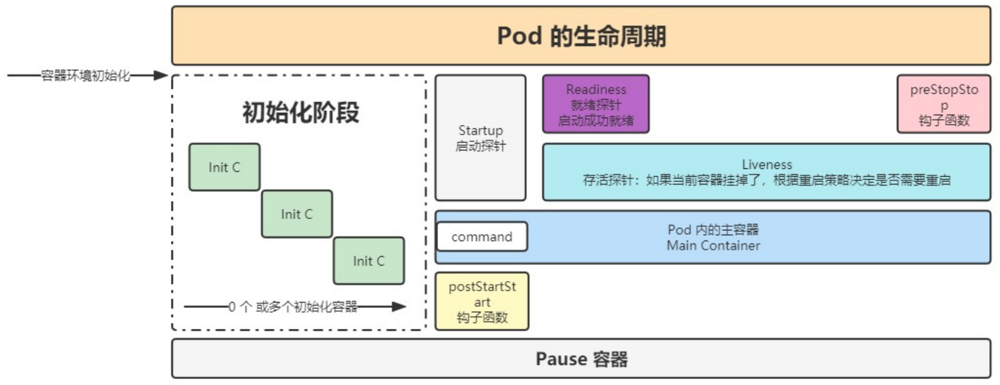

# 深入 Pods

## pods 配置文件

```yml
apiVersion: v1 # api 文档版本
kind: Pod  # 资源对象类型，也可以配置为像Deployment、StatefulSet这一类的对象
metadata: # Pod 相关的元数据，用于描述 Pod 的数据
  name: nginx-demo # Pod 的名称
  labels: # 定义 Pod 的标签
    type: app # 自定义 label 标签，名字为 type，值为 app
    test: 1.0.0 # 自定义 label 标签，描述 Pod 版本号
  namespace: 'default' # 命名空间的配置
spec: # 期望 Pod 按照这里面的描述进行创建
  containers: # 对于 Pod 中的容器描述
  - name: nginx # 容器的名称
    image: nginx:1.7.9 # 指定容器的镜像
    imagePullPolicy: IfNotPresent # 镜像拉取策略，指定如果本地有就用本地的，如果没有就拉取远程的
    command: # 指定容器启动时执行的命令
    - nginx
    - -g
    - 'daemon off;' # nginx -g 'daemon off;'
    workingDir: /usr/share/nginx/html # 定义容器启动后的工作目录
    ports:
    - name: http # 端口名称
      containerPort: 80 # 描述容器内要暴露什么端口
      protocol: TCP # 描述该端口是基于哪种协议通信的
    env: # 环境变量
    - name: JVM_OPTS # 环境变量名称
      value: '-Xms128m -Xmx128m' # 环境变量的值
    resources:
      requests: # 最少需要多少资源
        cpu: 100m # 限制 cpu 最少使用 0.1 个核心
        memory: 128Mi # 限制内存最少使用 128兆
      limits: # 最多可以用多少资源
        cpu: 200m # 限制 cpu 最多使用 0.2 个核心
        memory: 256Mi # 限制 最多使用 256兆
  restartPolicy: OnFailure # 重启策略，只有失败的情况才会重启
```

通过 `kubectl create -f nginx.config.yml` 就可以创建一个资源了

同时还可以使用如下命令查看详情

```
kubectl get po
kubectl describe po nginx-demo
```

## 探针

> 容器内应用的监测机制，根据不同的探针来判断容器应用当前的状态

### 类型

#### StartupProbe

k8s 1.16 版本新增的探针，用于判断应用程序是否已经启动了。

当**配置了 startupProbe 后，会先禁用其他探针**，直到 startupProbe 成功后，其他探针才会继续。

作用：由于有时候不能准确预估应用一定是多长时间启动成功，因此配置另外两种方式不方便配置初始化时长来检测，而配置了 statupProbe 后，只有在应用启动成功了，才会执行另外两种探针，可以更加方便的结合使用另外两种探针使用。

```yml
startupProbe:
  httpGet:
    path: /api/startup
    port: 80
```

#### LivenessProbe

用于探测容器中的应用是否运行，如果探测失败，kubelet 会根据配置的重启策略进行重启，若没有配置，默认就认为容器启动成功，不会执行重启策略。

```yml
livenessProbe:
  failureThreshold: 5
  httpGet:
    path: /health
    port: 8080
    scheme: HTTP
  initialDelaySeconds: 60
  periodSeconds: 10
  successThreshold: 1
  timeoutSeconds: 5
```

#### ReadinessProbe

用于探测容器内的程序是否健康，它的返回值如果返回 success，那么就认为该容器已经完全启动，并且该容器是可以接收外部流量的。

```yml
readinessProbe:
  failureThreshold: 3 # 错误次数
  httpGet:
    path: /ready
    port: 8181
    scheme: HTTP
  periodSeconds: 10 # 间隔时间
  successThreshold: 1
  timeoutSeconds: 1
```

### 探测方式

#### ExecAction

在容器内部执行一个命令，如果返回值为 0，则任务容器时健康的。

```yml
livenessProbe:
  exec:
    command:
      - cat
      - /health
```

#### TCPSocketAction

通过 tcp 连接监测容器内端口是否开放，如果开放则证明该容器健康

```yml
livenessProbe:
  tcpSocket:
    port: 80
```

#### HTTPGetAction

生产环境用的较多的方式，发送 HTTP 请求到容器内的应用程序，如果接口返回的状态码在 200~400 之间，则认为容器健康。

```yml
livenessProbe:
  failureThreshold: 5
  httpGet:
    path: /health
    port: 8080
    scheme: HTTP
    httpHeaders:
      - name: xxx
        value: xxx
```

### 参数配置

```yml
xxxProbe:
    initialDelaySeconds: 60 # 初始化时间
    timeoutSeconds: 2 # 超时时间
    periodSeconds: 5 # 监测间隔时间
    successThreshold: 1 # 检查 1 次成功就表示成功
    failureThreshold: 2 # 监测失败 2 次就表示失败
```

## 生命周期



```yaml
lifecycle:
  postStart: # 容创建完成后执行的动作，不能保证该操作一定在容器的 command 之前执行，一般不使用
    exec: # 可以是 exec / httpGet / tcpSocket
      command:
        - sh
        - -c
        - 'mkdir /data'
  preStop: # 在容器停止前执行的动作
    httpGet: # 发送一个 http 请求
      path: /
      port: 80
    exec: # 执行一个命令
      command:
        - sh
        - -c
        - sleep 9
```

### Pod 退出流程

**1. 删除操作**（Pod 进入终止阶段）

当用户执行 `kubectl delete pod <pod-name>` 或者 Pod 因策略（如 HPA 伸缩、节点驱逐等）被删除时，Kubernetes 开始终止该 Pod，流程如下：

**1.1 Endpoint 删除 Pod 的 IP 地址**

- Kubernetes **Service** 通过 Endpoint 维护与 Pod 的映射关系。
- 在 Pod 进入 **Terminating** 之前，Kubernetes 先从 Endpoint 中删除该 Pod 的 IP 地址，确保新请求不再被调度到该 Pod 上。
- 这一步骤保证了流量不会继续发送到即将被删除的 Pod，防止请求丢失或异常。

**1.2 Pod 变成 Terminating 状态**

- `kubectl get pod` 会显示 Pod 进入 **Terminating** 状态。

- 在此阶段，Pod 仍然在运行，直到所有终止步骤完成。

- Pod 不会立即被杀死，而是等待完成优雅终止（Graceful Termination）。

- 变为删除中的状态后，会给 pod 一个宽限期，让 pod 去执行一些清理或销毁操作。配置参数：

  ```yaml
  # 作用于 pod 中的所有容器
  spec:
    terminationGracePeriodSeconds: 30
  ```

**1.3 执行 preStop Hook**

- `preStop` 是 Pod 定义中的一个 **生命周期钩子（Lifecycle Hook）**，用于在容器被终止前执行特定操作。
- `preStop`  可以执行 HTTP 请求或命令：
  - **HTTP 请求**：调用一个 API，通知应用执行清理任务。
  - **命令执行**：运行 Shell 脚本或特定命令，完成资源释放等操作。
- 例如，在 `preStop` 中通知应用关闭数据库连接、保存状态等。

### PreStop 的应用

**PreStop Hook** 是 Kubernetes 提供的 **Pod 生命周期钩子**，在 Pod 进入 `Terminating` 状态时执行，主要用于执行 **优雅下线** 相关任务。

**1. 注册中心下线**（服务摘除）

**目标**：确保 Pod 被删除时，先从 **服务发现** 或 **注册中心** 解除绑定，避免流量继续发送到已关闭的 Pod。

**应用场景**：

- **微服务架构**（如 Spring Cloud、Dubbo）：Pod 运行的服务通常注册到注册中心（如 Eureka、Consul、Nacos、Zookeeper），需要先下线，避免流量转发到即将终止的实例。
- **负载均衡（Ingress、Service）**：可主动调用 API，将自身从负载均衡列表移除。

**实现方式**：

- **HTTP 方式**：调用注册中心提供的 API 下线实例。
- **命令执行**：执行 CLI 命令或脚本取消注册。

示例：

```yaml
lifecycle:
  preStop:
    exec:
      command:
        - "/bin/sh"
        - "-c"
        - "curl -X POST http://nacos-server:8848/nacos/v1/ns/instance/deregister?serviceName=my-service&ip=$(hostname -i)&port=8080"
```

该命令会在 Pod 退出前，调用 **Nacos** 注册中心的 API，将当前 Pod 下线。

**2. 数据清理**（缓存、连接、任务）

**目标**：确保 Pod 退出时，清理应用层面的临时数据，避免影响新实例或其他服务。

**应用场景**：

- **数据库连接关闭**：防止数据库连接泄漏，确保连接池释放资源。
- **缓存清理**：从 Redis、Etcd、Consul 等缓存系统删除相关 Key，避免脏数据。
- **队列任务处理**：确保 Kafka、RabbitMQ、RocketMQ 等消息队列的消费任务正常结束，避免消息丢失或重复消费。

**实现方式**：

- **执行脚本清理数据**
- **调用 API 通知服务进行清理**

示例（清理 Redis Key）：

```yaml
lifecycle:
  preStop:
    exec:
      command:
        - "/bin/sh"
        - "-c"
        - "redis-cli -h redis-server -p 6379 DEL session:$(hostname)"
```

这里在 Pod 退出前，清理 Redis 中以 `session:<Pod-Name>` 存储的缓存数据。

**3. 数据销毁**（持久化存储清理）

**目标**：删除不再需要的持久化数据，释放存储资源。

**应用场景**：

- **日志归档**：Pod 终止前，将重要日志转存到对象存储（如 S3、OSS、HDFS）。
- **临时文件删除**：Pod 可能会在 `/tmp` 或其他挂载目录存放临时文件，需要在退出前清理。
- **数据库持久化**：部分应用需要在关闭前执行数据持久化（如 Elasticsearch Flush 操作）。

**实现方式**：

- **归档日志**：使用 `tar` 压缩日志，并上传到远程存储。
- **删除本地临时文件**：执行 `rm -rf /tmp/*` 释放空间。

示例（清理 `/data/tmp` 目录）：

```yaml
lifecycle:
  preStop:
    exec:
      command:
        - "/bin/sh"
        - "-c"
        - "rm -rf /data/tmp/*"
```

该命令确保 Pod 退出前，清理 `/data/tmp` 目录，避免无用数据占用存储。
