# JavaFx基础

# 一、主要对象


## 1、Application

### 1.application的生命周期

任何一个JavaFx项目都需要有一个类继承Application，它是一个抽象类，含有一个抽象方法start()，所以我们继承的子类必须要去实现它。

他的生命周期函数
+ init()
+ start(Stage primaryStage)
+ stop()

然后我们要运行这个项目的话就需要调用launch()方法

launch方法有两种重载形式

```java
public static void launch(Class<? extends Application> appClass, String... args) {
    LauncherImpl.launchApplication(appClass, args);
}

public static void launch(String... args) {
    ……
}
```

### 2.线程

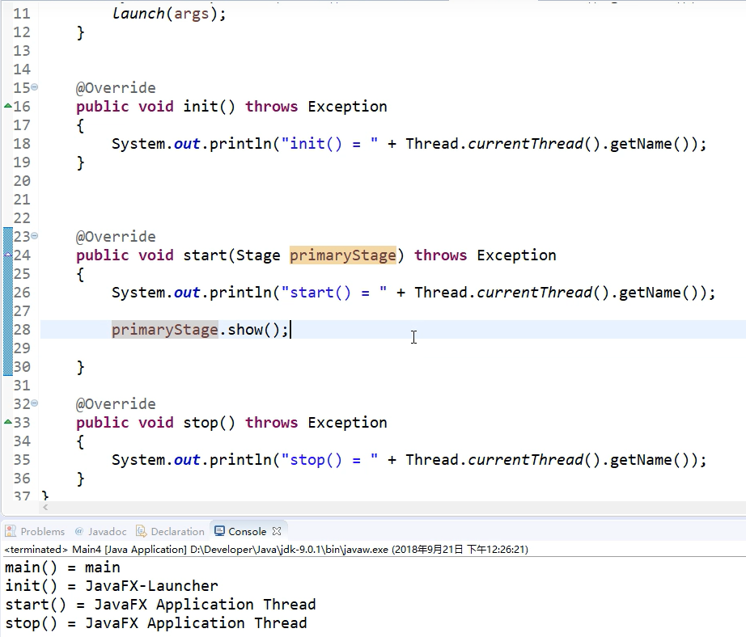

## 2、stage（舞台）

下图显示了舞台(Stage)，场景(Scene)，容器(Container)，布局(Layout )和控件(Controls)之间的关系：

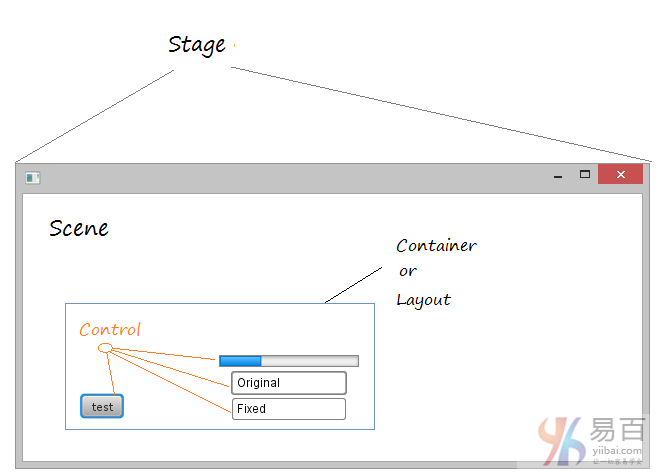

在**JavaFX**中，**Stage**是应用程序窗口，其中包含称为**Scene**的空间。 **Scene**包含界面的组件，如`Button`，`Text`，…或容器。


舞台也就是一个窗口

### 1.基本方法

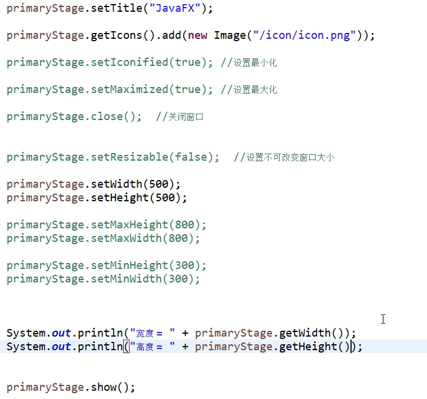

设置x、y坐标

### 2.宽高监听

```java
primaryStage.heightProperty().addListener(new ChangeListener<Number>() {
    @Override
    public void changed(ObservableValue<? extends Number> observable, Number oldValue, Number newValue) {
        System.out.println("当前高度 = " + newValue.toString());
    }
});
```

x、y坐标同样也可以监听

### 3.全屏、透明度、置顶

```java
//全屏
primaryStage.setFullScreen(true);
primaryStage.setScene(new Scene(new Group()));
```

```java
//透明度
primaryStage.setOpacity(0.5);     
```

```java
//置顶
primaryStage.setAlwaysOnTop(true);    
```

### 4.窗口模式

```
primaryStage.initStyle(StageStyle.DECORATED);//默认
primaryStage.initStyle(StageStyle.TRANSPARENT);//透明
primaryStage.initStyle(StageStyle.UNDECORATED);//透明
primaryStage.initStyle(StageStyle.UNIFIED);
primaryStage.initStyle(StageStyle.DECORATED);//只有一个小叉吧
```

### 5.模态窗口

```java
primaryStage.initModality(Modality.NONE);//无
primaryStage.initModality(Modality.WINDOW_MODAL);//关联模态
primaryStage.initModality(Modality.APPLICATION_MODAL);//纯模态
```

## 3、Platform（平台）

### 1.多任务

```java
Platform.runLater(new Runnable() {
    @Override
    public void run() {
        
    }
});
```

### 2.隐式退出

```java
Platform.setImplicitExit(false);

//必须用以下方法退出程序
Palatfrom.exit()
```

### 3.测试支持项

```java
Platform.isSupported(ConditionalFeature.CONTROLS);
```

### 4.退出程序

```java
Platform.exit();
```

## 4、Screen（屏幕）

获取屏幕信息

```java
Screen screen = Screen.getPrimary();

Rectangle2D bounds = screen.getBounds();//获取全部
Rectangle2D visualBounds = screen.getVisualBounds();//获取可视部分
screen.getDpi();//获取Dpi
```

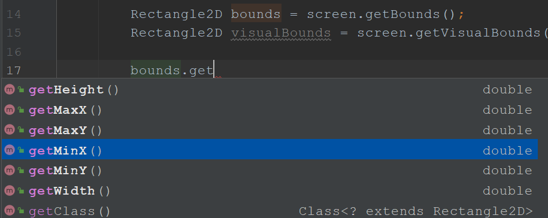

## 5、Scene（场景）

场景就可以当成一个面板

### 1.使用

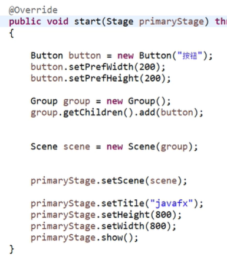

### 2.设置光标样式

```
scene.setCursor(Cursor.CLOSED_HAND);
```

设置自定义光标

## 6、Group（组）

```java
Group group = new Group();
group.getChildren();//获取子元素
group.getChildren().add();//添加子元素
Object[] obj = group.getChildren().toArray();//获取所有的子元素
```

# 二、组件

## Button（按钮）

### 1.基本操作

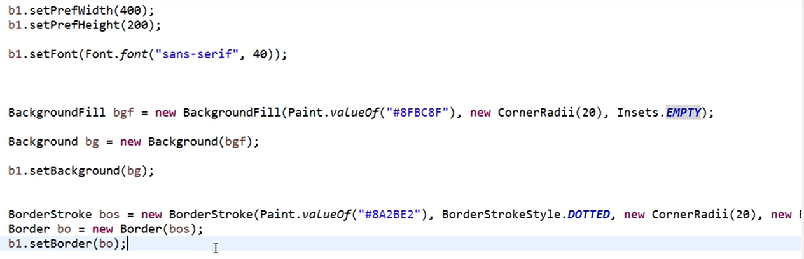

### 2.css样式、点击事件

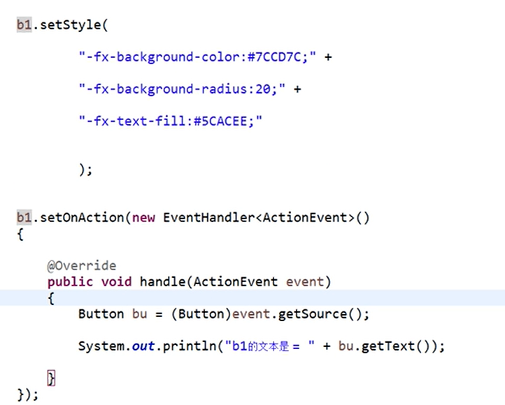

### 3.事件监听

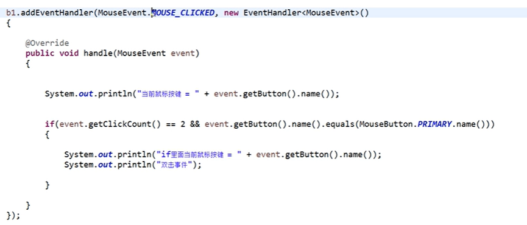

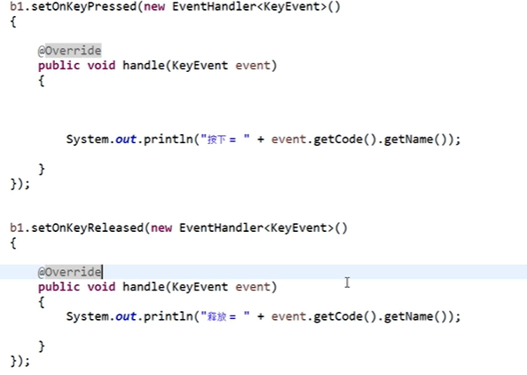


### 4.设置快捷键

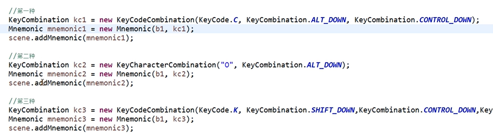

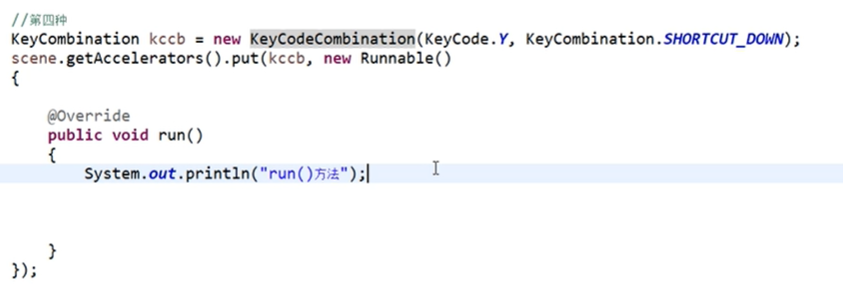

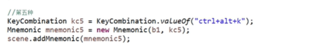

第4种最好

## Menu（菜单）

1、普通菜单、菜单项

```xml
<BorderPane xmlns="http://javafx.com/javafx"
            xmlns:fx="http://javafx.com/fxml"
            fx:controller="controller.MenuController">
  <top>
    <MenuBar>
      <Menu text="文件">
        <MenuItem text="打开文件" accelerator="ctrl+k" onAction="#handleMenuEvent"/>
        <MenuItem text="打开文件夹" onAction="#handleMenuEvent"/>
        <SeparatorMenuItem/>
        <MenuItem text="退出" onAction="#handleMenuEvent"/>
      </Menu>
    </MenuBar>
  </top>
</BorderPane>
```

编码方式设置快捷键

```java
MenuItem menuItem = (MenuItem) event.getSource();
menuItem.setAccelerator(KeyCombination.valueOf("ctrl+k"));
```

```java
Menu menu;
menu.setOnShowing(new EventHandler<Event>() {
    @Override
    public void handle(Event event) {

    }
});
menu.setOnHidden(new EventHandler<Event>() {
    @Override
    public void handle(Event event) {

    }
});
```

meun显现事件、消失事件

2、RadioMenuItem

```java
ToggleGroup tg = new ToggleGroup();
RadioMenuItem rmi1 = new RadioMenuItem("RadioMenuItem1");
RadioMenuItem rmi2 = new RadioMenuItem("RadioMenuItem2");
RadioMenuItem rmi3 = new RadioMenuItem("RadioMenuItem3");
rmi1.setToggleGroup(tg);
rmi2.setToggleGroup(tg);
rmi3.setToggleGroup(tg);
rmi1.setSelected(true);
```

3、CheckMenuItem

## Tab（选项卡）

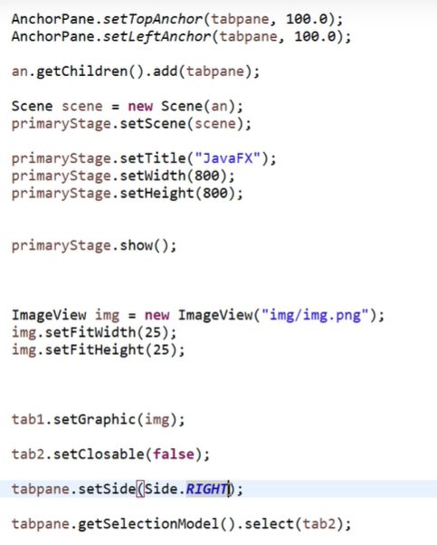

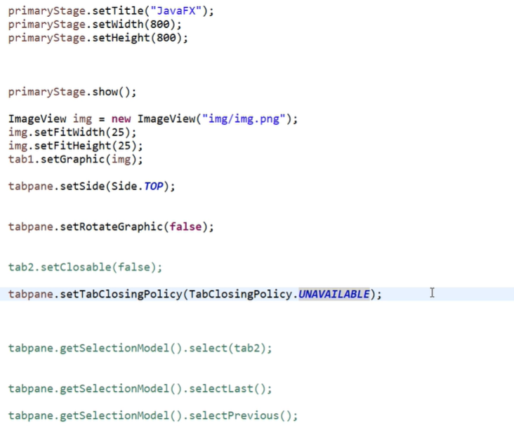

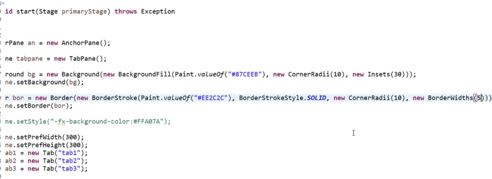

## 其他组件

+ TextField
  + setPromptText() //类似placeholder
  + setFoucTraversable() //设置焦点
+ PasswordField
+ Label

setUserData()，getUserData()，getProperties()，color类

+ Hyperlink

HostService host = getHostServices();

host.showDocument("");

# 三、布局

## BorderPane

The BorderPane layout pane provides five regions in which to place nodes: top, bottom, left, right, and center. Figure 1-1 shows the type of layout that you can create with a border pane. The regions can be any size. If your application does not need one of the regions, you do not need to define it and no space is allocated for it.

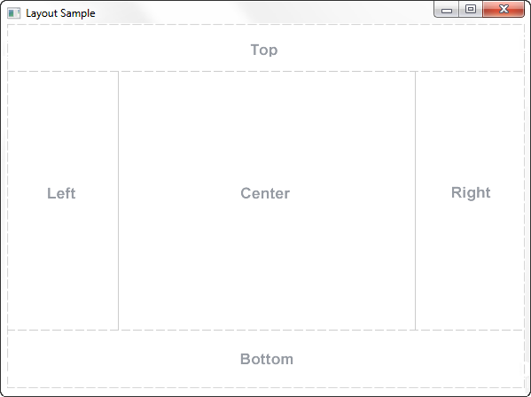

If the window is larger than the space needed for the contents of each region, **the extra space is given to the center region by default.**

如何创建一个BorderPane

```java
BorderPane border = new BorderPane();
HBox hbox = addHBox()
border.setTop(hbox);
border.setLeft(addVBox());
addStackPane(hbox);         // Add stack to HBox in top region

border.setCenter(addGridPane());
border.setRight(addFlowPane());
```

## HBox

+ setPadding()
+ setMargin()
+ setSpacing()
+ setAilgnment()


Example 1-2 Create an HBox Pane

```java
public HBox addHBox() {
    HBox hbox = new HBox();
    hbox.setPadding(new Insets(15, 12, 15, 12));
    hbox.setSpacing(10);
    hbox.setStyle("-fx-background-color: #336699;");

    Button buttonCurrent = new Button("Current");
    buttonCurrent.setPrefSize(100, 20);

    Button buttonProjected = new Button("Projected");
    buttonProjected.setPrefSize(100, 20);
    hbox.getChildren().addAll(buttonCurrent, buttonProjected);

    return hbox;
}
```

## VBox


Example 1-3 Create a VBox Pane

```java
public VBox addVBox(); {
    VBox vbox = new VBox();
    vbox.setPadding(new Insets(10));
    vbox.setSpacing(8);

    Text title = new Text("Data");
    title.setFont(Font.font("Arial", FontWeight.BOLD, 14));
    vbox.getChildren().add(title);

    Hyperlink options[] = new Hyperlink[] {
        new Hyperlink("Sales"),
        new Hyperlink("Marketing"),
        new Hyperlink("Distribution"),
        new Hyperlink("Costs")};

    for (int i=0; i<4; i++) {
        VBox.setMargin(options[i], new Insets(0, 0, 0, 8));
        vbox.getChildren().add(options[i]);
    }

    return vbox;
}
```

## StackPane

StackPane布局窗格将所有节点放在单个堆栈中，每个新节点都添加到前一个节点的顶部。这个布局模型提供了一种简单的方法，可以在一个形状或图像上覆盖文本，或者重叠常见的形状来创建一个复杂的形状。图1-6显示了一个帮助图标，它是通过将一个问号叠加在带有渐变背景的矩形上创建的。


Example 1-4 Create a Stack Pane

```java
public void addStackPane(HBox hb) {
    StackPane stack = new StackPane();
    Rectangle helpIcon = new Rectangle(30.0, 25.0);
    helpIcon.setFill(new LinearGradient(0,0,0,1, true, CycleMethod.NO_CYCLE,
        new Stop[]{
        new Stop(0,Color.web("#4977A3")),
        new Stop(0.5, Color.web("#B0C6DA")),
        new Stop(1,Color.web("#9CB6CF")),}));
    helpIcon.setStroke(Color.web("#D0E6FA"));
    helpIcon.setArcHeight(3.5);
    helpIcon.setArcWidth(3.5);

    Text helpText = new Text("?");
    helpText.setFont(Font.font("Verdana", FontWeight.BOLD, 18));
    helpText.setFill(Color.WHITE);
    helpText.setStroke(Color.web("#7080A0")); 

    stack.getChildren().addAll(helpIcon, helpText);
    stack.setAlignment(Pos.CENTER_RIGHT);     // Right-justify nodes in stack
    StackPane.setMargin(helpText, new Insets(0, 10, 0, 0)); // Center "?"

    hb.getChildren().add(stack);            // Add stack pane to HBox object
    HBox.setHgrow(stack, Priority.ALWAYS);    // Give stack any extra space
}
```

## FlowPane

+ setVgap()
+ setHgap()
+ setOrientation()

## GridPane

```java
//统一设置
gridPane.add(obj, row, col);
```

```java
//添加组件
gridPane.setConstraints(obj, row, col); 
gridPane.getChildren().add(obj);
```

```java
//单独设置
gridPane.setRowIndex(obj, 0); 
gridPane.setColumnIndex(obj, 1); 
gridPane.getChildren().add(obj);
```

```java
pane.getColumnConstraints().add(new ColumnConstraints(100));//设置第一列间距
pane.getRowConstraints().add(new RowConstraints(50));//设置第一行间距
```

## 其他布局

+ TextFlow
  + setLineSpacing
+ TilePane
+ DialogPane
  + setHeaderText()
  + setContentText()
  + getButtonTypes().add(Button.apply)
  + pane.lookupButton(Button.apply);
  + pane.setExpandableContent(new Text());
  + pane.setExpanded(true);


## 多任务

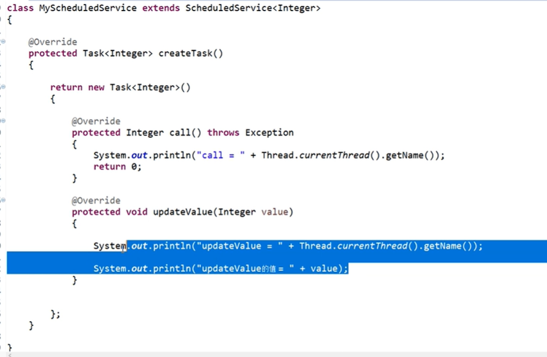

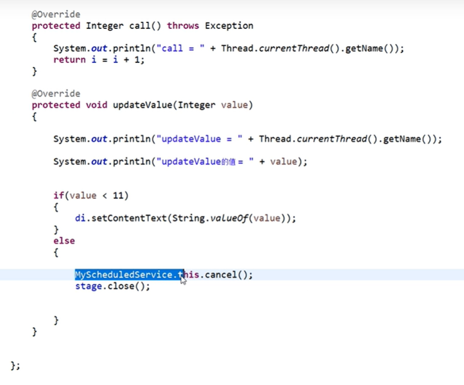


