# JavaFx基础

# 一、主要对象

## 1、Application

### 1.application的生命周期

任何一个JavaFx项目都需要有一个类继承Application，它是一个抽象类，含有一个抽象方法start()，所以我们继承的子类必须要去实现它。

他的生命周期函数

+ init()
+ start(Stage primaryStage)
+ stop()

然后我们要运行这个项目的话就需要调用launch()方法

launch方法有两种重载形式

```java
public static void launch(Class<? extends Application> appClass, String... args) {
    LauncherImpl.launchApplication(appClass, args);
}

public static void launch(String... args) {
    ……
}
```

### 2.线程

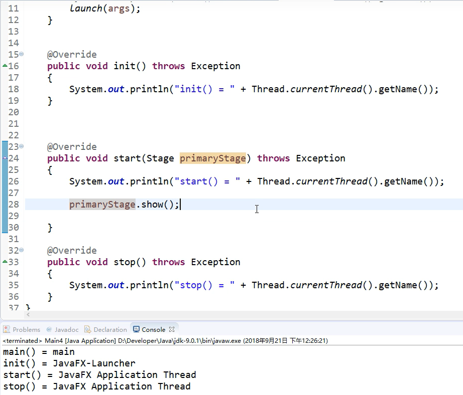

## 2、stage（舞台）

舞台也就是一个窗口

### 1.基本方法

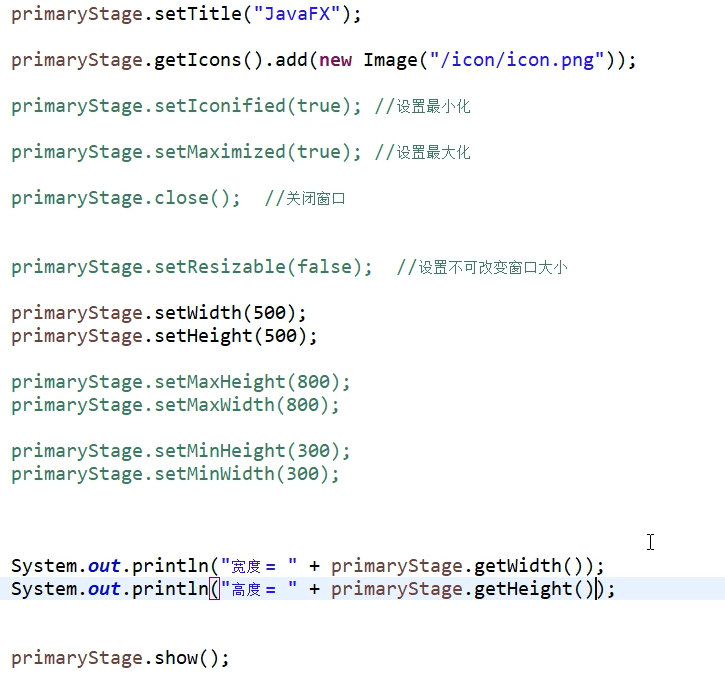

设置x、y坐标

### 2.宽高监听

```java
primaryStage.heightProperty().addListener(new ChangeListener<Number>() {
    @Override
    public void changed(ObservableValue<? extends Number> observable, Number oldValue, Number newValue) {
        System.out.println("当前高度 = " + newValue.toString());
    }
});
```

x、y坐标同样也可以监听

### 3.全屏、透明度、置顶

```java
//全屏
primaryStage.setFullScreen(true);
primaryStage.setScene(new Scene(new Group()));
```

```java
//透明度
primaryStage.setOpacity(0.5);     
```

```java
//置顶
primaryStage.setAlwaysOnTop(true);    
```

### 4.窗口模式

```
primaryStage.initStyle(StageStyle.DECORATED);//默认
primaryStage.initStyle(StageStyle.TRANSPARENT);//透明
primaryStage.initStyle(StageStyle.UNDECORATED);//透明
primaryStage.initStyle(StageStyle.UNIFIED);
primaryStage.initStyle(StageStyle.DECORATED);//只有一个小叉吧
```

### 5.模态窗口

```java
primaryStage.initModality(Modality.NONE);//无
primaryStage.initModality(Modality.WINDOW_MODAL);//关联模态
primaryStage.initModality(Modality.APPLICATION_MODAL);//纯模态
```

## 3、Platform（平台）

### 1.多任务

```java
Platform.runLater(new Runnable() {
    @Override
    public void run() {
        
    }
});
```

### 2.隐式退出

```java
Platform.setImplicitExit(false);

//必须用以下方法退出程序
Palatfrom.exit()
```

### 3.测试支持项

```java
Platform.isSupported(ConditionalFeature.CONTROLS);
```

### 4.退出程序

```java
Platform.exit();
```

## 4、Screen（屏幕）

获取屏幕信息

```java
Screen screen = Screen.getPrimary();

Rectangle2D bounds = screen.getBounds();//获取全部
Rectangle2D visualBounds = screen.getVisualBounds();//获取可视部分
screen.getDpi();//获取Dpi
```

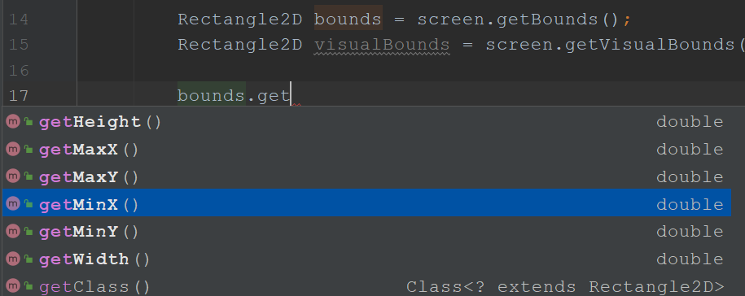

## 5、Scene（场景）

场景就可以当成一个面板

### 1.使用

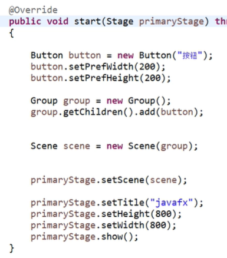

### 2.设置光标样式

```
scene.setCursor(Cursor.CLOSED_HAND);
```

设置自定义光标

## 6、Group（组）

```
Group group = new Group();
group.getChildren();//获取子元素
group.getChildren().add();//添加子元素
Object[] obj = group.getChildren().toArray();//获取所有的子元素
```

# 二、组件

## 1、Button（按钮）

### 1.基本操作

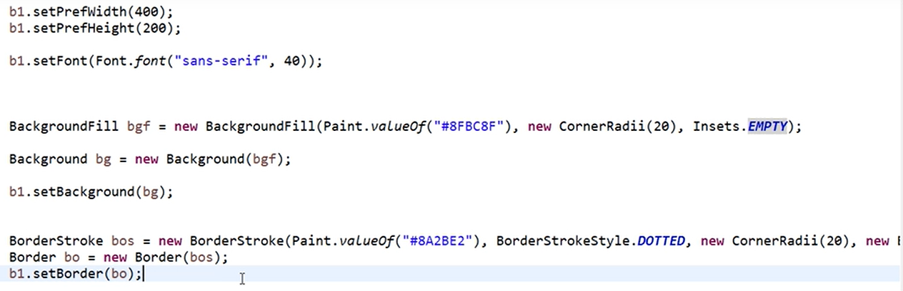

### 2.css样式、点击事件

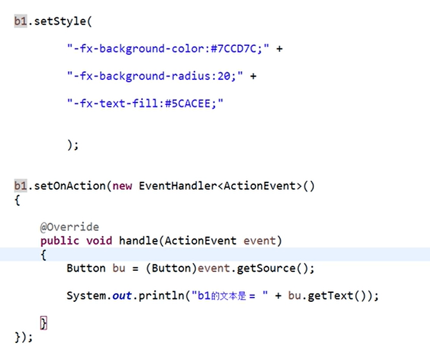

### 3.事件监听

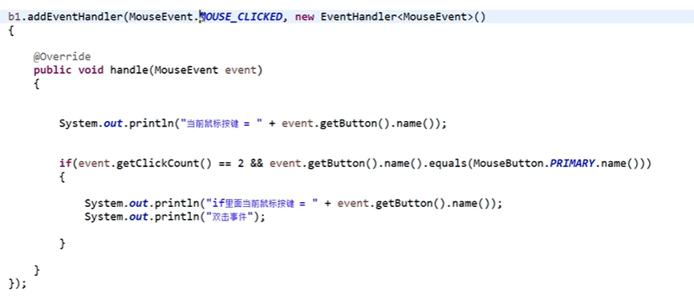

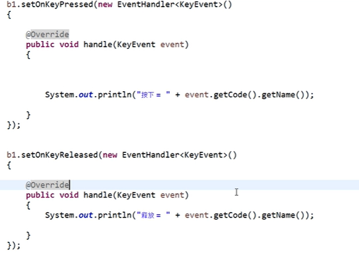


### 4.设置快捷键

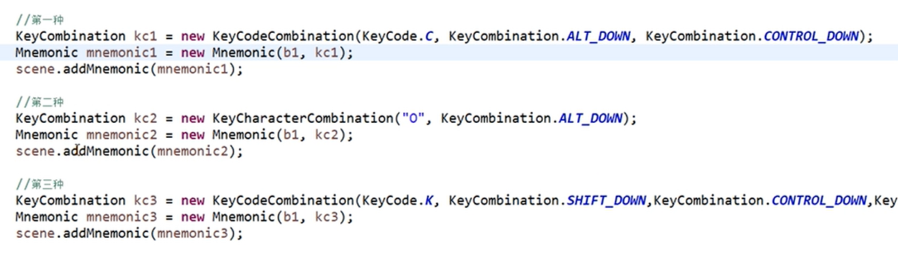

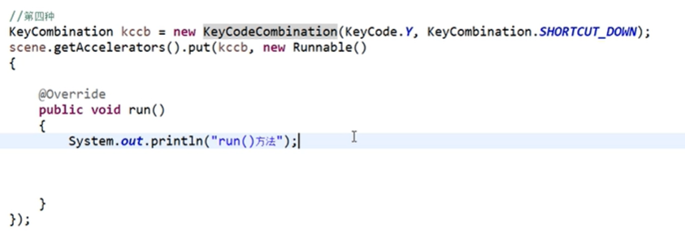

## 2、其他组件

+ TextField
  + setPromptText() //类似placeholder
  + setFoucTraversable() //设置焦点
+ PasswordField
+ Label

setUserData()，getUserData()，getProperties()，color类

+ Hyperlink

HostService host = getHostServices();

host.showDocument("");

# 三、布局

## 1、AnchorPane

+ setTopAnchor(obj, value)
+ setLeftAnchor(obj, value)
+ setPadding(new Insets())

## 2、HBox和VBox

+ setPadding()
+ setMargin()
+ setSpacing()
+ setAilgnment()

## 3、BorderPane

## 4、FlowPane

+ setVgap()
+ setHgap()
+ setOrientation()

## 5、GridPane

```java
//统一设置
gridPane.add(obj, row, col);
```

```java
//添加组件
gridPane.setConstraints(obj, row, col); 
gridPane.getChildren().add(obj);
```

```java
//单独设置
gridPane.setRowIndex(obj, 0); 
gridPane.setColumnIndex(obj, 1); 
gridPane.getChildren().add(obj);
```

```java
pane.getColumnConstraints().add(new ColumnConstraints(100));//设置第一列间距
pane.getRowConstraints().add(new RowConstraints(50));//设置第一行间距
```

## 6、StackPane

## 7、其他布局

+ TextFlow
  + setLineSpacing
+ TilePane
+ DialogPane
  + setHeaderText()
  + setContentText()
  + getButtonTypes().add(Button.apply)
  + pane.lookupButton(Button.apply);
  + pane.setExpandableContent(new Text());
  + pane.setExpanded(true);


## 多任务

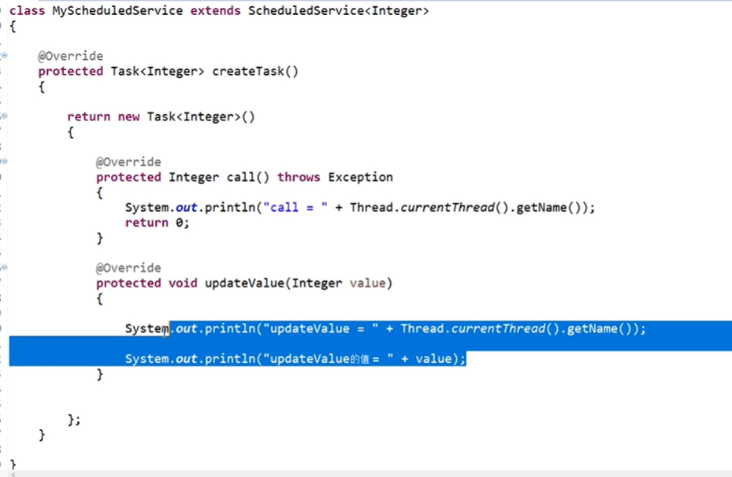

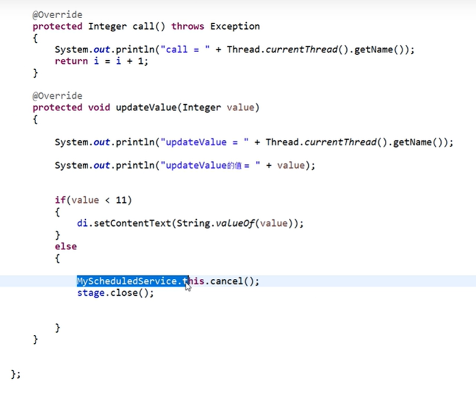


