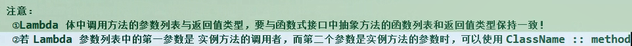
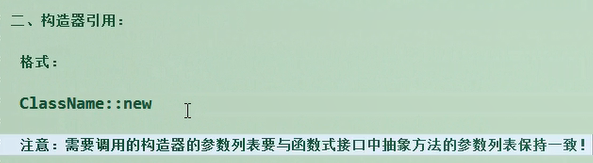

# Java8 新特性

## 四大函数式接口

```java
Consumer<T> //消费性接口
	void accept(T t);
	
Supplier<T> //供给性接口
	T get();
	
Function<T, R> //函数性接口
	R apply(T t);
	
Predicate<T> //断言性接口
	boolean test(T t);
```





## Stream 流

**1.创建流**

+ 可以使用Collection系列的 stream() 或 parallelStream()

```java
List<String> list = new ArrayList<>();
Stream<String> stream1 = list.stream();
```

+ 通过Arrays中的静态方法 stream() 获取数组流

```java
User[] users = new User[10];
Stream<User> stream2 = Arrays.stream(users);
```

+ 通过Stream类中的静态方法of()

```java
Stream<String> stream3 = Stream.of("aa", "bb", "cc");
```

+ 无限流

```java
Stream<String> stream4 = Stream.iterate(0, x -> x+2);
```

**2.中间操作**

+ 筛选与切片
  + filter —— 接受Lambda，从流中排除某些元素
  + limit —— 截断流，使其元素不超过给定的限度
  + skip(n) —— 跳过元素，返回一个扔掉了前n个元素的流。若流中元素不足n个，则返回一个空流。与limit（n）互补
  + 