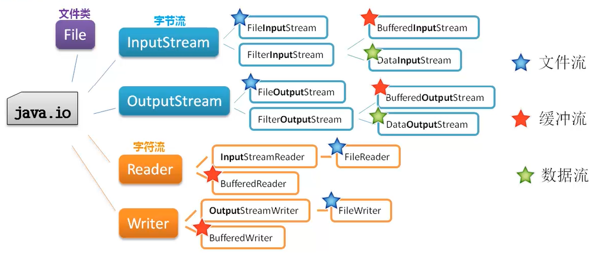

[toc]

# Java基础

# 一、数组

1、首先再次巩固一下，知道可以用**Arrays.sort()**进行升序排序，并且java体系中没有降序函数。

2、Arrays.fill()	

功能：可以批量填充数组内容

​	1、Arrays.fill（array，int value）将数组所有的值全部填充为value
​	2、Arrays.fill（array，int start，int last，int value）将索引值start到last的值（不包括last索引的值）全部填充为value。

3、Arrays.copyOf(array，int length)	
功能：可以拷贝一个数组
	参数：array为将要拷贝的数组
	           length为将要拷贝的长度
	           从第一元素开始算起，没有包含到的数组元素将不被拷贝。

4、Arrays.copyOfRange(array，int fromIndex，int toIndex)

​	功能：可以拷贝从索引值fromIndex到toIndex的值（不包括toIndex）。

5、sort（）、copyOfRange（）和copyOf（）都是Arrays的静态方法。

# 二、数字与字符串

> String类

## 1、构造方法

```java
public String(String original)  
```

可以将参数实例化为字符串类型

```java
public String(String original, int fromIndex, int count) 
```

可以将从索引值为fromIndex开始，获取长度为count的数据作为字符串。

## 2、数字转字符串

**（1）利用函数**

​	如果直接`String str=123;`这样就会报错，因为123是整型，而str是字符串类型，所以不能直接进行转换，因此，java提供了一个静态方法

```java
static String valueOf（args）
```

​	将任意的整型、长整型、布尔型等等转换为字符串类型。

**（2）隐式转换**

​	还有一种方式为隐式转换，比如String a =""+123;这样a就是一个字符串类型了。但是隐式转换有三种需要注意的地方，举三个例子    

```java
String a="1"+2+3+4;
String b=1+2+3+"4";
String c="1"+(2+3+4);
```

这时a、b、c有分别为什么取值呢？

a应该是1234，编译器看到“”会把后面所有的+当成字符串的拼接，

b应该是64，编译器先进性加法运算，然后看到“”就开始进行字符串的拼接，

c应该是19，因为有个括号，运算的优先级发生变化，先进行后面的运算，然后在开始字符串的拼接。

## 3、函数

（1）concat（String str）
	字符串的拼接。可以将str加入到一个字符串的最后位置，例如，String a =“123”； a=a.concat（“45”）->a = "12345"   就可以完成一个字符串拼接。
    

（2）length()	

​	获取字符串的长度。因为字符串是一个对象所以加上括号，而计算数组的长度直接length，因为length是数组的一个属性，所以不需要加上括号。

​	运用length()获得的字符串长度包括字符串中所有的空格，不管空格是否在中间或者开头末尾。


（3）charAt（int a）	
	通过索引值获取字符串的中的某个字符


（4）indexOf()	

​	获取子字符串的索引值

+ indexOf（char a）找出a的第一的出现的索引位置
+ indexOf（char a ，int fromIndex）找出a从fromIndex开始出现第一次的索引位置
+ lastIndexOf（）	功能：获取子字符串最后出现的索引值
  + lastIndexOf（char a）找出a的最后一次的出现的索引位置
  + lastIndexOf（char a ，int fromIndex）找出a从fromIndex向前出现最后一次的索引位置
    如果查询不到就会返回-1.


（5）endsWith（String str）     startsWith（String str）

​	获取首尾字符串，并返回一个布尔值

（6）contains（String str）

​	判断子字符串是否存在，返回一个布尔值

（7）toCharArray()

​	将字符串转换为字符数组

（8）equals（String b）	

​	比较字符串内容是否相等，返回一个布尔值

（8）substring（int beginIndex）

​	从beginIndex开始截取一段字符串

substring（int beginIndex，int endIndex）

截取从beginIndex到endindex的字符串

（9）replace

```java
public String replace(CharSequence target, CharSequence replacement) 
public String replaceAll(String regex, String replacement)
public String replaceFirst(String regex, String replacement)
```

都需要两个参数，都是将指定字符串替换为想要的字符串。

第二个可以支持正则表达式而第一个不支持

第三个支持正则表达式但是他只会替换第一个找到的

而第二个将替换所有指定的字符串。

拓展：CharSequence是一个接口，而String实现了这个接口，也可以说String也是CharSequence类型，CharSequence就是字符序列，String, StringBuilder和StringBuffer本质上都是通过字符数组实现的。

（10）

```java
public String toUpperCase()
public String toLowerCase()
```

无参方法。将字符串对象转化为大写或者小写形式。

（11）public String trim()

无参方法。可以去除首尾的空格，但是无法去除字符串中间的空格

拓展：利用replaceAll（）可以去除字符串中所有的空格。


（12）

```java
public static String format(String format, Object... args)
```

第一个参数表示的格式化的格式

第二个的参数是需要被格式化的对象

功能：两个参数。静态方法。能对指定数据按指定的格式进行格式化。

常规格式化，如同c语言中的printf()和scanf()函数，例：

```c++
printf("%d",c);     
printf("%.2f",1.23434);       
```


而在java中format与之非常相似，例：

```java
System.out.println(String.format("天才是%d%%的灵感加上%d%%的汗水"，1,99));
```

得到：天才是1%的灵感加上99%的汗水，注意在这里“%”的输出要有两个%%，不然会报错。

## 4、时间格式化

以下转换字符用于格式化常见的日期/时间组合。

​    'R'  24 小时制的时间，被格式化为 "%tH:%tM"  

​    'T'  24 小时制的时间，被格式化为 "%tH:%tM:%tS"。  

​    'r'  12 小时制的时间，被格式化为 "%tI:%tM:%tS %Tp"。上午或下午标记 ('%Tp') 的位置可能与语言环境有关。  

​    'D'  日期，被格式化为 "%tm/%td/%ty"。  

​    'F'  ISO 8601 格式的完整日期，被格式化为 "%tY-%tm-%td"。  

​    'c'  日期和时间，被格式化为 "%ta %tb %td %tT %tZ %tY"，例如 "Sun Jul 20 16:17:00 EDT 1969"。 
常用 单独格式化

​    'Y'  年份，被格式化为必要时带前导零的四位数（至少），例如，0092 等于格里高利历的 92 CE。  

​    'y'  年份的最后两位数，被格式化为必要时带前导零的两位数，即 00 - 99。

​    'B'  特定于语言环境的月份全称，例如 "January" 和 "February"。  

​    'b'  特定于语言环境的月份简称，例如 "Jan" 和 "Feb"。   

​    'd'  一个月中的天数，被格式化为必要时带前导零两位数，即 01 - 31  

​    'H'  24 小时制的小时，被格式化为必要时带前导零的两位数，即 00 - 23。  

​    'M'  小时中的分钟，被格式化为必要时带前导零的两位数，即 00 - 59。  

​    'S'  分钟中的秒，被格式化为必要时带前导零的两位数，即 00 - 60 （"60" 是支持闰秒所需的一个特殊值）。  

​    一般小写字母表示的是简写，大写表示的全称

## 5、StringBuffer和StringBuilder

​	Buffer  为缓冲的意思。它是线程安全的可变字符序列，类似于String的字符串缓冲区，其容量会随存放的字符串增加而自动增加。这个类存在两种构造方法：StringBuffer()、StringBuffer(int capacity)，第一种即初始字符容量为默认值16的字符。

​	StringBuffer与String的不同：

```java
new String("32") 	//表示实例化一个值为32的字符序列
new StringBuffer(32)//表示初始字符容量为32的字符
```

（1）public void setCharAt（index，ch）功能：通过索引值修改为指定的字符

（2）public StringBuffer reverse（）功能：将字符串反序

（3）public StringBuffer delete（int start ,int end）功能：删除从索引值start到end之间的字符。

（4）同样StringBuffer有许多与String相同的方法length（）、charAt（）、indexOf（）、substring（）、replace（）。

但这里的replace（）方法与String的不同，因为他有三个参数replace（int start，int end ，String str），能将从索引值start开始到end之间的值换为str。


StringBuilder   它的所有方法都与StringBuffer相同，但不支持线程同步，所以效率为最高的。

**总结：String、StringBuffer和StringBuilder的关系**

1、String可以通过**new StringBuffer(str)**或者**new StringBuilder(str)**转换为其他两种类型

2、而其他两种可以通过**toString()**转化为String类型。

3、String适合**数据少**，**操作少**情况下。**效率低**、**线程不安全**、为字符**常量**。

4、StringBuilder适合**单线程**，**操作多**，数据多的情况下。**效率高**、**线程不安全**、为字符**变量**。

5、StringBuffer适合**多线程**，**操作多**，数据多的情况下。**效率中**、**线程安全**、为字符**变量**。

# 三、面向对象

​	面向对象：世间万物皆为对象，就比如我们人，有自己的属性，姓名、年龄等等，还有行为方法，如行走，吃饭等等，这样将数据与对数据的处理方法放在一起，作为一个相互依赖的整体，这个整体可以称之为对象，而将同类对象抽象出同一特性，这些特性组合，然后就形成了类。

（1）对象和类？
	对象：一切皆对象。
	类：归类、物以类聚、人以群分。类别
		我对象：女的（外观）、活的（行为）
		具有【共同特征】和【共同行为】的一类实物的集合
	设置类：抽象过程   类的属性  类的方法	
	
（2）对象和类的区别？为什么要有类
		类			对象
		集合			个体
		抽象			具体
		模板			实例
		数据结构		数据

为什么要有类，方便得到实例，方便操作实例
类：实质是数据机构的定义和对象方法的归类。方法就是实现某项功能的定义
	
（3）类的作用？如何由类得到对象？

（4）对象实例化时，内存中格式如何操作的？【重点】【难点】

从类中实例化对象时，初始值为对应类型的零值

（5）toString方法作用？

​	如果类没有toString方法，会默认调用其父类的toString，没有父类，调用根类object

（6）对象的比较！equals方法和==区别？（面试）

system.gc（）强制销毁对象

用this调用构造方法时，代码应该写在方法最前面，不然会报错。

# 四、日期

1、语法：Date date=new Date()
Date date=new Date(long time)   参数是1970年1月1日00：00：00以来的指定毫秒数

2、Calendar c = Calendar.getInstance()

# 五、集合

1、Collection接口
add()		将指定的对象添加到该集合中
remove()		将指定的对象从该集合中移除
isEmpty()		返回boolean值，用于判断集合是否为空
size()		返回int型值，获取该集合中元素的个数
iterator()	返回在此collection的元素上进行迭代的的迭代器。用于遍历集合中的对象

# 六、网络编程

**1、获取本地地址**

InetAddress host=InetAddress.getLocalHost（）；IP地址

**2、获取指定地址**

```java
InetAddress host=InetAddress.getByName("192.168.0.1");	//域名地址
InetAddress host=InetAddress.getByName("www.baidu.com");	//计算机名
InetAddress host=InetAddress.getByName("WIN-NQEBEJ88FO");//获取指定主机的所有地址
InetAddress[]hosts=InetAddress.getByName("www.baidu.com");
Socket client = new Socket("服务器ip地址",[服务器开启的端口]);
```

**3、InetAddress 封装计算机的IP地址和主机名，没有端口**

（1）静态方法获取对象：

```java
InetAddress.getLocalHost();
InetAddress.getByName("www.baidu.com");
InetAddress.getByName("223.3.4.1");
```

（2）方法

```java
getHostAddress() 	//返回ip地址
getHostName()  		//返回域名，本机为计算机名
```

**4、InetSocketAddress  封装了端口**

（1）创建对象

```java
InetSocketAddress（string hostname， int port）
InetSocketAddress（InetAddress addr， int port）
```

（2）方法

```java
getAddress()
getHostName()
getPort()
```

**5、URL**

```java
System.out.println("协议：" + url.getProtocol());
System.out.println("主机：" + url.getHost());
System.out.println("端口：" + url.getPort());
System.out.println("资源路径：" + url.getFile());
System.out.println("资源路径2" + url.getPath());
```

# 七、IO



# 八、JDBC

1、加载驱动类
2、获取数据库连接对象（连接指定的数据库）
3、获取sql命令对象（编译和发送sql命令给数据库）
4、创建sql命令
5、执行sql命令
6、关闭资源

# 九、反射

## 1、概念和特点

1、引入
按照事务的特征来进行抽取成具体的java类，由java类来进行具体对象的创建

java中的类的特征：---抽取一个类来表示类的共同特征.
	属性：
		修饰符 类型 属性名 值
		结论：可以创建一个专门的类表示以上特性，该类的一个实例化对象表示一个具体的属性
	方法：
		修饰符 返回值类型 方法名 形参 方法体
		结论：可以创建一个专门的类表示以上特性，该类的一个实例化对象表示一个具体的方法
	构造器：
		修饰符 形参 方法体
		结论：可以创建一个专门的类表示以上特性，该类的一个实例化对象表示一个具体的构造器

总结论：创建一个类，该类的实例化对象存储了一个类的所有信息。这就是反射。

2、概念
万事万物皆对象，所以类也是对象。参考引入

3、作用：
实现了java对象的动态创建

4、问题引入
传统方式创建对象：" new 类名 ( ) ; "，前提是必须预先知道要使用的类。但是，如果无法确定要执行的对象怎么办？
如果要修改使用的类，必须修改源码.
5、解决
使用反射.

6、使用：
获取类对象
操作属性操作方法
操作构造器

7、特点
动态的创建java对象

8、缺点
效率低，影响程序的性能

## 2、使用

1、三种方式创建

```java
Class.forName()		//根据全路径获取(常用，必须会)------>创建类对象较多
对象名.getClass()	//根据对象获取----->操作反射方法较多
类名.class		//根据类名获取----->操作反射方法较多
```

2、类对象的方法

```java
cla.newInstance()		//获取实例化对象
cla.getPackage()		//获取类对象的包名
cla.getModifiers()		//获取类的修饰符
cla.getName()			//获取类的名称（全限定）
cla.getsimpleName()		//获取类的名称（类名）
cla.getsuperclass()		//获取类的名称（类名）
```

3、操作类属性

```java
cla.getFields()		返回指定字段
cla.getFields()		返回类及其所有父类的公有字段field数组
cla.getDeclareFields()	返回类及其所有字段field数组
cla.getDeclareField()	返回指定字段
f.getName()		获取属性名
f.getModifiers()		获取修饰符
f.getType()		获取类型，返回的是类型的类对象
f.setAccessible(ture)	暴力反射，操作私有属性，不安全
```

4、操作类方法

```java
getMethods()						获取所有的公共方法包括父类
getDeclaredMethods()				获取所有声明的方法包括父类
getMethod(String name, Class...cla)	获取指定的公共方法
		String name		表示方法名
		Class... cla	表示方法接受的参数类型的类对象
getDeclaredMethod(String name，Class...cla)获取指定的声明方法
		String name		表示方法名
		Class... cla	表示方法接受的参数类型的类对象
```


