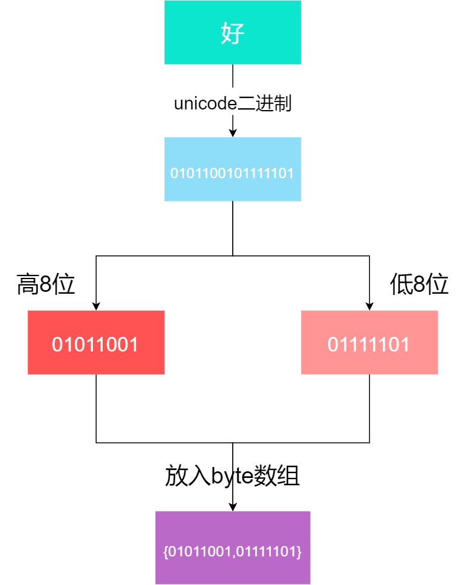
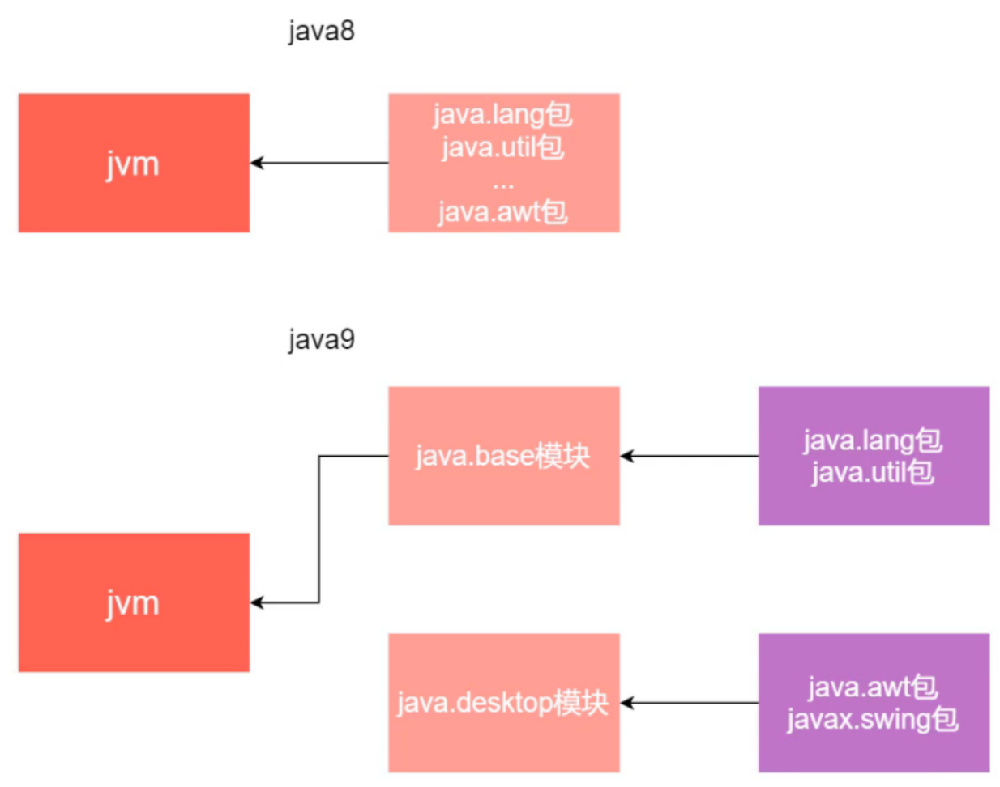

# Java9 新特性

## 接口的变化

1. 可以定义默认方法
2. 可以定义静态方法
3. 可以定义私有方法

```java
public interface MyInterface {
    
    void eat();
    
    default void run() {
        System.out.println("run");
    }
    
    static void sleep() {
        System.out.println("sleep");
    }
    
    private void play() {
        System.out.println("play");
    }
}
```

## 资源关闭改进

在 jdk1.8 时，想要自动关闭资源，需要将声明资源的代码全部放在 try 后面的小括号里面。

而在 jkd9 时，可以先在上面声明资源，然后**在 try 后的小括号写上所有声明的资源变量**，中间用分号隔开，最后一个分号可以不写。

```java
public class TryWithResource {

    public static void main(String[] args) throws FileNotFoundException {
        FileInputStream fis = new FileInputStream("");
        FileOutputStream fos = new FileOutputStream("");

        try (fis; fos) {
            System.out.println("try");
        } catch (Exception e) {
            System.out.println("catch");
        }
    }
}
```

## 变量名不可为 `_`

在 jdk1.8 时，变量名可以是下划线 `_`，而在 jdk9 时就不行了

## @Deprecated注解

@Deprecated注解的变化

该注解用于标识废弃的内容，在 jdk9 中新增了2个内容：

+ `String since() default "";`：标识是从哪个版本开始废弃
+ `boolean forRemoval() default false;`：标识该废弃的内容会在未来的某个版本中移除

## String字符串的变化

写程序的时候会经常用到String字符串，在**以前的版本中String内部使用了char数组存储**，对于使用英语的人来说，一个字符用一个字节就能存储，使用char存储字符会浪费一半的内存空间，因此**在jdk9中将String内部的char数组改成了byte数组**，这样就节省了一半的内存占用。

```java
char a = 'a'; // 2个字节
byte b = 97; // 1个字节
```



String中增加了下面2个成员变量：

+ `COMPACT STRINGS`：判断是否压缩，默认是true,若为false,则不压缩，使用UTF16编码。
+ `coder`：用来区分使用的字符编码，分别为LATIN1(值为0)和UTF16(值为1).

byte数组如何存储中文呢？通过源码（StringUTF16 类中的 toBytes 方法）得知，在使用中文字符串时，1个中文会被存储到 byte 数组中的两个元素上，即存储 1 个中文，byte 数组长度为 2，存储 2 个中文，byte 数组长度为 4。

***中英混合***

当字符串中存储了中英混合的内容时，1个英文字符会占用2个byte数组位置，例如下面代码底层byte数组的长度为16：

```java
String str = "测试123";
```

在获取字符串长度时，若存储的内容存在中文，是不能直接获取 byte 数组的长度作为字符串长度的，String 源码中有向右移动1位的操作(即除以2)，这样才能获取正确的字符串长度。

## 模块化

java8 中有个非常重要的包 `jre/lib/rt.jar`，里面涵盖了 Java 提供的类文件，在程序员运行 Java 程序时 jvm 会加载 `rt.jar`。这里有个问题是 `rt.jar` 中的某些文件我们是不会使用的，比如使用 Java 开发服务器端程序的时候通常用不到图形化界面的库 `java.awt`，这就造成了内存的浪费。

java9中将 `rt.jar` 分成了不同的模块，一个模块下可以包含多个包，模块之间存在着依赖关系，其中`java.base` 模块是基础模块，不依赖其他模块。上面提到的 `java.awt` 被放到了其他模块下，这样在不使用这个模块的时候就无需让 jvm 加载，减少内存浪费。让 jvm 加载程序的必要模块，并非全部模块，达到了瘦身效果。



jar包中含有 .class 文件，配置文件。jmod 除了包含这两个文件之外，还有：

+ native 
+ library
+ legal 
+ licenses等

两者主要的区别是 jmod 主要用在编译期和链接期，并非运行期，因此对于很多开发者来说，在运行期仍然需要使用 jar 包。

模块化的优点：

+ 精简 jvm 加载的 class 类，提升加载速度
+ 对包更精细的控制，提高安全

模块与包类似，只不过一个模块下可以包含多个包。下面举例来看下

```
项目 —— 公司
模块 —— 部门：开发部、销售部
包名 —— 小组
类 —— 员工
```

***示例***

接下来演示在测试部模块中调用开发部模块里面的类。

1. 创建项目，项目下分别创建开发部(命名develop),测试部(命名test)2个模块
2. 在开发部中创建下面2个包和类

```
|-code
  |- develop
  	 |- src
	     |- com.study.dev1
    	 	|- Cat.java
	     |- com.study.dev2
	     	|- Monkey.java
	     |- module-info.java
  |- test
  	 |- src
	  	 |- com.study.test
  		 	|- Test.java
         |- module-info.java
```

develop 模块下的 `module-info.java`

+ `module` 后面跟着的名字必须和模块名一致
+ `exports` 导出包
+ `opens` 导出包，但是只能通过反射访问

```java
module develop {
	exports com.study.dev1;
   	opens com.study.dev2;
}
```

test 模块下的 `module-info.java`

+ `requires` 导入某个模块

```java
module test {
	requires develop;
}
```

## jshell

jshell 在一些编程语言中，例如：python,Ruby等，都提供了 REPL（Read Eval Print Loop 简单的交互式编程环境）。jshell 就是 java 语言平台中的REPL。

有的时候我们只是想写一段简单的代码，例如 HelloWorld，按照以前的方式，还需要自己创建 java 文件，创建 class，编写 main 方法，但实际上里面的代码其实就是一个打印语句，此时还是比较麻烦的。在 jdk9 中新增了 jshell 工具，可以帮助我们快速的运行一些简单的代码。

从命令提示符里面输入 jshell，进入到 jshell 之后输入：

```java
System.out.print("Hello World");
```

