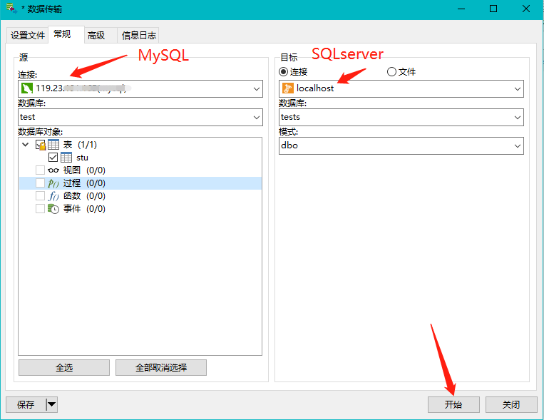

## navicat 新建 sqlserver 数据库

## mysql 转 sqlserver

1.点击要抓换的数据库—右键—选择数据传输； 或者点击顶部的工具—选择数据传输。

2.左侧是待转换的数据库，右侧是转换后的数据库（事先新建一个空的数据库）

3.转换完成。

## 主键转换

mysql 转为 sqlserver 后主键不可自增

解决方法：
打开SSMS，找到对应的表，右键Design，找到Identity Specification-双击鼠标打开属性选择Is Identity改为YES，改动后必须保存Ctrl+S

这时就能自增了

## 阻止修改表结构

有时修改表结构时 ssms 会进行阻止

打开“Microsoft SQL Server Management Studio”工具，在菜单栏选择：

工具-〉选项-〉左侧有个 设计器-〉表设计器和数据库设计器 -> 阻止保存要求重新创建表的更改(右侧) 把钩去掉即可。

