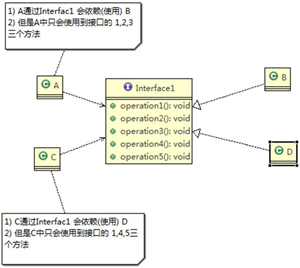
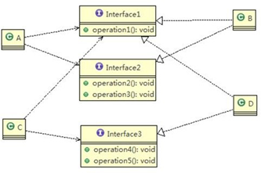
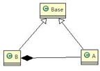

# 设计模式

+ 设计模式的目的

编写软件过程中，程序员面临着来自耦合性，内聚性以及可维护性，可扩展性，重用性，灵活性等多方面的挑战，设计模式是为了让程序（软件），具有更好

1）代码重用性（即：相同功能的代码，不用多次编写）

2）可读性（即：编程规范性，便于其他程序员的阅读和理解）

3）可扩展性（即：当需要增加新的功能时，非常的方便，称为可维护）

4）可靠性（即：当我们增加新的功能后，对原来的功能没有影响）

5）使程序呈现高内聚，低耦合的特性

+ 分享金句

1. 设计模式包含了面向对象的精髓，“懂了设计模式，你就懂了面向对象分析和设计（OOA/D）的精要”
2. Scott Mayers 在其巨著《Effective C++》就曾经说过：C++老手和C++新手的区别就是前者手背上有很多伤疤

设计模式原则，其实就是程序员在编程时，应当遵守的原则，也是各种设计模式的基础（即：设计模式为什么这样设计的依据）

# 设计模式7大原则

## 单一职责原则

**基本介绍**

1、降低类的复杂度，一个类只负责一项职责。

2、提高类的可读性，可维护性

3、降低变更引起的风险

4、通常情况下瓦我们应当遵守单一职责原则

+ 只有逻辑足够简单，才可以在代码级违反单一职责原则
+ 只有类中方法数量足够少，可以在方法级别保持单一职责原则

## 接口隔离原则

Interface Segregation Principle

**基本介绍**

1. 客户端不应该依赖它不需要的接口，即一个类对另一个类的依赖该建立在最小的接口上

2. 类 A 通过接口 Interface1 依赖类 B，类 C 通过接口 Interface1 依赖类 D，如果接口 Interface1 对于类 A 和类 C
   来说不是最小接口，那么类 B 和类 D 必须去实现他们不需要的方法。

3. 按隔离原则应当这样处理：
   将接口 Interface1 拆分为独立的几个接口(这里我们拆分成 3 个接口)，类 A 和类 C 分别与他们需要的接口建立依赖关系。也就是采用接口隔离原则

**应传统方法的问题和使用接口隔离原则改进**

1. 类 A 通过接口 Interface1 依赖类 B，类 C 通过接口 Interface1 依赖类 D，如果接口 Interface1 对于类 A 和类 C
   来说不是最小接口，那么类 B 和类 D 必须去实现他们不需要的方法

2. 将接口 Interface1 拆分为独立的几个接口，类 A 和类 C 分别与他们需要的接口建立依赖关系。也就是采用接口隔离原则

3. 接口 Interface1 中出现的方法，根据实际情况拆分为三个接口

## 依赖倒转原则

Dependence Inversion Principle

**基本介绍**

依赖倒转原则是指：

1)	高层模块不应该依赖低层模块，二者都应该依赖其抽象

2)	抽象不应该依赖细节，细节应该依赖抽象

3)	依赖倒转(倒置)的中心思想是面向接口编程

4)	依赖倒转原则是基于这样的设计理念：相对于细节的多变性，抽象的东西要稳定的多。以抽象为基础搭建的架构比以细节为基础的架构要稳定的多。在 java 中，抽象指的是接口或抽象类，细节就是具体的实现类

5)	使用接口或抽象类的目的是制定好规范，而不涉及任何具体的操作，把展现细节的任务交给他们的实现类去完成

## 里氏替换原则

Liskov Substitution Principle

**OO 中的继承性的思考和说明**

1)	继承包含这样一层含义：父类中凡是已经实现好的方法，实际上是在设定规范和契约，虽然它不强制要求所有的子类必须遵循这些契约，但是如果子类对这些已经实现的方法任意修改，就会对整个继承体系造成破坏。

2)	继承在给程序设计带来便利的同时，也带来了弊端。比如使用继承会给程序带来侵入性，程序的可移植性降低， 增加对象间的耦合性，如果一个类被其他的类所继承，则当这个类需要修改时，必须考虑到所有的子类，并且父类修改后，所有涉及到子类的功能都有可能产生故障

3)	问题提出：在编程中，如何正确的使用继承? => 里氏替换原则

**基本介绍**

1)    里氏替换原则(Liskov Substitution Principle)在 1988 年，由麻省理工学院的以为姓里的女士提出的。

2)    如果对每个类型为 T1 的对象 o1，都有类型为 T2 的对象 o2，使得以 T1 定义的所有程序 P 在所有的对象 o1 都代换成 o2 时，程序 P 的行为没有发生变化，那么类型 T2 是类型 T1 的子类型。换句话说，所有引用基类的地方必须能透明地使用其子类的对象。

3)    在使用继承时，遵循里氏替换原则，在==子类中尽量不要重写父类的方法==

4)    里氏替换原则告诉我们，继承实际上让两个类耦合性增强了，在适当的情况下，可以通过聚合，组合，依赖 来解决问题。

**解决方法**

1)	我们发现原来运行正常的相减功能发生了错误。原因就是类 B 无意中重写了父类的方法，造成原有功能出现错误。在实际编程中，我们常常会通过重写父类的方法完成新的功能，这样写起来虽然简单，但整个继承体系的复用性会比较差。特别是运行多态比较频繁的时候

2)	通用的做法是：==原来的父类和子类都继承一个更通俗的基类，原有的继承关系去掉==，采用依赖，聚合，组合等关系代替.

3)	改进方案

## 开闭原则

Open Closed Principle

**基本介绍**

1)	开闭原则是编程中最基础、最重要的设计原则

2)	一个软件实体如类，模块和函数应该对扩展开放(对提供方)，对修改关闭(对使用方)。用抽象构建框架，用实现扩展细节。

3)	当软件需要变化时，尽量通过扩展软件实体的行为来实现变化，而不是通过修改已有的代码来实现变化。

4)	编程中遵循其它原则，以及使用设计模式的目的就是遵循开闭原则。

## 迪米特法则

Demeter Principle

**基本介绍**

1) 一个对象应该对其他对象保持最少的了解

2) 类与类关系越密切，耦合度越大

3) 迪米特法则又叫最少知道原则，即一个类对自己依赖的类知道的越少越好。也就是说，对于被依赖的类不管多么复杂，都尽量将逻辑封装在类的内部。对外除了提供的 public 方法，不对外泄露任何信息

4) 迪米特法则还有个更简单的定义：只与直接的朋友通信

5) 直接的朋友：每个对象都会与其他对象有耦合关系，只要两个对象之间有耦合关系，我们就说这两个对象之间是朋友关系。耦合的方式很多，依赖，关联，组合，聚合等。其中，我们称出现成员变量，方法参数，方法返回值中的类为直接的朋友，而出现在局部变量中的类不是直接的朋友。也就是说，陌生的类最好不要以局部变量的形式出现在类的内部。

**迪米特法则注意事项和细节**

1)	迪米特法则的核心是==降低==类之间的耦合

2)	但是注意：由于每个类都减少了不必要的依赖，因此迪米特法则只是要求降低类间(对象间)耦合关系， 并==不是要求完全没有依赖关系==

## 合成复用原则

Composite Reuse Principle

**基本介绍**

原则是尽量使用合成/聚合的方式，而不是使用继承

# 设计原则核心思想

1)	找出应用中可能需要变化之处，把它们独立出来，不要和那些不需要变化的代码混在一起。

2)	针对接口编程，而不是针对实现编程。

3)	为了交互对象之间的松耦合设计而努力