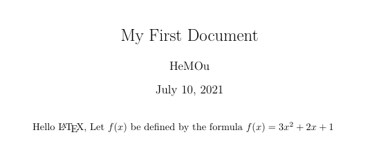

# LaTex笔记

## 安装

1、校验

判断是否安装成功，打开cmd输入如下指令之一

```shell
tex -v
latex -v
xelatex -v
```

2、更新

```shell
tlmgr update --all
```

## 初体验

1、新建一个demo.tex文件，内容如下

```latex
% 开始
\documentclass{article}

\begin{document}
Hello \LaTeX.
\end{document}
```

`%`就是tex的注解，`\xxx`类似这样斜杠后面加上一个引文单词叫做一个指令，而指令后的花括号`{}`内的内容叫做参数

2、将上述文件保存后，在当前文件在打开cmd，输入如下命令

```shell
latex demo.tex
```

最后包括源文件在内，会出现如下文件

+ demo.tex
+ demo.log
+ demo.aux
+ demo.dvi

3、接着输入如下命令，即可将`dvi`文件转换为pdf

```shell
dvipdfmx demo.dvi
```

4、当然还有一个更简洁的命令，一步就可以生成pdf文档，如下

```
xelatex demo.tex
```

5、值得一提的是`xelatex`可以支持中文文档的编译，当然需要两个条件

+ 编写的tex文档编码为UTF-8
+ 添加一个宏包`\usepackage{ctex}`

如下

```latex
\documentclass{article}

\usepackage{ctex}

\begin{document}
Hello \LaTeX.
\end{document}
```

6、最后就是关于Latex的ide软件，如`TexStudio`，需要进行如下设置

选项 -> 设置 -> 构建 -> 默认编译器改为xelatex

## 小案例

```latex
% 导言区
\documentclass{article} % book, report, letter
\title{My First Document}
\author{HeMOu}
\date{\today}
% 正文区（文稿区）
\begin{document}
	\maketitle
	Hello \LaTeX, Let $f(x)$ be defined by the formula $f(x) = 3x^2 + 2x + 1$
\end{document}
```

输入结果如下



在tex中有以下需要注意的

+ 正文区有且只有一个document环境
+ 留一个空行相当于在pdf中换行
+ 单`$`包裹的内容被称为数学公式
+ 双`$`包裹的数学公式会换行显示

## 查看文档

在cmd中输入如下命令可以查看各种文档

1、宏包手册

```shell
texdoc ctex
```

2、Latex教程

```shell
texdoc lshort-zh
```

3、表格教程

```
texdoc booktab # 三线表
texdoc longtab # 跨页长表格
texdoc tabu # 综合表格
```

