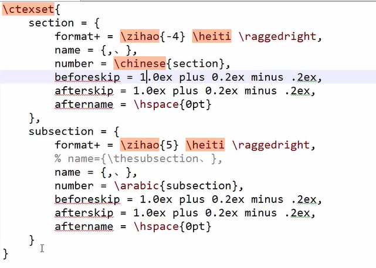

# 文件结构

## 基本结构

1. 文档声明
2. 宏包使用
3. [指令定义]
4. 文章信息定义
5. 正文区

## 文档声明

TeX有多种文档类型可选，笔者较常用的有如下几种类型：

- 对于英文，可以用`book`、`article`和`beamer`；
- 对于中文，可以用`ctexbook`、`ctexart`和`ctexbeamer`，这些类型自带了对中文的支持。

不同的文件类型，编写的过程中也会有一定的差异，如果直接修改文件类型的话，甚至会报错。以下统一选用`ctexart`。在编辑框第一行，输入如下内容来设置文件类型：

```tex
\documentclass{ctexart}
```

==**注意**：使用中文要使用`xelatex`进行编译==

> 另外，一般也可以在`\documentclass`处设置基本参数，设置默认字体大小为12pt，纸张大小为A4，单面打印。需要将第一行的内容替换为：
>
> ```tex
> \documentclass[12pt, a4paper, oneside]{ctexart}
> ```

文件的正文部分需要放入document环境中，在document环境外的部分不会出现在文件中。

```tex
\documentclass[12pt, a4paper, oneside]{ctexart}

\begin{document}

这里是正文. 

\end{document}
```

## 宏包

1、插入图片宏包

```tex
\usepackage{graphicx}
```

2、超链接宏包

在加载宏包时还可以设置基本参数，如使用超链接宏包`hyperref`，可以设置引用的颜色为黑色等

```tex
\usepackage[bookmarks=true, colorlinks, citecolor=blue, linkcolor=black]{hyperref}
```

3、数学宏包

```tex
\usepackage{amsmath, amsthm, amssymb}
```

## 文章信息定义

文章信息包括标题`\title`、作者`\author`以及日期`\date`等

```tex
\documentclass[12pt, a4paper, oneside]{ctexart}
\usepackage{amsmath, amsthm, amssymb, graphicx}
\usepackage[bookmarks=true, colorlinks, citecolor=blue, linkcolor=black]{hyperref}

% 导言区

\title{我的第一个\LaTeX 文档}
\author{HeMOu}
\date{\today}

\begin{document}

\maketitle

这里是正文. 

\end{document}
```

**注意**：如果显示标题信息，需要使用`\maketitle`

## 正文区

正文可以直接在document环境中书写，没有必要加入空格来缩进，因为文档默认会进行首行缩进。相邻的两行在编译时仍然会视为同一段。在LaTeX中，另起一段的方式是使用一行相隔，例如：

```tex
我是第一段. 

我是第二段.
```

这样编译出来就是两个段落。在正文部分，多余的空格、回车等等都会被自动忽略，这保证了全文排版不会突然多出一行或者多出一个空格。另外，另起一页的方式是：

```tex
\newpage
```

笔者在编写文档时，为了保证美观，通常将中文标点符号替换为英文标点符号（需要注意的是英文标点符号后面还有一个空格），这比较适合数学类型的文档。

在正文中，还可以设置局部的特殊字体：

| 字体     | 命令      |
| -------- | --------- |
| 直立     | \textup{} |
| 意大利   | \textit{} |
| 倾斜     | \textsl{} |
| 小型大写 | \textsc{} |
| 加宽加粗 | \textbf{} |

### 篇章结构

可以通过`\section`、`\subsection`、`\subsubsection`列出文章的提纲

如果需要目录需使用`\tableofcontents`

```latex
\documentclass{ctexart}

\begin{document}
	\tableofcontents # 用于生成目录
	
	\chapter{绪论} # 不同章节，只能应用于`book`文档类
	\section{引言} # 一级标题
    近年来，随着逆向工程和三维重建技术的发展和应用，获耳物体的三维数据的方法越来越多的关注和研究，很多研究机杉都陆续推出了自己的三维重建系统。
    
    近年来，随着逆向工程和三维重建技术的发展和应用，获耳物体的三维数据的方法越来越多的关注和研究。\\很多研究机杉都陆续推出了自己的三维重建系统。
    \section{实验方法}
    \section{实验结构}
    \subsection{数据} # 二级标题
    \subsubsection{实验条件} # 三级标题
    
    \chapter{结果} 
    \section{结论}
    \section{致谢}
\end{document}
```

注意：

+ `\\` 双斜杠相当于word中的手动换行符
+ `\par` 可以产生新的一个段落，类似回车
+ 文章的提纲格式可以在导言区通过`\ctexset`来进行设置



### 页眉页脚

在LaTex中，与页码和页面设置相关的命令有：

+ `\pagestyle{type}`
+ `\thispagestyle{type}`
+ `\setcounter{page}{number}`
+ `\pagenumbering{style}`

1、样式

`\pagestyle{type}`和`\thispagestyle{type}`命令用于设置页面样式（页眉和页脚）。

`\pagestyle{type}`和`\thispagestyle{type}`的主要区别在于`\pagestyle{type}`对后续全部页面都有效，而`\thispagestyle{type}`仅仅对当前页面有效。在LaTeX中，默认提供了如下五种页面样式：

- empty - 没有页眉和页脚
- plain - 没有页眉，页脚包含一个居中的页码
- headings - 没有页脚，页眉包含章/节或者字节的名字和页码
- myheadings - 没有页脚，页眉包含有页码

2、页码

默认状况下，页码从第一页开始（一般是包含标题页的）而且以阿拉伯数字形式显示（例如：1，2，3 …）。页码的编号也能够经过`\setcounter{page}{number}`命令手动设置，须要注意的是，手动设置可能会致使重复的页码出现。

3、页码样式

`\pagenumbering{style}`命令则用于改变页码的显示风格。LaTeX中页码风格包含如下五类：

- arabic - 阿拉伯数字
- roman - 小写的罗马数字
- Roman - 大写的罗马数字
- alph - 小写的字符形式
- Alph -大写的字符形式

4、示例

```tex
\documentclass{article}

\usepackage{fontspec, xunicode, xlextra}
\usepackage{xeCJK}

\title{\LaTeX 页码设置}
\author{Japinli}

\begin{document}
\maketitle
\thispagestyle{empty} % 当前页不显示页码
\newpage

\pagestyle{headings}
\setcounter{page}{1}
\pagenumbering{Roman}

\section*{前言}
学习如何在\LaTeX 中设置页码。
\newpage

\tableofcontents
\newpage

\setcounter{page}{1}
\pagenumbering{arabic}

\section{页码风格}

\LaTeX 中包含五种页码风格，分别是\emph{arabic}，\emph{roman}，\emph{Roman}，
\emph{alph}和\emph{Alph}。

\section{页码风格说明}

\emph{arabic}表明阿拉伯数字类型。

\emph{roman}表明小写的罗马数字类型。

\emph{Roman}表明大写的罗马数字类型。

\emph{alph}表明小写的字符类型。

\emph{Alph}表明大写的字符类型。

\section{页码风格设置}

为了改变页码的风格，能够使用\emph{\textbackslash pagenumbering\{sytle\}}
命令设置。

\end{document}
```

