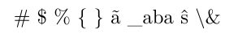
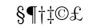
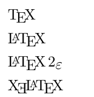
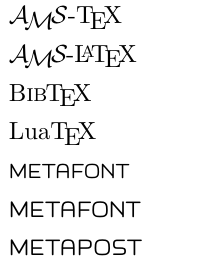
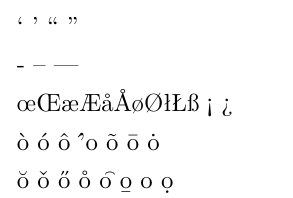

# 字体字号

## 字体

> 修改字体有两种方法
>
> 第一种，字体命令，可以将不同的字体应用到所传递的参数上
>
> 第二种，字体声明，可以字体样式应用到字体声明后的文本，本且可以使用花括号`{}`限定字体声明的范围

在LaTex中，一个字体有5种属性：

+ 字体编码
  + 正文字体编码：OT1、T1、EU1等
  + 数学字体编码：OML、OMS、OMX等
+ 字体族
  + 罗马字体`Roman Family`：笔画起始处有装饰(默认)
  + 无衬线字体`Sans Serif Family`：笔画起始处无装饰
  + 打字机字体`Typewriter Family`：每个字符宽度相同，又称等宽字体

可以使用字体指令，作用于命令的参数

```latex
\textrm{Roman Family} \textsf{Sans Serif Family} \texttt{Typewriter Family}
```

也可以使用字体声明，作用于后续的文本，并且可以使用花括号`{}`限定字体声明范围

```latex
\rmfamily Roman Family {\sffamily Sans Serif Family} {\ttfamily Typewriter Family}		
```

+ 字体系列
  + 粗细
  + 宽度
+ 字体形状
  + 直立`Upright Shape`
  + 斜体`Italic Shape`
  + 伪斜体`Slanted Shape`
  + 小型大写`Small Caps Shape`

字体命令

```latex
\textup{Upright Shape} \textit{Italic Shape}
\textsl{Slanted Shape} \textsc{Small Caps Shape}
```

字体声明

```latex
{\upshape Upright shape} {\itshape Italic Shape}
{\slshape Slanted Shape} {\scshape Small Caps Shape}
```

中文字体

```latex
{\songti 宋体} {\heiti 黑体} {\fangsong 仿宋} {\kaishu 楷书}
```

中文字体的粗体其实就是黑体，斜体就是楷体

```latex
\textbf{粗体} \textit{斜体}
```

## 字号

```latex
{\tiny Hello}
{\scriptsize Hello}
{\footnotesize Hello}
{\small Hello}
{\normalsize Hello}
{\large Hello}
{\Large Hello}
{\LARGE Hello}
{\huge Hello}
{\Huge Hello}
```

字体大小是通过一系列声明实现的，这些声明都是参照 `\normalsize`的大小调整的

 `\normalsize`的大小可以通过文档最开始文档类参数`\documentclass[11pt]{article}`方括号内的值来实现

方括号值内范围10pt~ 12pt

中文设置字号

```latex
\zihao{5} 你好
```

推荐使用`\newcommand`来设置字体大小

```latex
% 导言区
\newcommand{\myfont}{\textbf{\textsf{Fancy Text}}}

% 正文区
\myfont
```

## 特殊字符

### 空白符号

```latex
\quad 		% 1em 当前字体中M的宽度
\qquad 		% 2em
\thinspace 	% 1/6em 等同于`,`的宽度
\enspace 	% 0.5em
\ 			% `\ ` 类似将空格转义了
a~b			% 硬空格
a\kern 1pc b  % 1pc = 12pt = 4.218mm
a\kern -1em b % \kern 指令后参数可以接负值
a\hskip 1em b 
a\hskip{35pt}b
a\hphantom{xyz}b % 占位空格，空格长度等于参数内字符的长度
a\hfill b 	% 弹性空格，长度将占满一整行
```

**注意点**

+ 空行可以分段，多个空行效果同单个空行
+ 自动缩进，绝对不能使用空格代替
+ 英文中多个空格处理为1个空格，中文中书写空格将被忽略
+ 汉字与其它字符的间距会自动由XelaTex处理，如中英文混排，中英文间会有一个空格
+ 禁止使用中文全角空格

### LaTex 控制符

```latex
\# \$ \% \{ \} \~{} \_{} \^{} \textbackslash \&
```


```latex
\# \$ \% \{ \} \~{adf} \_{aba} \^{sd} \textbackslash \&
```



### 排版符号

```latex
\S \P \dag \ddag \copyright \pounds
```



### \Tex 标志符号

```latex
\documentclass{ctexart}
\usepackage{xltxtra} % 提供了针对XeTeX的改进并加入了XeTeX的Logo

\begin{document}
    \TeX{} 

    \LaTeX{} 

    \LaTeXe{}

    \XeLaTeX{} % 需要使用`\usepackage{xltxtra}`
\end{document}
```



其他logo

```latex
% 一下需要引入 texnames 宏包
\AmSTeX{}

\AmS-\LaTeX{}

\BibTeX{}

\LuaTeX{}

% 以下需要引入 mflogo 宏包
\METAFONT{}

\MF{}

\MP{}
```



### 其他

```latex
% 引号
` ' `` ''

% 连字符
- -- ---

% 非英文字符
\oe \OE \ae \AE \aa \AA \o \O \l \L \ss \SS !` ?`

% 重音符号
\`o \'o \^o \''o \~o \=o \.o 

\u{o} \v{o} \H{o} \r{o} \t{o} \b{o} \c{o} \d{o}
```



