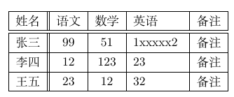
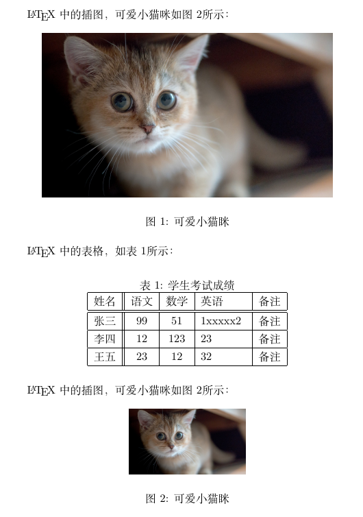

# 表格插图

## 插图

```latex
% 导言区
\usepackage{graphicx}

% 支持图片格式：eps, pdf, png, jpeg, bmp
% 指定图像搜索路径，相对于tex文件的当前位置
\graphicspath{{figures/}, {pic/}}

\begin{document}
	% 语法
	\includegraphics[<选项>]{<文件名>}

	\includegraphics[scale=0.3]{lion.eps}

	\includegraphics[height=2cm]{lion.eps}

	\includegraphics[width=2cm]{lion.eps}
	
	\includegraphics[height=0.1\textheight]{lion.eps}
	
	\includegraphics[width=0.1\textheight]{lion.eps}
	
	\includegraphics[angle=-45, width=0.2cm]{lion.eps}

\end{document}
```

## 表格

```latex
\begin{tabular}[<垂直对齐方式>]{<列格式说明>}
	<表项> & 	<表项> & 	<表项> & 	<表项>  \\
	...
\end{tabular}

% \\ 表示换行
% & 表示不同的列
% l 左对齐  c 居中对齐  r 右对齐
% p{<宽>} 本列自动宽度
```

示例代码

```latex
\documentclass{ctexart}

\begin{document}
    \begin{tabular}{|l||c|c|p{1.5cm}|r|}
        \hline
        姓名 & 语文 & 数学 & 英语 & 备注 \\
        \hline \hline
        张三 & 99 & 51 & 1xxxxx2 & 备注 \\
        \hline
        李四 & 12 & 123 & 23 & 备注 \\
        \hline
        王五 & 23 & 12 & 32 & 备注 \\
        \hline
    \end{tabular}
\end{document}
```




## 浮动体

示例代码如下

```latex
\documentclass{ctexart}

\usepackage{graphicx}
\graphicspath{{img/}}

\begin{document}
    
    \LaTeX{}中的插图，可爱小猫咪如图\ref{img-1}所示：
    \begin{figure}[htbp]
        \centering
        \includegraphics[width=0.5\textheight]{1.jpg}
        \caption{可爱小猫眯}\label{img-1}
    \end{figure}

    \LaTeX{}中的表格，如表\ref{table-1}所示：
    \begin{table}[h]
        \centering
        \caption{学生考试成绩}\label{table-1}
        \begin{tabular}{|l||c|c|p{1.5cm}|r|}
            \hline
            姓名 & 语文 & 数学 & 英语 & 备注 \\
            \hline \hline
            张三 & 99 & 51 & 1xxxxx2 & 备注 \\
            \hline
            李四 & 12 & 123 & 23 & 备注 \\
            \hline
            王五 & 23 & 12 & 32 & 备注 \\
            \hline
        \end{tabular}
    \end{table}

    \LaTeX{}中的插图，可爱小猫咪如图\ref{img-1}所示：
    \begin{figure}[h]
        \centering
        \includegraphics[width=0.2\textheight]{1.jpg}
        \caption{可爱小猫眯}\label{img-1}
    \end{figure}

\end{document}
```



1、表格浮动体`\begin{table}`与`\end{table}`包含起来，图片浮动体使用`\begin{figure}`与`\end{figure}`包含起来

2、`ref{<标签>}`以及`label{<标签>}`可以形成交叉引用

3、`\centering`浮动体内容居中

4、位置参数，默认tbp

+ h，此处（here）- 代码所在上下文位置
+ t，页顶（top）- 代码所在页面或之后页面的顶部
+ b，页底（bottom）- 代码所在页面或之后页面的底部
+ p，独立一页（page）- 浮动页面

5、标题控制( caption、bicaption等宏包)

并排与子图表(subcaption、subfig、 floatrow等宏包)

绕排(picinpar、 wrapfig等宏包)