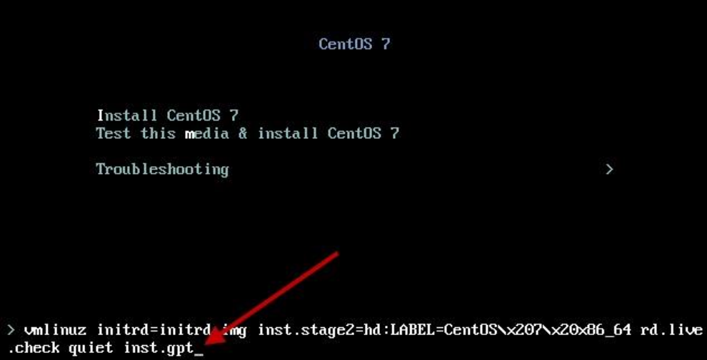
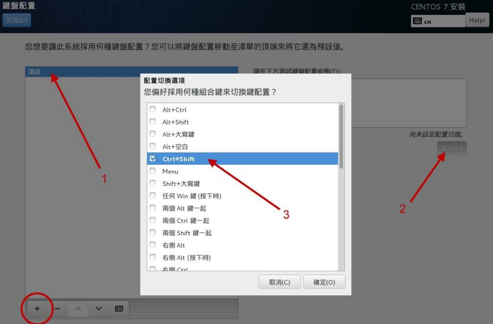
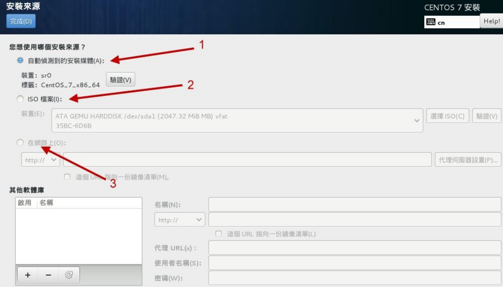
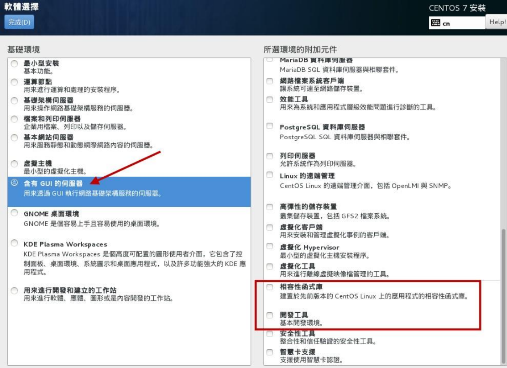
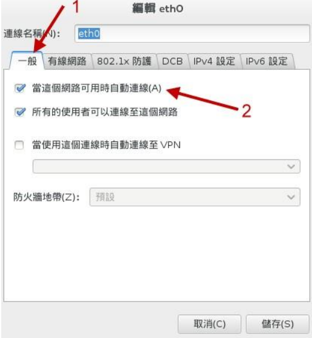
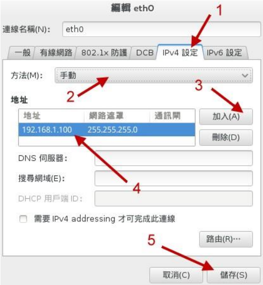
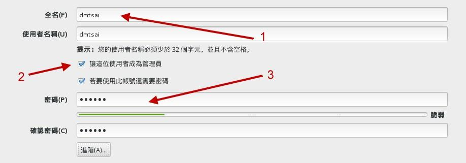

# 01-Linux的安装

## 虚拟硬盘大小

大概 40 GB左右

## 安装模式

进入安装向导后，选择第一行，按住`tab`，然后输入 `inst.gpt`，即可使用 GPT 模式安装

## 键盘配置

## 安装源和软件选择

安装源可以默认

软件选择：含有GUI的，最好也勾上右边的开发工具

## 分区

在安装目的地选择 `我将配置分页`，并按如下进行分配

+ biosboot  ——  2M
+ /boot  ——  1G  ——  标准分区
+ /  ——  10G  ——  LVM  ——  volume group：固定大小  30G
+ /home  ——  5G  ——  LVM
+ swap  ——  2G

## 网络

开启 -> 设定  -> 

## 账号

如果希望这个账号可以使用自己的密码来切换身份成为 root， 而不用知道 root 的密码！果真如此的
话，那么上头的 2 号箭头处，就得要勾选才好

