# yum换源并配置SSH

> 下面操作的Liunx是VirtualBox创建的

## 1、网络配置

因为后面的操作涉及到源的更新和**SSH的连接**，所以必须保证网络正常连接并且**宿主机能正常访问虚拟主机**。

新创建的虚拟机网络默认是NAT模式，如此配置可以正常上网

但是由于NAT的限制，宿主机访问不了虚拟主机。若嫌麻烦，可以设置网络为桥接方式，这样宿主机就可以和虚拟主机相互通信了。

在这里有两种方案解决NAT模式宿主机不能访问虚拟主机

### 1.1 双网卡

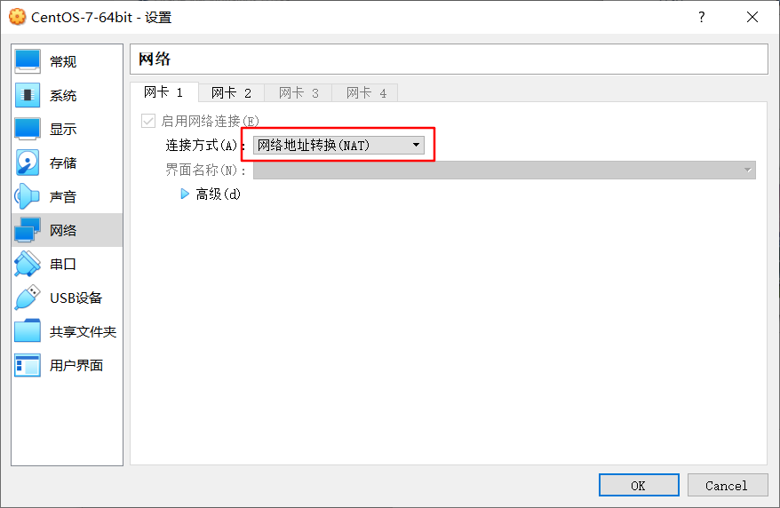

默认会使用NAT

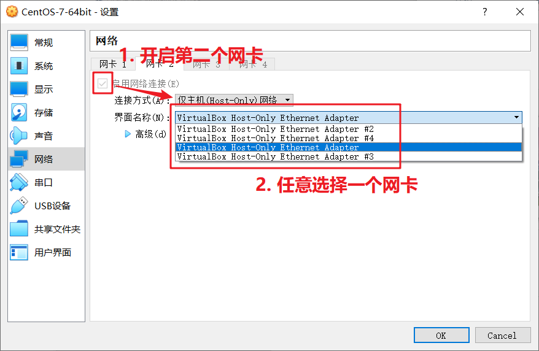

==开启第二个网卡后，默认会是自动获取IP，这样每次网络环境变化后，通过ssh连接虚拟机时，都要重新修改连接ip，会很麻烦。接下来将设置固定IP==

首先来查看新添加网卡的网段

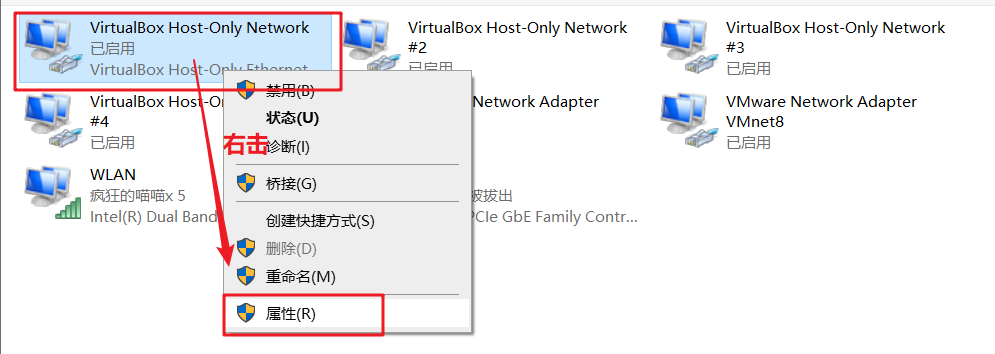

因为之前新建网卡时，选择的是第一个，所以这里找到第一个网卡，右击后

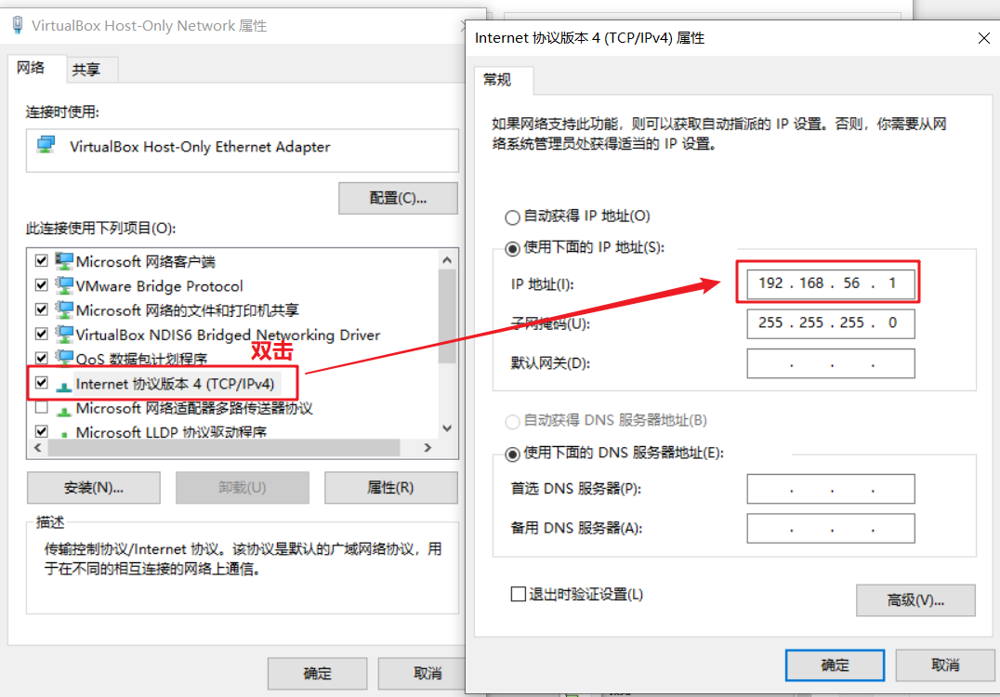

发现网段是`192.168.56.xxx`

现在设置固定IP

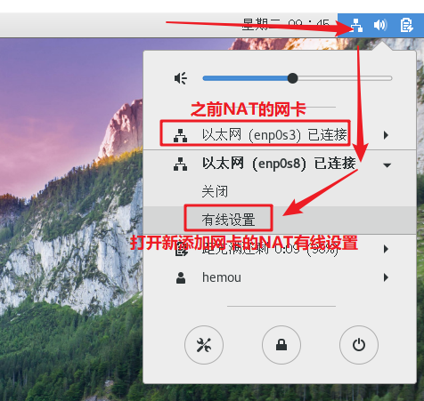

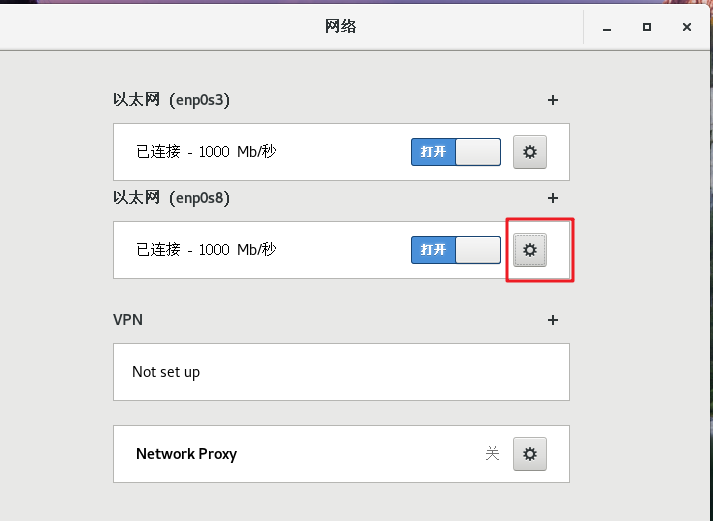

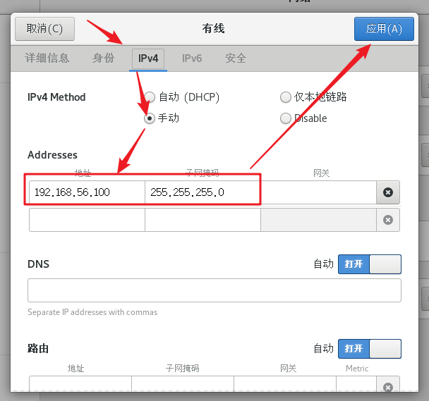

然后重启网卡

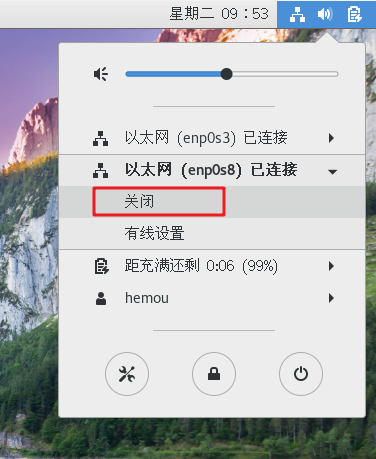

先关闭，然后再开启

### 2.2 端口转发

第二个方法就是在NAT网卡中添加一个端口转发规则

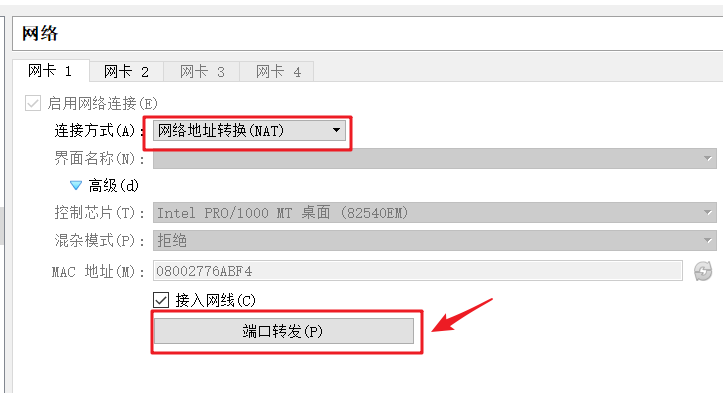

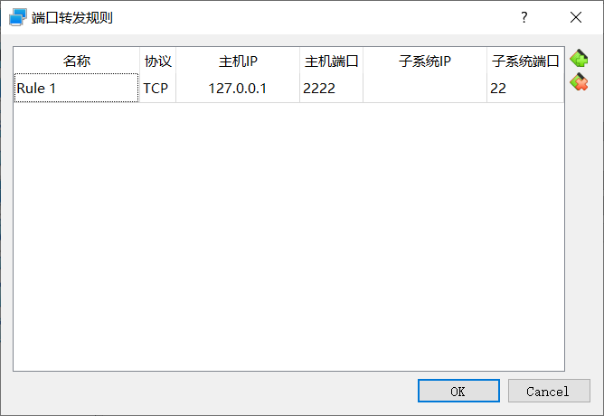

选择主机端口时，找一个没有被占用的。子系统IP可以留空，然后子系统端口就选择将要映射的SSH的22号端口。然后点击OK

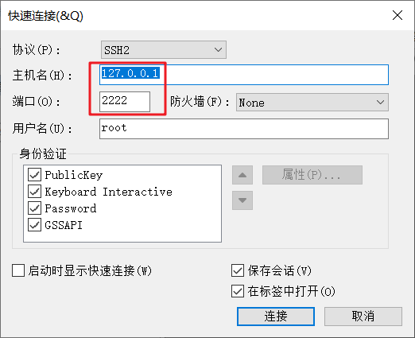

填写我们刚设置的本地ip和端口

然后就发现能连接了

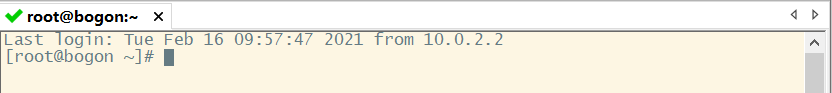

## 2、yum换源

1、执行如下命令

```shell
yum repolist all
```

2、若发现列表为空，前往 `/etc/yum/repos.d` 目录，执行如下命令

```shell
wget http://mirrors.aliyun.com/repo/Centos-7.repo
```

3、如果不为空，可以先备份（可跳过）

```shell
cp /etc/yum.repos.d/CentOS-7.repo /etc/yum.repos.d/CentOS-Base.repo.backup
```

4、生成缓存

```shell
yum clean all
yum makecache
```

5、更新源

```shell
yum -y update
```

## 3、连接SSH

1、查看本机是否安装SSH软件包

```shell
rpm -qa | grep ssh
```

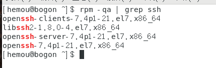

如果没有则需要安装，不过经过上一步的更新源，一般都会有

```shell
yum install openssh-server
```

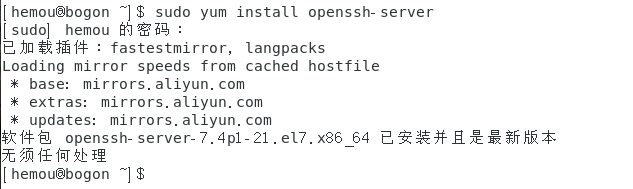

2、开启SSH服务

```shell
systemctl start sshd
```

3、接下来就可以尝试用SSH连接工具进行连接了

4、如果连接不上可以是防火墙的原因

1）先查看防火墙状态

```shell
systemctl status firewalld
```

如果有 `Active: active(running)`，则说明防火墙已启动

2）开放22端口

```shell
firewall-cmd --add-port=22/tcp --permanent     ##永久添加22端口 
```

然后重启防火墙（每次修改设置必须重启）

```shell
systemctl restart firewalld
```

然后没事的话可以看看防火墙的信息

```shell
firewall-cmd --list-all	# 查看防火墙信息
```

这时再试试用SSH连接

3）如果还连不上，试试把防火墙给关掉

```shell
systemctl stop firewalld	# 关闭防火墙
```

## 4、参考

[vmware 虚拟机三种网络模式 桥接 NAT 仅主机区别](https://blog.csdn.net/zkuncn/article/details/78452098)

[VirtualBox NAT 模式下，主机ssh访问虚拟机配置](https://blog.csdn.net/YL_1314/article/details/51841427)

[centos 7怎么通过图形界面来配置静态ip](https://blog.csdn.net/qq_32067151/article/details/103354773)

[Virtualbox中配置双网卡，实现动态IP访问外网，固定IP方便内网通过SSH连接](https://www.daxiblog.com/virtualbox%E4%B8%AD%E9%85%8D%E7%BD%AE%E5%8F%8C%E7%BD%91%E5%8D%A1%EF%BC%8C%E5%AE%9E%E7%8E%B0%E5%8A%A8%E6%80%81ip%E8%AE%BF%E9%97%AE%E5%A4%96%E7%BD%91%EF%BC%8C%E5%9B%BA%E5%AE%9Aip%E6%96%B9%E4%BE%BF/)

