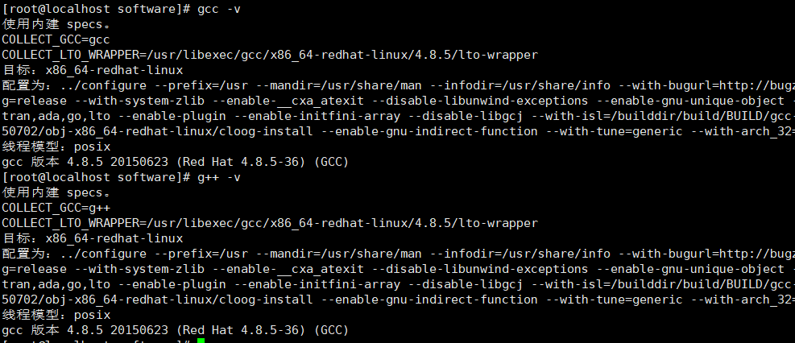
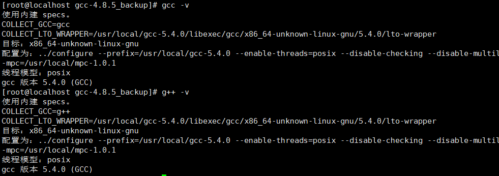
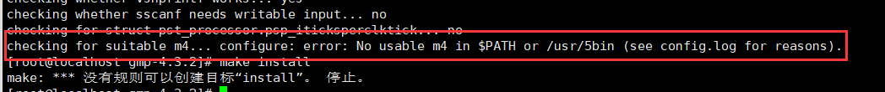
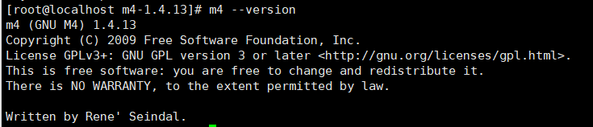

>本文介绍一种离线安装gcc5.4.0的方法，适用于无网环境机器部署。步骤是先离线安装4.8.5版本gcc，然后编译升级至5.4.0。

### 1.前期准备

#### 1.1 安装文件下载

(1) gcc 4.8.5和gcc-c++ 4.8.5的rpm安装文件

- gcc_gcc-c++_4.8.5_rpm([百度网盘](https://pan.baidu.com/s/1lUS_skshAnjf9BwOufTXJw) 提取码: 9527)

(2) gcc-5.4.0依赖项

- gmp-4.3.2.tar.gz([下载地址](https://ftp.gnu.org/gnu/gmp/))
- mpfr-2.4.2.tar.gz([下载地址](https://ftp.gnu.org/gnu/mpfr/))
- mpc-1.0.1.tar.gz([下载地址](https://ftp.gnu.org/gnu/mpc/))

(3) gcc-5.4.0安装文件

- gcc-5.4.0.tar.gz([下载地址](https://ftp.gnu.org/gnu/gcc/gcc-5.4.0/))

(4) 其他依赖（可选）

- m4-1.4.13.tar.gz([下载地址](http://mirrors.kernel.org/gnu/m4/))

#### 1.2 创建目录，上传安装文件

创建目录(位置可选择)，将需要的安装文件上传至该目录下

```shell
mkdir /usr/local/software
```

### 2.安装gcc、gcc-c++ 4.8.5

分别进入存放gcc、gcc-c++ 4.8.5 rpm的文件夹，执行安装命令：

```shell
rpm -Uvh *.rpm --nodeps --force
```

检查是否完成安装：

```shell
gcc -v
g++ -v
```

显示如下，安装成功



### 3.安装gcc5.4.0依赖项

#### 3.1 gmp安装

```shell
tar -zxvf gmp-4.3.2.tar.gz

cd gmp-4.3.2

./configure --prefix=/usr/local/gmp-4.3.2 && make

make install
```

(若编译报错，请检查系统是否已安装m4，详情见常见问题5.1)

#### 3.2 mpfr安装

(需先安装gmp)

```shell
tar -zxvf mpfr-2.4.2.tar.gz

cd mpfr-2.4.2

./configure --prefix=/usr/local/mpfr-2.4.2 --with-gmp=/usr/local/gmp-4.3.2 && make

make install
```

#### 3.3 mpc安装

(需先安装gmp、mpfr)

```shell
tar -zxvf mpc-1.0.1.tar.gz

cd mpc-1.0.1

./configure --prefix=/usr/local/mpc-1.0.1 --with-gmp=/usr/local/gmp-4.3.2 --with-mpfr=/usr/local/mpfr-2.4.2 && make

make install
```

### 4.升级至gcc5.4.0

#### 4.1 配置依赖项环境变量

```shell
vi ~/.bashrc

# 添加以下内容并保存退出
export LD_LIBRARY_PATH=$LD_LIBRARY_PATH:/usr/local/gmp-4.3.2/lib:/usr/local/mpc-1.0.1/lib:/usr/local/mpfr-2.4.2/lib

# 刷新使生效
source ~/.bashrc
```

#### 4.2 编译安装gcc5.4.0

```shell
tar -zxvf gcc-5.4.0.tar.gz

cd gcc-5.4.0

# 创建编译目录
mkdir gcc-build

cd gcc-build

# 配置
../configure --prefix=/usr/local/gcc-5.4.0 --enable-threads=posix --disable-checking --disable-multilib --enable-languages=c,c++ --with-gmp=/usr/local/gmp-4.3.2 --with-mpfr=/usr/local/mpfr-2.4.2 --with-mpc=/usr/local/mpc-1.0.1

# 多核编译 (这一步可能耗时很长，半小时左右，取决于机器性能)
make -j4

make install
```

#### 4.3 创建软链接

```shell
# 备份原来的gcc、g++
mkdir -p /usr/backup/gcc-4.8.5_backup
mv /usr/bin/{gcc,g++} /usr/backup/gcc-4.8.5_backup

# 为5.4.0版本gcc、g++创建软链接
ln -s /usr/local/gcc-5.4.0/bin/gcc /usr/bin/gcc
ln -s /usr/local/gcc-5.4.0/bin/g++ /usr/bin/g++

# 查看gcc、g++版本
gcc -v
g++ -v
```



至此，gcc5.4.0升级完成


### 5.常见问题

#### 5.1 依赖项安装报错缺少m4

依赖项安装时报错```configure: error: No usable m4 in $PATH or /usr/5bin```，原因是缺少必要的m4依赖，需要安装m4


离线安装m4(安装包见1.1安装文件下载)

```shell
tar -zxvf m4-1.4.13.tar.gz

cd m4-1.4.13

./configure --prefix=/usr/local

make && make install
```

检查是否安装完成：

```shell
m4 --version
```



m4安装完成后再次安装其他依赖项即可


#### 5.2 进行编译配置时找不到文件

- 需要仔细核对配置的依赖项文件或路径是否存在且正确，同时确保所填写的版本与安装版本一致

- 同理，在gcc5.4.0安装之前配置依赖项环境变量时，也需要保证配置的依赖项文件路径真实有效，且不要忘记刷新环境变量使其生效

