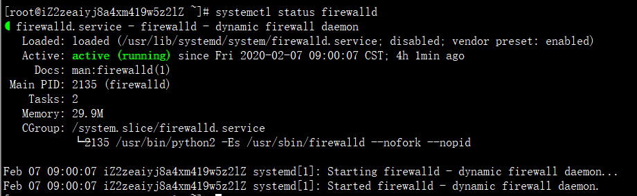

[toc]

# Linux 笔记

## 防火墙相关

### 1、查看防火墙状态

```shell
systemctl status firewalld
```



绿字部分 Active：active(running) ，代表防火墙是开着的

若是这样 Active：inactive(dead)，代表防火墙关掉了

### 2、部署防火墙

```shell
systemctl start firewalld 	# 开启防火墙
systemctl stop firewalld	# 关闭防火墙

systemctl enable firewalld.service	# 开启开机自启动
systemctl disable firewalld.service # 关闭开机自启动
```

### 3、常用操作

```shell
firewall-cmd --list-all	# 查看防火墙信息
firewall-cmd --add-port=80/tcp --permanent 	# 开放端口号，本例代表开放80端口
firewall-cmd --reload	# 重启防火墙
```

**每次设置开放的端口号后都需要重启**

### 4、其他操作

```shell
firewall-cmd --state						   ##查看防火墙状态，running代表已启动
firewall-cmd --get-zones                       ##列出支持的zone
firewall-cmd --get-services                    ##列出支持的服务，在列表中的服务是放行的
firewall-cmd --query-service ftp               ##查看ftp服务是否支持，返回yes或者no
firewall-cmd --add-service=ftp                 ##临时开放ftp服务
firewall-cmd --add-service=ftp --permanent     ##永久开放ftp服务
firewall-cmd --remove-service=ftp --permanent  ##永久移除ftp服务
firewall-cmd --add-port=80/tcp --permanent     ##永久添加80端口 
firewall-cmd --remove-port=80/tcp --permanent  ##永久移除80端口
firewall-cmd --list-ports                      ##查看已经开放的端口
iptables -L -n                                 ##查看规则，这个命令是和iptables的相同的
man firewall-cmd                               ##查看帮助
```


