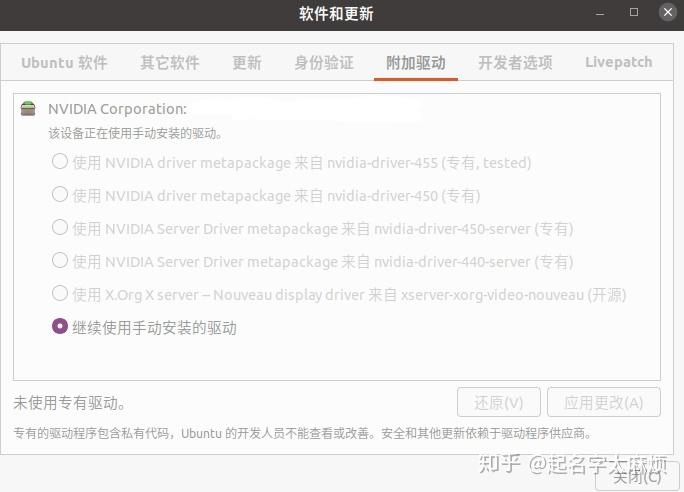
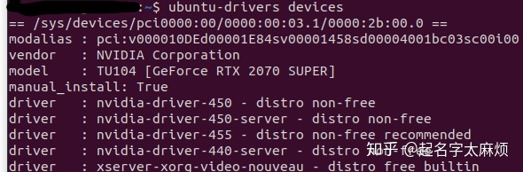
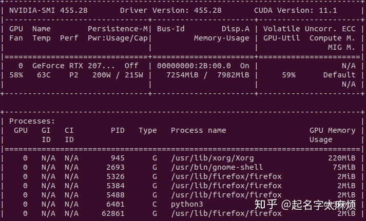

# 安装Nvidia驱动

- 添加 PPA 软件仓库：`sudo add-apt-repository ppa:graphics-drivers/ppa`，需要输入用户密码，按照提示还需要按下 Enter 键。
- 更新软件索引：`sudo apt update`

1、`ubuntu-drivers devices`查看显卡硬件型号（不必要）

2、先去官网[Download Drivers | NVIDIA](https://www.nvidia.com/Download/index.aspx)搜索一下当前显卡支持的最新驱动

3、如果同意安装推荐版本，那我们只需要终端输入：sudo ubuntu-drivers autoinstall 就可以自动安装了

4、当然我们也可以使用 apt 命令安装自己想要安装的版本，比如我想安装 340 这个版本号的版本，终端输入：sudo apt install nvidia-340 就自动安装了


下面正式开始记录两种不同方法去安装ubuntu系统的显卡驱动。

## **1.最简安装**

ubuntu系统安装完成后，可以通过一定的系统更新进行显卡驱动的安装，前提是后续的使用过程中，对于显卡驱动以及cuda的版本不存在更改的要求。

**PS: ubuntu自动进行的显卡驱动安装，在安装完成后，并不会出现那些对应的文件夹，因此在后续的应用中，如果需要更改对应的版本的话，就稍显不方便。可能出现的情况就是，你想卸载cuda去重装另一个版本的，却一直找不到它所处的安装位置，这就着实有些尴尬了。**

安装流程：（极简操作）

**1.点击“软件和更新”，进入管理器，选择“附加驱动”选项卡；**



可以看到，在这一项中会列举出一些系统推荐的显卡驱动版本，有专有的，亦有开源的。其实并无太大区别，不过建议大家选择专有的驱动。

2.选择好驱动，点击**应用更改**，稍待几分钟，即可完成显卡驱动的安装。

Ps：最简安装，仅仅需要两步即可完成显卡驱动的安装。

又Ps：系统自带的显卡驱动安装，同时也会捎带上cuda的安装，所以后续不需要再进行cuda的安装。

## **2.手动安装驱动**

因为需要根据情况去切换cuda，最终选择了手动安装ubuntu系统的显卡驱动。

**2.1 查看显卡的型号**

打开终端，输入指令以查看电脑的显卡型号：

```text
ubuntu-drivers devices
```

可以看到如下界面：



model即为显卡的型号信息，此处为GeForce RTX 2070 SUPER；推荐的显卡驱动版本号为nvidia-driver-450 - distro non-free。

**2.2 官网下载显卡驱动**

到官网下载对应的显卡驱动：

[官方 GeForce 驱动程序)](https://www.nvidia.cn/geforce/drivers/)

ubuntu系统的话，选择对应显卡型号的Display Driver进行下载。

**2.3 安装相关依赖**

```text
sudo apt-get install libprotobuf-dev libleveldb-dev libsnappy-dev libopencv-dev libhdf5-serial-dev protobuf-compiler
sudo apt-get install --no-install-recommends libboost-all-dev
sudo apt-get install libopenblas-dev liblapack-dev libatlas-base-dev
sudo apt-get install libgflags-dev libgoogle-glog-dev liblmdb-dev
```

如果安装失败，则先进行pip3的升级更新，在重复上述操作。

安装pip3：

```text
sudo apt-get install python3-pip
```

更新升级pip3：

```text
sudo pip3 install --upgrade pip
```

若是依旧未奏效，则需要下载对应安装包手动安装，地址如下：

[https://pkgs.org/search/?q=libgflagspkgs.org/search/?q=libgflags](https://pkgs.org/search/?q=libgflags)

**2.4 禁用系统默认显卡驱动**

```text
sudo gedit /etc/modprobe.d/blacklist.conf
```

打开文件，在文件末尾写入：

```text
blacklist nouveau
options nouveau modeset=0
```

保存后手动更新；

```text
sudo update-initramfs -u
```

电脑重启，输入下列指令进行确认，若无输出，则禁用成功：

```text
lsmod | grep nouveau
```

**2.5 配置环境变量**

gedit命令打开配置文件：

```text
sudo gedit ~/.bashrc
```

末尾写入：

```text
export LD_LIBRARY_PATH=/usr/lib/x86_64-linux-gnu:$LD_LIBRARY_PATH
export LD_LIBRARY_PATH=/lib/x86_64-linux-gnu:$LD_LIBRARY_PATH
```

保存更新：

```text
source ~/.bashrc
```

**2.6 卸载原有驱动（如果有的话）**

**有两种方法**

```text
sudo apt-get --purge remove nvidia*
sudo apt autoremove
```

或

卸载命令位置/usr/bin/nvidia-uninstall

sudo /usr/bin/nvidia-uninstall

**2.7 退出图形界面**

按住ctrl+alt+F1（1-6均可），进入x-server

```text
sudo service lightdm stop
```

禁用图形界面。

如果提示unit lightdm.service not loaded

则需要安装LightDm：

```text
sudo apt install lightdm
```

安装完毕后跳出一个界面，选择lightdm，再`sudo service lightdm stop`。

**2.8 安装驱动**

先对对应文件进行授权，然后执行安装程序。

```text
sudo chmod +x NVIDIA-……………….run*
sudo sh NVIDIA-……………….run* --no-opengl-files --no-x-check --no-nouveau-check 
```

第二项指令的三个参数分别为：
**–no-opengl-files 不安装OpenGL文件。这个参数最重要**

–no-x-check 安装驱动时不检查X服务

–no-nouveau-check 安装驱动时不检查nouveau

后两项可以不加，在安装过程中会出现对应对话框进行选择。

安装过程中选项如下：

```text
1.The distribution-provided pre-install script failed! Are you sure you want to continue? 

“Yes”

2.Would you like to register the kernel module souces with DKMS? This will allow DKMS to automatically build a new module, if you install a different kernel later?

“No”

3.Nvidia’s 32-bit compatibility libraries?

“No”

4.Would you like to run the nvidia-xconfigutility to automatically update your x configuration so that the NVIDIA x driver will be used when you restart x? Any pre-existing x confile will be backed up. 

“Yes”
```

其余一路回车即可。

**2.9 安装完成，验证**

安装完成后，仍会回到x-server界面，此时

- 挂载NVIDIA驱动：

```text
modprobe nvidia
```

- 回到图形界面或直接将电脑重启

```text
sudo service lightdm start            #回到图形界面

sudo reboot now                       #重启
```

- 终端输入指令

```text
sudo nvidia-smi
```

如果有下图式的输出，则安装成功。




# 参考

[Ubuntu 18.04 安装 NVIDIA 显卡驱动 - 知乎 (zhihu.com)](https://zhuanlan.zhihu.com/p/59618999)

[Ubuntu20.04显卡驱动安装 - 知乎 (zhihu.com)](https://zhuanlan.zhihu.com/p/308407850)
