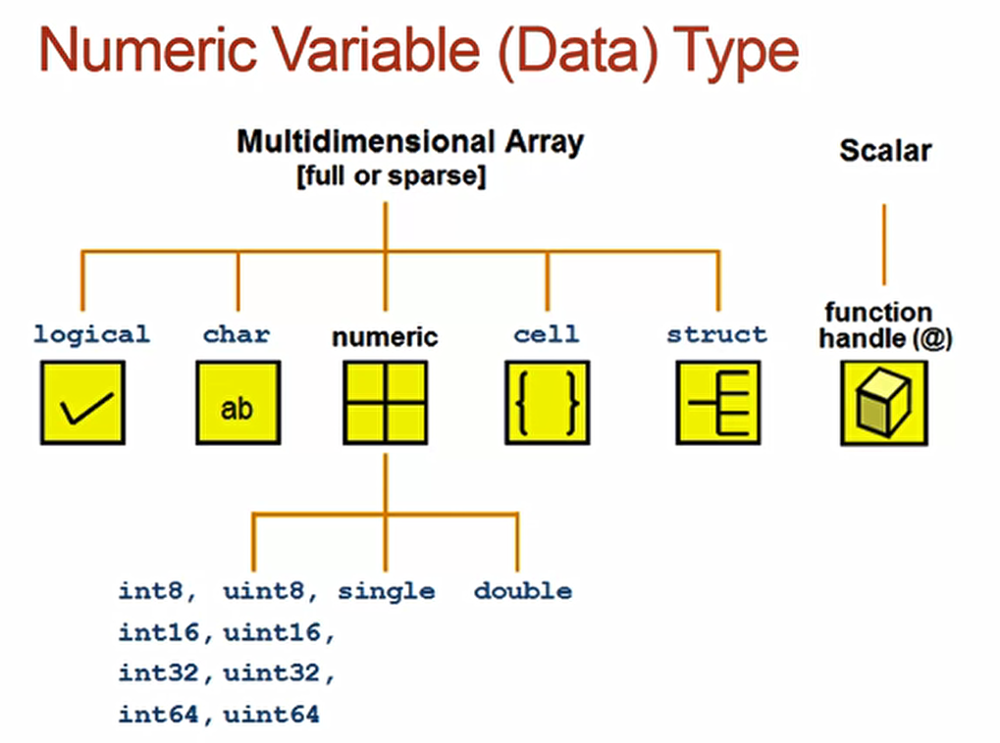

[TOC]

### Matlab教程


***

##### 基本操作

* 基本操作符 + - * / ^

* 变量
    * 没有被赋值的临时变量将被自动赋值给ANS
    * 大小写敏感

* 变量类型

    

* 常用指令

    * `who` 查看工作区含有的变量
    * `whos` 查看工作区含有的变量以及详细信息
    * `iskeyword` 查看关键字
    * `clear` 清除工作区的所有变量，**可以指定单个变量**
    * `clc` 清除界面的显示

* 特殊变量及常量

    * `i、j` ：复数
    * `Inf` ：∞
    * `eps`：自然对数
    * `NaN`：不是一个数
    * `pi`：圆周率

* 变量优先级  变量>内置函数>子功能>私有函数

* 数字显示格式：

    * `short` 保留4位小数
    * `long` 保留15位小数
    * `shortE` 科学计数法保留4位小数
    * `longE` 科学计数法保留15位小数
    * `bank` 保留2位小数
    * `hex` 二进制双精度数的十六进制表示法
    * `rat` 小整数比

* 指令结尾带`;` 不会显示运算结果，否则就会显示运算结果


***

##### 矩阵操作

###### 向量与矩阵

``` matlab
//行矩阵
>> a = [1 2 3 4]

//列矩阵
>> b = [1; 2; 3; 4]
```

###### 获取矩阵值

``` matlab
a=[1 2 3; 4 5 6; 7 8 9;]
```

> 通过行列值选择，例如 a(1, 3) 就是第一行第三列的数 和 a([1 3], [1 3]) 就是第一行第一列和第三行第三列的数

> 通过索引获取 a(1) = 1

###### 特殊矩阵

`linspace()`[^1] 线性矩阵

`eye(n)` 单位对角矩阵

`zeros(n1, n2)` 零矩阵

`ones(n1, n2)` 单位矩阵

`diag()` 对角矩阵

`rand()` 随机矩阵

###### 矩阵相关函数

`max` 矩阵的最大值，以列为单位

`max(max(a))` 

`min()`

`sum()`

`sort()` 以列为单位，升序排列矩阵

`sortrows()` 以第一列的数字为判断标准，升序排列每行元素

`size()` 返回矩阵的**行数**和**列数**

`find()` 返回矩阵的**列数**

[^1]: 括号内为空的，不代表参数为空，可能包含多个参数


***

##### 结构化程序


